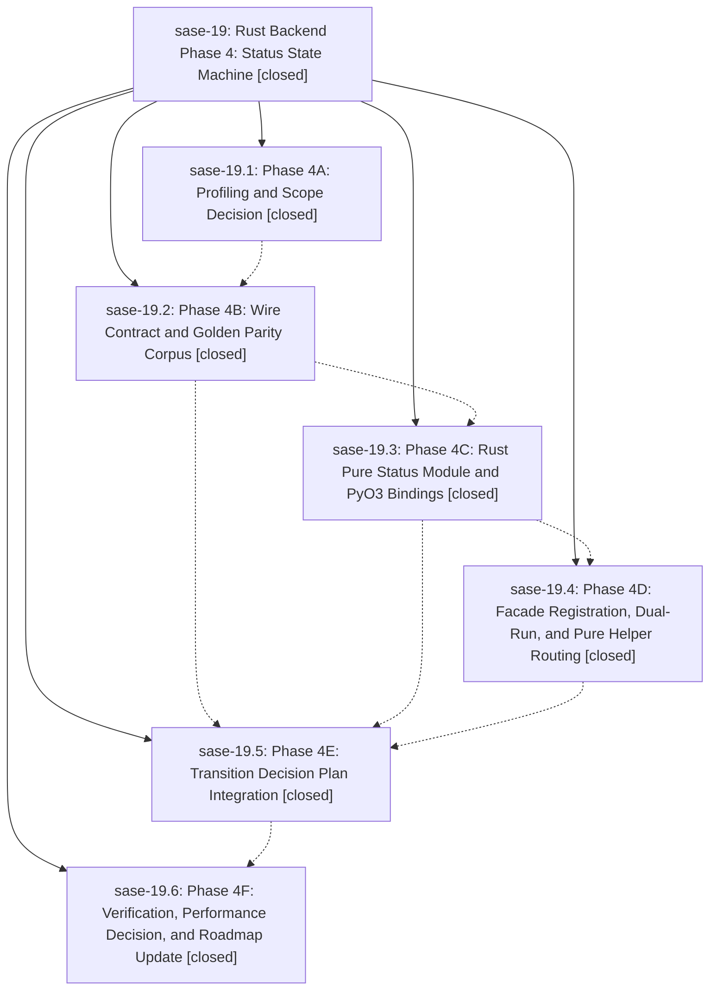

# Bead: sase-19 — Rust Backend Phase 4: Status State Machine

[Bead Pages](../README.md) / sase-19

**Status:** ✓ closed · **Resolution:** (unrecorded) · **Type:** plan · **Tier:** epic
**Owner:** `bryanbugyi34@gmail.com`
**Created:** 2026-04-29 16:40:51 UTC · **Closed:** 2026-04-29 18:12:57 UTC
**Plan:** [202604/rust\_backend\_phase4\_status\_machine.md](https://github.com/sase-org/sase--plans/blob/main/202604/rust_backend_phase4_status_machine.md)

## Phases

| Bead | Title | Status | Size | Agents | Commits |
|---|---|---|---|---:|---:|
| [sase-19.1](sase-19.1.md) | Phase 4A: Profiling and Scope Decision | ✓ closed | small | 0 | 1 |
| [sase-19.2](sase-19.2.md) | Phase 4B: Wire Contract and Golden Parity Corpus | ✓ closed | small | 0 | 1 |
| [sase-19.3](sase-19.3.md) | Phase 4C: Rust Pure Status Module and PyO3 Bindings | ✓ closed | small | 0 | 2 |
| [sase-19.4](sase-19.4.md) | Phase 4D: Facade Registration, Dual-Run, and Pure Helper Routing | ✓ closed | small | 0 | 1 |
| [sase-19.5](sase-19.5.md) | Phase 4E: Transition Decision Plan Integration | ✓ closed | small | 0 | 1 |
| [sase-19.6](sase-19.6.md) | Phase 4F: Verification, Performance Decision, and Roadmap Update | ✓ closed | small | 0 | 1 |

## Lineage

## Commits

| Commit | Subject | Bead | Committed (UTC) |
|---|---|---|---|
| [`15b3edf`](https://github.com/sase-org/sase/commit/15b3edfbe39bf1290a63bef0d34b006aff40cd7e) | chore: Phase 4A status state machine profiling and scope decision (sase-19.1) | [sase-19.1](sase-19.1.md) | 2026-04-29 17:00:47 |
| [`59b7394`](https://github.com/sase-org/sase/commit/59b739430d662bcc23cefd4ccc874d45a1646ec4) | feat: define status state machine wire contract (sase-19.2) | [sase-19.2](sase-19.2.md) | 2026-04-29 17:17:57 |
| [`sase-core@1837849`](https://github.com/sase-org/sase-core/commit/18378495053d46d10a7ed7941c8515e2bdc1107d) | feat: Phase 4C — pure-Rust status state machine and PyO3 bindings (sase-19.3) | [sase-19.3](sase-19.3.md) | 2026-04-29 17:32:03 |
| [`cb3f21b`](https://github.com/sase-org/sase/commit/cb3f21b340c60de683eed02bd73ade1eaa659ec3) | chore: Phase 4C handoff doc for status state machine port (sase-19.3) | [sase-19.3](sase-19.3.md) | 2026-04-29 17:32:31 |
| [`773606a`](https://github.com/sase-org/sase/commit/773606a55cbea9c3fdb3caa73f685c97b4412bdf) | feat: route status line helpers through Rust facade (sase-19.4) | [sase-19.4](sase-19.4.md) | 2026-04-29 17:40:58 |
| [`7840a20`](https://github.com/sase-org/sase/commit/7840a20fe143602626c00da4d3a08ad03c8fd290) | ref: route status transitions through the Rust planner facade (sase-19.5) | [sase-19.5](sase-19.5.md) | 2026-04-29 18:01:30 |
| [`54b3469`](https://github.com/sase-org/sase/commit/54b34699f098df0f951c6e169d467c3816254978) | chore: close Rust backend Phase 4 with verification and rollout decision (sase-19.6) | [sase-19.6](sase-19.6.md) | 2026-04-29 18:11:22 |
| [`6ea984d`](https://github.com/sase-org/sase/commit/6ea984d3987b0bbe1d8ef231f853e43cac8757cf) | chore: close Rust backend Phase 4 epic (sase-19) | [sase-19](README.md) | 2026-04-29 18:13:51 |
