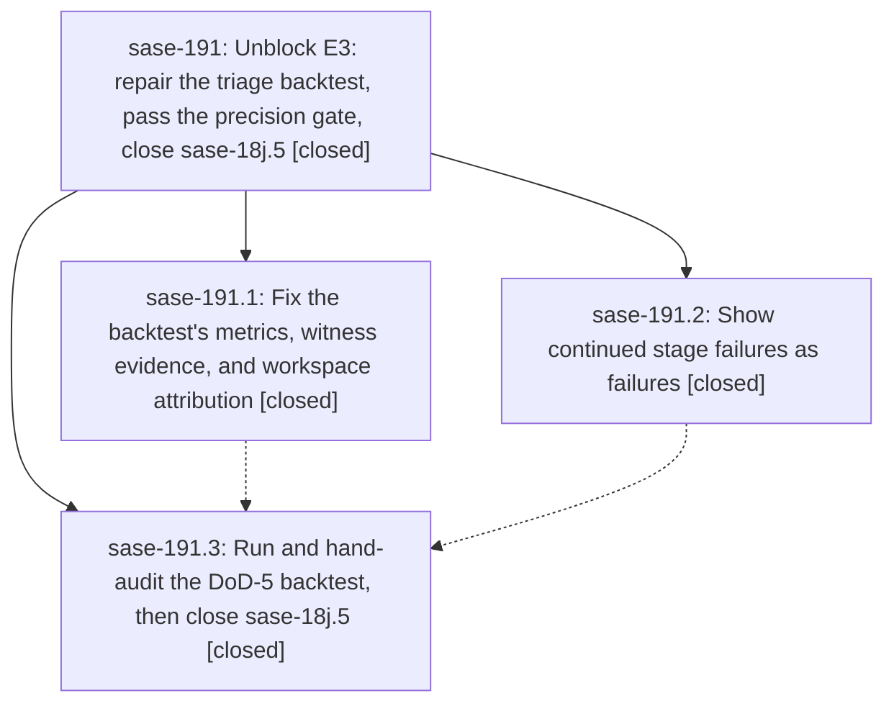

# Bead: sase-191 — Unblock E3: repair the triage backtest, pass the precision gate, close sase-18j.5

[Bead Pages](../README.md) / sase-191

**Status:** ✓ closed · **Resolution:** done · **Type:** ▸ plan · **Tier:** epic
**Owner:** `bryanbugyi34@gmail.com` · **Created by:** [bbugyi200.athena.0rz](https://github.com/sase-org/sase--agents/blob/main/families/bbugyi200.athena.0rz.md) · **Assignee:** `sase-191.land`
**Created:** 2026-09-25 07:43:28 EDT · **Closed:** 2026-09-25 11:24:56 EDT
**Plan:** [202609/e3\_precision\_gate.md](https://github.com/sase-org/sase--plans/blob/main/202609/e3_precision_gate.md)

## Description

Phase sase-18j.5 closes on a DoD-5 precision backtest that was measured correctly and hand-audited for real. Closing it releases the E3 agents that are already queued (sase-18j.6 through sase-18j.9 and sase-18j.land). They finish the epic, and sase-18j.land closes sase-18j.

## Notes

[2026-09-25T15:24:56Z · sase-191.land] Land verified: 245dcb553 (sase-191.2) run_silent prints ✗ + captured output for continued stages and exits 0, never ✓; keep-going test pins it. 7757bacc9 (sase-191.1) per-locator added metric + informational any-path count, witness_run_ids/selection_record_ids resolved to run/agent/workspace/base/clean evidence, newest witness by ancestry index, ledger>run_started_at>artifact-dir>mtime workspace attribution with counts, settled_ts selection lookback, contaminated-stage exclusion, replay_runs split, fixture twin + real-binding round trips, tools/AGENTS.md + shims. Landing fix: audit.md table header had 11 columns but a 10-cell delimiter row (not a valid GFM table); the delimiter is now derived from the column list, with a test asserting header/delimiter/row cell parity. Plan landing checks: sase-18j.5 closed with DoD-5 PASS note (60/60 + 17/17 touched pre-existing, known_on_added_or_untracked=0, knobs unchanged, artifacts ef446cbb/a6279075); sase-18j notes #4 (FIXED BY sase-191.2) and #5 (owner DISCOVERED ISSUE) exist; sase-18j.6 released and running. Integration: the 7 post-epic commits (ace, command-line, agents-sync, finalizers, docs) touch no run_silent/triage/backtest code; nothing to integrate. Follow-ups: sase-191.3 owner-matching over-match -> no task, causally owned by active epic sase-18j and already recorded as DISCOVERED ISSUE on sase-18j (#5) and sase-18j.6 (#1); sase-191.1 five keymap/dynamic-agent check failures -> declined, no longer reproduce at HEAD (342 keymap/dynamic-agent tests pass; stale copy-pin tests fixed by 24615e18d). Verification: sase tool run check lint stages all green; the scoped test stage stalled on host worker-token contention and was killed at 40m, so the same 69-file selection was run directly: 759 passed. epic-symbols: none.

## Phases

| Bead | Title | Status | Size | Created | Agents | Commits |
|---|---|---|---|---|---:|---:|
| [sase-191.1](sase-191.1.md) | Fix the backtest's metrics, witness evidence, and workspace attribution | ✓ closed | medium | 2026-09-25 | 1 | 1 |
| [sase-191.2](sase-191.2.md) | Show continued stage failures as failures | ✓ closed | small | 2026-09-25 | 1 | 1 |
| [sase-191.3](sase-191.3.md) | Run and hand-audit the DoD-5 backtest, then close sase-18j.5 | ✓ closed | medium | 2026-09-25 | 1 | 0 |

## Lineage

## Agents

| Agent | Bead | Commits |
|---|---|---:|
| [bbugyi200.athena.sase-191.1](https://github.com/sase-org/sase--agents/blob/main/agents/bbugyi200.athena.sase-191.1/README.md) | [sase-191.1](sase-191.1.md) | 1 |
| [bbugyi200.athena.sase-191.2](https://github.com/sase-org/sase--agents/blob/main/agents/bbugyi200.athena.sase-191.2/README.md) | [sase-191.2](sase-191.2.md) | 1 |
| [bbugyi200.athena.sase-191.3](https://github.com/sase-org/sase--agents/blob/main/agents/bbugyi200.athena.sase-191.3/README.md) | [sase-191.3](sase-191.3.md) | 0 |
| [bbugyi200.athena.sase-191.land](https://github.com/sase-org/sase--agents/blob/main/agents/bbugyi200.athena.sase-191.land/README.md) | [sase-191](README.md) | 1 |

## Commits

| Repo | Commit | Subject | Bead | Committed |
|---|---|---|---|---|
| sase | [`245dcb5`](https://github.com/sase-org/sase/commit/245dcb55362fca45a0ae4a03d982a059ab38854d) | fix(tools): show continued run\_silent stage failures as failures (sase-191.2) | [sase-191.2](sase-191.2.md) | 2026-09-25 08:31:23 EDT |
| sase | [`7757bac`](https://github.com/sase-org/sase/commit/7757bacc9d82e14a78e1683f0fed407969e98c7c) | fix(triage): repair backtest audit evidence | [sase-191.1](sase-191.1.md) | 2026-09-25 09:18:49 EDT |
| sase | [`0f5d897`](https://github.com/sase-org/sase/commit/0f5d89750ef60c8fb883a168e45dc38aada36111) | fix(triage): give the backtest audit table a matching delimiter row (sase-191) | [sase-191](README.md) | 2026-09-25 11:28:22 EDT |
