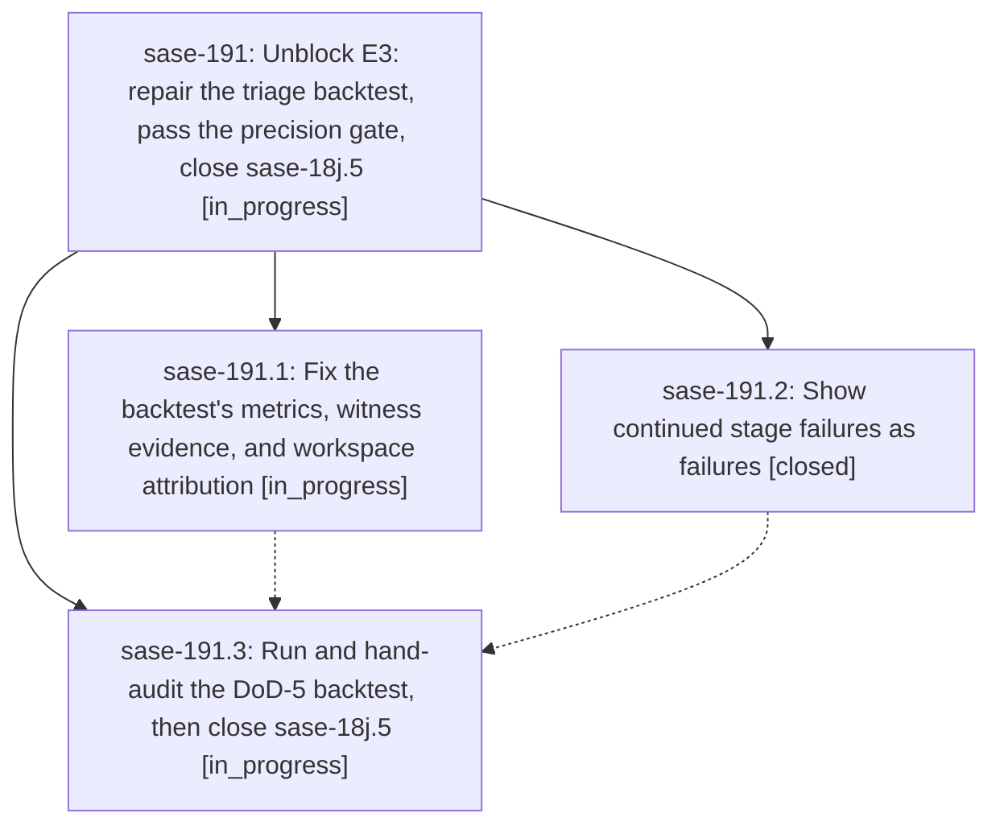

# Bead: sase-191 — Unblock E3: repair the triage backtest, pass the precision gate, close sase-18j.5

[Bead Pages](../README.md) / sase-191

**Status:** ◐ in_progress · **Type:** ▸ plan · **Tier:** epic
**Owner:** `bryanbugyi34@gmail.com` · **Created by:** [bbugyi200.athena.0rz](https://github.com/sase-org/sase--agents/blob/main/families/bbugyi200.athena.0rz.md) · **Assignee:** `sase-191.land`
**Created:** 2026-09-25 07:43:28 EDT
**Plan:** [202609/e3\_precision\_gate.md](https://github.com/sase-org/sase--plans/blob/main/202609/e3_precision_gate.md)

## Description

Phase sase-18j.5 closes on a DoD-5 precision backtest that was measured correctly and hand-audited for real. Closing it releases the E3 agents that are already queued (sase-18j.6 through sase-18j.9 and sase-18j.land). They finish the epic, and sase-18j.land closes sase-18j.

## Phases

| Bead | Title | Status | Size | Created | Agents | Commits |
|---|---|---|---|---|---:|---:|
| [sase-191.1](sase-191.1.md) | Fix the backtest's metrics, witness evidence, and workspace attribution | ◐ in_progress | medium | 2026-09-25 | 1 | 0 |
| [sase-191.2](sase-191.2.md) | Show continued stage failures as failures | ✓ closed | small | 2026-09-25 | 1 | 1 |
| [sase-191.3](sase-191.3.md) | Run and hand-audit the DoD-5 backtest, then close sase-18j.5 | ◐ in_progress | medium | 2026-09-25 | 1 | 0 |

## Lineage

## Agents

| Agent | Bead | Commits |
|---|---|---:|
| [bbugyi200.athena.sase-191.1](https://github.com/sase-org/sase--agents/blob/main/agents/bbugyi200.athena.sase-191.1/README.md) | [sase-191.1](sase-191.1.md) | 0 |
| [bbugyi200.athena.sase-191.2](https://github.com/sase-org/sase--agents/blob/main/agents/bbugyi200.athena.sase-191.2/README.md) | [sase-191.2](sase-191.2.md) | 1 |
| [bbugyi200.athena.sase-191.3](https://github.com/sase-org/sase--agents/blob/main/agents/bbugyi200.athena.sase-191.3/README.md) | [sase-191.3](sase-191.3.md) | 0 |
| [bbugyi200.athena.sase-191.land](https://github.com/sase-org/sase--agents/blob/main/agents/bbugyi200.athena.sase-191.land/README.md) | [sase-191](README.md) | 0 |

## Commits

| Repo | Commit | Subject | Bead | Committed |
|---|---|---|---|---|
| sase | [`245dcb5`](https://github.com/sase-org/sase/commit/245dcb55362fca45a0ae4a03d982a059ab38854d) | fix(tools): show continued run\_silent stage failures as failures (sase-191.2) | [sase-191.2](sase-191.2.md) | 2026-09-25 08:31:23 EDT |
