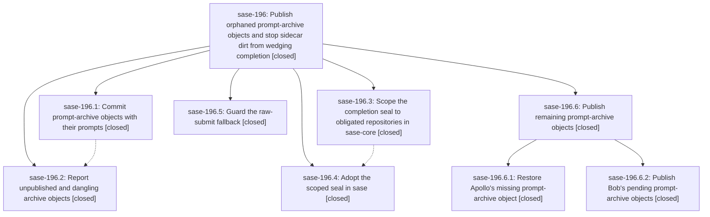

# Bead: sase-196 — Publish orphaned prompt-archive objects and stop sidecar dirt from wedging completion

[Bead Pages](../README.md) / sase-196

**Status:** ✓ closed · **Resolution:** done · **Type:** ▸ plan · **Tier:** epic
**Owner:** `bryanbugyi34@gmail.com` · **Created by:** [bbugyi200.athena.0ry.f0](https://github.com/sase-org/sase--agents/blob/main/families/bbugyi200.athena.0ry.f0.md) · **Assignee:** `sase-196.land`
**Created:** 2026-09-25 09:05:32 EDT · **Closed:** 2026-09-25 13:52:00 EDT
**Plan:** [202609/agents\_sidecar\_orphan\_objects.md](https://github.com/sase-org/sase--plans/blob/main/202609/agents_sidecar_orphan_objects.md)

## Description

Prompt-archive objects under files/objects are committed with the prompt that links them, the orphans already in the agents sidecar clones get published by that same path, broken or unpublished object links are reported, pre-existing dirt in a repository an agent is not committing no longer blocks or invalidates `sase final prepare`, and the raw-submit fallback can no longer commit the manifest template's placeholder message.

## Notes

[2026-09-25T15:43:11Z · sase-18z.3.1--1] DISCOVERED ISSUE: After sase-196.2 landed as 4214ccc65 feat(agents): validate archive objects, just check is red on clean master: agent prompts validate reports 3 artifact-untracked sidecar objects (40de62d8, 414a92e8, 5bd2b6fd — sase-17u) and artifact-missing prompts/202609/bbugyi200.apollo.2.md -> files/objects/sha256/41/412ed4ed462f3f76938f9846b24973ee9d2783d09fa7a3e747e24dd2581b6268. Reproduced with this workspace stashed to HEAD. The new validation is working; the orphans and missing object still need the epic land path.

[2026-09-25T16:02:58Z · sase-196.land] LAND AUDIT (2026-09-25): Read all five child scopes and notes, the epic plan, source and commits f648e88e4/7d14286e5/4214ccc65/45a2e61be plus sase-core 9e1ac1d. Later sase commits touch unrelated ACE/TUI, command-line, triage, and fork-wait areas; no integration conflict found. The three athena-sidecar untracked objects were published by concurrent commit 0db40ded93, but this checkout's validator still reports artifact-missing for Apollo object 412ed4ed; Apollo's sidecar has the exact file untracked and its installed sase predates the publication fix. Validated nested epic plan sase_plan_restore_prompt_archive_objects.md with parent_bead sase-196 to publish Apollo and bob-cli objects and rerun just check before this landing resumes. FOLLOW-UP DISPOSITION: sase-196.1 private helper proposal declined because phase .2 made is_valid_archive_object public for doctor and kept _pending_archive_objects private behind quarantine; sase-196.2 object recovery and sase-196.4 duplicate blocker remain child-epic work and existing task sase-17u; sase-196.3 private_argv flake corroborated on existing sase-17n (+1); sase-190 closed after .5 guard. No new task bead needed.

[2026-09-25T17:52:00Z · sase-196.6.land--1] Rechecked original plan, all five closed phases and their notes, nested child sase-196.6 and both of its notes, source and epic commits f648e88e4/4214ccc65/9e1ac1d/45a2e61be/7d14286e5. Newer primary commits touch ACE/TUI, command line, triage, fork waits, and queue weight; no later changes in agents_sync, finalizers, or the scoped Rust continuation seal require integration. Live SASE agents sidecar is clean at origin/main; incident objects 40de62, 414a92, 5bd2b6, and Apollo 412ed4 are tracked, and prompt validation passes 6494 prompts with zero errors. Bob-cli pending ce18b4 and d8bdfd objects are tracked and its sidecar is clean; its separate pre-existing Kelly 8adbb12d missing target remains task sase-19h. Closed sase-17u with publication evidence; sase-190 was previously closed. Original phase follow-ups were disposed in LAND AUDIT note #2: private helper now appropriately public for validator, Apollo/orphan recovery handled by nested child, private_argv flake corroborated on sase-17n, and duplicate check blocker resolved. Nested child follow-ups: legacy artifact-link index write recorded on causal active epic sase-yy; Kelly target filed as sase-19h. No --epic-symbol entries; just symvision passes after child close. Final sase tool run check passed lint, SASE validation, and committed plans, but timed out after 45m in scoped tests amid shared host contention; individual phase and focused tests passed. No force used.

## Phases

| Bead | Title | Status | Size | Created | Agents | Commits |
|---|---|---|---|---|---:|---:|
| [sase-196.1](sase-196.1.md) | Commit prompt-archive objects with their prompts | ✓ closed | medium | 2026-09-25 | 1 | 1 |
| [sase-196.2](sase-196.2.md) | Report unpublished and dangling archive objects | ✓ closed | medium | 2026-09-25 | 1 | 1 |
| [sase-196.3](sase-196.3.md) | Scope the completion seal to obligated repositories in sase-core | ✓ closed | medium | 2026-09-25 | 1 | 1 |
| [sase-196.4](sase-196.4.md) | Adopt the scoped seal in sase | ✓ closed | small | 2026-09-25 | 1 | 1 |
| [sase-196.5](sase-196.5.md) | Guard the raw-submit fallback | ✓ closed | small | 2026-09-25 | 1 | 1 |

## Lineage

## Agents

| Agent | Bead | Commits |
|---|---|---:|
| [bbugyi200.athena.sase-196.1](https://github.com/sase-org/sase--agents/blob/main/agents/bbugyi200.athena.sase-196.1/README.md) | [sase-196.1](sase-196.1.md) | 1 |
| [bbugyi200.athena.sase-196.2](https://github.com/sase-org/sase--agents/blob/main/agents/bbugyi200.athena.sase-196.2/README.md) | [sase-196.2](sase-196.2.md) | 1 |
| [bbugyi200.athena.sase-196.3](https://github.com/sase-org/sase--agents/blob/main/families/bbugyi200.athena.sase-196.3.md) | [sase-196.3](sase-196.3.md) | 1 |
| [bbugyi200.athena.sase-196.4](https://github.com/sase-org/sase--agents/blob/main/agents/bbugyi200.athena.sase-196.4/README.md) | [sase-196.4](sase-196.4.md) | 1 |
| [bbugyi200.athena.sase-196.5](https://github.com/sase-org/sase--agents/blob/main/agents/bbugyi200.athena.sase-196.5/README.md) | [sase-196.5](sase-196.5.md) | 1 |
| [bbugyi200.athena.sase-196.6.1](https://github.com/sase-org/sase--agents/blob/main/agents/bbugyi200.athena.sase-196.6.1/README.md) | [sase-196.6.1](sase-196.6.1.md) | 0 |
| [bbugyi200.athena.sase-196.6.2](https://github.com/sase-org/sase--agents/blob/main/agents/bbugyi200.athena.sase-196.6.2/README.md) | [sase-196.6.2](sase-196.6.2.md) | 0 |
| [bbugyi200.athena.sase-196.6.land](https://github.com/sase-org/sase--agents/blob/main/families/bbugyi200.athena.sase-196.6.land.md) | [sase-196.6](sase-196.6.md) | 1 |
| [bbugyi200.athena.sase-196.land](https://github.com/sase-org/sase--agents/blob/main/families/bbugyi200.athena.sase-196.land.md) | [sase-196](README.md) | 0 |

## Commits

| Repo | Commit | Subject | Bead | Committed |
|---|---|---|---|---|
| sase | [`f648e88`](https://github.com/sase-org/sase/commit/f648e88e4870bc7024a49d873a1ef08f8382b427) | fix(agents-sync): commit prompt-archive objects with their prompts (sase-196.1) | [sase-196.1](sase-196.1.md) | 2026-09-25 10:22:50 EDT |
| sase-core | [`sase-core@9e1ac1d`](https://github.com/sase-org/sase-core/commit/9e1ac1dae03496ac3c31f18e3a42aece8dca5337) | fix(continuation): scope seal checks to repos with a decision | [sase-196.3](sase-196.3.md) | 2026-09-25 10:30:05 EDT |
| sase | [`7d14286`](https://github.com/sase-org/sase/commit/7d14286e594de40c34f891d54eccbaacbe19d8d4) | feat(finalizers): guard the raw-submit fallback (sase-196.5) | [sase-196.5](sase-196.5.md) | 2026-09-25 10:33:02 EDT |
| sase | [`4214ccc`](https://github.com/sase-org/sase/commit/4214ccc650b63c2efb7839af46ddb966d788ca1d) | feat(agents): validate archive objects | [sase-196.2](sase-196.2.md) | 2026-09-25 11:04:42 EDT |
| sase | [`45a2e61`](https://github.com/sase-org/sase/commit/45a2e61be9b8d5146f05ff360a24577311aab144) | fix(finalizers): adopt decision-scoped completion seal | [sase-196.4](sase-196.4.md) | 2026-09-25 11:40:50 EDT |
| sase--plans | [`sase--plans@35005a1`](https://github.com/sase-org/sase--plans/commit/35005a1b70a52eed85c0425eee8d877aa2af8516) | docs(plans): mark prompt archive recovery epics done | [sase-196.6](sase-196.6.md) | 2026-09-25 13:54:49 EDT |

<!-- sase:referenced-by:start -->

## Referenced By

| Relation | Artifact | Why | Uses |
| --- | --- | --- | ---: |
| read-by | [agent:sase-18z.3.1--1][1] | Need the epic scope for causal prompt-archive just check failure | 1 |

[1]: https://github.com/sase-org/sase--agents/blob/main/families/bbugyi200.athena.sase-18z.3.1.md

<!-- sase:referenced-by:end -->
