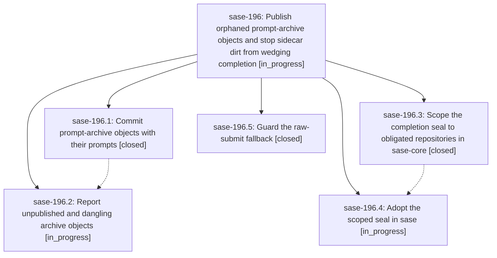

# Bead: sase-196 — Publish orphaned prompt-archive objects and stop sidecar dirt from wedging completion

[Bead Pages](../README.md) / sase-196

**Status:** ◐ in_progress · **Type:** ▸ plan · **Tier:** epic
**Owner:** `bryanbugyi34@gmail.com` · **Created by:** [bbugyi200.athena.0ry.f0](https://github.com/sase-org/sase--agents/blob/main/families/bbugyi200.athena.0ry.f0.md) · **Assignee:** `sase-196.land`
**Created:** 2026-09-25 09:05:32 EDT
**Plan:** [202609/agents\_sidecar\_orphan\_objects.md](https://github.com/sase-org/sase--plans/blob/main/202609/agents_sidecar_orphan_objects.md)

## Description

Prompt-archive objects under files/objects are committed with the prompt that links them, the orphans already in the agents sidecar clones get published by that same path, broken or unpublished object links are reported, pre-existing dirt in a repository an agent is not committing no longer blocks or invalidates `sase final prepare`, and the raw-submit fallback can no longer commit the manifest template's placeholder message.

## Phases

| Bead | Title | Status | Size | Created | Agents | Commits |
|---|---|---|---|---|---:|---:|
| [sase-196.1](sase-196.1.md) | Commit prompt-archive objects with their prompts | ✓ closed | medium | 2026-09-25 | 1 | 1 |
| [sase-196.2](sase-196.2.md) | Report unpublished and dangling archive objects | ◐ in_progress | medium | 2026-09-25 | 1 | 0 |
| [sase-196.3](sase-196.3.md) | Scope the completion seal to obligated repositories in sase-core | ✓ closed | medium | 2026-09-25 | 1 | 0 |
| [sase-196.4](sase-196.4.md) | Adopt the scoped seal in sase | ◐ in_progress | small | 2026-09-25 | 1 | 0 |
| [sase-196.5](sase-196.5.md) | Guard the raw-submit fallback | ✓ closed | small | 2026-09-25 | 1 | 1 |

## Lineage

## Agents

| Agent | Bead | Commits |
|---|---|---:|
| [bbugyi200.athena.sase-196.1](https://github.com/sase-org/sase--agents/blob/main/agents/bbugyi200.athena.sase-196.1/README.md) | [sase-196.1](sase-196.1.md) | 1 |
| [bbugyi200.athena.sase-196.2](https://github.com/sase-org/sase--agents/blob/main/agents/bbugyi200.athena.sase-196.2/README.md) | [sase-196.2](sase-196.2.md) | 0 |
| [bbugyi200.athena.sase-196.3](https://github.com/sase-org/sase--agents/blob/main/families/bbugyi200.athena.sase-196.3.md) | [sase-196.3](sase-196.3.md) | 0 |
| [bbugyi200.athena.sase-196.4](https://github.com/sase-org/sase--agents/blob/main/agents/bbugyi200.athena.sase-196.4/README.md) | [sase-196.4](sase-196.4.md) | 0 |
| [bbugyi200.athena.sase-196.5](https://github.com/sase-org/sase--agents/blob/main/agents/bbugyi200.athena.sase-196.5/README.md) | [sase-196.5](sase-196.5.md) | 1 |
| [bbugyi200.athena.sase-196.land](https://github.com/sase-org/sase--agents/blob/main/agents/bbugyi200.athena.sase-196.land/README.md) | [sase-196](README.md) | 0 |

## Commits

| Repo | Commit | Subject | Bead | Committed |
|---|---|---|---|---|
| sase | [`f648e88`](https://github.com/sase-org/sase/commit/f648e88e4870bc7024a49d873a1ef08f8382b427) | fix(agents-sync): commit prompt-archive objects with their prompts (sase-196.1) | [sase-196.1](sase-196.1.md) | 2026-09-25 10:22:50 EDT |
| sase | [`7d14286`](https://github.com/sase-org/sase/commit/7d14286e594de40c34f891d54eccbaacbe19d8d4) | feat(finalizers): guard the raw-submit fallback (sase-196.5) | [sase-196.5](sase-196.5.md) | 2026-09-25 10:33:02 EDT |
