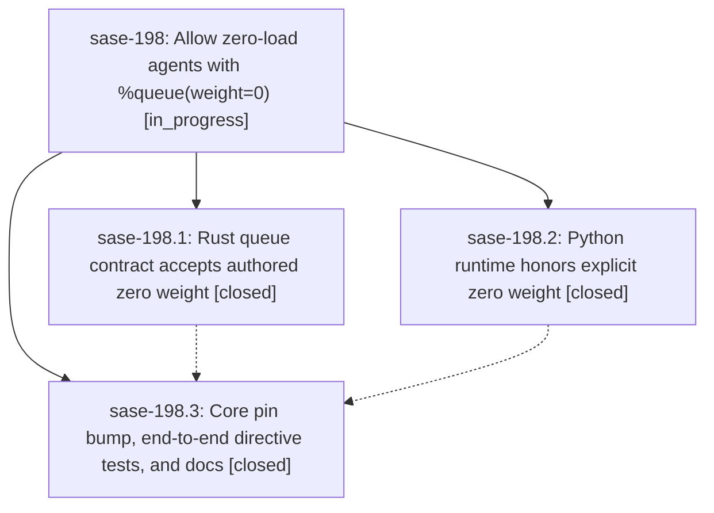

# Bead: sase-198 — Allow zero-load agents with %queue(weight=0)

[Bead Pages](../README.md) / sase-198

**Status:** ◐ in_progress · **Type:** ▸ plan · **Tier:** epic
**Owner:** `bryanbugyi34@gmail.com` · **Created by:** [bbugyi200.apollo.1n](https://github.com/sase-org/sase--agents/blob/main/families/bbugyi200.apollo.1n.md) · **Assignee:** `sase-198.land`
**Created:** 2026-09-25 09:48:59 EDT
**Plan:** [202609/queue\_zero\_weight.md](https://github.com/sase-org/sase--plans/blob/main/202609/queue_zero_weight.md)

## Description

A user can author `%queue(weight=0)` or `%q(w=0)` to launch a sase agent that adds no weighted load to runner capacity. The directive round-trips through every re-authoring path, the agent and its user-authored lineage run at weight 0 end to end, and the epic-launch monitor's host-set zero weight still never gives its successors a free ride.

## Phases

| Bead | Title | Status | Size | Created | Agents | Commits |
|---|---|---|---|---|---:|---:|
| [sase-198.1](sase-198.1.md) | Rust queue contract accepts authored zero weight | ✓ closed | medium | 2026-09-25 | 1 | 1 |
| [sase-198.2](sase-198.2.md) | Python runtime honors explicit zero weight | ✓ closed | medium | 2026-09-25 | 1 | 1 |
| [sase-198.3](sase-198.3.md) | Core pin bump, end-to-end directive tests, and docs | ✓ closed | small | 2026-09-25 | 1 | 1 |

## Lineage

## Agents

| Agent | Bead | Commits |
|---|---|---:|
| [bbugyi200.apollo.sase-198.1](https://github.com/sase-org/sase--agents/blob/main/families/bbugyi200.apollo.sase-198.1.md) | [sase-198.1](sase-198.1.md) | 0 |
| [bbugyi200.apollo.sase-198.2](https://github.com/sase-org/sase--agents/blob/main/families/bbugyi200.apollo.sase-198.2.md) | [sase-198.2](sase-198.2.md) | 0 |
| [bbugyi200.apollo.sase-198.3](https://github.com/sase-org/sase--agents/blob/main/families/bbugyi200.apollo.sase-198.3.md) | [sase-198.3](sase-198.3.md) | 1 |
| [bbugyi200.apollo.sase-198.land](https://github.com/sase-org/sase--agents/blob/main/agents/bbugyi200.apollo.sase-198.land/README.md) | [sase-198](README.md) | 0 |

## Commits

| Repo | Commit | Subject | Bead | Committed |
|---|---|---|---|---|
| sase-core | [`sase-core@c31b8cf`](https://github.com/sase-org/sase-core/commit/c31b8cf4bad8ea8c5b058a959bb69270ee2d5b30) | feat: Rust queue contract accepts authored zero weight (sase-198.1) | [sase-198.1](sase-198.1.md) | 2026-09-25 12:19:36 EDT |
| sase | [`4e18680`](https://github.com/sase-org/sase/commit/4e18680d3d98c3d82cef1b026edd9bf9b3590bf9) | feat: Python runtime honors explicit zero weight (sase-198.2) | [sase-198.2](sase-198.2.md) | 2026-09-25 12:20:11 EDT |
| sase | [`0607f7a`](https://github.com/sase-org/sase/commit/0607f7a083d80a96d3b1e9e0b5d6174417a6ce4e) | feat(queue): allow zero-load agents with %queue(weight=0) (sase-198.3) | [sase-198.3](sase-198.3.md) | 2026-09-25 13:12:21 EDT |
