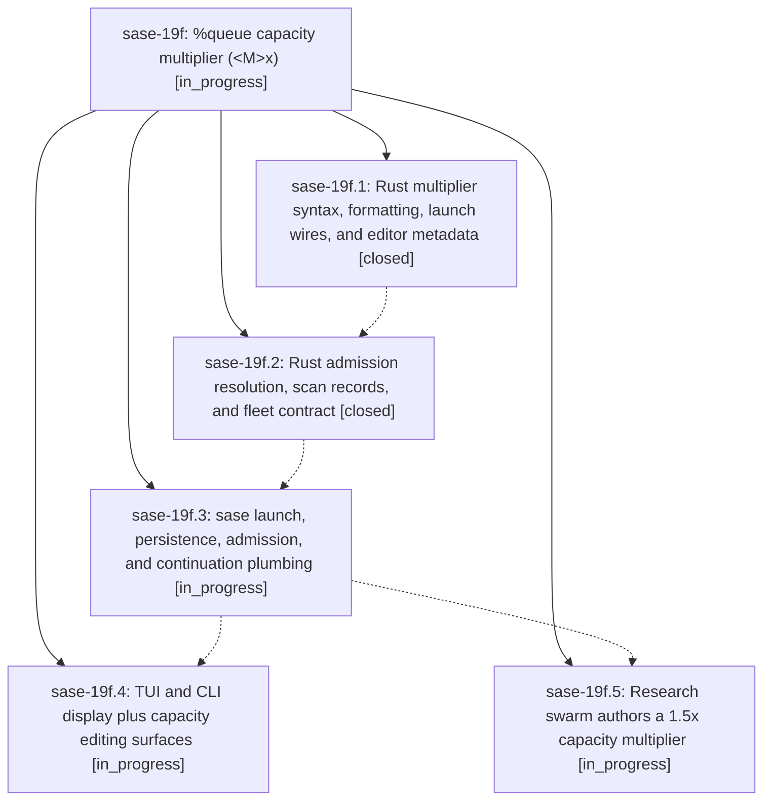

# Bead: sase-19f — %queue capacity multiplier (\<M\>x)

[Bead Pages](../README.md) / sase-19f

**Status:** ◐ in_progress · **Type:** ▸ plan · **Tier:** epic
**Owner:** `bryanbugyi34@gmail.com` · **Created by:** [bbugyi200.apollo.1o](https://github.com/sase-org/sase--agents/blob/main/families/bbugyi200.apollo.1o.md) · **Assignee:** `sase-19f.land`
**Created:** 2026-09-25 12:24:33 EDT
**Plan:** [202609/queue\_capacity\_multiplier.md](https://github.com/sase-org/sase--plans/blob/main/202609/queue_capacity_multiplier.md)

## Description

The `%queue` / `%q` capacity argument accepts a multiplier `<M>x` (at most two decimal places). Admission resolves it as M times the machine's effective `max_running_agents` budget. Every `#research_swarm` agent authors `%q(1.5x, w=0.25)`, so on a machine whose effective budget is 5 each research agent gets a capacity of 7.5.

## Phases

| Bead | Title | Status | Size | Created | Agents | Commits |
|---|---|---|---|---|---:|---:|
| [sase-19f.1](sase-19f.1.md) | Rust multiplier syntax, formatting, launch wires, and editor metadata | ✓ closed | medium | 2026-09-25 | 1 | 1 |
| [sase-19f.2](sase-19f.2.md) | Rust admission resolution, scan records, and fleet contract | ✓ closed | medium | 2026-09-25 | 1 | 1 |
| [sase-19f.3](sase-19f.3.md) | sase launch, persistence, admission, and continuation plumbing | ◐ in_progress | medium | 2026-09-25 | 1 | 0 |
| [sase-19f.4](sase-19f.4.md) | TUI and CLI display plus capacity editing surfaces | ◐ in_progress | medium | 2026-09-25 | 1 | 0 |
| [sase-19f.5](sase-19f.5.md) | Research swarm authors a 1.5x capacity multiplier | ◐ in_progress | small | 2026-09-25 | 1 | 0 |

## Lineage

## Agents

| Agent | Bead | Commits |
|---|---|---:|
| [bbugyi200.apollo.sase-19f.1](https://github.com/sase-org/sase--agents/blob/main/agents/bbugyi200.apollo.sase-19f.1/README.md) | [sase-19f.1](sase-19f.1.md) | 1 |
| [bbugyi200.apollo.sase-19f.2](https://github.com/sase-org/sase--agents/blob/main/agents/bbugyi200.apollo.sase-19f.2/README.md) | [sase-19f.2](sase-19f.2.md) | 1 |
| [bbugyi200.apollo.sase-19f.3](https://github.com/sase-org/sase--agents/blob/main/agents/bbugyi200.apollo.sase-19f.3/README.md) | [sase-19f.3](sase-19f.3.md) | 0 |
| [bbugyi200.apollo.sase-19f.4](https://github.com/sase-org/sase--agents/blob/main/agents/bbugyi200.apollo.sase-19f.4/README.md) | [sase-19f.4](sase-19f.4.md) | 0 |
| [bbugyi200.apollo.sase-19f.5](https://github.com/sase-org/sase--agents/blob/main/agents/bbugyi200.apollo.sase-19f.5/README.md) | [sase-19f.5](sase-19f.5.md) | 0 |
| [bbugyi200.apollo.sase-19f.land](https://github.com/sase-org/sase--agents/blob/main/agents/bbugyi200.apollo.sase-19f.land/README.md) | [sase-19f](README.md) | 0 |

## Commits

| Repo | Commit | Subject | Bead | Committed |
|---|---|---|---|---|
| sase-core | [`sase-core@f55c63b`](https://github.com/sase-org/sase-core/commit/f55c63bc90fe5811bc381103b038a137f8a767dd) | feat(queue): parse and format %queue \<M\>x capacity multipliers | [sase-19f.1](sase-19f.1.md) | 2026-09-25 13:05:04 EDT |
| sase-core | [`sase-core@96e42d9`](https://github.com/sase-org/sase-core/commit/96e42d944689412c45a39035764f3422acf261bb) | feat(queue): resolve capacity multipliers at admission | [sase-19f.2](sase-19f.2.md) | 2026-09-25 13:35:22 EDT |
