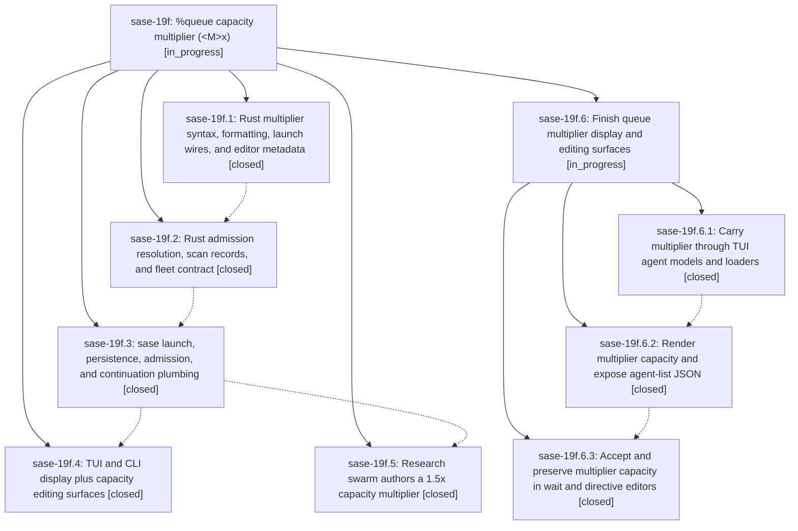

# Bead: sase-19f — %queue capacity multiplier (\<M\>x)

[Bead Pages](../README.md) / sase-19f

**Status:** ◐ in_progress · **Type:** ▸ plan · **Tier:** epic
**Owner:** `bryanbugyi34@gmail.com` · **Created by:** [bbugyi200.apollo.1o](https://github.com/sase-org/sase--agents/blob/main/sessions/bbugyi200.apollo.1o.md) · **Assignee:** `sase-19f.land`
**Created:** 2026-09-25 12:24:33 EDT
**Plan:** [202609/queue\_capacity\_multiplier.md](https://github.com/sase-org/sase--plans/blob/main/202609/queue_capacity_multiplier.md)

## Description

The `%queue` / `%q` capacity argument accepts a multiplier `<M>x` (at most two decimal places). Admission resolves it as M times the machine's effective `max_running_agents` budget. Every `#research_swarm` agent authors `%q(1.5x, w=0.25)`, so on a machine whose effective budget is 5 each research agent gets a capacity of 7.5.

## Notes

[2026-09-25T22:51:26Z · sase-17d.12.2--3] DISCOVERED ISSUE: tests/ace/tui/widgets/test_directive_arg_completion.py::test_queue_capacity_completion_describes_limit fails on clean HEAD: expected "This launch's capacity budget, replacing max_running_agents" but metadata is "...max_running_agents, or <M>x multiplier of this machine's max_running_agents budget". Reproduced isolation 0.01s and under full just check (ToolRun 181640206aaedbb9cd6afd796ecec0bd). Caused by this epic's multiplier copy; TUI/CLI display phase sase-19f.4 should update the assertion.

[2026-09-26T01:12:03Z · sase-17m.land] DISCOVERED ISSUE (sase-17m land agent, 2026-09-25, master 266c8b37b/eba6b80d0): 6beedbc11 (sase-19f.3, queue capacity multiplier plumbing) made AgentInfo require a queue_capacity_multiplier positional argument, but test fakes were not updated. Under sase tool run check (ToolRun 7263b9ee3f7bc48d3764693f0b934ba6, escalated full lane: 47643 passed), 7 test modules fail collection with 'TypeError: AgentInfo.__new__() missing 1 required positional argument: queue_capacity_multiplier': test_axe_run_agent_failed_fork_admission.py, test_axe_run_agent_runner_deferred_workspace_{flow,outcomes}.py, test_axe_run_agent_runner_retry_loop.py, test_axe_run_agent_runner_started_at.py, test_run_agent_runner_clan_summary_refresh.py, test_run_agent_workspace_identity.py. Also 4 nodes in tests/test_run_agent_runner_wait_queue.py fail with "'types.SimpleNamespace' object has no attribute 'queue_capacity_multiplier'" (SimpleNamespace AgentInfo fakes). The collection errors also make tests/test_contract_manifest.py::test_contract_manifest_matches_marker_selection fail, because pytest -m contract --collect-only exits 2. All of these reproduce on a clean tree with changes stashed.

[2026-09-26T01:18:39Z · sase-19i.4--5] DISCOVERED ISSUE: Independent corroboration from sase-19i.4 just check (ToolRun 1d771ea94f12cc992e8fd84cedcfa051) on origin/master 013a17072. Same 7-module AgentInfo collection TypeError for missing queue_capacity_multiplier; wait_queue nodes fail with SystemExit(1); contract_manifest collect-only exits 2. Local repro: tests/_axe_run_agent_runner_retry_helpers.py AGENT_INFO still omits the field. Already recorded on this epic by sase-17m.land (note #2).

[2026-09-26T08:37:31Z · sase-19f.land] LANDING AUDIT / INTERRUPTION (2026-09-26): Reviewed epic and all five child notes plus sase-core commits f55c63b/96e42d9, sase plumbing 6beedbc11, research plugin 416c5b1, and later master changes. Core parsing/admission/plumbing and research template are present. The phase sase-19f.4 note reports TUI/CLI surfaces but there is no phase-4 commit and current source has no queue_capacity_multiplier in src/sase/ace or src/sase/integrations; phase 4 is materially incomplete despite its closed status. Proposing a nested epic for only those missing surfaces with parent_bead sase-19f. Keep parent open until it lands. Follow-ups: phase 1/2 clean-base Clippy warnings routed to active green-CI epic sase-10w (new note); phase 3 xprompts.md memory correction filed as task sase-1ac per memory-write policy and original plan deferral; phase 3 _OwnerRecordLookup private import no longer exists (declined as already fixed); phase 5 published core floor corroborated on existing release-and-ratchet task sase-10d (+1, PyPI 0.34.73 predates parse commit). Epic notes #1-3: completion assertion updated; test-fake field repaired in fffdaeb3e, existing task sase-1a5 still needs closure after verification. Three sase-19f epic-symbol entries remain intentionally pending the surface implementation. Parent plan remains wip.

## Phases

| Bead | Title | Status | Size | Created | Agents | Commits |
|---|---|---|---|---|---:|---:|
| [sase-19f.1](sase-19f.1.md) | Rust multiplier syntax, formatting, launch wires, and editor metadata | ✓ closed | medium | 2026-09-25 | 1 | 1 |
| [sase-19f.2](sase-19f.2.md) | Rust admission resolution, scan records, and fleet contract | ✓ closed | medium | 2026-09-25 | 1 | 1 |
| [sase-19f.3](sase-19f.3.md) | sase launch, persistence, admission, and continuation plumbing | ✓ closed | medium | 2026-09-25 | 1 | 1 |
| [sase-19f.4](sase-19f.4.md) | TUI and CLI display plus capacity editing surfaces | ✓ closed | medium | 2026-09-25 | 1 | 0 |
| [sase-19f.5](sase-19f.5.md) | Research swarm authors a 1.5x capacity multiplier | ✓ closed | small | 2026-09-25 | 1 | 0 |

## Lineage

## Agents

| Agent | Bead | Commits |
|---|---|---:|
| [bbugyi200.apollo.sase-19f.1](https://github.com/sase-org/sase--agents/blob/main/agents/bbugyi200.apollo.sase-19f.1/README.md) | [sase-19f.1](sase-19f.1.md) | 1 |
| [bbugyi200.apollo.sase-19f.2](https://github.com/sase-org/sase--agents/blob/main/agents/bbugyi200.apollo.sase-19f.2/README.md) | [sase-19f.2](sase-19f.2.md) | 1 |
| [bbugyi200.apollo.sase-19f.3](https://github.com/sase-org/sase--agents/blob/main/sessions/bbugyi200.apollo.sase-19f.3.md) | [sase-19f.3](sase-19f.3.md) | 1 |
| [bbugyi200.apollo.sase-19f.4](https://github.com/sase-org/sase--agents/blob/main/sessions/bbugyi200.apollo.sase-19f.4.md) | [sase-19f.4](sase-19f.4.md) | 0 |
| [bbugyi200.apollo.sase-19f.5](https://github.com/sase-org/sase--agents/blob/main/sessions/bbugyi200.apollo.sase-19f.5.md) | [sase-19f.5](sase-19f.5.md) | 0 |
| [bbugyi200.apollo.sase-19f.6.1](https://github.com/sase-org/sase--agents/blob/main/sessions/bbugyi200.apollo.sase-19f.6.1.md) | [sase-19f.6.1](sase-19f.6.1.md) | 1 |
| [bbugyi200.apollo.sase-19f.6.2](https://github.com/sase-org/sase--agents/blob/main/agents/bbugyi200.apollo.sase-19f.6.2/README.md) | [sase-19f.6.2](sase-19f.6.2.md) | 1 |
| [bbugyi200.apollo.sase-19f.6.3](https://github.com/sase-org/sase--agents/blob/main/sessions/bbugyi200.apollo.sase-19f.6.3.md) | [sase-19f.6.3](sase-19f.6.3.md) | 1 |
| [bbugyi200.apollo.sase-19f.6.land](https://github.com/sase-org/sase--agents/blob/main/agents/bbugyi200.apollo.sase-19f.6.land/README.md) | [sase-19f.6](sase-19f.6.md) | 0 |
| [bbugyi200.apollo.sase-19f.land](https://github.com/sase-org/sase--agents/blob/main/sessions/bbugyi200.apollo.sase-19f.land.md) | [sase-19f](README.md) | 0 |

## Commits

| Repo | Commit | Subject | Bead | Committed |
|---|---|---|---|---|
| sase-core | [`sase-core@f55c63b`](https://github.com/sase-org/sase-core/commit/f55c63bc90fe5811bc381103b038a137f8a767dd) | feat(queue): parse and format %queue \<M\>x capacity multipliers | [sase-19f.1](sase-19f.1.md) | 2026-09-25 13:05:04 EDT |
| sase-core | [`sase-core@96e42d9`](https://github.com/sase-org/sase-core/commit/96e42d944689412c45a39035764f3422acf261bb) | feat(queue): resolve capacity multipliers at admission | [sase-19f.2](sase-19f.2.md) | 2026-09-25 13:35:22 EDT |
| sase | [`6beedbc`](https://github.com/sase-org/sase/commit/6beedbc118b8e06d92fdb9145d847e21aab87065) | feat(xprompt): add queue capacity multiplier plumbing | [sase-19f.3](sase-19f.3.md) | 2026-09-25 19:20:15 EDT |
| sase | [`73c47eb`](https://github.com/sase-org/sase/commit/73c47eb84f51e40098a25b53420beeebd4a2398c) | feat(tui): project queue capacity multiplier through agent state, dedup, fleet and loaders | [sase-19f.6.1](sase-19f.6.1.md) | 2026-09-26 06:20:39 EDT |
| sase | [`5f676a2`](https://github.com/sase-org/sase/commit/5f676a28e8b3b3c9a7f3378200e448b60b75f9cd) | feat(ace-tui): render queue capacity multiplier end to end | [sase-19f.6.2](sase-19f.6.2.md) | 2026-09-26 07:07:11 EDT |
| sase | [`2f88d1e`](https://github.com/sase-org/sase/commit/2f88d1eaa7f34ddf03a6dd016d5487452abba064) | feat(ace-tui): accept and preserve multiplier capacity in wait and directive editors | [sase-19f.6.3](sase-19f.6.3.md) | 2026-09-26 07:45:04 EDT |

<!-- sase:referenced-by:start -->

## Referenced By

| Relation | Artifact | Why | Uses |
| --- | --- | --- | ---: |
| read-by | [agent:sase-17m.land][1] | Check whether active epic owns clean-HEAD test failures found while landing sase-17m | 1 |
| read-by | [agent:sase-19i.4--5][2] | Need the epic scope | 1 |

[1]: https://github.com/sase-org/sase--agents/blob/main/agents/bbugyi200.apollo.sase-17m.land/README.md
[2]: https://github.com/sase-org/sase--agents/blob/main/sessions/bbugyi200.apollo.sase-19i.4.md

<!-- sase:referenced-by:end -->
