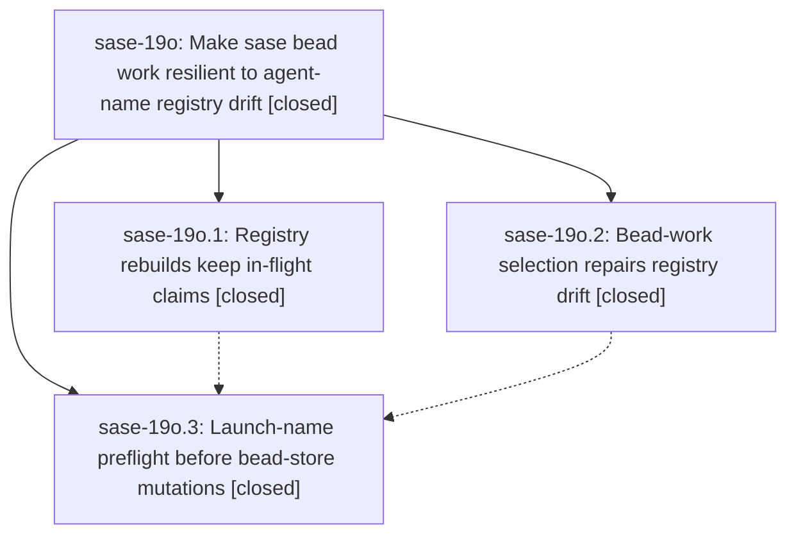

# Bead: sase-19o — Make sase bead work resilient to agent-name registry drift

[Bead Pages](../README.md) / sase-19o

**Status:** ✓ closed · **Resolution:** done · **Type:** ▸ plan · **Tier:** epic
**Owner:** `bryanbugyi34@gmail.com` · **Created by:** [bbugyi200.athena.0s9](https://github.com/sase-org/sase--agents/blob/main/sessions/bbugyi200.athena.0s9.md) · **Assignee:** `sase-19o.land`
**Created:** 2026-09-25 13:51:09 EDT · **Closed:** 2026-09-26 06:06:55 EDT
**Plan:** [202609/bead\_work\_registry\_drift\_resilience.md](https://github.com/sase-org/sase--plans/blob/main/202609/bead_work_registry_drift_resilience.md)

## Description

A `sase bead work` retry never plans to launch an agent name that a live or historical owner still holds: registry rebuilds stop dropping in-flight name claims, bead-work cleanup selection repairs (or refuses) any remaining registry drift before it kills anything, and every launch-name conflict is detected before bead-store preclaims, checkpoint commits, or pushes happen.

## Notes

[2026-09-25T21:44:12Z · sase-17d.12.2--2] DISCOVERED ISSUE: just _lint-symvision fails on origin/master after 938d2d8fe: Private _OwnerRecordLookup in src/sase/bead/cli_work_cleanup_targets.py is imported by non-test src/sase/bead/cli_work_cleanup_selection.py. sase-17d.12.2 renamed the Protocol to OwnerRecordLookup in this workspace to unblock just check; land should confirm that public name is the intended consumer surface.

[2026-09-25T23:20:14Z · sase-19i.4--2] DISCOVERED ISSUE: workspace master 7e5b6b8a8 is behind origin/master by 7 including 566c96bcd; ownerless bead-work tests still crash with "agent-name reservation batches require an agent owner". Applied the origin two-line ownerless skip in src/sase/bead/cli_work_name_preflight.py plus test_preflight_ownerless_compatibility_does_not_crash so sase-19i.4 just check can pass; land should treat 566c96bcd as the canonical fix.

[2026-09-26T10:06:55Z · sase-19o.land] Verified sase-19o against its three closed phases, the source on master (8f6257d218), and the commits that mention the epic.

sase-19o.1 (9d79a73462) keeps live identity-pending artifact claims in both rebuild paths. collect_inflight_claim_entries runs after the planned-plus-scanned merge, reuses one locked registry read, and shares _collect_single_artifact_entries with the full scan. Dead, missing, removed, and renamed identities are still dropped. The rebuild docstring states that a rebuild never discards a live claim it cannot disprove. Incident, locked-fallback, race, liveness, removal, renamed-identity, and clan tests are in tests/test_agent_name_registry_rebuild.py.

sase-19o.2 (938d2d8fec) makes select_bead_work_launch rebuild the registry once when an artifact owner is missing from the snapshot, then classify normally. Drift that survives the rebuild becomes a BLOCKED target before destructive cleanup or bead-store mutation. No drift means no rebuild. Revalidation still raises when an owner appears after the preview. Coverage is in tests/test_bead/test_cli_work_registry_drift.py.

sase-19o.3 (29f18be2b1) adds plan-only plan_registered_name_reservations on the same Rust planner as mutate. Epic and task launches call preflight_bead_work_launch_names after force-reuse cleanup and before plan snapshot, mark-ready, preclaim, and checkpoint. A launch-time NameCollisionError still rolls back, then re-preflights the owner directory and resume command, and does not suggest a try-next name. Parity, epic, task, and launch-collision tests are in tests/test_agent_name_registry_plan.py and tests/test_bead/test_cli_work_launch_name_preflight.py.

Integration since 938d2d8fec, excluding this epic's own commits: 7e5b6b8a88 and 59bf17d53f published OwnerRecordLookup, and cli_work_cleanup_selection imports that public Protocol. That resolves the sase-17d.12.2 discovered issue; the public name is the consumer surface. 566c96bcdf is the canonical ownerless skip: when AgentIdentitySnapshot has no owner, preflight returns before the Rust planner. Owner-configured collisions still fail before any bead-store mutation. That resolves the sase-19i.4 discovered issue on this tree. 6beedbc118 only added queue_capacity_multiplier to AgentInfo and wait flags; claim-then-named-meta ordering is unchanged. d86bcc3ac2 bumped AGENT_SCAN_WIRE_SCHEMA_VERSION to 10 and updated validate_sase_core_rs. Later bead-work entry points still go through launch_epic_bead_work or launch_task_bead_work, which own the preflight. No duplicate drift repair or conflicting reservation path showed up. sase bead epic-symbols sase-19o lists no --epic-symbol entries.

Follow-ups declined: sase-19o.1's proposed investigation of 21 unnamed unrelated scoped-check failures has no named tests and no matching task. The later landing check's four distinct failures (TUI link-follow, tool-run database lock, zsh pty timeout, leak-detector thread snapshot) each passed in isolation and were not persistent, so no task was filed. sase-19o.3's scan_agent_artifacts schema 10 vs expected 9 failure was fixed by d86bcc3ac2; Python and the core validator now expect schema 10. sase-19p stays an unrelated in-progress epic.

This turn ran just test on the registry rebuild, plan-only reservation, drift selection, and launch-name preflight modules: 54 passed. The epic has no parent bead.

## Phases

| Bead | Title | Status | Size | Created | Agents | Commits |
|---|---|---|---|---|---:|---:|
| [sase-19o.1](sase-19o.1.md) | Registry rebuilds keep in-flight claims | ✓ closed | medium | 2026-09-25 | 1 | 1 |
| [sase-19o.2](sase-19o.2.md) | Bead-work selection repairs registry drift | ✓ closed | small | 2026-09-25 | 1 | 1 |
| [sase-19o.3](sase-19o.3.md) | Launch-name preflight before bead-store mutations | ✓ closed | medium | 2026-09-25 | 1 | 1 |

## Lineage

## Agents

| Agent | Bead | Commits |
|---|---|---:|
| [bbugyi200.athena.sase-19o.1](https://github.com/sase-org/sase--agents/blob/main/agents/bbugyi200.athena.sase-19o.1/README.md) | [sase-19o.1](sase-19o.1.md) | 1 |
| [bbugyi200.athena.sase-19o.2](https://github.com/sase-org/sase--agents/blob/main/sessions/bbugyi200.athena.sase-19o.2.md) | [sase-19o.2](sase-19o.2.md) | 1 |
| [bbugyi200.athena.sase-19o.3](https://github.com/sase-org/sase--agents/blob/main/sessions/bbugyi200.athena.sase-19o.3.md) | [sase-19o.3](sase-19o.3.md) | 1 |
| [bbugyi200.athena.sase-19o.land](https://github.com/sase-org/sase--agents/blob/main/agents/bbugyi200.athena.sase-19o.land/README.md) | [sase-19o](README.md) | 1 |
| [bbugyi200.athena.sase-19o.land--3--code](https://github.com/sase-org/sase--agents/blob/main/agents/bbugyi200.athena.sase-19o.land--3--code/README.md) | [sase-19o](README.md) | 1 |

## Commits

| Repo | Commit | Subject | Bead | Committed |
|---|---|---|---|---|
| sase | [`938d2d8`](https://github.com/sase-org/sase/commit/938d2d8fec9052d178bdd12ea478af412422cc65) | fix(bead): type work-cleanup snapshot helpers for mypy | [sase-19o.2](sase-19o.2.md) | 2026-09-25 15:09:13 EDT |
| sase | [`9d79a73`](https://github.com/sase-org/sase/commit/9d79a73462b0e5287dc4731067d1ff81dbe509ae) | fix(agent-names): retain live in-flight registry claims | [sase-19o.1](sase-19o.1.md) | 2026-09-25 15:21:04 EDT |
| sase | [`29f18be`](https://github.com/sase-org/sase/commit/29f18be2b1f619497319c575330f8464bc2b4b6d) | fix(bead): preflight launch names before bead-store mutations | [sase-19o.3](sase-19o.3.md) | 2026-09-25 16:46:56 EDT |
| sase | [`566c96b`](https://github.com/sase-org/sase/commit/566c96bcdfb98b9d60621ff66ddaa45a66a5ea01) | fix(bead): skip launch-name preflight for ownerless compatibility callers | [sase-19o](README.md) | 2026-09-25 19:04:22 EDT |
| sase--plans | [`sase--plans@6afcee8`](https://github.com/sase-org/sase--plans/commit/6afcee819e4053dc37a306c83aade73e72bc5107) | chore(plan): mark bead-work registry drift resilience done | [sase-19o](README.md) | 2026-09-26 06:10:13 EDT |

<!-- sase:referenced-by:start -->

## Referenced By

| Relation | Artifact | Why | Uses |
| --- | --- | --- | ---: |
| read-by | [agent:sase-17m.9--4][1] | Need parent epic scope of the work-cleanup mypy commit that introduced the private import | 1 |

[1]: https://github.com/sase-org/sase--agents/blob/main/sessions/bbugyi200.athena.sase-17m.9.md

<!-- sase:referenced-by:end -->
