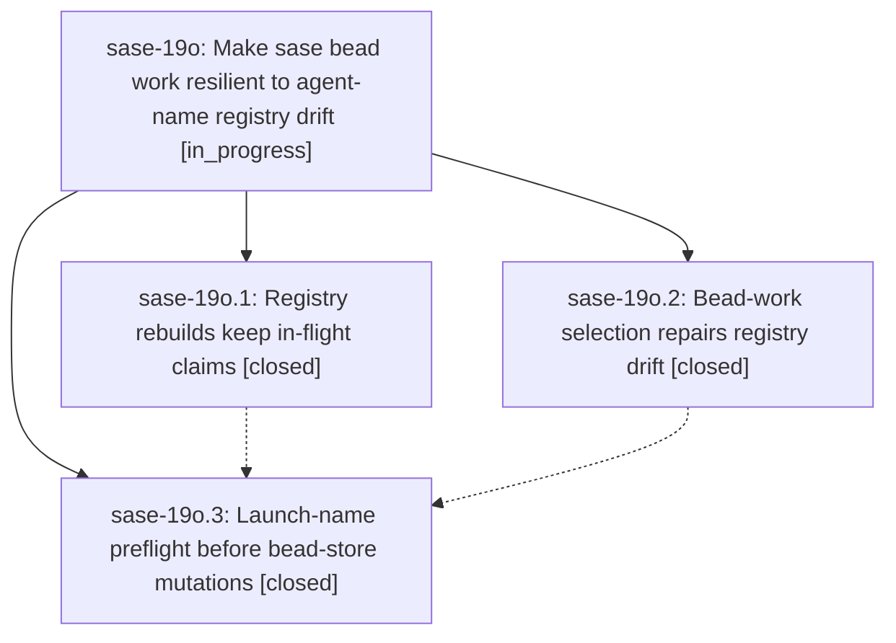

# Bead: sase-19o — Make sase bead work resilient to agent-name registry drift

[Bead Pages](../README.md) / sase-19o

**Status:** ◐ in_progress · **Type:** ▸ plan · **Tier:** epic
**Owner:** `bryanbugyi34@gmail.com` · **Created by:** [bbugyi200.athena.0s9](https://github.com/sase-org/sase--agents/blob/main/families/bbugyi200.athena.0s9.md) · **Assignee:** `sase-19o.land`
**Created:** 2026-09-25 13:51:09 EDT
**Plan:** [202609/bead\_work\_registry\_drift\_resilience.md](https://github.com/sase-org/sase--plans/blob/main/202609/bead_work_registry_drift_resilience.md)

## Description

A `sase bead work` retry never plans to launch an agent name that a live or historical owner still holds: registry rebuilds stop dropping in-flight name claims, bead-work cleanup selection repairs (or refuses) any remaining registry drift before it kills anything, and every launch-name conflict is detected before bead-store preclaims, checkpoint commits, or pushes happen.

## Notes

[2026-09-25T21:44:12Z · sase-17d.12.2--2] DISCOVERED ISSUE: just _lint-symvision fails on origin/master after 938d2d8fe: Private _OwnerRecordLookup in src/sase/bead/cli_work_cleanup_targets.py is imported by non-test src/sase/bead/cli_work_cleanup_selection.py. sase-17d.12.2 renamed the Protocol to OwnerRecordLookup in this workspace to unblock just check; land should confirm that public name is the intended consumer surface.

## Phases

| Bead | Title | Status | Size | Created | Agents | Commits |
|---|---|---|---|---|---:|---:|
| [sase-19o.1](sase-19o.1.md) | Registry rebuilds keep in-flight claims | ✓ closed | medium | 2026-09-25 | 1 | 1 |
| [sase-19o.2](sase-19o.2.md) | Bead-work selection repairs registry drift | ✓ closed | small | 2026-09-25 | 1 | 1 |
| [sase-19o.3](sase-19o.3.md) | Launch-name preflight before bead-store mutations | ✓ closed | medium | 2026-09-25 | 1 | 1 |

## Lineage

## Agents

| Agent | Bead | Commits |
|---|---|---:|
| [bbugyi200.athena.sase-19o.1](https://github.com/sase-org/sase--agents/blob/main/agents/bbugyi200.athena.sase-19o.1/README.md) | [sase-19o.1](sase-19o.1.md) | 1 |
| [bbugyi200.athena.sase-19o.2](https://github.com/sase-org/sase--agents/blob/main/sessions/bbugyi200.athena.sase-19o.2.md) | [sase-19o.2](sase-19o.2.md) | 1 |
| [bbugyi200.athena.sase-19o.3](https://github.com/sase-org/sase--agents/blob/main/sessions/bbugyi200.athena.sase-19o.3.md) | [sase-19o.3](sase-19o.3.md) | 1 |
| [bbugyi200.athena.sase-19o.land](https://github.com/sase-org/sase--agents/blob/main/sessions/bbugyi200.athena.sase-19o.land.md) | [sase-19o](README.md) | 0 |
| [bbugyi200.athena.sase-19o.land--3--code](https://github.com/sase-org/sase--agents/blob/main/agents/bbugyi200.athena.sase-19o.land--3--code/README.md) | [sase-19o](README.md) | 1 |

## Commits

| Repo | Commit | Subject | Bead | Committed |
|---|---|---|---|---|
| sase | [`938d2d8`](https://github.com/sase-org/sase/commit/938d2d8fec9052d178bdd12ea478af412422cc65) | fix(bead): type work-cleanup snapshot helpers for mypy | [sase-19o.2](sase-19o.2.md) | 2026-09-25 15:09:13 EDT |
| sase | [`9d79a73`](https://github.com/sase-org/sase/commit/9d79a73462b0e5287dc4731067d1ff81dbe509ae) | fix(agent-names): retain live in-flight registry claims | [sase-19o.1](sase-19o.1.md) | 2026-09-25 15:21:04 EDT |
| sase | [`29f18be`](https://github.com/sase-org/sase/commit/29f18be2b1f619497319c575330f8464bc2b4b6d) | fix(bead): preflight launch names before bead-store mutations | [sase-19o.3](sase-19o.3.md) | 2026-09-25 16:46:56 EDT |
| sase | [`566c96b`](https://github.com/sase-org/sase/commit/566c96bcdfb98b9d60621ff66ddaa45a66a5ea01) | fix(bead): skip launch-name preflight for ownerless compatibility callers | [sase-19o](README.md) | 2026-09-25 19:04:22 EDT |
