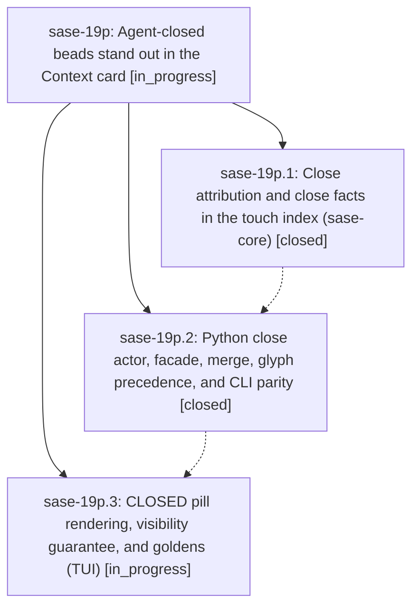

# Bead: sase-19p — Agent-closed beads stand out in the Context card

[Bead Pages](../README.md) / sase-19p

**Status:** ◐ in_progress · **Type:** ▸ plan · **Tier:** epic
**Owner:** `bryanbugyi34@gmail.com` · **Created by:** [bbugyi200.athena.0s0](https://github.com/sase-org/sase--agents/blob/main/sessions/bbugyi200.athena.0s0.md) · **Assignee:** `sase-19p.land`
**Created:** 2026-09-25 14:05:27 EDT
**Plan:** [202609/agent\_closed\_beads.md](https://github.com/sase-org/sase--plans/blob/main/202609/agent_closed_beads.md)

## Description

When a SASE agent closes a bead, that agent's Main-deck Context card lists the bead in SASE CONTEXT › ARTIFACTS › Beads with an unmistakable CLOSED pill. The close is credited to the agent that actually closed it (never the bead's creator), stays visible even when the agent touched many other beads, and reads as one feature across the card and `sase bead touched`.

## Notes

[2026-09-25T20:43:41Z · sase-19o.3--1] DISCOVERED ISSUE: just check on clean sase master (workspace sase_14, 2026-09-25) fails in tools/validate_sase_core_rs: scan_agent_artifacts probe returned stale schema got 10 expected 9. Linked sase-core HEAD is d64520b; Rust AGENT_SCAN_WIRE_SCHEMA_VERSION became 10 at 2a0fc2a (canonicalize agent-session contracts), after sase pin c31b8cf. sase-19p.2 is tasked with moving that pin — bump src/sase/core/agent_scan_wire_records.py AGENT_SCAN_WIRE_SCHEMA_VERSION and tools/validate_sase_core_rs expected 9 together with the pin, or just check stays red on every sase workspace that builds the linked core. Evidence: sase tool run cd3cab34ae9d3bdb04b4dca191ba8d7d / monitor dhmxdwbjkjen. Not caused by sase-19o.3 (phase tests 9/9 passed).

## Phases

| Bead | Title | Status | Size | Created | Agents | Commits |
|---|---|---|---|---|---:|---:|
| [sase-19p.1](sase-19p.1.md) | Close attribution and close facts in the touch index (sase-core) | ✓ closed | medium | 2026-09-25 | 1 | 1 |
| [sase-19p.2](sase-19p.2.md) | Python close actor, facade, merge, glyph precedence, and CLI parity | ✓ closed | small | 2026-09-25 | 1 | 1 |
| [sase-19p.3](sase-19p.3.md) | CLOSED pill rendering, visibility guarantee, and goldens (TUI) | ◐ in_progress | medium | 2026-09-25 | 1 | 0 |

## Lineage

## Agents

| Agent | Bead | Commits |
|---|---|---:|
| [bbugyi200.athena.sase-19p.1](https://github.com/sase-org/sase--agents/blob/main/agents/bbugyi200.athena.sase-19p.1/README.md) | [sase-19p.1](sase-19p.1.md) | 1 |
| [bbugyi200.athena.sase-19p.2](https://github.com/sase-org/sase--agents/blob/main/sessions/bbugyi200.athena.sase-19p.2.md) | [sase-19p.2](sase-19p.2.md) | 1 |
| [bbugyi200.athena.sase-19p.3](https://github.com/sase-org/sase--agents/blob/main/agents/bbugyi200.athena.sase-19p.3/README.md) | [sase-19p.3](sase-19p.3.md) | 0 |
| [bbugyi200.athena.sase-19p.land](https://github.com/sase-org/sase--agents/blob/main/agents/bbugyi200.athena.sase-19p.land/README.md) | [sase-19p](README.md) | 0 |

## Commits

| Repo | Commit | Subject | Bead | Committed |
|---|---|---|---|---|
| sase-core | [`sase-core@7677abd`](https://github.com/sase-org/sase-core/commit/7677abd82df9019350af294dd47915ac4eb23aef) | feat(bead): record close attribution and close facts in touch index | [sase-19p.1](sase-19p.1.md) | 2026-09-25 15:04:57 EDT |
| sase | [`ed548d3`](https://github.com/sase-org/sase/commit/ed548d3e26ca95ef01dda40d2488ff21529cb974) | feat(bead): surface agent close records through Python plumbing | [sase-19p.2](sase-19p.2.md) | 2026-09-25 19:24:39 EDT |

<!-- sase:referenced-by:start -->

## Referenced By

| Relation | Artifact | Why | Uses |
| --- | --- | --- | ---: |
| read-by | [agent:sase-19p.1][1] | parent epic context | 1 |

[1]: https://github.com/sase-org/sase--agents/blob/main/agents/bbugyi200.athena.sase-19p.1/README.md

<!-- sase:referenced-by:end -->
