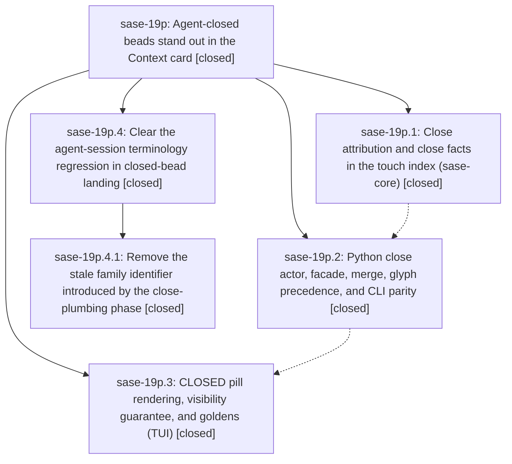

# Bead: sase-19p — Agent-closed beads stand out in the Context card

[Bead Pages](../README.md) / sase-19p

**Status:** ✓ closed · **Resolution:** done · **Type:** ▸ plan · **Tier:** epic
**Owner:** `bryanbugyi34@gmail.com` · **Created by:** [bbugyi200.athena.0s0](https://github.com/sase-org/sase--agents/blob/main/sessions/bbugyi200.athena.0s0.md) · **Assignee:** `sase-19p.land`
**Created:** 2026-09-25 14:05:27 EDT · **Closed:** 2026-09-26 07:02:30 EDT
**Plan:** [202609/agent\_closed\_beads.md](https://github.com/sase-org/sase--plans/blob/main/202609/agent_closed_beads.md)

## Description

When a SASE agent closes a bead, that agent's Main-deck Context card lists the bead in SASE CONTEXT › ARTIFACTS › Beads with an unmistakable CLOSED pill. The close is credited to the agent that actually closed it (never the bead's creator), stays visible even when the agent touched many other beads, and reads as one feature across the card and `sase bead touched`.

## Notes

[2026-09-25T20:43:41Z · sase-19o.3--1] DISCOVERED ISSUE: just check on clean sase master (workspace sase_14, 2026-09-25) fails in tools/validate_sase_core_rs: scan_agent_artifacts probe returned stale schema got 10 expected 9. Linked sase-core HEAD is d64520b; Rust AGENT_SCAN_WIRE_SCHEMA_VERSION became 10 at 2a0fc2a (canonicalize agent-session contracts), after sase pin c31b8cf. sase-19p.2 is tasked with moving that pin — bump src/sase/core/agent_scan_wire_records.py AGENT_SCAN_WIRE_SCHEMA_VERSION and tools/validate_sase_core_rs expected 9 together with the pin, or just check stays red on every sase workspace that builds the linked core. Evidence: sase tool run cd3cab34ae9d3bdb04b4dca191ba8d7d / monitor dhmxdwbjkjen. Not caused by sase-19o.3 (phase tests 9/9 passed).

[2026-09-26T01:45:19Z · sase-19p.land] LANDING INTERRUPTED (2026-09-25, integrated master 4ee966cd5): Read epic, all three closed child phases and every note; audited Rust close mutation/touch reducer at sase-core 9d049aa, Python facade/CLI/merge/glyph paths, TUI rows and both PNG goldens. The core pin contains Rust commit 7677abd, and no --epic-symbol entries remain. Later commits updated the core pin (013a17072), removed the stale feature flag (49c32e19e), regenerated memory README (eba6b80d0), and touched adjacent header/navigation code without conflicting with the closed-bead paths. Epic note #1 scan schema mismatch is resolved at schema 10. Proposed follow-up sase-19p.1#1 is independent reopen attribution, still present in open_issue/reopen_closed_ancestors; filed ready bug sase-1a4 with source snapshot and related link to sase-15a. Proposed follow-up sase-19p.2#1 is resolved by 49c32e19e. Proposed follow-up sase-19p.3#1 is resolved by eba6b80d0. No proposal declined without a recorded outcome. sase tool run check 0962fffefcd94a0b59720955cda3794c passed lint/SASE validation/committed plans, then full non-visual tests had 47669 pass, 10 fail, 91 errors; queue AgentInfo errors are recorded on sase-19f and Node Finder marker audit on sase-19i. One deterministic failure IS ours: tests/test_agent_session_terminology.py::test_current_source_avoids_agent_family_identifiers reports the legacy identifier in src/sase/core/runner_slots/_admission_capacity_records.py:157, introduced by phase .2 commit ed548d3e2 and still present on integrated master. Remaining epic work is planned in validated child epic sase_plan_agent_closed_bead_landing_cleanup.md (parent_bead sase-19p), limited to removing that stale docstring identifier and verifying the integrated tree. Parent close, post-close symvision, and original plan status remain for resumed parent landing.

[2026-09-26T11:02:30Z · sase-19p.4.land] Rechecked the interrupted landing after child epic sase-19p.4 closed. Landing note #2 left one epic-caused failure: tests/test_agent_session_terminology.py::test_current_source_avoids_agent_family_identifiers on the agent_family_parallel mention in src/sase/core/runner_slots/_admission_capacity_records.py. That docstring now describes the legacy parallel marker without the retired identifier (wording in 22e5414a9; manifest curation in fffdaeb3e8). Focused terminology and close-feature suites passed, 74 tests, including close-without-note actor credit and CLOSED-pill row rendering. Descendants sase-19p.1, sase-19p.2, sase-19p.3, and sase-19p.4 are closed done, and the linked plan's core, plumbing, and render phases match those beads. Epic note #1 scan-schema mismatch stays resolved at schema 10. Follow-ups stay as previously recorded: sase-19p.1#1 is ready task sase-1a4; sase-19p.2#1 is gone with 49c32e19e (tool_failure_triage absent); sase-19p.3#1 is gone with eba6b80d0. Post-child commits through f62604e712, including the bead_touches split 0a2247c4f1, do not regress those paths. No --epic-symbol entries for sase-19p. Child-epic follow-ups sase-19p.4.1#1 and #2 were already fixed on master (465a8858b9 and e2b462548c) and were declined rather than refiled. just symvision was clean after the child close.

## Phases

| Bead | Title | Status | Size | Created | Agents | Commits |
|---|---|---|---|---|---:|---:|
| [sase-19p.1](sase-19p.1.md) | Close attribution and close facts in the touch index (sase-core) | ✓ closed | medium | 2026-09-25 | 1 | 1 |
| [sase-19p.2](sase-19p.2.md) | Python close actor, facade, merge, glyph precedence, and CLI parity | ✓ closed | small | 2026-09-25 | 1 | 1 |
| [sase-19p.3](sase-19p.3.md) | CLOSED pill rendering, visibility guarantee, and goldens (TUI) | ✓ closed | medium | 2026-09-25 | 1 | 1 |

## Lineage

## Agents

| Agent | Bead | Commits |
|---|---|---:|
| [bbugyi200.athena.sase-19p.1](https://github.com/sase-org/sase--agents/blob/main/agents/bbugyi200.athena.sase-19p.1/README.md) | [sase-19p.1](sase-19p.1.md) | 1 |
| [bbugyi200.athena.sase-19p.2](https://github.com/sase-org/sase--agents/blob/main/sessions/bbugyi200.athena.sase-19p.2.md) | [sase-19p.2](sase-19p.2.md) | 1 |
| [bbugyi200.athena.sase-19p.3](https://github.com/sase-org/sase--agents/blob/main/sessions/bbugyi200.athena.sase-19p.3.md) | [sase-19p.3](sase-19p.3.md) | 1 |
| [bbugyi200.athena.sase-19p.4.1](https://github.com/sase-org/sase--agents/blob/main/sessions/bbugyi200.athena.sase-19p.4.1.md) | [sase-19p.4.1](sase-19p.4.1.md) | 1 |
| [bbugyi200.athena.sase-19p.4.land](https://github.com/sase-org/sase--agents/blob/main/agents/bbugyi200.athena.sase-19p.4.land/README.md) | [sase-19p.4](sase-19p.4.md) | 1 |
| [bbugyi200.athena.sase-19p.land](https://github.com/sase-org/sase--agents/blob/main/sessions/bbugyi200.athena.sase-19p.land.md) | [sase-19p](README.md) | 0 |

## Commits

| Repo | Commit | Subject | Bead | Committed |
|---|---|---|---|---|
| sase-core | [`sase-core@7677abd`](https://github.com/sase-org/sase-core/commit/7677abd82df9019350af294dd47915ac4eb23aef) | feat(bead): record close attribution and close facts in touch index | [sase-19p.1](sase-19p.1.md) | 2026-09-25 15:04:57 EDT |
| sase | [`ed548d3`](https://github.com/sase-org/sase/commit/ed548d3e26ca95ef01dda40d2488ff21529cb974) | feat(bead): surface agent close records through Python plumbing | [sase-19p.2](sase-19p.2.md) | 2026-09-25 19:24:39 EDT |
| sase | [`7211290`](https://github.com/sase-org/sase/commit/72112905707800b3f51068d66edda19323d359ba) | feat(ace): add agent bead touches panel and sase context snapshots | [sase-19p.3](sase-19p.3.md) | 2026-09-25 20:55:47 EDT |
| sase | [`fffdaeb`](https://github.com/sase-org/sase/commit/fffdaeb3e84392178f4c7bba0344609e440c859a) | fix(agent-session): finish sase-17m landing gaps and queue capacity plumbing | [sase-19p.4.1](sase-19p.4.1.md) | 2026-09-25 23:46:09 EDT |
| sase--plans | [`sase--plans@c141c1d`](https://github.com/sase-org/sase--plans/commit/c141c1d35680e45d7c3eb6817f8a2c6c26efd0cc) | chore(plan): mark agent-closed bead landing plans done | [sase-19p.4](sase-19p.4.md) | 2026-09-26 07:12:02 EDT |

<!-- sase:referenced-by:start -->

## Referenced By

| Relation | Artifact | Why | Uses |
| --- | --- | --- | ---: |
| read-by | [agent:sase-19p.1][1] | parent epic context | 1 |

[1]: https://github.com/sase-org/sase--agents/blob/main/agents/bbugyi200.athena.sase-19p.1/README.md

<!-- sase:referenced-by:end -->
