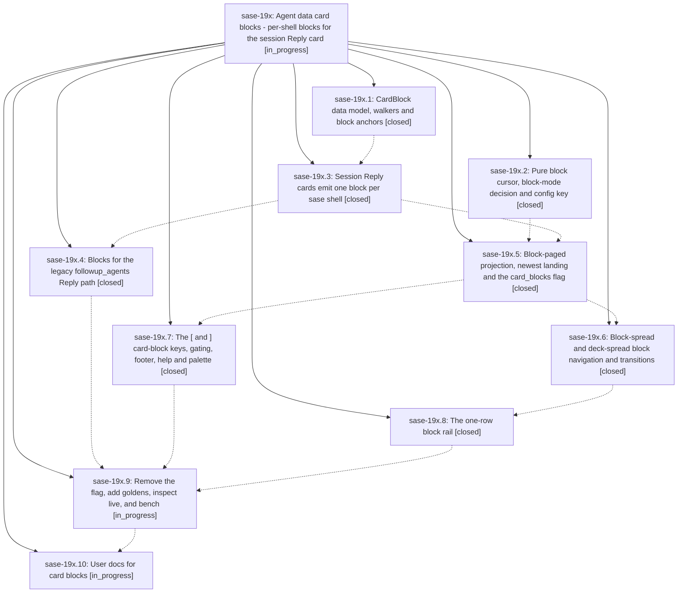

# Bead: sase-19x — Agent data card blocks - per-shell blocks for the session Reply card

[Bead Pages](../README.md) / sase-19x

**Status:** ◐ in_progress · **Type:** ▸ plan · **Tier:** epic
**Owner:** `bryanbugyi34@gmail.com` · **Created by:** [bbugyi200.athena.0s4](https://github.com/sase-org/sase--agents/blob/main/sessions/bbugyi200.athena.0s4.md) · **Assignee:** `sase-19x.land`
**Created:** 2026-09-25 20:37:37 EDT
**Plan:** [202609/agent\_data\_card\_blocks.md](https://github.com/sase-org/sase--plans/blob/main/202609/agent_data_card_blocks.md)

## Description

Agents-tab deck panels gain a third level, deck -> card -> block. An agent session's Reply card is split into one block per concrete sase shell. A card shown alone spreads its blocks when they fit `ace.agent_decks.block_spread_max_screens` and pages them one shell at a time otherwise. Every node lands on its newest block, `[` / `]` step to older / newer blocks, and a one-row block rail shows the session timeline. The result is intuitive, reliable, fast, and beautiful.

## Notes

[2026-09-26T10:55:17Z · bryanbugyi34@gmail.com] The epic lander agent should implement all proposed memory file changes directly (no follow-up beads).

[2026-09-26T12:42:22Z · sase-1aa.land] DISCOVERED ISSUE: sase-1aa landing audit ran sase tool run check 5de0d0655fe4b5841b4498a98cf496e7 on current master; formatting, generated docs, model policy, keep-sorted, Ruff, mypy, flags, pyscripts, waits, changelog and terminology passed, then Symvision failed with three NEW stale Justfile --epic-symbol entries keyed to closed phase sase-19x.4: phase_card_block, block_meta_for_session_shell, session_reply_heading (Justfile lines 380-382). sase bead epic-symbols sase-19x confirms them; phase .4 closed at 2026-09-26T11:31:53Z. This is caused by sase-19x phase close, not sase-1aa model work. Resolve or re-key these entries to an open later phase that still needs them before closing 19x.

[2026-09-26T12:58:43Z · sase-19f.6.4.land] DISCOVERED ISSUE: Independent corroboration from sase-19f.6.4.1 PROPOSED FOLLOW-UP notes #1-2: on master after its loaded-multiplier display commit, just check still reports stale Justfile --epic-symbol entries for closed sase-19x.4 (phase_card_block, block_meta_for_session_shell, session_reply_heading). This is the same issue as this epic note #2; resolve or re-key before sase-19x closes.

## Phases

| Bead | Title | Status | Size | Created | Agents | Commits |
|---|---|---|---|---|---:|---:|
| [sase-19x.1](sase-19x.1.md) | CardBlock data model, walkers and block anchors | ✓ closed | medium | 2026-09-25 | 1 | 1 |
| [sase-19x.10](sase-19x.10.md) | User docs for card blocks | ◐ in_progress | small | 2026-09-25 | 1 | 0 |
| [sase-19x.2](sase-19x.2.md) | Pure block cursor, block-mode decision and config key | ✓ closed | small | 2026-09-25 | 1 | 1 |
| [sase-19x.3](sase-19x.3.md) | Session Reply cards emit one block per sase shell | ✓ closed | medium | 2026-09-25 | 1 | 1 |
| [sase-19x.4](sase-19x.4.md) | Blocks for the legacy followup\_agents Reply path | ✓ closed | small | 2026-09-25 | 1 | 1 |
| [sase-19x.5](sase-19x.5.md) | Block-paged projection, newest landing and the card\_blocks flag | ✓ closed | medium | 2026-09-25 | 1 | 1 |
| [sase-19x.6](sase-19x.6.md) | Block-spread and deck-spread block navigation and transitions | ✓ closed | medium | 2026-09-25 | 1 | 1 |
| [sase-19x.7](sase-19x.7.md) | The \[ and \] card-block keys, gating, footer, help and palette | ✓ closed | medium | 2026-09-25 | 1 | 1 |
| [sase-19x.8](sase-19x.8.md) | The one-row block rail | ✓ closed | medium | 2026-09-25 | 1 | 1 |
| [sase-19x.9](sase-19x.9.md) | Remove the flag, add goldens, inspect live, and bench | ◐ in_progress | medium | 2026-09-25 | 1 | 0 |

## Lineage

## Agents

| Agent | Bead | Commits |
|---|---|---:|
| [bbugyi200.athena.sase-19x.1](https://github.com/sase-org/sase--agents/blob/main/sessions/bbugyi200.athena.sase-19x.1.md) | [sase-19x.1](sase-19x.1.md) | 1 |
| [bbugyi200.athena.sase-19x.10](https://github.com/sase-org/sase--agents/blob/main/agents/bbugyi200.athena.sase-19x.10/README.md) | [sase-19x.10](sase-19x.10.md) | 0 |
| [bbugyi200.athena.sase-19x.2](https://github.com/sase-org/sase--agents/blob/main/sessions/bbugyi200.athena.sase-19x.2.md) | [sase-19x.2](sase-19x.2.md) | 1 |
| [bbugyi200.athena.sase-19x.3](https://github.com/sase-org/sase--agents/blob/main/agents/bbugyi200.athena.sase-19x.3/README.md) | [sase-19x.3](sase-19x.3.md) | 0 |
| [bbugyi200.athena.sase-19x.4](https://github.com/sase-org/sase--agents/blob/main/sessions/bbugyi200.athena.sase-19x.4.md) | [sase-19x.4](sase-19x.4.md) | 1 |
| [bbugyi200.athena.sase-19x.5](https://github.com/sase-org/sase--agents/blob/main/sessions/bbugyi200.athena.sase-19x.5.md) | [sase-19x.5](sase-19x.5.md) | 1 |
| [bbugyi200.athena.sase-19x.6](https://github.com/sase-org/sase--agents/blob/main/agents/bbugyi200.athena.sase-19x.6/README.md) | [sase-19x.6](sase-19x.6.md) | 1 |
| [bbugyi200.athena.sase-19x.7](https://github.com/sase-org/sase--agents/blob/main/sessions/bbugyi200.athena.sase-19x.7.md) | [sase-19x.7](sase-19x.7.md) | 1 |
| [bbugyi200.athena.sase-19x.8](https://github.com/sase-org/sase--agents/blob/main/sessions/bbugyi200.athena.sase-19x.8.md) | [sase-19x.8](sase-19x.8.md) | 1 |
| [bbugyi200.athena.sase-19x.9](https://github.com/sase-org/sase--agents/blob/main/agents/bbugyi200.athena.sase-19x.9/README.md) | [sase-19x.9](sase-19x.9.md) | 0 |
| [bbugyi200.athena.sase-19x.land](https://github.com/sase-org/sase--agents/blob/main/agents/bbugyi200.athena.sase-19x.land/README.md) | [sase-19x](README.md) | 0 |

## Commits

| Repo | Commit | Subject | Bead | Committed |
|---|---|---|---|---|
| sase | [`671a611`](https://github.com/sase-org/sase/commit/671a6116c5d7ae9f5567497538dbac4bceffc084) | feat(decks): add CardBlock data model, walkers and block anchors | [sase-19x.1](sase-19x.1.md) | 2026-09-25 22:08:40 EDT |
| sase | [`465a885`](https://github.com/sase-org/sase/commit/465a8858b99e2c9d5b978ceaac9003ca6030b5eb) | feat(ace): add pure block cursor model and block spread config key | [sase-19x.2](sase-19x.2.md) | 2026-09-25 23:11:06 EDT |
| sase | [`8f6257d`](https://github.com/sase-org/sase/commit/8f6257d2184a94796da21426ac59f6835234e95f) | feat: Session Reply cards emit one block per sase shell (sase-19x.3) | [sase-19x.3](sase-19x.3.md) | 2026-09-26 05:45:18 EDT |
| sase | [`42e29d6`](https://github.com/sase-org/sase/commit/42e29d6ccca3bf8f2de51a020526f464f5a021d5) | feat(decks): block-paged projection with newest landing and card\_blocks flag (sase-19x.5) | [sase-19x.5](sase-19x.5.md) | 2026-09-26 07:39:10 EDT |
| sase | [`6bfd710`](https://github.com/sase-org/sase/commit/6bfd7103dc6efaced71e909c111515e89ea2e3ee) | feat(legacy-reply): per-phase blocks for followup\_agents Reply path (sase-19x.4) | [sase-19x.4](sase-19x.4.md) | 2026-09-26 07:46:43 EDT |
| sase | [`5f082a5`](https://github.com/sase-org/sase/commit/5f082a5f13c84b5128d51992ff1696d1815a9c0d) | feat(ace-tui): block-spread and deck-spread navigation with ReadingAnchor (sase-19x.6) | [sase-19x.6](sase-19x.6.md) | 2026-09-26 08:24:34 EDT |
| sase | [`972acbe`](https://github.com/sase-org/sase/commit/972acbe9023cf20d1e0960f072f69d86f60ae4f8) | feat(ace-tui): card-block \[ and \] keys with gating, footer, help and palette (sase-19x.7) | [sase-19x.7](sase-19x.7.md) | 2026-09-26 08:51:04 EDT |
| sase | [`f7df95c`](https://github.com/sase-org/sase/commit/f7df95c94c0fc5a2498968ce46fec815444cd020) | feat(ace-tui): one-row block rail under Main deck panel (sase-19x.8) | [sase-19x.8](sase-19x.8.md) | 2026-09-26 09:21:28 EDT |

<!-- sase:referenced-by:start -->

## Referenced By

| Relation | Artifact | Why | Uses |
| --- | --- | --- | ---: |
| read-by | [agent:sase-19x.6][1] | Need epic status | 1 |

[1]: https://github.com/sase-org/sase--agents/blob/main/agents/bbugyi200.athena.sase-19x.6/README.md

<!-- sase:referenced-by:end -->
