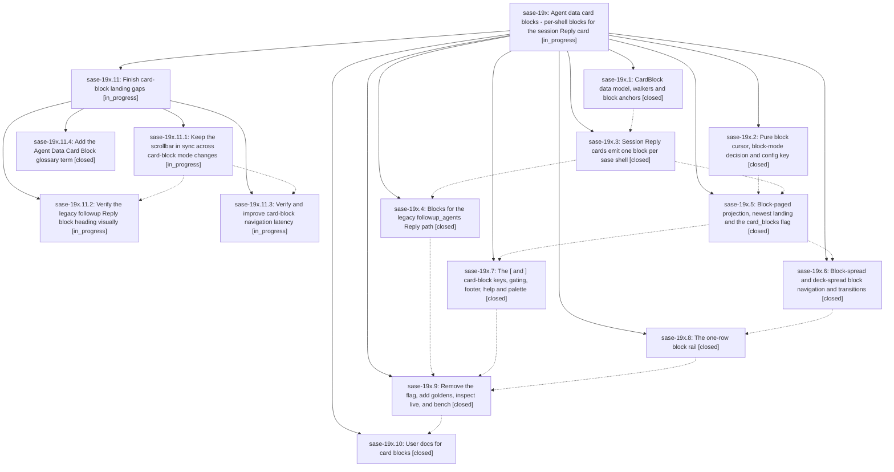

# Bead: sase-19x — Agent data card blocks - per-shell blocks for the session Reply card

[Bead Pages](../README.md) / sase-19x

**Status:** ◐ in_progress · **Type:** ▸ plan · **Tier:** epic
**Owner:** `bryanbugyi34@gmail.com` · **Created by:** [bbugyi200.athena.0s4](https://github.com/sase-org/sase--agents/blob/main/sessions/bbugyi200.athena.0s4.md) · **Assignee:** `sase-19x.land`
**Created:** 2026-09-25 20:37:37 EDT
**Plan:** [202609/agent\_data\_card\_blocks.md](https://github.com/sase-org/sase--plans/blob/main/202609/agent_data_card_blocks.md)

<!-- sase:links:start -->

## Links

| Relation | Artifact | Why |
| --- | --- | --- |
| implemented-by | [plan:202609/agent_data_card_blocks.md][1] | derived from the plan's `bead_id:` frontmatter field |

_Plus 15 automatic references — see [Referenced By](#referenced-by)._

[1]: https://github.com/sase-org/sase--plans/blob/main/202609/agent_data_card_blocks.md

<!-- sase:links:end -->

## Description

Agents-tab deck panels gain a third level, deck -> card -> block. An agent session's Reply card is split into one block per concrete sase shell. A card shown alone spreads its blocks when they fit `ace.agent_decks.block_spread_max_screens` and pages them one shell at a time otherwise. Every node lands on its newest block, `[` / `]` step to older / newer blocks, and a one-row block rail shows the session timeline. The result is intuitive, reliable, fast, and beautiful.

## Notes

[2026-09-26T10:55:17Z · bryanbugyi34@gmail.com] The epic lander agent should implement all proposed memory file changes directly (no follow-up beads).

[2026-09-26T12:42:22Z · sase-1aa.land] DISCOVERED ISSUE: sase-1aa landing audit ran sase tool run check 5de0d0655fe4b5841b4498a98cf496e7 on current master; formatting, generated docs, model policy, keep-sorted, Ruff, mypy, flags, pyscripts, waits, changelog and terminology passed, then Symvision failed with three NEW stale Justfile --epic-symbol entries keyed to closed phase sase-19x.4: phase_card_block, block_meta_for_session_shell, session_reply_heading (Justfile lines 380-382). sase bead epic-symbols sase-19x confirms them; phase .4 closed at 2026-09-26T11:31:53Z. This is caused by sase-19x phase close, not sase-1aa model work. Resolve or re-key these entries to an open later phase that still needs them before closing 19x.

[2026-09-26T12:58:43Z · sase-19f.6.4.land] DISCOVERED ISSUE: Independent corroboration from sase-19f.6.4.1 PROPOSED FOLLOW-UP notes #1-2: on master after its loaded-multiplier display commit, just check still reports stale Justfile --epic-symbol entries for closed sase-19x.4 (phase_card_block, block_meta_for_session_shell, session_reply_heading). This is the same issue as this epic note #2; resolve or re-key before sase-19x closes.

[2026-09-26T14:00:44Z · sase-1ag.land] DISCOVERED ISSUE: Independent corroboration from sase-1ag.2 PROPOSED FOLLOW-UP note #1, rechecked by sase-1ag.land. `just symvision` on master e565105721 still fails only on the three Justfile --epic-symbol entries keyed to closed phase sase-19x.4: phase_card_block, block_meta_for_session_shell, session_reply_heading. Same issue as notes #2 and #3. Additional finding: those three functions are already called from src/sase/ace/tui/widgets/prompt_panel/_agent_display_hint_body.py and _agent_display_render.py, so the exemptions are unnecessary as well as stale. Delete the three Justfile lines; do not re-key them to sase-19x.9 or sase-19x.10. The sase-19f entries named in the original proposal are already absent. Open epic sase-18i's CoderPlacement and RetiredGate entries are still accepted and are not this issue.

[2026-09-26T14:23:48Z · sase-19i.7.land] DISCOVERED ISSUE corroboration from sase-19i.7 land review (phase .2 PROPOSED FOLLOW-UP #5): just symvision on 7cdde2b32 still fails solely on three closed sase-19x.4 Justfile entries: phase_card_block, block_meta_for_session_shell, session_reply_heading. The original proposal also named sase-19f and sase-1aa.4 entries, but those are absent from current Justfile; epic note #4 already identifies deletion of the three 19x.4 exemptions as the remedy. This belongs to active sase-19x, so no standalone task was created.

[2026-09-26T15:12:33Z · sase-1aa.5.land] -n @/tmp/sase-19x-discovered.md

[2026-09-26T16:54:30Z · sase-1af.5.land] DISCOVERED ISSUE: sase-1af.5.1 note #1, rechecked at sase-1af.5 landing on master e922c424e. tools/check_feature_flags exits 1 with "rule 7: closed flag bead 'sase-1ad' still has a surviving 'card_blocks' definition". src/sase/feature_flags/registry.py still defines FeatureFlag.card_blocks with bead sase-1ad. src/sase/ace/tui/widgets/decks/flag.py still defines card_blocks_enabled, and panel_blocks.py, main_view.py, panel_transitions.py, and panel_interaction.py still call it. sase-19x.9 note #3 and sase-1ad note #1 say decks/flag.py was deleted and the registry entry removed, but this clone has no commit mentioning sase-19x.9 or sase-1ad. The last flag.py commit is 42e29d6cc (sase-19x.5), which added the flag. The cutover removal claimed at phase close never landed, so just check stops at lint (feature flags) for later unrelated work, including sase-1af.5. Corroborated on closed flag bead sase-1ad with +1 --verified-after-close from this landing. Finish that removal before this epic lands. The five Justfile --epic-symbol entries keyed to closed phase sase-19x.9 (ReadingAnchor, capture_reading_anchor, restore_block_offset, render_block_rail, block_rail_text) are also still present. A rule 8 warning for live flag bead sase-1ar (legacy_sase_shell_syntax, created by sase-1ab.3) is an in-flight landing warning, separate from this issue.

[2026-09-26T16:57:30Z · sase-1af.5.land] SUPPLEMENT: the +1 --verified-after-close on sase-1ad reopened that flag bead (↺1). A second tools/check_feature_flags run then exits 0. The only output is a rule 8 warning for live flag bead sase-1ar (legacy_sase_shell_syntax), created 43m ago by sase-1ab.3 and still inside landing grace. Rule 7 is clear because the bead is live again. The card_blocks definition and call sites are still in the tree, so the cutover removal claimed by sase-19x.9 still has to land before sase-1ad can close again.

[2026-09-26T17:05:44Z · sase-1af.5.land] SUPPLEMENT: just symvision on master after sase-1af closed exits 1 only on the five closed-phase exemptions. Exact errors: --epic-symbol 'sase-19x.9(ReadingAnchor)', 'sase-19x.9(capture_reading_anchor)', 'sase-19x.9(restore_block_offset)', 'sase-19x.9(render_block_rail)', and 'sase-19x.9(block_rail_text)' — bead sase-19x.9 is closed. sase-1af and sase-1af.5 have no epic-symbol entries. Left the Justfile keyed to sase-19x.9 because that epic is still open and phase .10 does not own these seams; resolve them on this epic's landing (consume, privatize, delete, or re-key to a still-open bead).

[2026-09-26T17:13:33Z · sase-1ao.land] DISCOVERED ISSUE corroboration from sase-1ao landing: current master e922c424e just check ToolRun 3f77453fd19a04e6c131bd3fb44181c2 passed prior lint stages, then Symvision stopped on the same five closed sase-19x.9 entries named in epic note #9 (ReadingAnchor, capture_reading_anchor, restore_block_offset, render_block_rail, block_rail_text). This is owned by the still-open card-blocks epic; no new task and no change to unrelated model-shortcut code.

[2026-09-26T17:27:32Z · sase-1ah.land] DISCOVERED ISSUE: sase-1ah landing independently reproduced just symvision failure on master 3065117500: five Justfile --epic-symbol exemptions still name closed phase sase-19x.9 (ReadingAnchor, capture_reading_anchor, restore_block_offset, render_block_rail, block_rail_text). This is the card-block epic issue already described in notes #9-10; resolve before 19x closes.

[2026-09-26T18:42:36Z · sase-19x.land] LANDING AUDIT (before child repair plan): All ten phase beads and notes reviewed. Current master 7606e5d8c7 includes each of the ten epic commits; CardBlock/BlockSpreadOnly, block cursor and mode config, session and legacy Reply builders, panel projection/transition/navigation, [ / ] gating, one-row rail, cutover, seven block PNGs, and docs are present. 87 focused model/panel/key/rail tests passed. Phase .9 cutover commit 39f8e4ea47 is now on master: no card_blocks registry definition, no decks/flag.py, no enabled call sites. I closed reopened flag bead sase-1ad after feature-flags lint exited 0. `sase bead epic-symbols sase-19x` reports no entries; all formerly stale phase .4/.9 exemptions were removed or privatized by later commits. Post-start TUI drift includes the panel.py split (9634b6f9fd); current panel_navigation/panel_interaction still call block navigation and 87 focused tests pass. Other recent commits add Node Finder, model shortcuts, receipt tools, and gate-turn migration; the only direct integration issue found is ongoing sase-1ab's test/terminology cutover, routed to that epic.

PROPOSED FOLLOW-UP outcomes (carry these into the final close note):
- .1 #1 and .2 #1 AgentInfo queue_capacity_multiplier fake/collection failures: already fixed by fffdaeb3e and closed task sase-1a5; declined new task. .1 #1 agent-session terminology and monitor-capacity nodes now pass focused; contract-manifest and marker-path audit are currently red from active sase-1ab shell-to-turn rename, recorded on sase-1ab; declined duplicate task.
- .3 #1 marker-path audit ruff F601: current ruff check passes; declined as resolved. .3 #2 two fleet PNG drifts: corroborated existing sase-19z with +1.
- .4 #1 legacy followup_agents Reply heading visual: still needs explicit legacy-path visual inspection, included in child plan. .4 #2 and .9 #5 Ctrl+J Files timing flake: corroborated sase-1a7. .4 #3 snapshot config-token thread flake: corroborated sase-t6.
- .5 #2 sticky-Reply j/k over 16 ms and #3 about 50 ms block-cycle page swap: included in child performance phase, which will compare controlled host baseline before deciding whether feature work remains. .5 #4 ppid-walk flake: corroborated sase-19b; gate slot reacquire flake routed to causally related active sase-10h; notification modal uppercase G flake filed as new large task sase-1at (no duplicate or active causal epic); two Grok omitted-zero flakes routed to active collector epic sase-yz; chatty-child supervisor flake corroborated sase-lk. No task created for the load-only cases already owned by those beads/epics.
- .6 #1 and .7 #1 stale phase .4 Symvision exemptions: already removed; no entries in epic-symbols, declined new task. .7 #2 project_tags, VCS completion, axe config/default builtin failures: all pass in current 154-pass focused batch after just rust-install restored the linked sase-core-rs extension; declined as stale-install observations. The separate getting-started wording failure in that batch is corroborated as sase-1as.
- .8 #1 live block-rail pill capture: phase .9 captured and inspected seven block PNGs plus live TUI captures; no pill defect reported. A direct legacy Reply visual remains in child plan. .8 #2 executor.py toobig: corroborated sase-1a9. .8 #3 clean-base header scroll assertion still fails serially and was routed to active red-master CI epic sase-th; project_tags/VCS/axe are green after restoring Rust; stale Symvision entries cleared. The vague usage transport deadline observation has no node or repeatable evidence and is declined pending reproduction.
- .9 #2 ScrollBar.position stale across block mode switch is real:

… and 1418 more characters

## Phases

| Bead | Title | Status | Size | Created | Agents | Commits |
|---|---|---|---|---|---:|---:|
| [sase-19x.1](sase-19x.1.md) | CardBlock data model, walkers and block anchors | ✓ closed | medium | 2026-09-25 | 1 | 1 |
| [sase-19x.10](sase-19x.10.md) | User docs for card blocks | ✓ closed | small | 2026-09-25 | 1 | 1 |
| [sase-19x.2](sase-19x.2.md) | Pure block cursor, block-mode decision and config key | ✓ closed | small | 2026-09-25 | 1 | 1 |
| [sase-19x.3](sase-19x.3.md) | Session Reply cards emit one block per sase shell | ✓ closed | medium | 2026-09-25 | 1 | 1 |
| [sase-19x.4](sase-19x.4.md) | Blocks for the legacy followup\_agents Reply path | ✓ closed | small | 2026-09-25 | 1 | 1 |
| [sase-19x.5](sase-19x.5.md) | Block-paged projection, newest landing and the card\_blocks flag | ✓ closed | medium | 2026-09-25 | 1 | 1 |
| [sase-19x.6](sase-19x.6.md) | Block-spread and deck-spread block navigation and transitions | ✓ closed | medium | 2026-09-25 | 1 | 1 |
| [sase-19x.7](sase-19x.7.md) | The \[ and \] card-block keys, gating, footer, help and palette | ✓ closed | medium | 2026-09-25 | 1 | 1 |
| [sase-19x.8](sase-19x.8.md) | The one-row block rail | ✓ closed | medium | 2026-09-25 | 1 | 1 |
| [sase-19x.9](sase-19x.9.md) | Remove the flag, add goldens, inspect live, and bench | ✓ closed | medium | 2026-09-25 | 1 | 2 |

## Lineage

## Agents

| Agent | Bead | Commits |
|---|---|---:|
| [bbugyi200.athena.sase-19x.1](https://github.com/sase-org/sase--agents/blob/main/sessions/bbugyi200.athena.sase-19x.1.md) | [sase-19x.1](sase-19x.1.md) | 1 |
| [bbugyi200.athena.sase-19x.10](https://github.com/sase-org/sase--agents/blob/main/agents/bbugyi200.athena.sase-19x.10/README.md) | [sase-19x.10](sase-19x.10.md) | 1 |
| [bbugyi200.athena.sase-19x.11.1](https://github.com/sase-org/sase--agents/blob/main/sessions/bbugyi200.athena.sase-19x.11.1.md) | [sase-19x.11.1](sase-19x.11.1.md) | 0 |
| [bbugyi200.athena.sase-19x.11.2](https://github.com/sase-org/sase--agents/blob/main/agents/bbugyi200.athena.sase-19x.11.2/README.md) | [sase-19x.11.2](sase-19x.11.2.md) | 0 |
| [bbugyi200.athena.sase-19x.11.3](https://github.com/sase-org/sase--agents/blob/main/agents/bbugyi200.athena.sase-19x.11.3/README.md) | [sase-19x.11.3](sase-19x.11.3.md) | 0 |
| [bbugyi200.athena.sase-19x.11.4](https://github.com/sase-org/sase--agents/blob/main/sessions/bbugyi200.athena.sase-19x.11.4.md) | [sase-19x.11.4](sase-19x.11.4.md) | 1 |
| [bbugyi200.athena.sase-19x.11.land](https://github.com/sase-org/sase--agents/blob/main/agents/bbugyi200.athena.sase-19x.11.land/README.md) | [sase-19x.11](sase-19x.11.md) | 0 |
| [bbugyi200.athena.sase-19x.2](https://github.com/sase-org/sase--agents/blob/main/sessions/bbugyi200.athena.sase-19x.2.md) | [sase-19x.2](sase-19x.2.md) | 1 |
| [bbugyi200.athena.sase-19x.3](https://github.com/sase-org/sase--agents/blob/main/agents/bbugyi200.athena.sase-19x.3/README.md) | [sase-19x.3](sase-19x.3.md) | 0 |
| [bbugyi200.athena.sase-19x.4](https://github.com/sase-org/sase--agents/blob/main/sessions/bbugyi200.athena.sase-19x.4.md) | [sase-19x.4](sase-19x.4.md) | 1 |
| [bbugyi200.athena.sase-19x.5](https://github.com/sase-org/sase--agents/blob/main/sessions/bbugyi200.athena.sase-19x.5.md) | [sase-19x.5](sase-19x.5.md) | 1 |
| [bbugyi200.athena.sase-19x.6](https://github.com/sase-org/sase--agents/blob/main/agents/bbugyi200.athena.sase-19x.6/README.md) | [sase-19x.6](sase-19x.6.md) | 1 |
| [bbugyi200.athena.sase-19x.7](https://github.com/sase-org/sase--agents/blob/main/sessions/bbugyi200.athena.sase-19x.7.md) | [sase-19x.7](sase-19x.7.md) | 1 |
| [bbugyi200.athena.sase-19x.8](https://github.com/sase-org/sase--agents/blob/main/sessions/bbugyi200.athena.sase-19x.8.md) | [sase-19x.8](sase-19x.8.md) | 1 |
| [bbugyi200.athena.sase-19x.9](https://github.com/sase-org/sase--agents/blob/main/sessions/bbugyi200.athena.sase-19x.9.md) | [sase-19x.9](sase-19x.9.md) | 2 |
| [bbugyi200.athena.sase-19x.land](https://github.com/sase-org/sase--agents/blob/main/sessions/bbugyi200.athena.sase-19x.land.md) | [sase-19x](README.md) | 0 |

## Commits

| Repo | Commit | Subject | Bead | Committed |
|---|---|---|---|---|
| sase | [`671a611`](https://github.com/sase-org/sase/commit/671a6116c5d7ae9f5567497538dbac4bceffc084) | feat(decks): add CardBlock data model, walkers and block anchors | [sase-19x.1](sase-19x.1.md) | 2026-09-25 22:08:40 EDT |
| sase | [`465a885`](https://github.com/sase-org/sase/commit/465a8858b99e2c9d5b978ceaac9003ca6030b5eb) | feat(ace): add pure block cursor model and block spread config key | [sase-19x.2](sase-19x.2.md) | 2026-09-25 23:11:06 EDT |
| sase | [`8f6257d`](https://github.com/sase-org/sase/commit/8f6257d2184a94796da21426ac59f6835234e95f) | feat: Session Reply cards emit one block per sase shell (sase-19x.3) | [sase-19x.3](sase-19x.3.md) | 2026-09-26 05:45:18 EDT |
| sase | [`42e29d6`](https://github.com/sase-org/sase/commit/42e29d6ccca3bf8f2de51a020526f464f5a021d5) | feat(decks): block-paged projection with newest landing and card\_blocks flag (sase-19x.5) | [sase-19x.5](sase-19x.5.md) | 2026-09-26 07:39:10 EDT |
| sase | [`6bfd710`](https://github.com/sase-org/sase/commit/6bfd7103dc6efaced71e909c111515e89ea2e3ee) | feat(legacy-reply): per-phase blocks for followup\_agents Reply path (sase-19x.4) | [sase-19x.4](sase-19x.4.md) | 2026-09-26 07:46:43 EDT |
| sase | [`5f082a5`](https://github.com/sase-org/sase/commit/5f082a5f13c84b5128d51992ff1696d1815a9c0d) | feat(ace-tui): block-spread and deck-spread navigation with ReadingAnchor (sase-19x.6) | [sase-19x.6](sase-19x.6.md) | 2026-09-26 08:24:34 EDT |
| sase | [`972acbe`](https://github.com/sase-org/sase/commit/972acbe9023cf20d1e0960f072f69d86f60ae4f8) | feat(ace-tui): card-block \[ and \] keys with gating, footer, help and palette (sase-19x.7) | [sase-19x.7](sase-19x.7.md) | 2026-09-26 08:51:04 EDT |
| sase | [`f7df95c`](https://github.com/sase-org/sase/commit/f7df95c94c0fc5a2498968ce46fec815444cd020) | feat(ace-tui): one-row block rail under Main deck panel (sase-19x.8) | [sase-19x.8](sase-19x.8.md) | 2026-09-26 09:21:28 EDT |
| sase | [`39f8e4e`](https://github.com/sase-org/sase/commit/39f8e4ea4702ee22ed584b8d7d36f21053a79bfc) | feat(ace-tui): card-blocks cutover, flag removal, goldens and bench (sase-19x.9) | [sase-19x.9](sase-19x.9.md) | 2026-09-26 13:51:36 EDT |
| sase--agents | [`sase--agents@6fdb1a9`](https://github.com/sase-org/sase--agents/commit/6fdb1a9c0caff4497334107624079cb7701e8a3c) | docs(sase-19x.9): archive agent prompt for card-blocks cutover | [sase-19x.9](sase-19x.9.md) | 2026-09-26 13:56:03 EDT |
| sase | [`3c8596b`](https://github.com/sase-org/sase/commit/3c8596b61007ecc1c57b3dce8f1f36eefef3e26c) | docs(ace): document card blocks for session Reply cards (sase-19x.10) | [sase-19x.10](sase-19x.10.md) | 2026-09-26 14:09:23 EDT |
| sase | [`f583cd5`](https://github.com/sase-org/sase/commit/f583cd509745acad6f83e357a63fa2286bab84e1) | docs(sase-19x.11.4): add Agent Data Card Block glossary term | [sase-19x.11.4](sase-19x.11.4.md) | 2026-09-26 15:29:58 EDT |

<!-- sase:referenced-by:start -->

## Referenced By

| Relation | Artifact | Why | Uses |
| --- | --- | --- | ---: |
| read-by | [agent:research.2l.cdx][1] | Need the card-block epic scope and recorded UX context for independent implementation research | 1 |
| read-by | [agent:research.2l.final][2] | Understand planned card-block behavior and existing deck/card view modes before UX recommendation | 1 |
| read-by | [agent:research.2l.gem][3] | Research context on card blocks and spread/paged view UX | 1 |
| read-by | [agent:research.2l.grk][4] | Need epic context for card blocks before researching spread/paged UX | 1 |
| read-by | [agent:research.2l.mus][5] | Need card-blocks epic context for spread-paged UX research | 1 |
| read-by | [agent:research.f.cdx][6] | Need the epic's card-block scope and intended follow-on UX context | 2 |
| read-by | [agent:research.f.gem][7] | understand card blocks context for spread vs paged view research | 1 |
| read-by | [agent:research.f.mus][8] | research spread paged deck card UX context | 1 |
| read-by | [agent:sase-19f.6.3--1][9] | triage symvision owner status | 1 |
| read-by | [agent:sase-19f.6.4.land][10] | Determine whether active ancestor owns stale phase-4 symbol exemptions | 1 |
| read-by | [agent:sase-19i.7.3.3.1--1][11] | check if parent epic still open for re-keying symbols | 1 |
| read-by | [agent:sase-19x.6][12] | Need epic status | 1 |
| read-by | [agent:sase-1aa.5.land][13] | Need whether stale sase-19x.4 epic-symbol entries are already a discovered issue | 1 |
| read-by | [agent:sase-1af.5.land][14] | Need whether the open card-blocks epic still owns the surviving card_blocks definition | 1 |
| read-by | [agent:sase-1ag.land][15] | Need epic notes to see whether stale sase-19x.4 epic-symbol entries are already recorded | 1 |

[1]: https://github.com/sase-org/sase--agents/blob/main/agents/bbugyi200.athena.research.2l.cdx/README.md
[2]: https://github.com/sase-org/sase--agents/blob/main/agents/bbugyi200.athena.research.2l.final/README.md
[3]: https://github.com/sase-org/sase--agents/blob/main/agents/bbugyi200.athena.research.2l.gem/README.md
[4]: https://github.com/sase-org/sase--agents/blob/main/agents/bbugyi200.athena.research.2l.grk/README.md
[5]: https://github.com/sase-org/sase--agents/blob/main/agents/bbugyi200.athena.research.2l.mus/README.md
[6]: https://github.com/sase-org/sase--agents/blob/main/agents/bbugyi200.athena.research.f.cdx/README.md
[7]: https://github.com/sase-org/sase--agents/blob/main/agents/bbugyi200.athena.research.f.gem/README.md
[8]: https://github.com/sase-org/sase--agents/blob/main/agents/bbugyi200.athena.research.f.mus/README.md
[9]: https://github.com/sase-org/sase--agents/blob/main/sessions/bbugyi200.athena.sase-19f.6.3.md
[10]: https://github.com/sase-org/sase--agents/blob/main/agents/bbugyi200.athena.sase-19f.6.4.land/README.md
[11]: https://github.com/sase-org/sase--agents/blob/main/sessions/bbugyi200.athena.sase-19i.7.3.3.1.md
[12]: https://github.com/sase-org/sase--agents/blob/main/agents/bbugyi200.athena.sase-19x.6/README.md
[13]: https://github.com/sase-org/sase--agents/blob/main/agents/bbugyi200.athena.sase-1aa.5.land/README.md
[14]: https://github.com/sase-org/sase--agents/blob/main/agents/bbugyi200.athena.sase-1af.5.land/README.md
[15]: https://github.com/sase-org/sase--agents/blob/main/agents/bbugyi200.athena.sase-1ag.land/README.md

<!-- sase:referenced-by:end -->
