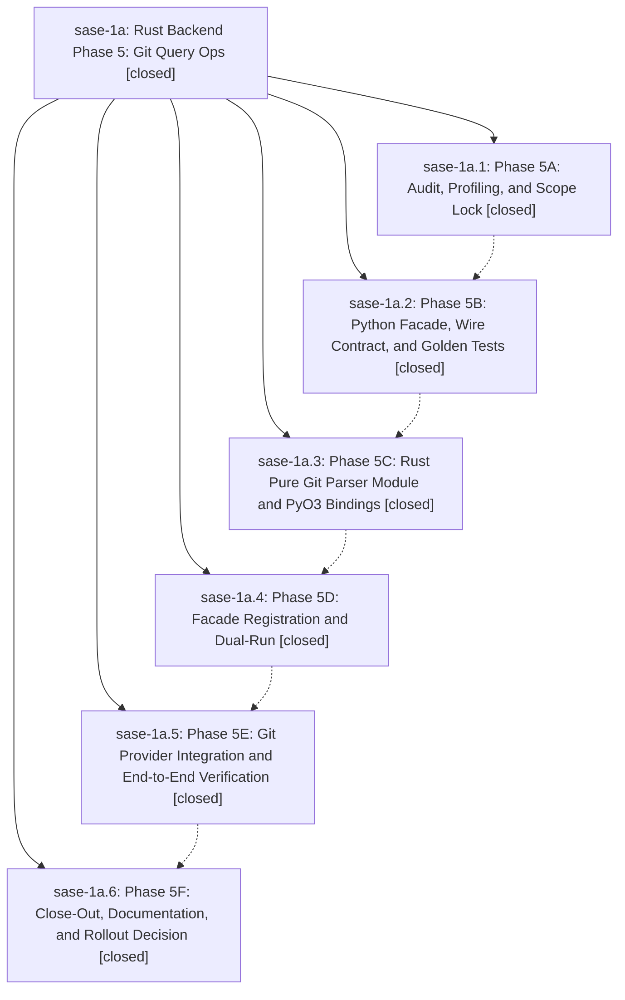

# Bead: sase-1a — Rust Backend Phase 5: Git Query Ops

[Bead Pages](../README.md) / sase-1a

**Status:** ✓ closed · **Resolution:** (unrecorded) · **Type:** plan · **Tier:** epic
**Owner:** `bryanbugyi34@gmail.com`
**Created:** 2026-04-29 18:20:03 UTC · **Closed:** 2026-04-29 19:25:47 UTC
**Plan:** [202604/rust\_backend\_phase5\_git\_query\_ops.md](https://github.com/sase-org/sase--plans/blob/main/202604/rust_backend_phase5_git_query_ops.md)

## Phases

| Bead | Title | Status | Size | Agents | Commits |
|---|---|---|---|---:|---:|
| [sase-1a.1](sase-1a.1.md) | Phase 5A: Audit, Profiling, and Scope Lock | ✓ closed | small | 0 | 1 |
| [sase-1a.2](sase-1a.2.md) | Phase 5B: Python Facade, Wire Contract, and Golden Tests | ✓ closed | small | 0 | 1 |
| [sase-1a.3](sase-1a.3.md) | Phase 5C: Rust Pure Git Parser Module and PyO3 Bindings | ✓ closed | small | 0 | 1 |
| [sase-1a.4](sase-1a.4.md) | Phase 5D: Facade Registration and Dual-Run | ✓ closed | small | 0 | 1 |
| [sase-1a.5](sase-1a.5.md) | Phase 5E: Git Provider Integration and End-to-End Verification | ✓ closed | small | 0 | 1 |
| [sase-1a.6](sase-1a.6.md) | Phase 5F: Close-Out, Documentation, and Rollout Decision | ✓ closed | small | 0 | 1 |

## Lineage

## Commits

| Commit | Subject | Bead | Committed (UTC) |
|---|---|---|---|
| [`6f27ced`](https://github.com/sase-org/sase/commit/6f27ced9da241ce46752ac47e320e6e8fd46bd24) | chore: Phase 5A audit, bench, and scope lock for git query ops (sase-1a.1) | [sase-1a.1](sase-1a.1.md) | 2026-04-29 18:29:53 |
| [`11f568e`](https://github.com/sase-org/sase/commit/11f568ec2234b59a043d138a94faaa5929b4e549) | chore: Phase 5B Git query parser facade + golden tests (sase-1a.2) | [sase-1a.2](sase-1a.2.md) | 2026-04-29 18:40:47 |
| [`d4828f9`](https://github.com/sase-org/sase/commit/d4828f9a72f52653c883fe344a407f9840877309) | chore: Phase 5C handoff doc for Rust Git query parser port (sase-1a.3) | [sase-1a.3](sase-1a.3.md) | 2026-04-29 18:49:43 |
| [`0147907`](https://github.com/sase-org/sase/commit/014790747a4532dba6fefba3dd23f144c503bb99) | chore: Phase 5D facade registration + dual-run for Git query parsers (sase-1a.4) | [sase-1a.4](sase-1a.4.md) | 2026-04-29 19:06:13 |
| [`9a8cd4a`](https://github.com/sase-org/sase/commit/9a8cd4a83d0f5d491ea1240e93e386ea059f466f) | ref: route GitQueryOpsMixin through sase.core.git\_query\_facade (sase-1a.5) | [sase-1a.5](sase-1a.5.md) | 2026-04-29 19:14:08 |
| [`d2b8ed1`](https://github.com/sase-org/sase/commit/d2b8ed1fcf8dd7b4b84f0eac8a6ed79b4e22ba20) | chore: Phase 5F close-out for Rust Git query parsers (sase-1a.6) | [sase-1a.6](sase-1a.6.md) | 2026-04-29 19:23:26 |
