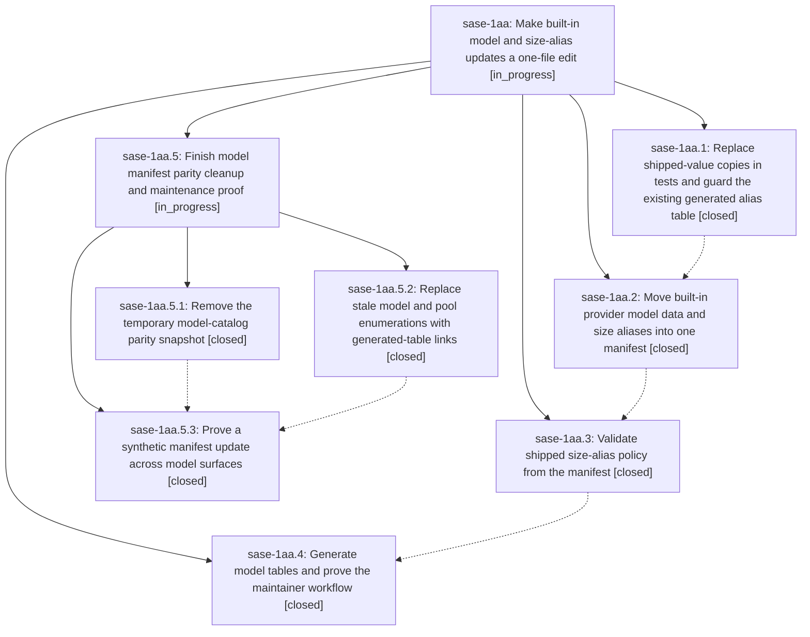

# Bead: sase-1aa — Make built-in model and size-alias updates a one-file edit

[Bead Pages](../README.md) / sase-1aa

**Status:** ◐ in_progress · **Type:** ▸ plan · **Tier:** epic
**Owner:** `bryanbugyi34@gmail.com` · **Created by:** [bbugyi200.apollo.1t](https://github.com/sase-org/sase--agents/blob/main/sessions/bbugyi200.apollo.1t.md) · **Assignee:** `sase-1aa.land`
**Created:** 2026-09-25 22:26:14 EDT
**Plan:** [202609/model\_catalog\_maintenance.md](https://github.com/sase-org/sase--plans/blob/main/202609/model_catalog_maintenance.md)

## Description

Maintainers update one bundled manifest for built-in model catalogs, tier defaults, and size-alias pools, then regenerate checked documentation without editing value-pinned tests.

## Notes

[2026-09-26T11:53:16Z · sase-1aa.land] LANDING AUDIT (2026-09-26): All four phase notes and their implementation commits were reviewed. Provider hooks read models.yml through model_manifest; policy, eleven generated doc blocks, doctor check, just check and both CI workflows are wired. Non-epic commits since creation changed ACE/queue, release metadata and shared Justfile steps, with no model-catalog overlap needing integration. Remaining epic acceptance work: tests/llm_provider/_phase2_model_catalog_baseline.json is still tracked despite phase-2 removal requirement; synthetic renderer test does not prove routing, alias resolution, picker/TUI completion or LSP payload. A nested plan covers only those gaps. Proposed follow-ups: sase-1aa.1 note #1 F601 declined as already fixed by 465a8858b and Ruff passes now; note #2 broad 83 clean-base usage failures declined for lack of a current reproducible signature (139 targeted usage tests pass; existing node-specific usage reports remain). sase-1aa.2 note #1 filed as ready flake task sase-1ai (CPU budget under load, distinct from module cap); note #2 filed as ready flake task sase-1aj (bucket action snapshot race, node-specific per retired sase-ct). No proposals in phases .3 or .4. epic-symbols reported no entries. Leave this epic open until child landing and final just check.

[2026-09-26T12:11:34Z · sase-1aa.land] LANDING AUDIT ADDENDUM: Found another phase-4 one-file-maintenance gap after the initial note: docs/llms.md Automatic Provider Resolution still has a manually maintained full built-in model list beside the generated catalog; README.md, docs/getting_started.md, docs/agent_providers.md, docs/configuration.md, and docs/llms.md retain prose naming current Grok pool members/fallbacks or fixed catalog counts. A manifest-only model or pool retune can leave those statements false. The nested plan now includes a separate refresh_prose phase before the synthetic end-to-end proof.

[2026-09-26T12:42:43Z · sase-1aa.land] VERIFICATION: sase tool run check 5de0d0655fe4b5841b4498a98cf496e7 exited 1 after formatting, generated docs, model policy, keep-sorted, Ruff, mypy, flags, pyscripts, test waits, changelog and terminology passed. The sole failing stage was Symvision: three stale --epic-symbol entries for already-closed sase-19x.4 (phase_card_block, block_meta_for_session_shell, session_reply_heading), unrelated to this model-catalog epic. Recorded as DISCOVERED ISSUE on active epic sase-19x; no sase-1aa epic-symbols remain. SASE validation and scoped tests were not reached because check stopped at this unrelated gate. The nested remaining-work plan also now covers manual docs values discovered in this audit.

## Phases

| Bead | Title | Status | Size | Created | Agents | Commits |
|---|---|---|---|---|---:|---:|
| [sase-1aa.1](sase-1aa.1.md) | Replace shipped-value copies in tests and guard the existing generated alias table | ✓ closed | medium | 2026-09-25 | 1 | 0 |
| [sase-1aa.2](sase-1aa.2.md) | Move built-in provider model data and size aliases into one manifest | ✓ closed | medium | 2026-09-25 | 1 | 1 |
| [sase-1aa.3](sase-1aa.3.md) | Validate shipped size-alias policy from the manifest | ✓ closed | medium | 2026-09-25 | 1 | 1 |
| [sase-1aa.4](sase-1aa.4.md) | Generate model tables and prove the maintainer workflow | ✓ closed | medium | 2026-09-25 | 1 | 1 |

## Lineage

## Agents

| Agent | Bead | Commits |
|---|---|---:|
| [bbugyi200.apollo.sase-1aa.1](https://github.com/sase-org/sase--agents/blob/main/agents/bbugyi200.apollo.sase-1aa.1/README.md) | [sase-1aa.1](sase-1aa.1.md) | 0 |
| [bbugyi200.apollo.sase-1aa.2](https://github.com/sase-org/sase--agents/blob/main/sessions/bbugyi200.apollo.sase-1aa.2.md) | [sase-1aa.2](sase-1aa.2.md) | 1 |
| [bbugyi200.apollo.sase-1aa.3](https://github.com/sase-org/sase--agents/blob/main/agents/bbugyi200.apollo.sase-1aa.3/README.md) | [sase-1aa.3](sase-1aa.3.md) | 1 |
| [bbugyi200.apollo.sase-1aa.4](https://github.com/sase-org/sase--agents/blob/main/agents/bbugyi200.apollo.sase-1aa.4/README.md) | [sase-1aa.4](sase-1aa.4.md) | 1 |
| [bbugyi200.apollo.sase-1aa.5.1](https://github.com/sase-org/sase--agents/blob/main/agents/bbugyi200.apollo.sase-1aa.5.1/README.md) | [sase-1aa.5.1](sase-1aa.5.1.md) | 1 |
| [bbugyi200.apollo.sase-1aa.5.2](https://github.com/sase-org/sase--agents/blob/main/agents/bbugyi200.apollo.sase-1aa.5.2/README.md) | [sase-1aa.5.2](sase-1aa.5.2.md) | 0 |
| [bbugyi200.apollo.sase-1aa.5.3](https://github.com/sase-org/sase--agents/blob/main/sessions/bbugyi200.apollo.sase-1aa.5.3.md) | [sase-1aa.5.3](sase-1aa.5.3.md) | 1 |
| [bbugyi200.apollo.sase-1aa.5.land](https://github.com/sase-org/sase--agents/blob/main/agents/bbugyi200.apollo.sase-1aa.5.land/README.md) | [sase-1aa.5](sase-1aa.5.md) | 0 |
| [bbugyi200.apollo.sase-1aa.land](https://github.com/sase-org/sase--agents/blob/main/sessions/bbugyi200.apollo.sase-1aa.land.md) | [sase-1aa](README.md) | 0 |

## Commits

| Repo | Commit | Subject | Bead | Committed |
|---|---|---|---|---|
| sase | [`1ef56bd`](https://github.com/sase-org/sase/commit/1ef56bd1b696af2de86705af38c1c7321686926f) | feat(llm-provider): move built-in model data and size aliases into one manifest | [sase-1aa.2](sase-1aa.2.md) | 2026-09-26 06:11:53 EDT |
| sase | [`e2b4625`](https://github.com/sase-org/sase/commit/e2b462548c2becdf846ed2773450c4542b56de04) | feat(llm-provider): add executable model policy over models.yml | [sase-1aa.3](sase-1aa.3.md) | 2026-09-26 06:38:07 EDT |
| sase | [`39acc57`](https://github.com/sase-org/sase/commit/39acc575475bf2d0391b24a655d2077c6a86b0e6) | feat(llm): generate model docs tables with policy gate and doctor check | [sase-1aa.4](sase-1aa.4.md) | 2026-09-26 07:35:32 EDT |
| sase | [`6a6ae5d`](https://github.com/sase-org/sase/commit/6a6ae5d102ebf9818a4bb4c52f356ffaad1b6a5f) | chore(models): remove temporary phase-1 model-catalog parity snapshot | [sase-1aa.5.1](sase-1aa.5.1.md) | 2026-09-26 09:03:34 EDT |
| sase | [`ec25a1a`](https://github.com/sase-org/sase/commit/ec25a1a3338edf683336138a6e6819f7a5906ffa) | feat: eplace stale model and pool enumerations with generated-table links (sase-1aa.5.2) | [sase-1aa.5.2](sase-1aa.5.2.md) | 2026-09-26 09:25:59 EDT |
| sase | [`fedf207`](https://github.com/sase-org/sase/commit/fedf207c1a557d4279656be8ff9eed72b1398435) | test(models): prove synthetic manifest update reaches all model surfaces (sase-1aa.5.3) | [sase-1aa.5.3](sase-1aa.5.3.md) | 2026-09-26 10:58:55 EDT |
