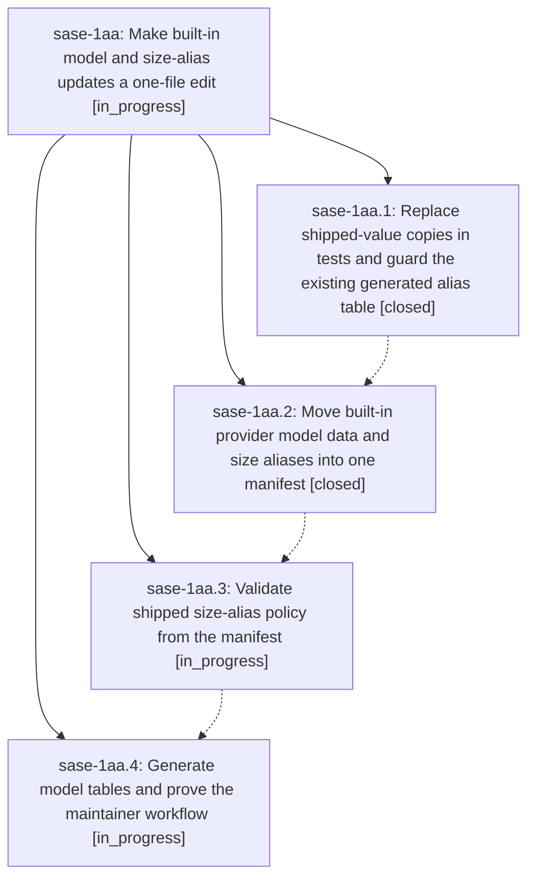

# Bead: sase-1aa — Make built-in model and size-alias updates a one-file edit

[Bead Pages](../README.md) / sase-1aa

**Status:** ◐ in_progress · **Type:** ▸ plan · **Tier:** epic
**Owner:** `bryanbugyi34@gmail.com` · **Created by:** [bbugyi200.apollo.1t](https://github.com/sase-org/sase--agents/blob/main/sessions/bbugyi200.apollo.1t.md) · **Assignee:** `sase-1aa.land`
**Created:** 2026-09-25 22:26:14 EDT
**Plan:** [202609/model\_catalog\_maintenance.md](https://github.com/sase-org/sase--plans/blob/main/202609/model_catalog_maintenance.md)

## Description

Maintainers update one bundled manifest for built-in model catalogs, tier defaults, and size-alias pools, then regenerate checked documentation without editing value-pinned tests.

## Phases

| Bead | Title | Status | Size | Created | Agents | Commits |
|---|---|---|---|---|---:|---:|
| [sase-1aa.1](sase-1aa.1.md) | Replace shipped-value copies in tests and guard the existing generated alias table | ✓ closed | medium | 2026-09-25 | 1 | 0 |
| [sase-1aa.2](sase-1aa.2.md) | Move built-in provider model data and size aliases into one manifest | ✓ closed | medium | 2026-09-25 | 1 | 1 |
| [sase-1aa.3](sase-1aa.3.md) | Validate shipped size-alias policy from the manifest | ◐ in_progress | medium | 2026-09-25 | 1 | 0 |
| [sase-1aa.4](sase-1aa.4.md) | Generate model tables and prove the maintainer workflow | ◐ in_progress | medium | 2026-09-25 | 1 | 0 |

## Lineage

## Agents

| Agent | Bead | Commits |
|---|---|---:|
| [bbugyi200.apollo.sase-1aa.1](https://github.com/sase-org/sase--agents/blob/main/agents/bbugyi200.apollo.sase-1aa.1/README.md) | [sase-1aa.1](sase-1aa.1.md) | 0 |
| [bbugyi200.apollo.sase-1aa.2](https://github.com/sase-org/sase--agents/blob/main/sessions/bbugyi200.apollo.sase-1aa.2.md) | [sase-1aa.2](sase-1aa.2.md) | 1 |
| [bbugyi200.apollo.sase-1aa.3](https://github.com/sase-org/sase--agents/blob/main/agents/bbugyi200.apollo.sase-1aa.3/README.md) | [sase-1aa.3](sase-1aa.3.md) | 0 |
| [bbugyi200.apollo.sase-1aa.4](https://github.com/sase-org/sase--agents/blob/main/agents/bbugyi200.apollo.sase-1aa.4/README.md) | [sase-1aa.4](sase-1aa.4.md) | 0 |
| [bbugyi200.apollo.sase-1aa.land](https://github.com/sase-org/sase--agents/blob/main/agents/bbugyi200.apollo.sase-1aa.land/README.md) | [sase-1aa](README.md) | 0 |

## Commits

| Repo | Commit | Subject | Bead | Committed |
|---|---|---|---|---|
| sase | [`1ef56bd`](https://github.com/sase-org/sase/commit/1ef56bd1b696af2de86705af38c1c7321686926f) | feat(llm-provider): move built-in model data and size aliases into one manifest | [sase-1aa.2](sase-1aa.2.md) | 2026-09-26 06:11:53 EDT |
