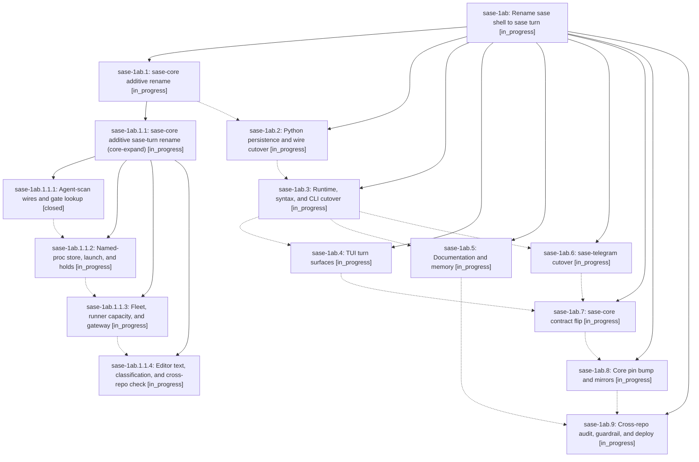

# Bead: sase-1ab — Rename sase shell to sase turn

[Bead Pages](../README.md) / sase-1ab

**Status:** ◐ in_progress · **Type:** ▸ plan · **Tier:** epic
**Owner:** `bryanbugyi34@gmail.com` · **Created by:** [bbugyi200.athena.0ss](https://github.com/sase-org/sase--agents/blob/main/sessions/bbugyi200.athena.0ss.md) · **Assignee:** `sase-1ab.land`
**Created:** 2026-09-26 00:15:04 EDT
**Plan:** [202609/sase\_turn\_rename.md](https://github.com/sase-org/sase--plans/blob/main/202609/sase_turn_rename.md)

## Description

The concept formerly called a sase shell is named a sase turn on every current surface in sase, sase-core, sase-telegram, sase-github, sase-research-artifacts, and chezmoi: code, wire contracts, persisted output, CLI, gate specs, config, the TUI, skills, docs, and memory. Agent, gate, and monitor shells become agent, gate, and monitor turns, and stand-alone proc shells become named procs. Pre-rename data still loads, retired user syntax keeps working behind a sunset flag, and unrelated meanings of "shell" (Unix shells, shell completion, UI chrome) are unchanged.

## Phases

| Bead | Title | Status | Size | Created | Agents | Commits |
|---|---|---|---|---|---:|---:|
| [sase-1ab.1](sase-1ab.1.md) | sase-core additive rename | ◐ in_progress | large | 2026-09-26 | 1 | 0 |
| [sase-1ab.2](sase-1ab.2.md) | Python persistence and wire cutover | ◐ in_progress | large | 2026-09-26 | 1 | 0 |
| [sase-1ab.3](sase-1ab.3.md) | Runtime, syntax, and CLI cutover | ◐ in_progress | large | 2026-09-26 | 1 | 0 |
| [sase-1ab.4](sase-1ab.4.md) | TUI turn surfaces | ◐ in_progress | large | 2026-09-26 | 1 | 0 |
| [sase-1ab.5](sase-1ab.5.md) | Documentation and memory | ◐ in_progress | medium | 2026-09-26 | 1 | 0 |
| [sase-1ab.6](sase-1ab.6.md) | sase-telegram cutover | ◐ in_progress | small | 2026-09-26 | 1 | 0 |
| [sase-1ab.7](sase-1ab.7.md) | sase-core contract flip | ◐ in_progress | medium | 2026-09-26 | 1 | 0 |
| [sase-1ab.8](sase-1ab.8.md) | Core pin bump and mirrors | ◐ in_progress | medium | 2026-09-26 | 1 | 0 |
| [sase-1ab.9](sase-1ab.9.md) | Cross-repo audit, guardrail, and deploy | ◐ in_progress | medium | 2026-09-26 | 1 | 0 |

## Lineage

## Agents

| Agent | Bead | Commits |
|---|---|---:|
| [bbugyi200.athena.sase-1ab.1](https://github.com/sase-org/sase--agents/blob/main/sessions/bbugyi200.athena.sase-1ab.1.md) | [sase-1ab.1](sase-1ab.1.md) | 0 |
| [bbugyi200.athena.sase-1ab.1.1.1](https://github.com/sase-org/sase--agents/blob/main/agents/bbugyi200.athena.sase-1ab.1.1.1/README.md) | [sase-1ab.1.1.1](sase-1ab.1.1.1.md) | 1 |
| [bbugyi200.athena.sase-1ab.1.1.2](https://github.com/sase-org/sase--agents/blob/main/agents/bbugyi200.athena.sase-1ab.1.1.2/README.md) | [sase-1ab.1.1.2](sase-1ab.1.1.2.md) | 0 |
| [bbugyi200.athena.sase-1ab.1.1.3](https://github.com/sase-org/sase--agents/blob/main/agents/bbugyi200.athena.sase-1ab.1.1.3/README.md) | [sase-1ab.1.1.3](sase-1ab.1.1.3.md) | 0 |
| [bbugyi200.athena.sase-1ab.1.1.4](https://github.com/sase-org/sase--agents/blob/main/agents/bbugyi200.athena.sase-1ab.1.1.4/README.md) | [sase-1ab.1.1.4](sase-1ab.1.1.4.md) | 0 |
| [bbugyi200.athena.sase-1ab.1.1.land](https://github.com/sase-org/sase--agents/blob/main/agents/bbugyi200.athena.sase-1ab.1.1.land/README.md) | [sase-1ab.1.1](sase-1ab.1.1.md) | 0 |
| [bbugyi200.athena.sase-1ab.2](https://github.com/sase-org/sase--agents/blob/main/agents/bbugyi200.athena.sase-1ab.2/README.md) | [sase-1ab.2](sase-1ab.2.md) | 0 |
| [bbugyi200.athena.sase-1ab.3](https://github.com/sase-org/sase--agents/blob/main/agents/bbugyi200.athena.sase-1ab.3/README.md) | [sase-1ab.3](sase-1ab.3.md) | 0 |
| [bbugyi200.athena.sase-1ab.4](https://github.com/sase-org/sase--agents/blob/main/agents/bbugyi200.athena.sase-1ab.4/README.md) | [sase-1ab.4](sase-1ab.4.md) | 0 |
| [bbugyi200.athena.sase-1ab.5](https://github.com/sase-org/sase--agents/blob/main/agents/bbugyi200.athena.sase-1ab.5/README.md) | [sase-1ab.5](sase-1ab.5.md) | 0 |
| [bbugyi200.athena.sase-1ab.6](https://github.com/sase-org/sase--agents/blob/main/agents/bbugyi200.athena.sase-1ab.6/README.md) | [sase-1ab.6](sase-1ab.6.md) | 0 |
| [bbugyi200.athena.sase-1ab.7](https://github.com/sase-org/sase--agents/blob/main/agents/bbugyi200.athena.sase-1ab.7/README.md) | [sase-1ab.7](sase-1ab.7.md) | 0 |
| [bbugyi200.athena.sase-1ab.8](https://github.com/sase-org/sase--agents/blob/main/agents/bbugyi200.athena.sase-1ab.8/README.md) | [sase-1ab.8](sase-1ab.8.md) | 0 |
| [bbugyi200.athena.sase-1ab.9](https://github.com/sase-org/sase--agents/blob/main/agents/bbugyi200.athena.sase-1ab.9/README.md) | [sase-1ab.9](sase-1ab.9.md) | 0 |
| [bbugyi200.athena.sase-1ab.land](https://github.com/sase-org/sase--agents/blob/main/agents/bbugyi200.athena.sase-1ab.land/README.md) | [sase-1ab](README.md) | 0 |

## Commits

| Repo | Commit | Subject | Bead | Committed |
|---|---|---|---|---|
| sase-core | [`sase-core@c2c2f94`](https://github.com/sase-org/sase-core/commit/c2c2f94f54e71d3b009a776a213b044ad7bf18aa) | refactor(agent\_scan): rename session shell wires to session turn wires | [sase-1ab.1.1.1](sase-1ab.1.1.1.md) | 2026-09-26 00:50:45 EDT |
