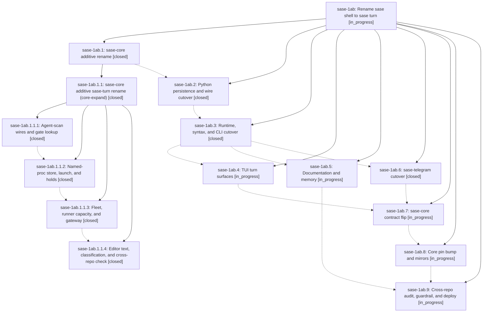

# Bead: sase-1ab — Rename sase shell to sase turn

[Bead Pages](../README.md) / sase-1ab

**Status:** ◐ in_progress · **Type:** ▸ plan · **Tier:** epic
**Owner:** `bryanbugyi34@gmail.com` · **Created by:** [bbugyi200.athena.0ss](https://github.com/sase-org/sase--agents/blob/main/sessions/bbugyi200.athena.0ss.md) · **Assignee:** `sase-1ab.land`
**Created:** 2026-09-26 00:15:04 EDT
**Plan:** [202609/sase\_turn\_rename.md](https://github.com/sase-org/sase--plans/blob/main/202609/sase_turn_rename.md)

<!-- sase:links:start -->

## Links

| Relation | Artifact | Why |
| --- | --- | --- |
| implemented-by | [plan:202609/sase_turn_rename.md][1] | derived from the plan's `bead_id:` frontmatter field |

_Plus 1 automatic references — see [Referenced By](#referenced-by)._

[1]: https://github.com/sase-org/sase--plans/blob/main/202609/sase_turn_rename.md

<!-- sase:links:end -->

## Description

The concept formerly called a sase shell is named a sase turn on every current surface in sase, sase-core, sase-telegram, sase-github, sase-research-artifacts, and chezmoi: code, wire contracts, persisted output, CLI, gate specs, config, the TUI, skills, docs, and memory. Agent, gate, and monitor shells become agent, gate, and monitor turns, and stand-alone proc shells become named procs. Pre-rename data still loads, retired user syntax keeps working behind a sunset flag, and unrelated meanings of "shell" (Unix shells, shell completion, UI chrome) are unchanged.

## Phases

| Bead | Title | Status | Size | Created | Agents | Commits |
|---|---|---|---|---|---:|---:|
| [sase-1ab.1](sase-1ab.1.md) | sase-core additive rename | ✓ closed | large | 2026-09-26 | 1 | 0 |
| [sase-1ab.2](sase-1ab.2.md) | Python persistence and wire cutover | ✓ closed | large | 2026-09-26 | 1 | 2 |
| [sase-1ab.3](sase-1ab.3.md) | Runtime, syntax, and CLI cutover | ✓ closed | large | 2026-09-26 | 1 | 1 |
| [sase-1ab.4](sase-1ab.4.md) | TUI turn surfaces | ◐ in_progress | large | 2026-09-26 | 1 | 0 |
| [sase-1ab.5](sase-1ab.5.md) | Documentation and memory | ◐ in_progress | medium | 2026-09-26 | 1 | 0 |
| [sase-1ab.6](sase-1ab.6.md) | sase-telegram cutover | ✓ closed | small | 2026-09-26 | 1 | 1 |
| [sase-1ab.7](sase-1ab.7.md) | sase-core contract flip | ◐ in_progress | medium | 2026-09-26 | 1 | 0 |
| [sase-1ab.8](sase-1ab.8.md) | Core pin bump and mirrors | ◐ in_progress | medium | 2026-09-26 | 1 | 0 |
| [sase-1ab.9](sase-1ab.9.md) | Cross-repo audit, guardrail, and deploy | ◐ in_progress | medium | 2026-09-26 | 1 | 0 |

## Lineage

## Agents

| Agent | Bead | Commits |
|---|---|---:|
| [bbugyi200.athena.sase-1ab.1](https://github.com/sase-org/sase--agents/blob/main/sessions/bbugyi200.athena.sase-1ab.1.md) | [sase-1ab.1](sase-1ab.1.md) | 0 |
| [bbugyi200.athena.sase-1ab.1.1.1](https://github.com/sase-org/sase--agents/blob/main/agents/bbugyi200.athena.sase-1ab.1.1.1/README.md) | [sase-1ab.1.1.1](sase-1ab.1.1.1.md) | 1 |
| [bbugyi200.athena.sase-1ab.1.1.2](https://github.com/sase-org/sase--agents/blob/main/agents/bbugyi200.athena.sase-1ab.1.1.2/README.md) | [sase-1ab.1.1.2](sase-1ab.1.1.2.md) | 1 |
| [bbugyi200.athena.sase-1ab.1.1.3](https://github.com/sase-org/sase--agents/blob/main/agents/bbugyi200.athena.sase-1ab.1.1.3/README.md) | [sase-1ab.1.1.3](sase-1ab.1.1.3.md) | 1 |
| [bbugyi200.athena.sase-1ab.1.1.4](https://github.com/sase-org/sase--agents/blob/main/sessions/bbugyi200.athena.sase-1ab.1.1.4.md) | [sase-1ab.1.1.4](sase-1ab.1.1.4.md) | 1 |
| [bbugyi200.athena.sase-1ab.1.1.land](https://github.com/sase-org/sase--agents/blob/main/agents/bbugyi200.athena.sase-1ab.1.1.land/README.md) | [sase-1ab.1.1](sase-1ab.1.1.md) | 1 |
| [bbugyi200.athena.sase-1ab.2](https://github.com/sase-org/sase--agents/blob/main/sessions/bbugyi200.athena.sase-1ab.2.md) | [sase-1ab.2](sase-1ab.2.md) | 2 |
| [bbugyi200.athena.sase-1ab.3](https://github.com/sase-org/sase--agents/blob/main/sessions/bbugyi200.athena.sase-1ab.3.md) | [sase-1ab.3](sase-1ab.3.md) | 1 |
| [bbugyi200.athena.sase-1ab.4](https://github.com/sase-org/sase--agents/blob/main/sessions/bbugyi200.athena.sase-1ab.4.md) | [sase-1ab.4](sase-1ab.4.md) | 0 |
| [bbugyi200.athena.sase-1ab.5](https://github.com/sase-org/sase--agents/blob/main/agents/bbugyi200.athena.sase-1ab.5/README.md) | [sase-1ab.5](sase-1ab.5.md) | 0 |
| [bbugyi200.athena.sase-1ab.6](https://github.com/sase-org/sase--agents/blob/main/agents/bbugyi200.athena.sase-1ab.6/README.md) | [sase-1ab.6](sase-1ab.6.md) | 1 |
| [bbugyi200.athena.sase-1ab.7](https://github.com/sase-org/sase--agents/blob/main/agents/bbugyi200.athena.sase-1ab.7/README.md) | [sase-1ab.7](sase-1ab.7.md) | 0 |
| [bbugyi200.athena.sase-1ab.8](https://github.com/sase-org/sase--agents/blob/main/agents/bbugyi200.athena.sase-1ab.8/README.md) | [sase-1ab.8](sase-1ab.8.md) | 0 |
| [bbugyi200.athena.sase-1ab.9](https://github.com/sase-org/sase--agents/blob/main/agents/bbugyi200.athena.sase-1ab.9/README.md) | [sase-1ab.9](sase-1ab.9.md) | 0 |
| [bbugyi200.athena.sase-1ab.land](https://github.com/sase-org/sase--agents/blob/main/agents/bbugyi200.athena.sase-1ab.land/README.md) | [sase-1ab](README.md) | 0 |

## Commits

| Repo | Commit | Subject | Bead | Committed |
|---|---|---|---|---|
| sase-core | [`sase-core@c2c2f94`](https://github.com/sase-org/sase-core/commit/c2c2f94f54e71d3b009a776a213b044ad7bf18aa) | refactor(agent\_scan): rename session shell wires to session turn wires | [sase-1ab.1.1.1](sase-1ab.1.1.1.md) | 2026-09-26 00:50:45 EDT |
| sase-core | [`sase-core@4a04cea`](https://github.com/sase-org/sase-core/commit/4a04cea5b20cf17615cd7acafec9f1ad4dfadce3) | refactor(core): rename proc-shell store, launch, and hold wires to named-proc vocabulary | [sase-1ab.1.1.2](sase-1ab.1.1.2.md) | 2026-09-26 01:15:29 EDT |
| sase-core | [`sase-core@20deb1b`](https://github.com/sase-org/sase-core/commit/20deb1b0c5b19f0f9ad3b6e34f765093dbb585da) | refactor(core): rename fleet runtime shell wires to turn vocabulary | [sase-1ab.1.1.3](sase-1ab.1.1.3.md) | 2026-09-26 01:47:36 EDT |
| sase-core | [`sase-core@6953a96`](https://github.com/sase-org/sase-core/commit/6953a96460eec45bb46fe8a505304626bd375708) | refactor(core): retarget editor text and classify remaining shell hits to turn vocabulary | [sase-1ab.1.1.4](sase-1ab.1.1.4.md) | 2026-09-26 02:52:52 EDT |
| sase--plans | [`sase--plans@9aa7bc7`](https://github.com/sase-org/sase--plans/commit/9aa7bc779863f292b23347f0ff42ef74c3209376) | chore(plan): mark sase-core turn expansion complete | [sase-1ab.1.1](sase-1ab.1.1.md) | 2026-09-26 03:23:34 EDT |
| sase | [`c051b9a`](https://github.com/sase-org/sase/commit/c051b9a31a3c91c329bb029ea6dcda0ef0ceb0db) | fix(turn-cutover): repair sase-1ab.2 verification fallout | [sase-1ab.2](sase-1ab.2.md) | 2026-09-26 10:02:24 EDT |
| sase | [`4ef7166`](https://github.com/sase-org/sase/commit/4ef7166481dbf359c1dae0ca4cb783d7398295dc) | test(1ab.2): repair proc-rename fallout in wire-cutover tests | [sase-1ab.2](sase-1ab.2.md) | 2026-09-26 11:39:33 EDT |
| sase | [`d5fc758`](https://github.com/sase-org/sase/commit/d5fc75864f0afb44b5f9fa7d1c21b6d4d913916d) | feat(runtime): cut over gate shell to gate turn | [sase-1ab.3](sase-1ab.3.md) | 2026-09-26 13:46:45 EDT |
| sase-telegram | [`sase-telegram@0106dc9`](https://github.com/sase-org/sase-telegram/commit/0106dc98ed36cc797fc4a860034f313a212445a0) | refactor(telegram): rename gate shell settlement to gate turn vocabulary | [sase-1ab.6](sase-1ab.6.md) | 2026-09-26 14:22:18 EDT |

<!-- sase:referenced-by:start -->

## Referenced By

| Relation | Artifact | Why | Uses |
| --- | --- | --- | ---: |
| read-by | [agent:sase-1ab.1.1.land][1] | Need the enclosing epic descendant readiness and phase sequencing | 1 |

[1]: https://github.com/sase-org/sase--agents/blob/main/agents/bbugyi200.athena.sase-1ab.1.1.land/README.md

<!-- sase:referenced-by:end -->
