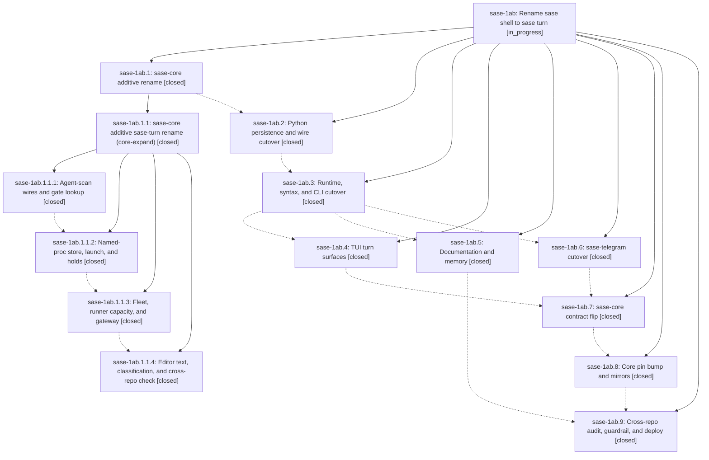

# Bead: sase-1ab — Rename sase shell to sase turn

[Bead Pages](../README.md) / sase-1ab

**Status:** ◐ in_progress · **Type:** ▸ plan · **Tier:** epic
**Owner:** `bryanbugyi34@gmail.com` · **Created by:** [bbugyi200.athena.0ss](https://github.com/sase-org/sase--agents/blob/main/sessions/bbugyi200.athena.0ss.md) · **Assignee:** `sase-1ab.land`
**Created:** 2026-09-26 00:15:04 EDT
**Plan:** [202609/sase\_turn\_rename.md](https://github.com/sase-org/sase--plans/blob/main/202609/sase_turn_rename.md)

<!-- sase:links:start -->

## Links

| Relation | Artifact | Why |
| --- | --- | --- |
| implemented-by | [plan:202609/sase_turn_rename.md][1] | derived from the plan's `bead_id:` frontmatter field |
| related | [bead:sase-1ay][2] | Four of the 13 symbols live in legacy_sase_shell_syntax.py from sase-1ab.3; coordinate with the rename epic and flag bead sase-1ar |

_Plus 4 automatic references — see [Referenced By](#referenced-by)._

[1]: https://github.com/sase-org/sase--plans/blob/main/202609/sase_turn_rename.md
[2]: https://github.com/sase-org/sase--beads/blob/main/pages/sase-1ay/README.md

<!-- sase:links:end -->

## Description

The concept formerly called a sase shell is named a sase turn on every current surface in sase, sase-core, sase-telegram, sase-github, sase-research-artifacts, and chezmoi: code, wire contracts, persisted output, CLI, gate specs, config, the TUI, skills, docs, and memory. Agent, gate, and monitor shells become agent, gate, and monitor turns, and stand-alone proc shells become named procs. Pre-rename data still loads, retired user syntax keeps working behind a sunset flag, and unrelated meanings of "shell" (Unix shells, shell completion, UI chrome) are unchanged.

## Notes

[2026-09-26T18:31:24Z · sase-19x.land] DISCOVERED ISSUE: proposed by sase-19x.10 note #2 and reproduced during sase-19x landing on master 7606e5d8c7: just symvision exits 1 because src/sase/config/_settings_system.py imports private _legacy_sase_shell_syntax_enabled from src/sase/agent/legacy_sase_shell_syntax.py. Commit d5fc75864f in this active sase-turn rename epic introduced that module. Make the shared helper public or keep its consumer in-file per Symvision; sase-19x changed neither file.

[2026-09-26T18:41:29Z · sase-19x.land] DISCOVERED ISSUE supplement from sase-19x landing: after restoring current linked Rust extension, a serial focused run of tests/test_contract_manifest.py, tests/test_agent_session_terminology.py, tests/test_agent_artifact_marker_path_passing_audit.py, and tests/fakey/test_monitor_capacity_e2e.py gave 10 passed/2 failed. test_tracked_marker_path_passing_sites_are_reviewed expects src/sase/shells/member.py but the active turn rename moved it to src/sase/turns/member.py. test_contract_manifest_matches_marker_selection fails during full contract collection because 14 tests still import removed gate_shell/shells/proc-shell paths or the not-yet-landed turn names; collection errors name tests/ace/tui/models/test_agent_proc_shells.py, test_gate_rows.py, test_monitor_rows.py, visual agent-session panel fixtures, monitor/test_no_new_receipt.py, and related nodes. The unrelated phase sase-19x.1 note #1 reported contract-manifest and marker-audit failures on an earlier tree; current failures are now specifically this active rename integration. Please update tests/fixtures and manifest in sase-1ab.9.

[2026-09-26T19:48:29Z · sase-19i.7.3.3.land] DISCOVERED ISSUE corroboration from sase-19i.7.3.3 landing: just symvision on sase HEAD f583cd5097 exits 1 because src/sase/config/_settings_system.py imports private _legacy_sase_shell_syntax_enabled from src/sase/agent/legacy_sase_shell_syntax.py. This independently confirms existing sase-1ab note #1; no standalone task because the active turn-rename epic caused and owns the repair.

[2026-09-26T20:56:06Z · sase-1ap.4.land] DISCOVERED ISSUE corroboration from the sase-1ap.4 landing at 752edf9fc. just test-visual -- -k "agents_bead_created_by_agent or agents_bead_closed_by_agent_narrow" passed the three selected PNG tests and exited 3 on 14 collection ImportErrors that still import removed shell names: tests/ace/tui/models/test_agent_proc_shells.py (PROC_LIFECYCLE_PROC_SHELL), test_gate_rows.py (AgentSessionShellGateWire), test_monitor_rows.py (AgentSessionShellMonitorWire), test_agent_panel_title_monitor_badges.py and the agent-session panel fixtures (sase.gate_shell.state), test_gate_failure_recovery.py (sase.shells.settlement), test_proc_shell_selection_survives_refresh.py and the proc-shell PNG fixtures (PROC_LIFECYCLE_PROC_SHELL), test_agent_list_runtime_rendering_status.py (sase.gate_shell.status), tests/monitor/test_no_new_receipt.py (sase.shells.followup), test_agent_loader_pending_gate_turn.py (row_is_agent_session_turn), and test_agents_tab_apply_capacity.py (sase.ace.tui.models.agent_named_procs). just symvision also still exits 1 because src/sase/config/_settings_system.py imports private _legacy_sase_shell_syntax_enabled from src/sase/agent/legacy_sase_shell_syntax.py. This matches notes #1 and #2. The creation-reason visual commit did not touch these files.

[2026-09-26T21:13:12Z · sase-19x.11.land] DISCOVERED ISSUE: proposed by sase-19x.11.3 note #2 and reproduced by the sase-19x.11 land agent on current master. tests/ace/tui/widgets/decks/test_deck_empty_availability.py::test_files_probe_empty_kinds and tests/ace/tui/widgets/decks/test_deck_panels.py::test_preferred_card_and_partial_empty_body both fail with AttributeError: type object 'AgentType' has no attribute 'PROC_SHELL' (test_deck_empty_availability.py:60 and test_deck_panels.py:95). The turn rename removed that enum member and these two deck tests still construct it. Same root as the shell-import collection failures already on this epic; these two nodes collect and then fail. Not caused by the card-block landing diff. No separate task.

[2026-09-26T21:38:43Z · sase-19x.11.5.land] DISCOVERED ISSUE corroboration from sase-19x.11.5.1 PROPOSED FOLLOW-UP #1, independently reproduced at HEAD e95241543d: tests/ace/tui/widgets/decks/test_deck_panels.py::test_preferred_card_and_partial_empty_body fails because AgentType.PROC_SHELL no longer exists (already noted here in #5). A distinct rename-contract node, tests/test_validate_sase_core_rs_contracts_tool.py::test_validate_proc_lifecycle_contract_passes_for_schema_v3_transitions, also fails because its schema-v3 mock returns lifecycle=named-proc while tools/validate_sase_core_rs still expects proc-shell. The active sase-turn rename caused and owns both compatibility updates; source proposal is sase-19x.11.5.1 #1. No separate task.

[2026-09-26T22:18:45Z · sase-19i.7.3.3.3.land] DISCOVERED ISSUE corroboration from the sase-19i.7.3.3.3 landing at acbd5999ad: tests/ace/tui/models/test_gate_rows.py still raises ImportError for AgentSessionShellGateWire, and tests/ace/tui/models/test_monitor_rows.py still raises ImportError for AgentSessionShellMonitorWire, both from sase.core.agent_scan_wire. The module now exports AgentSessionTurnGateWire, AgentSessionTurnMonitorWire, and AgentSessionTurnWire. This matches notes #2 and #4. The node-finder budget commits did not touch these tests. No separate task.

[2026-09-26T22:34:07Z · sase-1ah.8.land] DISCOVERED ISSUE corroboration from the sase-1ah.8 landing at sase HEAD acbd5999a. Two items already on this epic are still true in source: tests/monitor/test_no_new_receipt.py imports sase.shells.followup (FollowupLaunchResult now lives in sase.turns.followup; src/sase/shells has no module), matching notes #2 and #4; tests/test_validate_sase_core_rs_contracts_tool.py returns lifecycle named-proc while tools/validate_sase_core_rs still expects proc-shell, matching note #6. No separate task.

The private-import half of notes #1, #3, and #4 is repaired in acbd5999a. legacy_sase_shell_syntax_enabled is now public, and src/sase/config/_settings_system.py imports that public name. Do not re-fix the old private name.

[2026-09-26T23:56:38Z · sase-1aq.10.land] DISCOVERED ISSUE: sase-1aq.10.2 note #5, .10.3 note #3, .10.4 note #2, .10.5 note #3, and .10.6 note #5 report clean-base just-check failures after the shell-to-turn/named-proc rename. Current source still has tests/ace/tui/test_fleet_agents_display_parity.py:122 constructing removed AgentType.PROC_SHELL while src/sase/ace/tui/models/agent.py now uses NAMED_PROC; the parity node fails with AttributeError on clean base. The .10.2 clean-base check also names test_procs_service::test_submit_records_a_named_proc and test_parser_proc::test_proc_run_and_list_parse_named_named_proc; reconcile these with this epic’s broader rename/fixture integration in phase .9. This is unrelated to mobile gateway, dispatch acceptance, or parity implementation; no new task because the active rename epic caused and owns the failures.

[2026-09-26T23:58:58Z · sase-1au.land] DISCOVERED ISSUE corroboration from sase-1au landing: phase sase-1au.2 note #3 and phase sase-1au.5 note #1 independently proposed the proc lifecycle test mismatch. At master 899bdba64, .venv/bin/python -m pytest -q tests/test_validate_sase_core_rs_contracts_tool.py::test_validate_proc_lifecycle_contract_passes_for_schema_v3_transitions still fails: fixture lifecycle=named-proc, tools/validate_sase_core_rs expects proc-shell. This is already this active turn-rename epic scope (notes #6 and #8), not stash-trash work; no separate task.

[2026-09-27T01:54:33Z · sase-1au.6.land] DISCOVERED ISSUE: proposed by sase-1au.6.3 note #1 and reproduced at master b9f53067b1 during the sase-1au.6 landing. .venv/bin/mypy src/sase/ace/tui/widgets/prompt_panel/_agent_display_hint_sections.py reports [name-defined] at line 74: LEGACY_NAMED_PROC_SECTION_ID is not defined (mypy suggests NAMED_PROC_SECTION_ID). The constant is defined in _agent_named_proc_section.py and used here without an import, so render_named_proc_hint_document raises NameError when lane_fold_overrides is a Mapping. git blame attributes lines 71-75 to d4c7b5ca9a (sase-1ab.4). This is rename fallout, not Prompts-overlay work; no separate task.

[2026-09-27T06:12:59Z · sase-1aq.10.7.5.land] Corroboration (sase-1aq.10.7.5.land, 2026-09-27): LEGACY_NAMED_PROC_SECTION_ID [name-defined] at src/sase/ace/tui/widgets/prompt_panel/_agent_display_hint_sections.py:74 is still red at master 19abe261d4 (ToolRun 109aa65ee68b1d6365d33d297620dfab), also proposed by sase-1aq.10.7.5.1 note #1. The same run's 48 test-scoped failures (turns/shells marker audits, proc parser/runtime, keybinding footer 'shell' digits, proc_wire_schema_version binding) reproduce on the clean tree and are rename fallout.

## Phases

| Bead | Title | Status | Size | Created | Agents | Commits |
|---|---|---|---|---|---:|---:|
| [sase-1ab.1](sase-1ab.1.md) | sase-core additive rename | ✓ closed | large | 2026-09-26 | 1 | 0 |
| [sase-1ab.2](sase-1ab.2.md) | Python persistence and wire cutover | ✓ closed | large | 2026-09-26 | 1 | 2 |
| [sase-1ab.3](sase-1ab.3.md) | Runtime, syntax, and CLI cutover | ✓ closed | large | 2026-09-26 | 1 | 1 |
| [sase-1ab.4](sase-1ab.4.md) | TUI turn surfaces | ✓ closed | large | 2026-09-26 | 1 | 1 |
| [sase-1ab.5](sase-1ab.5.md) | Documentation and memory | ✓ closed | medium | 2026-09-26 | 1 | 1 |
| [sase-1ab.6](sase-1ab.6.md) | sase-telegram cutover | ✓ closed | small | 2026-09-26 | 1 | 1 |
| [sase-1ab.7](sase-1ab.7.md) | sase-core contract flip | ✓ closed | medium | 2026-09-26 | 1 | 1 |
| [sase-1ab.8](sase-1ab.8.md) | Core pin bump and mirrors | ✓ closed | medium | 2026-09-26 | 1 | 1 |
| [sase-1ab.9](sase-1ab.9.md) | Cross-repo audit, guardrail, and deploy | ✓ closed | medium | 2026-09-26 | 1 | 1 |

## Lineage

```mermaid
flowchart TD
    n0["sase-1ab: Rename sase shell to sase turn [in_progress]"]
    n1["sase-1ab.1: sase-core additive rename [closed]"]
    n2["sase-1ab.1.1: sase-core additive sase-turn rename (core-expand) [closed]"]
    n3["sase-1ab.1.1.1: Agent-scan wires and gate lookup [closed]"]
    n4["sase-1ab.1.1.2: Named-proc store, launch, and holds [closed]"]
    n5["sase-1ab.1.1.3: Fleet, runner capacity, and gateway [closed]"]
    n6["sase-1ab.1.1.4: Editor text, classification, and cross-repo check [closed]"]
    n7["sase-1ab.2: Python persistence and wire cutover [closed]"]
    n8["sase-1ab.3: Runtime, syntax, and CLI cutover [closed]"]
    n9["sase-1ab.4: TUI turn surfaces [closed]"]
    n10["sase-1ab.5: Documentation and memory [closed]"]
    n11["sase-1ab.6: sase-telegram cutover [closed]"]
    n12["sase-1ab.7: sase-core contract flip [closed]"]
    n13["sase-1ab.8: Core pin bump and mirrors [closed]"]
    n14["sase-1ab.9: Cross-repo audit, guardrail, and deploy [closed]"]
    n0 --> n1
    n1 --> n2
    n2 --> n3
    n2 --> n4
    n2 --> n5
    n2 --> n6
    n0 --> n7
    n0 --> n8
    n0 --> n9
    n0 --> n10
    n0 --> n11
    n0 --> n12
    n0 --> n13
    n0 --> n14
    n1 -.-> n7
    n3 -.-> n4
    n4 -.-> n5
    n5 -.-> n6
    n7 -.-> n8
    n8 -.-> n9
    n8 -.-> n10
    n8 -.-> n11
    n9 -.-> n12
    n10 -.-> n14
    n11 -.-> n12
    n12 -.-> n13
    n13 -.-> n14
```

## Agents

| Agent | Bead | Commits |
|---|---|---:|
| [bbugyi200.athena.sase-1ab.1](https://github.com/sase-org/sase--agents/blob/main/sessions/bbugyi200.athena.sase-1ab.1.md) | [sase-1ab.1](sase-1ab.1.md) | 0 |
| [bbugyi200.athena.sase-1ab.1.1.1](https://github.com/sase-org/sase--agents/blob/main/agents/bbugyi200.athena.sase-1ab.1.1.1/README.md) | [sase-1ab.1.1.1](sase-1ab.1.1.1.md) | 1 |
| [bbugyi200.athena.sase-1ab.1.1.2](https://github.com/sase-org/sase--agents/blob/main/agents/bbugyi200.athena.sase-1ab.1.1.2/README.md) | [sase-1ab.1.1.2](sase-1ab.1.1.2.md) | 1 |
| [bbugyi200.athena.sase-1ab.1.1.3](https://github.com/sase-org/sase--agents/blob/main/agents/bbugyi200.athena.sase-1ab.1.1.3/README.md) | [sase-1ab.1.1.3](sase-1ab.1.1.3.md) | 1 |
| [bbugyi200.athena.sase-1ab.1.1.4](https://github.com/sase-org/sase--agents/blob/main/sessions/bbugyi200.athena.sase-1ab.1.1.4.md) | [sase-1ab.1.1.4](sase-1ab.1.1.4.md) | 1 |
| [bbugyi200.athena.sase-1ab.1.1.land](https://github.com/sase-org/sase--agents/blob/main/agents/bbugyi200.athena.sase-1ab.1.1.land/README.md) | [sase-1ab.1.1](sase-1ab.1.1.md) | 1 |
| [bbugyi200.athena.sase-1ab.2](https://github.com/sase-org/sase--agents/blob/main/sessions/bbugyi200.athena.sase-1ab.2.md) | [sase-1ab.2](sase-1ab.2.md) | 2 |
| [bbugyi200.athena.sase-1ab.3](https://github.com/sase-org/sase--agents/blob/main/sessions/bbugyi200.athena.sase-1ab.3.md) | [sase-1ab.3](sase-1ab.3.md) | 1 |
| [bbugyi200.athena.sase-1ab.4](https://github.com/sase-org/sase--agents/blob/main/sessions/bbugyi200.athena.sase-1ab.4.md) | [sase-1ab.4](sase-1ab.4.md) | 1 |
| [bbugyi200.athena.sase-1ab.5](https://github.com/sase-org/sase--agents/blob/main/sessions/bbugyi200.athena.sase-1ab.5.md) | [sase-1ab.5](sase-1ab.5.md) | 1 |
| [bbugyi200.athena.sase-1ab.6](https://github.com/sase-org/sase--agents/blob/main/agents/bbugyi200.athena.sase-1ab.6/README.md) | [sase-1ab.6](sase-1ab.6.md) | 1 |
| [bbugyi200.athena.sase-1ab.7](https://github.com/sase-org/sase--agents/blob/main/sessions/bbugyi200.athena.sase-1ab.7.md) | [sase-1ab.7](sase-1ab.7.md) | 1 |
| [bbugyi200.athena.sase-1ab.8](https://github.com/sase-org/sase--agents/blob/main/agents/bbugyi200.athena.sase-1ab.8/README.md) | [sase-1ab.8](sase-1ab.8.md) | 1 |
| [bbugyi200.athena.sase-1ab.9](https://github.com/sase-org/sase--agents/blob/main/sessions/bbugyi200.athena.sase-1ab.9.md) | [sase-1ab.9](sase-1ab.9.md) | 1 |
| [bbugyi200.athena.sase-1ab.land](https://github.com/sase-org/sase--agents/blob/main/agents/bbugyi200.athena.sase-1ab.land/README.md) | [sase-1ab](README.md) | 0 |

## Commits

| Repo | Commit | Subject | Bead | Committed |
|---|---|---|---|---|
| sase-core | [`sase-core@c2c2f94`](https://github.com/sase-org/sase-core/commit/c2c2f94f54e71d3b009a776a213b044ad7bf18aa) | refactor(agent\_scan): rename session shell wires to session turn wires | [sase-1ab.1.1.1](sase-1ab.1.1.1.md) | 2026-09-26 00:50:45 EDT |
| sase-core | [`sase-core@4a04cea`](https://github.com/sase-org/sase-core/commit/4a04cea5b20cf17615cd7acafec9f1ad4dfadce3) | refactor(core): rename proc-shell store, launch, and hold wires to named-proc vocabulary | [sase-1ab.1.1.2](sase-1ab.1.1.2.md) | 2026-09-26 01:15:29 EDT |
| sase-core | [`sase-core@20deb1b`](https://github.com/sase-org/sase-core/commit/20deb1b0c5b19f0f9ad3b6e34f765093dbb585da) | refactor(core): rename fleet runtime shell wires to turn vocabulary | [sase-1ab.1.1.3](sase-1ab.1.1.3.md) | 2026-09-26 01:47:36 EDT |
| sase-core | [`sase-core@6953a96`](https://github.com/sase-org/sase-core/commit/6953a96460eec45bb46fe8a505304626bd375708) | refactor(core): retarget editor text and classify remaining shell hits to turn vocabulary | [sase-1ab.1.1.4](sase-1ab.1.1.4.md) | 2026-09-26 02:52:52 EDT |
| sase--plans | [`sase--plans@9aa7bc7`](https://github.com/sase-org/sase--plans/commit/9aa7bc779863f292b23347f0ff42ef74c3209376) | chore(plan): mark sase-core turn expansion complete | [sase-1ab.1.1](sase-1ab.1.1.md) | 2026-09-26 03:23:34 EDT |
| sase | [`c051b9a`](https://github.com/sase-org/sase/commit/c051b9a31a3c91c329bb029ea6dcda0ef0ceb0db) | fix(turn-cutover): repair sase-1ab.2 verification fallout | [sase-1ab.2](sase-1ab.2.md) | 2026-09-26 10:02:24 EDT |
| sase | [`4ef7166`](https://github.com/sase-org/sase/commit/4ef7166481dbf359c1dae0ca4cb783d7398295dc) | test(1ab.2): repair proc-rename fallout in wire-cutover tests | [sase-1ab.2](sase-1ab.2.md) | 2026-09-26 11:39:33 EDT |
| sase | [`d5fc758`](https://github.com/sase-org/sase/commit/d5fc75864f0afb44b5f9fa7d1c21b6d4d913916d) | feat(runtime): cut over gate shell to gate turn | [sase-1ab.3](sase-1ab.3.md) | 2026-09-26 13:46:45 EDT |
| sase-telegram | [`sase-telegram@0106dc9`](https://github.com/sase-org/sase-telegram/commit/0106dc98ed36cc797fc4a860034f313a212445a0) | refactor(telegram): rename gate shell settlement to gate turn vocabulary | [sase-1ab.6](sase-1ab.6.md) | 2026-09-26 14:22:18 EDT |
| sase | [`63d2bdc`](https://github.com/sase-org/sase/commit/63d2bdceac0b421ee53528a351b2105bdcb77d9d) | docs(sase-1ab.5): rename shell concepts to turn and named-proc terminology | [sase-1ab.5](sase-1ab.5.md) | 2026-09-26 14:49:59 EDT |
| sase | [`d4c7b5c`](https://github.com/sase-org/sase/commit/d4c7b5ca9a66b61ae6d73f9c13e1e13c5cbcc418) | fix(ace-tui): repair bulk kill after named\_proc rename and rebaseline turn surfaces | [sase-1ab.4](sase-1ab.4.md) | 2026-09-26 20:55:51 EDT |
| sase | [`55e9e96`](https://github.com/sase-org/sase/commit/55e9e96decd7e1bf8f9e2524994597a80cd73e56) | feat(turn-rename): accept sase-core contract-flip spellings and schemas dual-compatibly | [sase-1ab.7](sase-1ab.7.md) | 2026-09-26 22:58:52 EDT |
| sase | [`25a7bd2`](https://github.com/sase-org/sase/commit/25a7bd24fef6553c4b27a19dbbf916ab9ac20c98) | fix(procs): restore legacy proc-shell readers corrupted by rename | [sase-1ab.8](sase-1ab.8.md) | 2026-09-27 06:17:52 EDT |
| sase | [`eac55e9`](https://github.com/sase-org/sase/commit/eac55e929aac9cf1130c60f0f62196cda11b074a) | test(turn-rename): add sase-turn terminology guard plus audit-deploy wording fixes | [sase-1ab.9](sase-1ab.9.md) | 2026-09-27 07:24:52 EDT |

<!-- sase:referenced-by:start -->

## Referenced By

| Relation | Artifact | Why | Uses |
| --- | --- | --- | ---: |
| read-by | [agent:sase-19x.11.5.land][1] | Need related active epic for proposed pre-existing test failures | 1 |
| read-by | [agent:sase-1ab.1.1.land][2] | Need the enclosing epic descendant readiness and phase sequencing | 1 |
| read-by | [agent:sase-1ap.4.land][3] | Need shell-rename epic status for collection ImportError ownership | 1 |
| read-by | [agent:sase-1au.6.land][4] | Need whether turn-rename epic still owns proc-shell and mypy residuals | 2 |

[1]: https://github.com/sase-org/sase--agents/blob/main/agents/bbugyi200.athena.sase-19x.11.5.land/README.md
[2]: https://github.com/sase-org/sase--agents/blob/main/agents/bbugyi200.athena.sase-1ab.1.1.land/README.md
[3]: https://github.com/sase-org/sase--agents/blob/main/agents/bbugyi200.athena.sase-1ap.4.land/README.md
[4]: https://github.com/sase-org/sase--agents/blob/main/agents/bbugyi200.athena.sase-1au.6.land/README.md

<!-- sase:referenced-by:end -->
