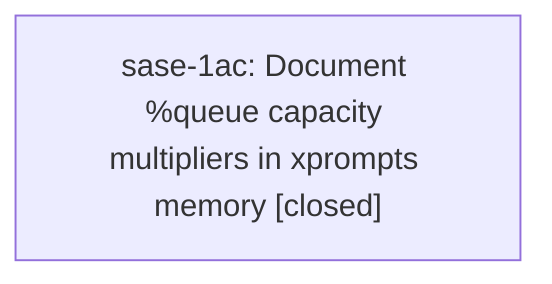

# Bead: sase-1ac — Document %queue capacity multipliers in xprompts memory

[Bead Pages](../README.md) / sase-1ac

**Status:** ✓ closed · **Resolution:** done · **Type:** ◆ task · **Task type:** ▤ memory
**Owner:** `bryanbugyi34@gmail.com` · **Created by:** `bbugyi200.apollo.sase-19f.land` · **Assignee:** `sase-1ac` · **Size:** small
**Created:** 2026-09-26 04:34:48 EDT · **Closed:** 2026-09-26 05:00:06 EDT

## Description

Proposed by sase-19f.3 note #1. The approved epic plan explicitly deferred updating sase/memory/xprompts.md. Its %queue paragraph still states that capacity must be a positive integer, but %q(1.5x, w=0.25) now parses and resolves against effective max_running_agents. Update the table and paragraph with <M>x syntax, two-decimal precision, live effective-budget scaling, and the 1.5x * 5 = 7.5 example. Run sase memory init after the authorized edit. Distinct from sase-134, which documents %hold and proc queue behavior.

---

\## Memory update

- **Path:** `xprompts.md`

Explain %q(1.5x) multiplier syntax and its effective max_running_agents resolution; replace integer-only guidance and regenerate memory output.

## Notes

[2026-09-26T09:00:06Z · sase-1ac] Documented %queue <M>x multipliers in sase/memory/xprompts.md: table row now shows capacity (N or <M>x); paragraph covers multiplier syntax, finite/>0/two-decimal rule with canonical trimmed formatting (1.50x reads as 1.5x), admission-time resolution against live effective max_running_agents rounded to two decimals, and the %q(1.5x, w=0.25) x effective-limit-5 = 7.5 budget example; integer-N fixed-budget semantics preserved. Verified: sase memory init --no-commit regenerated README stats (reference note, AGENTS.md unchanged), sase init memory --check passes, just fmt clean. Full just check could not complete in-turn: blocked by pre-existing workspace skew (installed sase-core-rs 0.34.71 vs linked checkout 0.34.73, needs just install rebuild); unrelated to this docs-only edit.

## Lineage

## Agents

| Agent | Bead | Commits |
|---|---|---:|
| [bbugyi200.athena.sase-1ac](https://github.com/sase-org/sase--agents/blob/main/agents/bbugyi200.athena.sase-1ac/README.md) | [sase-1ac](README.md) | 1 |

## Commits

| Repo | Commit | Subject | Bead | Committed |
|---|---|---|---|---|
| sase | [`fa285b2`](https://github.com/sase-org/sase/commit/fa285b261f94a7b93b24cb3f7b69b6e0a73ccc42) | docs(memory): document %queue \<M\>x capacity multipliers in xprompts | [sase-1ac](README.md) | 2026-09-26 05:01:34 EDT |
