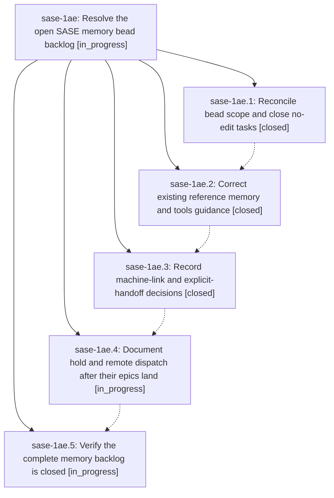

# Bead: sase-1ae — Resolve the open SASE memory bead backlog

[Bead Pages](../README.md) / sase-1ae

**Status:** ◐ in_progress · **Type:** ▸ plan · **Tier:** epic
**Owner:** `bryanbugyi34@gmail.com` · **Created by:** [bbugyi200.athena.0qi](https://github.com/sase-org/sase--agents/blob/main/sessions/bbugyi200.athena.0qi.md) · **Assignee:** `sase-1ae.land`
**Created:** 2026-09-26 07:00:20 EDT
**Plan:** [202609/close\_memory\_bead\_backlog.md](https://github.com/sase-org/sase--plans/blob/main/202609/close_memory_bead_backlog.md)

## Description

Apply the audited memory corrections and close all 15 currently open memory task beads with evidence-based reasons, including the two tasks gated by active epics.

## Phases

| Bead | Title | Status | Size | Created | Agents | Commits |
|---|---|---|---|---|---:|---:|
| [sase-1ae.1](sase-1ae.1.md) | Reconcile bead scope and close no-edit tasks | ✓ closed | small | 2026-09-26 | 1 | 0 |
| [sase-1ae.2](sase-1ae.2.md) | Correct existing reference memory and tools guidance | ✓ closed | medium | 2026-09-26 | 1 | 1 |
| [sase-1ae.3](sase-1ae.3.md) | Record machine-link and explicit-handoff decisions | ✓ closed | medium | 2026-09-26 | 1 | 1 |
| [sase-1ae.4](sase-1ae.4.md) | Document hold and remote dispatch after their epics land | ◐ in_progress | medium | 2026-09-26 | 1 | 0 |
| [sase-1ae.5](sase-1ae.5.md) | Verify the complete memory backlog is closed | ◐ in_progress | small | 2026-09-26 | 1 | 0 |

## Lineage

## Agents

| Agent | Bead | Commits |
|---|---|---:|
| [bbugyi200.athena.sase-1ae.1](https://github.com/sase-org/sase--agents/blob/main/agents/bbugyi200.athena.sase-1ae.1/README.md) | [sase-1ae.1](sase-1ae.1.md) | 0 |
| [bbugyi200.athena.sase-1ae.2](https://github.com/sase-org/sase--agents/blob/main/agents/bbugyi200.athena.sase-1ae.2/README.md) | [sase-1ae.2](sase-1ae.2.md) | 1 |
| [bbugyi200.athena.sase-1ae.3](https://github.com/sase-org/sase--agents/blob/main/agents/bbugyi200.athena.sase-1ae.3/README.md) | [sase-1ae.3](sase-1ae.3.md) | 1 |
| [bbugyi200.athena.sase-1ae.4](https://github.com/sase-org/sase--agents/blob/main/agents/bbugyi200.athena.sase-1ae.4/README.md) | [sase-1ae.4](sase-1ae.4.md) | 0 |
| [bbugyi200.athena.sase-1ae.5](https://github.com/sase-org/sase--agents/blob/main/agents/bbugyi200.athena.sase-1ae.5/README.md) | [sase-1ae.5](sase-1ae.5.md) | 0 |
| [bbugyi200.athena.sase-1ae.land](https://github.com/sase-org/sase--agents/blob/main/agents/bbugyi200.athena.sase-1ae.land/README.md) | [sase-1ae](README.md) | 0 |

## Commits

| Repo | Commit | Subject | Bead | Committed |
|---|---|---|---|---|
| sase | [`4e0b96e`](https://github.com/sase-org/sase/commit/4e0b96e3db5d083822b8fbc422f84ee13e9711ef) | docs(memory): apply reference-phase corrections for seven backlog beads | [sase-1ae.2](sase-1ae.2.md) | 2026-09-26 08:13:55 EDT |
| sase | [`7eceb61`](https://github.com/sase-org/sase/commit/7eceb61ad9f37a21713fe9c6e3852e3a6c219e88) | docs(memory): record machine-link and explicit-handoff decisions | [sase-1ae.3](sase-1ae.3.md) | 2026-09-26 08:33:35 EDT |
