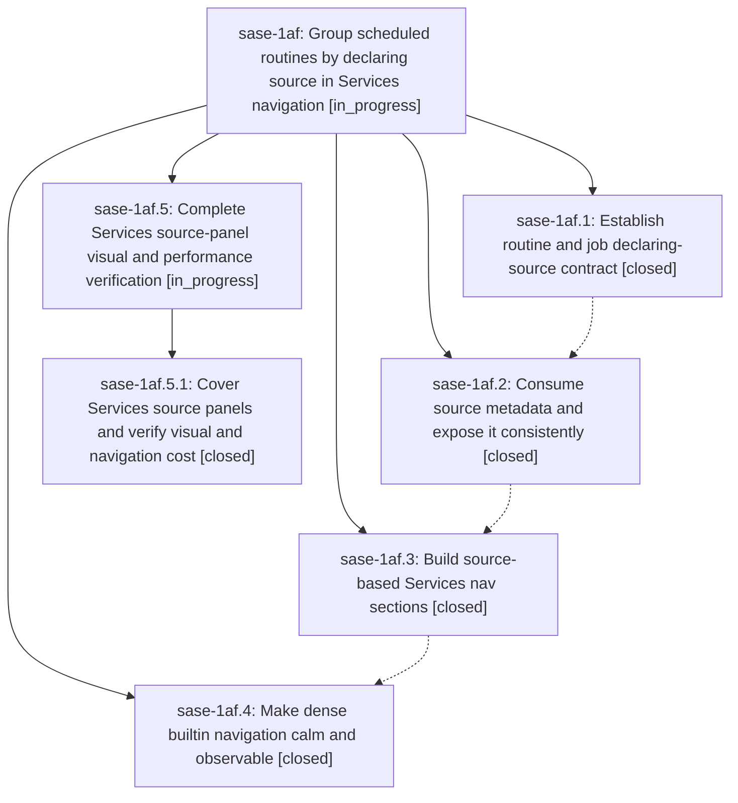

# Bead: sase-1af — Group scheduled routines by declaring source in Services navigation

[Bead Pages](../README.md) / sase-1af

**Status:** ◐ in_progress · **Type:** ▸ plan · **Tier:** epic
**Owner:** `bryanbugyi34@gmail.com` · **Created by:** [bbugyi200.apollo.1v](https://github.com/sase-org/sase--agents/blob/main/sessions/bbugyi200.apollo.1v.md) · **Assignee:** `sase-1af.land`
**Created:** 2026-09-26 07:23:38 EDT
**Plan:** [202609/routine\_source\_nav\_sections.md](https://github.com/sase-org/sase--plans/blob/main/202609/routine_source_nav_sections.md)

## Description

Make user, plugin, and builtin routines immediately findable in distinct, reliable Services nav sections while preserving fast navigation and visible health.

## Notes

[2026-09-26T15:30:29Z · sase-1af.land] LANDING INTERRUPTED: Core commit 3568b38 and sase commits 6f18d2829, 880f1f863, bd83d3e60 implement the declaration contract, Python projection, source panels, badges, folding, and docs. Drift audit since the first sase commit found only separate changes to core pin, schema, ace docs, styles, and default config; the current pin 9f86897 contains 3568b38, and no later commit changed Services source logic. Remaining epic work: phase .4 did not cover 100x30 or Builtin-only Services PNGs, the old Services visual fixture has no routine_origins so does not exercise source groups/folding/health, and phase notes provide no key-to-paint/idle trace comparison. A child epic plan, sase_plan_services_source_visual_completion.md, scopes only that visual/performance completion and will parent to sase-1af. FOLLOW-UP TRIAGE: .1 note #1 is existing ready task sase-1an; independently corroborated with +1 from core HEAD. .2 note #1, .3 note #1, and .4 note #1 are the same stale-whitelist instance: three closed sase-19x.4 entries already assigned in active sase-19x notes #2-#5 and task sase-o7; sase-19f entries have gone; two sase-18i entries are keyed to that still-open epic, so no new task or duplicate +1. .3 note #2 is one loaded-host full-lane timeout after intended selection escalation, with no failing node or repeat on unchanged tree; declined as insufficient evidence of a distinct reproducible defect, and this child will report its own just check outcome. .4 note #2 is remaining sase-1af work, not a separate task. Do not close sase-1af until the child epic lands, then rerun epic-symbols, close, symvision, and mark this plan done.

## Phases

| Bead | Title | Status | Size | Created | Agents | Commits |
|---|---|---|---|---|---:|---:|
| [sase-1af.1](sase-1af.1.md) | Establish routine and job declaring-source contract | ✓ closed | medium | 2026-09-26 | 1 | 1 |
| [sase-1af.2](sase-1af.2.md) | Consume source metadata and expose it consistently | ✓ closed | medium | 2026-09-26 | 1 | 1 |
| [sase-1af.3](sase-1af.3.md) | Build source-based Services nav sections | ✓ closed | medium | 2026-09-26 | 1 | 1 |
| [sase-1af.4](sase-1af.4.md) | Make dense builtin navigation calm and observable | ✓ closed | medium | 2026-09-26 | 1 | 1 |

## Lineage

## Agents

| Agent | Bead | Commits |
|---|---|---:|
| [bbugyi200.apollo.sase-1af.1](https://github.com/sase-org/sase--agents/blob/main/agents/bbugyi200.apollo.sase-1af.1/README.md) | [sase-1af.1](sase-1af.1.md) | 1 |
| [bbugyi200.apollo.sase-1af.2](https://github.com/sase-org/sase--agents/blob/main/sessions/bbugyi200.apollo.sase-1af.2.md) | [sase-1af.2](sase-1af.2.md) | 1 |
| [bbugyi200.apollo.sase-1af.3](https://github.com/sase-org/sase--agents/blob/main/sessions/bbugyi200.apollo.sase-1af.3.md) | [sase-1af.3](sase-1af.3.md) | 1 |
| [bbugyi200.apollo.sase-1af.4](https://github.com/sase-org/sase--agents/blob/main/agents/bbugyi200.apollo.sase-1af.4/README.md) | [sase-1af.4](sase-1af.4.md) | 1 |
| [bbugyi200.apollo.sase-1af.5.1](https://github.com/sase-org/sase--agents/blob/main/agents/bbugyi200.apollo.sase-1af.5.1/README.md) | [sase-1af.5.1](sase-1af.5.1.md) | 1 |
| [bbugyi200.apollo.sase-1af.5.land](https://github.com/sase-org/sase--agents/blob/main/agents/bbugyi200.apollo.sase-1af.5.land/README.md) | [sase-1af.5](sase-1af.5.md) | 0 |
| [bbugyi200.apollo.sase-1af.land](https://github.com/sase-org/sase--agents/blob/main/sessions/bbugyi200.apollo.sase-1af.land.md) | [sase-1af](README.md) | 0 |

## Commits

| Repo | Commit | Subject | Bead | Committed |
|---|---|---|---|---|
| sase-core | [`sase-core@3568b38`](https://github.com/sase-org/sase-core/commit/3568b38d00ae0656ce92704d409612ba23357e84) | feat(axe): add declaring-source contract to AXE inventory entries | [sase-1af.1](sase-1af.1.md) | 2026-09-26 07:51:53 EDT |
| sase | [`6f18d28`](https://github.com/sase-org/sase/commit/6f18d282928335b49ab9000a7fa38c2a4f62a927) | feat(axe): expose routine declaring source through config, CLI, and Services | [sase-1af.2](sase-1af.2.md) | 2026-09-26 08:50:24 EDT |
| sase | [`880f1f8`](https://github.com/sase-org/sase/commit/880f1f863e824f1009217e782deef7ec4b58c5ab) | feat(axe): add source-based Services nav panels | [sase-1af.3](sase-1af.3.md) | 2026-09-26 10:28:59 EDT |
| sase | [`bd83d3e`](https://github.com/sase-org/sase/commit/bd83d3e6075770b58fd46d0c1e088fbde74bbced) | feat(axe): calm dense builtin navigation with health badges and first-sight folding | [sase-1af.4](sase-1af.4.md) | 2026-09-26 11:16:41 EDT |
| sase | [`8c9653d`](https://github.com/sase-org/sase/commit/8c9653df004cd3592cc81ef39d30e1410a1b7ff2) | test(ace): add services panels PNG snapshot coverage with explicit routine origins | [sase-1af.5.1](sase-1af.5.1.md) | 2026-09-26 12:33:05 EDT |
