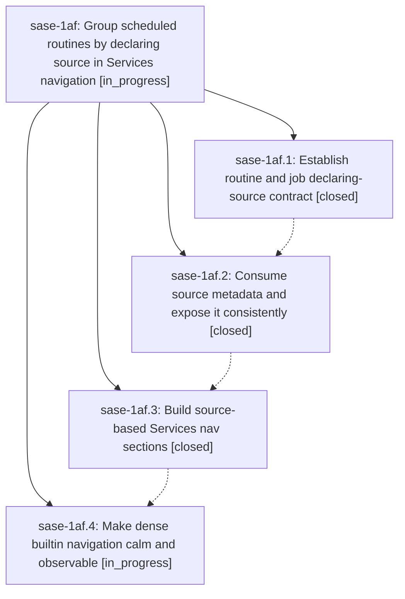

# Bead: sase-1af — Group scheduled routines by declaring source in Services navigation

[Bead Pages](../README.md) / sase-1af

**Status:** ◐ in_progress · **Type:** ▸ plan · **Tier:** epic
**Owner:** `bryanbugyi34@gmail.com` · **Created by:** [bbugyi200.apollo.1v](https://github.com/sase-org/sase--agents/blob/main/sessions/bbugyi200.apollo.1v.md) · **Assignee:** `sase-1af.land`
**Created:** 2026-09-26 07:23:38 EDT
**Plan:** [202609/routine\_source\_nav\_sections.md](https://github.com/sase-org/sase--plans/blob/main/202609/routine_source_nav_sections.md)

## Description

Make user, plugin, and builtin routines immediately findable in distinct, reliable Services nav sections while preserving fast navigation and visible health.

## Phases

| Bead | Title | Status | Size | Created | Agents | Commits |
|---|---|---|---|---|---:|---:|
| [sase-1af.1](sase-1af.1.md) | Establish routine and job declaring-source contract | ✓ closed | medium | 2026-09-26 | 1 | 1 |
| [sase-1af.2](sase-1af.2.md) | Consume source metadata and expose it consistently | ✓ closed | medium | 2026-09-26 | 1 | 1 |
| [sase-1af.3](sase-1af.3.md) | Build source-based Services nav sections | ✓ closed | medium | 2026-09-26 | 1 | 1 |
| [sase-1af.4](sase-1af.4.md) | Make dense builtin navigation calm and observable | ◐ in_progress | medium | 2026-09-26 | 1 | 0 |

## Lineage

## Agents

| Agent | Bead | Commits |
|---|---|---:|
| [bbugyi200.apollo.sase-1af.1](https://github.com/sase-org/sase--agents/blob/main/agents/bbugyi200.apollo.sase-1af.1/README.md) | [sase-1af.1](sase-1af.1.md) | 1 |
| [bbugyi200.apollo.sase-1af.2](https://github.com/sase-org/sase--agents/blob/main/sessions/bbugyi200.apollo.sase-1af.2.md) | [sase-1af.2](sase-1af.2.md) | 1 |
| [bbugyi200.apollo.sase-1af.3](https://github.com/sase-org/sase--agents/blob/main/sessions/bbugyi200.apollo.sase-1af.3.md) | [sase-1af.3](sase-1af.3.md) | 1 |
| [bbugyi200.apollo.sase-1af.4](https://github.com/sase-org/sase--agents/blob/main/agents/bbugyi200.apollo.sase-1af.4/README.md) | [sase-1af.4](sase-1af.4.md) | 0 |
| [bbugyi200.apollo.sase-1af.land](https://github.com/sase-org/sase--agents/blob/main/agents/bbugyi200.apollo.sase-1af.land/README.md) | [sase-1af](README.md) | 0 |

## Commits

| Repo | Commit | Subject | Bead | Committed |
|---|---|---|---|---|
| sase-core | [`sase-core@3568b38`](https://github.com/sase-org/sase-core/commit/3568b38d00ae0656ce92704d409612ba23357e84) | feat(axe): add declaring-source contract to AXE inventory entries | [sase-1af.1](sase-1af.1.md) | 2026-09-26 07:51:53 EDT |
| sase | [`6f18d28`](https://github.com/sase-org/sase/commit/6f18d282928335b49ab9000a7fa38c2a4f62a927) | feat(axe): expose routine declaring source through config, CLI, and Services | [sase-1af.2](sase-1af.2.md) | 2026-09-26 08:50:24 EDT |
| sase | [`880f1f8`](https://github.com/sase-org/sase/commit/880f1f863e824f1009217e782deef7ec4b58c5ab) | feat(axe): add source-based Services nav panels | [sase-1af.3](sase-1af.3.md) | 2026-09-26 10:28:59 EDT |
