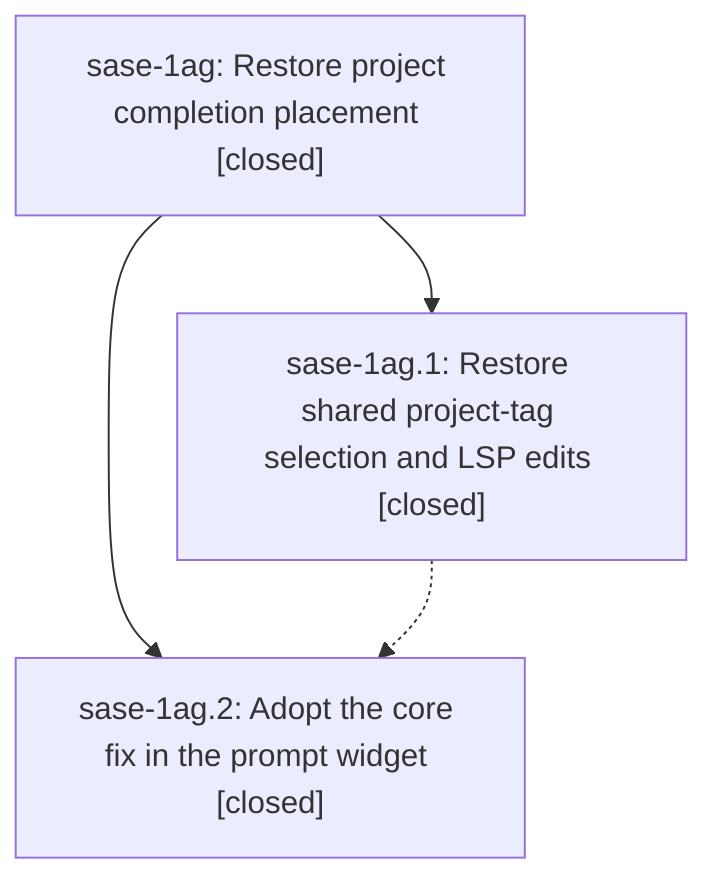

# Bead: sase-1ag — Restore project completion placement

[Bead Pages](../README.md) / sase-1ag

**Status:** ✓ closed · **Resolution:** done · **Type:** ▸ plan · **Tier:** epic
**Owner:** `bryanbugyi34@gmail.com` · **Created by:** [bbugyi200.apollo.1w](https://github.com/sase-org/sase--agents/blob/main/sessions/bbugyi200.apollo.1w.md) · **Assignee:** `sase-1ag.land`
**Created:** 2026-09-26 07:27:37 EDT · **Closed:** 2026-09-26 10:01:27 EDT
**Plan:** [202609/restore\_project\_completion\_placement.md](https://github.com/sase-org/sase--plans/blob/main/202609/restore_project_completion_placement.md)

## Description

Selecting a project completion places the chosen tag at the existing workspace target or leading prompt position in both the prompt widget and LSP.

## Notes

[2026-09-26T14:01:27Z · sase-1ag.land] Verified both closed phases against source and commits. sase-1ag.1 is core 24e8f5894f2f4c977ab637c29579b6e12f647820: project_tag_selection_edits removes the typed trigger and places the row at the earliest same-segment workspace target, or at the segment leading position after frontmatter, whitespace, and %directive tokens; the caret is just after the insertion; LSP keeps the primary edit on the trigger and emits nonoverlapping additional edits, merging when the trigger occupies the destination. Rust accept tests cover an existing tag before and after the trigger, multiple targets, frontmatter and directives, PR spelling, whitespace, newlines, Unicode, and literal zones. sase-1ag.2 is sase e565105721: pin is 24e8f58, Python apply_project_tag_selection calls project_tag_apply_selection with no duplicated algorithm, and docs/comments describe target-position placement. Focused tests passed here: tests/test_project_tags.py apply/trigger selection 23 passed, and tests/ace/tui/widgets/test_vcs_project_completion.py accept 14 passed. sase bead epic-symbols sase-1ag lists no entries.

Integration: commits since the epic started that touch the same files stay compatible. docs/ace.md still has the sase-1aa generated-table links and the target-position paragraph. The sase-1af.2 pin 3568b38 is an ancestor of 24e8f58, so the axe declaring-source contract remains included. Core HEAD 9f86897 (sase-1ah receipts) does not touch project tags and was never pinned, so this epic did not roll it back. No remaining in-place project-accept path. No integration edit was required.

Follow-ups: sase-1ag.1 clippy style denies filed as ready task sase-1an (medium, ci). The five named files are unchanged since that phase note; not caused by this epic; no duplicate task; sase-165 and sase-1ah do not own the lints. sase-1ag.2 symvision: just symvision still fails only on closed sase-19x.4 exemptions (phase_card_block, block_meta_for_session_shell, session_reply_heading). Already recorded on sase-19x notes #2 and #3; this landing added a corroborating note that the three functions are already used by the reply render path, so delete the Justfile lines rather than re-key them. The proposed sase-19f entries are already absent. Open sase-18i CoderPlacement and RetiredGate entries are still accepted and were left in place. sase-1ag.2 lumberjack empty_data declined: tests/test_axe_lumberjack_config.py::test_load_axe_config_empty_data passes on current master. The bundled full-suite agent_terminate/panel_shell/launch_context_bar flakes were not filed: no matching flake beads, no node IDs precise enough to reproduce, and check-full was not rerun.

## Phases

| Bead | Title | Status | Size | Created | Agents | Commits |
|---|---|---|---|---|---:|---:|
| [sase-1ag.1](sase-1ag.1.md) | Restore shared project-tag selection and LSP edits | ✓ closed | medium | 2026-09-26 | 1 | 1 |
| [sase-1ag.2](sase-1ag.2.md) | Adopt the core fix in the prompt widget | ✓ closed | small | 2026-09-26 | 1 | 1 |

## Lineage

## Agents

| Agent | Bead | Commits |
|---|---|---:|
| [bbugyi200.apollo.sase-1ag.1](https://github.com/sase-org/sase--agents/blob/main/agents/bbugyi200.apollo.sase-1ag.1/README.md) | [sase-1ag.1](sase-1ag.1.md) | 1 |
| [bbugyi200.apollo.sase-1ag.2](https://github.com/sase-org/sase--agents/blob/main/sessions/bbugyi200.apollo.sase-1ag.2.md) | [sase-1ag.2](sase-1ag.2.md) | 0 |
| [bbugyi200.apollo.sase-1ag.land](https://github.com/sase-org/sase--agents/blob/main/agents/bbugyi200.apollo.sase-1ag.land/README.md) | [sase-1ag](README.md) | 1 |

## Commits

| Repo | Commit | Subject | Bead | Committed |
|---|---|---|---|---|
| sase-core | [`sase-core@24e8f58`](https://github.com/sase-org/sase-core/commit/24e8f5894f2f4c977ab637c29579b6e12f647820) | fix(core): restore target-position project-tag selection and LSP edits | [sase-1ag.1](sase-1ag.1.md) | 2026-09-26 08:01:58 EDT |
| sase | [`e565105`](https://github.com/sase-org/sase/commit/e565105721bd0c7bc45701f94acb5dae8475dd67) | fix: Adopt the core fix in the prompt widget (sase-1ag.2) | [sase-1ag.2](sase-1ag.2.md) | 2026-09-26 09:36:40 EDT |
| sase--plans | [`sase--plans@bffc13b`](https://github.com/sase-org/sase--plans/commit/bffc13b0dcf743e7e2525e60715acb5eec5dc40b) | docs: mark the sase-1ag project completion placement plan done | [sase-1ag](README.md) | 2026-09-26 10:05:44 EDT |
