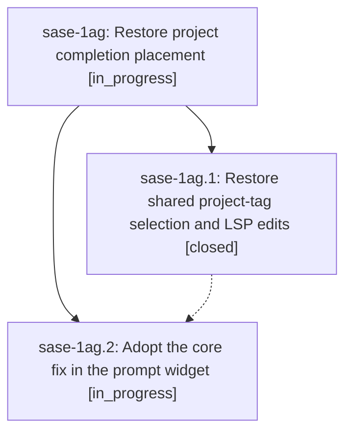

# Bead: sase-1ag — Restore project completion placement

[Bead Pages](../README.md) / sase-1ag

**Status:** ◐ in_progress · **Type:** ▸ plan · **Tier:** epic
**Owner:** `bryanbugyi34@gmail.com` · **Created by:** [bbugyi200.apollo.1w](https://github.com/sase-org/sase--agents/blob/main/sessions/bbugyi200.apollo.1w.md) · **Assignee:** `sase-1ag.land`
**Created:** 2026-09-26 07:27:37 EDT
**Plan:** [202609/restore\_project\_completion\_placement.md](https://github.com/sase-org/sase--plans/blob/main/202609/restore_project_completion_placement.md)

## Description

Selecting a project completion places the chosen tag at the existing workspace target or leading prompt position in both the prompt widget and LSP.

## Phases

| Bead | Title | Status | Size | Created | Agents | Commits |
|---|---|---|---|---|---:|---:|
| [sase-1ag.1](sase-1ag.1.md) | Restore shared project-tag selection and LSP edits | ✓ closed | medium | 2026-09-26 | 1 | 1 |
| [sase-1ag.2](sase-1ag.2.md) | Adopt the core fix in the prompt widget | ◐ in_progress | small | 2026-09-26 | 1 | 0 |

## Lineage

## Agents

| Agent | Bead | Commits |
|---|---|---:|
| [bbugyi200.apollo.sase-1ag.1](https://github.com/sase-org/sase--agents/blob/main/agents/bbugyi200.apollo.sase-1ag.1/README.md) | [sase-1ag.1](sase-1ag.1.md) | 1 |
| [bbugyi200.apollo.sase-1ag.2](https://github.com/sase-org/sase--agents/blob/main/agents/bbugyi200.apollo.sase-1ag.2/README.md) | [sase-1ag.2](sase-1ag.2.md) | 0 |
| [bbugyi200.apollo.sase-1ag.land](https://github.com/sase-org/sase--agents/blob/main/agents/bbugyi200.apollo.sase-1ag.land/README.md) | [sase-1ag](README.md) | 0 |

## Commits

| Repo | Commit | Subject | Bead | Committed |
|---|---|---|---|---|
| sase-core | [`sase-core@24e8f58`](https://github.com/sase-org/sase-core/commit/24e8f5894f2f4c977ab637c29579b6e12f647820) | fix(core): restore target-position project-tag selection and LSP edits | [sase-1ag.1](sase-1ag.1.md) | 2026-09-26 08:01:58 EDT |
