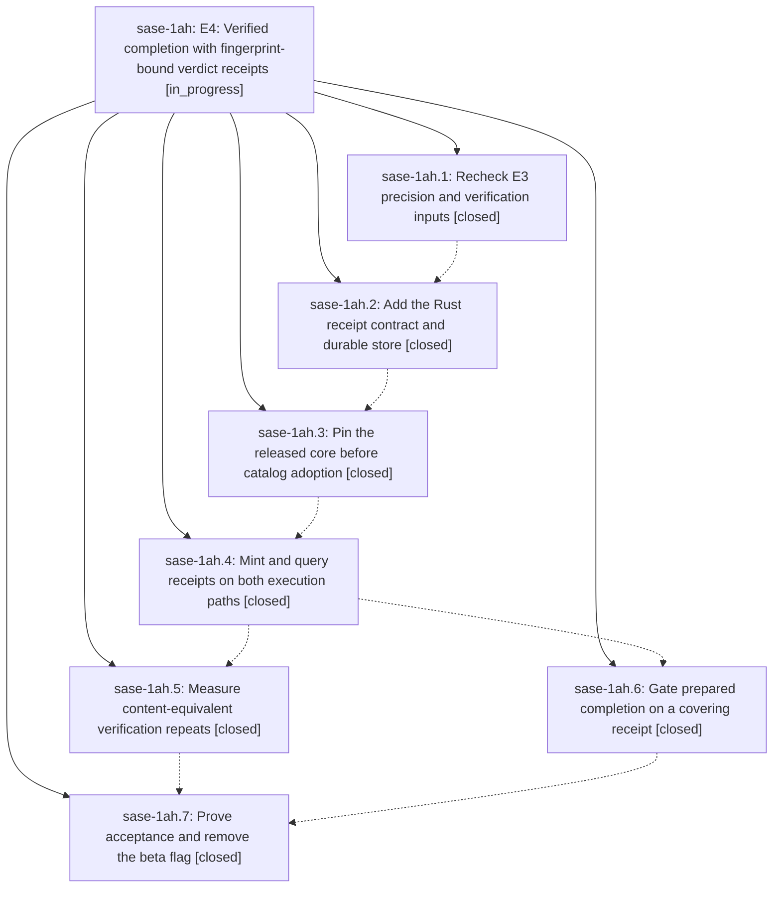

# Bead: sase-1ah — E4: Verified completion with fingerprint-bound verdict receipts

[Bead Pages](../README.md) / sase-1ah

**Status:** ◐ in_progress · **Type:** ▸ plan · **Tier:** epic
**Owner:** `bryanbugyi34@gmail.com` · **Created by:** [bbugyi200.athena.0st](https://github.com/sase-org/sase--agents/blob/main/sessions/bbugyi200.athena.0st.md) · **Assignee:** `sase-1ah.land`
**Created:** 2026-09-26 07:29:28 EDT
**Plan:** [202609/tool\_e4\_verified\_completion.md](https://github.com/sase-org/sase--plans/blob/main/202609/tool_e4_verified_completion.md)

## Description

A named verification run can mint a short-lived receipt for its exact fingerprint and trustworthy E3 verdict; users and host-owned prepared completion can query that proof, while every tool invocation still executes and any drift or uncertain failure recovers.

## Phases

| Bead | Title | Status | Size | Created | Agents | Commits |
|---|---|---|---|---|---:|---:|
| [sase-1ah.1](sase-1ah.1.md) | Recheck E3 precision and verification inputs | ✓ closed | medium | 2026-09-26 | 1 | 1 |
| [sase-1ah.2](sase-1ah.2.md) | Add the Rust receipt contract and durable store | ✓ closed | large | 2026-09-26 | 1 | 1 |
| [sase-1ah.3](sase-1ah.3.md) | Pin the released core before catalog adoption | ✓ closed | medium | 2026-09-26 | 1 | 1 |
| [sase-1ah.4](sase-1ah.4.md) | Mint and query receipts on both execution paths | ✓ closed | medium | 2026-09-26 | 1 | 1 |
| [sase-1ah.5](sase-1ah.5.md) | Measure content-equivalent verification repeats | ✓ closed | medium | 2026-09-26 | 1 | 1 |
| [sase-1ah.6](sase-1ah.6.md) | Gate prepared completion on a covering receipt | ✓ closed | large | 2026-09-26 | 1 | 2 |
| [sase-1ah.7](sase-1ah.7.md) | Prove acceptance and remove the beta flag | ✓ closed | medium | 2026-09-26 | 1 | 1 |

## Lineage

## Agents

| Agent | Bead | Commits |
|---|---|---:|
| [bbugyi200.athena.sase-1ah.1](https://github.com/sase-org/sase--agents/blob/main/agents/bbugyi200.athena.sase-1ah.1/README.md) | [sase-1ah.1](sase-1ah.1.md) | 1 |
| [bbugyi200.athena.sase-1ah.2](https://github.com/sase-org/sase--agents/blob/main/sessions/bbugyi200.athena.sase-1ah.2.md) | [sase-1ah.2](sase-1ah.2.md) | 1 |
| [bbugyi200.athena.sase-1ah.3](https://github.com/sase-org/sase--agents/blob/main/agents/bbugyi200.athena.sase-1ah.3/README.md) | [sase-1ah.3](sase-1ah.3.md) | 1 |
| [bbugyi200.athena.sase-1ah.4](https://github.com/sase-org/sase--agents/blob/main/agents/bbugyi200.athena.sase-1ah.4/README.md) | [sase-1ah.4](sase-1ah.4.md) | 1 |
| [bbugyi200.athena.sase-1ah.5](https://github.com/sase-org/sase--agents/blob/main/agents/bbugyi200.athena.sase-1ah.5/README.md) | [sase-1ah.5](sase-1ah.5.md) | 1 |
| [bbugyi200.athena.sase-1ah.6](https://github.com/sase-org/sase--agents/blob/main/sessions/bbugyi200.athena.sase-1ah.6.md) | [sase-1ah.6](sase-1ah.6.md) | 2 |
| [bbugyi200.athena.sase-1ah.7](https://github.com/sase-org/sase--agents/blob/main/agents/bbugyi200.athena.sase-1ah.7/README.md) | [sase-1ah.7](sase-1ah.7.md) | 1 |
| [bbugyi200.athena.sase-1ah.land](https://github.com/sase-org/sase--agents/blob/main/agents/bbugyi200.athena.sase-1ah.land/README.md) | [sase-1ah](README.md) | 0 |

## Commits

| Repo | Commit | Subject | Bead | Committed |
|---|---|---|---|---|
| sase | [`0b5fc65`](https://github.com/sase-org/sase/commit/0b5fc652b0933891525879b16e16259969d90052) | feat(tool): add hermetic-baseline lint version probes and KNOWN precision recheck | [sase-1ah.1](sase-1ah.1.md) | 2026-09-26 07:57:48 EDT |
| sase-core | [`sase-core@9f86897`](https://github.com/sase-org/sase-core/commit/9f86897f834e9719c44f5e1669a4bd55d312b99c) | feat(tool-run): add schema-1 receipt contract and durable store | [sase-1ah.2](sase-1ah.2.md) | 2026-09-26 09:12:36 EDT |
| sase | [`4e85d4b`](https://github.com/sase-org/sase/commit/4e85d4bc0553290c9edfd2af1ec22d5922d6c885) | feat(tool): pin receipt-capable core and adopt catalog receipt policy | [sase-1ah.3](sase-1ah.3.md) | 2026-09-26 10:14:58 EDT |
| sase | [`2811476`](https://github.com/sase-org/sase/commit/281147666b7ce353cb46fc1031870e72c9c7cd6d) | feat(tool): add receipt execution CLI with settle adapter and receipt query | [sase-1ah.4](sase-1ah.4.md) | 2026-09-26 10:43:44 EDT |
| sase | [`473871c`](https://github.com/sase-org/sase/commit/473871ceea6b68748793875bca1daef39ca68558) | feat(tool): add receipts opportunity report for content-equivalent repeats | [sase-1ah.5](sase-1ah.5.md) | 2026-09-26 11:08:37 EDT |
| sase | [`9e8a65a`](https://github.com/sase-org/sase/commit/9e8a65ad2a7491680ffbea38ceb011e0f10891e2) | feat(verdict-completion): explicit no-new intent policy with commit-time recheck, typed refusals and verdict provenance (sase-1ah.6) | [sase-1ah.6](sase-1ah.6.md) | 2026-09-26 12:23:28 EDT |
| sase-core | [`sase-core@e654e7c`](https://github.com/sase-org/sase-core/commit/e654e7cc4ae31c0e13e03bead38ba42c4e08c445) | feat(continuation): accept-policy wires for verdict completion (sase-1ah.6) | [sase-1ah.6](sase-1ah.6.md) | 2026-09-26 12:28:31 EDT |
| sase | [`3065117`](https://github.com/sase-org/sase/commit/3065117500eb3c007c6993177803022d3b1ccf7e) | feat(tool): remove tool\_receipts flag and land receipt proof contract | [sase-1ah.7](sase-1ah.7.md) | 2026-09-26 13:09:11 EDT |

<!-- sase:referenced-by:start -->

## Referenced By

| Relation | Artifact | Why | Uses |
| --- | --- | --- | ---: |
| read-by | [agent:sase-1ah.1][1] | Need parent epic scope | 1 |
| read-by | [agent:sase-1ah.4][2] | epic context | 1 |
| read-by | [agent:sase-1ah.5][3] | Need epic context for opportunity-report phase | 1 |

[1]: https://github.com/sase-org/sase--agents/blob/main/agents/bbugyi200.athena.sase-1ah.1/README.md
[2]: https://github.com/sase-org/sase--agents/blob/main/agents/bbugyi200.athena.sase-1ah.4/README.md
[3]: https://github.com/sase-org/sase--agents/blob/main/agents/bbugyi200.athena.sase-1ah.5/README.md

<!-- sase:referenced-by:end -->
