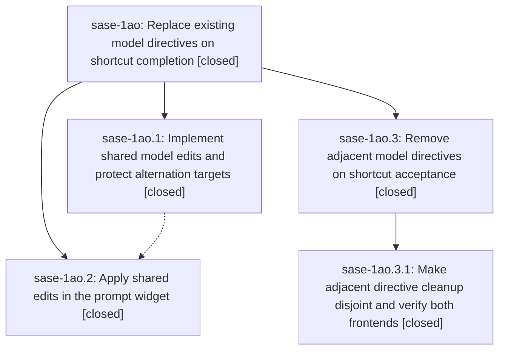

# Bead: sase-1ao — Replace existing model directives on shortcut completion

[Bead Pages](../README.md) / sase-1ao

**Status:** ✓ closed · **Resolution:** done · **Type:** ▸ plan · **Tier:** epic
**Owner:** `bryanbugyi34@gmail.com` · **Created by:** [bbugyi200.apollo.1x](https://github.com/sase-org/sase--agents/blob/main/sessions/bbugyi200.apollo.1x.md) · **Assignee:** `sase-1ao.land`
**Created:** 2026-09-26 10:14:32 EDT · **Closed:** 2026-09-26 15:46:54 EDT
**Plan:** [202609/model\_shortcut\_replacement.md](https://github.com/sase-org/sase--plans/blob/main/202609/model_shortcut_replacement.md)

<!-- sase:links:start -->

## Links

| Relation | Artifact | Why |
| --- | --- | --- |
| implemented-by | [plan:202609/model_shortcut_replacement.md][1] | derived from the plan's `bead_id:` frontmatter field |

_Plus 1 automatic references — see [Referenced By](#referenced-by)._

[1]: https://github.com/sase-org/sase--plans/blob/main/202609/model_shortcut_replacement.md

<!-- sase:links:end -->

## Description

Accepting =alias or ==model yields one standalone model directive per prompt segment while preserving alternation branches, with matching behavior in the prompt widget and LSP.

## Notes

[2026-09-26T16:57:27Z · sase-1ao.land] LANDING INTERRUPTED: Reviewed both closed children, linked plan, core stitch e1179e6 and widget stitch e922c424e. Current Rust planner, PyO3 wire, ACE accept path, and LSP conversion implement the reported segment/alternation behavior, and the pin is e1179e6. Drift since epic creation includes receipt, Services, Node Finder, deck, and test work; no later core commit touches shortcut/alternation code, and no post-widget commit touches the ACE shortcut accept path. Reproduced remaining epic defect: =la %m:a %m:b with @large becomes %m:@large %m:b because whitespace ranges overlap and a later standalone directive is skipped. A validated child epic plan, sase_plan_model_shortcut_adjacent_directives.md, covers only that cleanup and parity regression. Follow-up triage: phase .1 note #1 duplicates ready CI task sase-1an, independently corroborated with +1 on current core HEAD; no new task. Phase .2 note #1 is a clean-base check-failure cluster under current verification review; its completion-snapshot/kind-coverage subset is already tracked by sase-18s. Do not close this epic before the child lands; then recheck the phase .2 cluster, epic-symbols, symvision, and linked plan status.

[2026-09-26T17:14:01Z · sase-1ao.land] LANDING ADDENDUM: Current clean-master verification ToolRun 3f77453fd19a04e6c131bd3fb44181c2 exited 1 at Symvision after earlier lint stages passed; the only errors are five stale sase-19x.9 --epic-symbol entries, already on active epic sase-19x notes #9-#10 (corroborated there). sase bead epic-symbols sase-1ao lists no entries. Focused serial rerun of phase .2 proposed-failure groups on current installed core gave 94 passed/4 failed: Admin Center resume x8, bgcmd, proc observer, procs pane store, config schema, models surface, and agent-session terminology now pass, so those proposed subgroups are declined as no longer reproducible. The three remaining completion snapshot/kind-coverage nodes are exactly within ready task sase-18s and received independent +1; no duplicate task. The fourth is a deterministic stale getting-started Grok wording assertion from closed model-catalog epic sase-1aa.5.2; created small ready CI task sase-1as, separate from old closed sase-m3. Phase .1 clippy proposal is existing task sase-1an (+1 recorded). Only remaining work caused by this epic is the adjacent standalone-directive removal in the validated parent-linked child plan; leave sase-1ao open until that child lands, then rerun readiness/verification and close normally.

[2026-09-26T19:46:54Z · sase-1ao.3.land] Rechecked after child epic sase-1ao.3 closed. Descendants sase-1ao.1, sase-1ao.2, and sase-1ao.3 are closed done. The adjacent-directive gap from the earlier landing notes is fixed in core 104d902: focused Rust, LSP, and PyO3 tests passed there, and the installed binding's ACE/LSP/widget suite passed 146 including adjacent accept and undo. The sase pin is e44af7d, a descendant of that repair; the only newer core commit is prompt-stash and does not touch shortcut code. No post-start sase commit edits the accept path. Prior follow-ups stay settled: core clippy is ready task sase-1an (additional +1 from the child landing), and the phase .2 check cluster was already split into declined subgroups plus sase-18s and sase-1as. No --epic-symbol entries for sase-1ao. just check a4c074f6 still fails only on closed phase sase-19i.7.3.3.2's stale node-finder epic-symbol, recorded on in-progress epic sase-19i.7.3.3.

## Phases

| Bead | Title | Status | Size | Created | Agents | Commits |
|---|---|---|---|---|---:|---:|
| [sase-1ao.1](sase-1ao.1.md) | Implement shared model edits and protect alternation targets | ✓ closed | medium | 2026-09-26 | 1 | 1 |
| [sase-1ao.2](sase-1ao.2.md) | Apply shared edits in the prompt widget | ✓ closed | medium | 2026-09-26 | 1 | 1 |

## Lineage

## Agents

| Agent | Bead | Commits |
|---|---|---:|
| [bbugyi200.apollo.sase-1ao.1](https://github.com/sase-org/sase--agents/blob/main/agents/bbugyi200.apollo.sase-1ao.1/README.md) | [sase-1ao.1](sase-1ao.1.md) | 1 |
| [bbugyi200.apollo.sase-1ao.2](https://github.com/sase-org/sase--agents/blob/main/sessions/bbugyi200.apollo.sase-1ao.2.md) | [sase-1ao.2](sase-1ao.2.md) | 1 |
| [bbugyi200.apollo.sase-1ao.3.1](https://github.com/sase-org/sase--agents/blob/main/sessions/bbugyi200.apollo.sase-1ao.3.1.md) | [sase-1ao.3.1](sase-1ao.3.1.md) | 1 |
| [bbugyi200.apollo.sase-1ao.3.land](https://github.com/sase-org/sase--agents/blob/main/agents/bbugyi200.apollo.sase-1ao.3.land/README.md) | [sase-1ao.3](sase-1ao.3.md) | 2 |
| [bbugyi200.apollo.sase-1ao.land](https://github.com/sase-org/sase--agents/blob/main/sessions/bbugyi200.apollo.sase-1ao.land.md) | [sase-1ao](README.md) | 0 |

## Commits

| Repo | Commit | Subject | Bead | Committed |
|---|---|---|---|---|
| sase-core | [`sase-core@e1179e6`](https://github.com/sase-org/sase-core/commit/e1179e65bacefa91593c7dfbbd5480459ecfa504) | feat(core): alternation-aware model shortcut accept with protected branch targets | [sase-1ao.1](sase-1ao.1.md) | 2026-09-26 11:23:03 EDT |
| sase | [`e922c42`](https://github.com/sase-org/sase/commit/e922c424e2e8bd22aac06fdb69c255ff15f33863) | feat(ace): adopt shared model-shortcut edits in prompt widget (sase-1ao.2) | [sase-1ao.2](sase-1ao.2.md) | 2026-09-26 12:33:10 EDT |
| sase | [`1a38e71`](https://github.com/sase-org/sase/commit/1a38e711d2d60466cb6a7b560d1193ae498aec49) | test(adjacent-cleanup): disjoint accept coverage for =alias/==model shortcuts (sase-1ao.3.1 already closed) | [sase-1ao.3.1](sase-1ao.3.1.md) | 2026-09-26 14:38:52 EDT |
| sase-core | [`sase-core@104d902`](https://github.com/sase-org/sase-core/commit/104d902c9c54995dd3d8cd0888a6cdf19cbf5738) | fix(core): remove adjacent model directives with disjoint edits | [sase-1ao.3.1](sase-1ao.3.1.md) | 2026-09-26 14:56:36 EDT |
| sase | [`00f4975`](https://github.com/sase-org/sase/commit/00f4975d9c7236fb6eccf78cb1dc183769007955) | fix(core): pin the published adjacent model-directive cleanup | [sase-1ao.3](sase-1ao.3.md) | 2026-09-26 15:50:22 EDT |
| sase--plans | [`sase--plans@0f2736d`](https://github.com/sase-org/sase--plans/commit/0f2736de8a9ee40140d7e08428d5933fe5a553cb) | docs(plans): mark the model shortcut epics done | [sase-1ao.3](sase-1ao.3.md) | 2026-09-26 15:52:28 EDT |

<!-- sase:referenced-by:start -->

## Referenced By

| Relation | Artifact | Why | Uses |
| --- | --- | --- | ---: |
| read-by | [agent:sase-1ao.1][1] | epic context | 1 |

[1]: https://github.com/sase-org/sase--agents/blob/main/agents/bbugyi200.apollo.sase-1ao.1/README.md

<!-- sase:referenced-by:end -->
