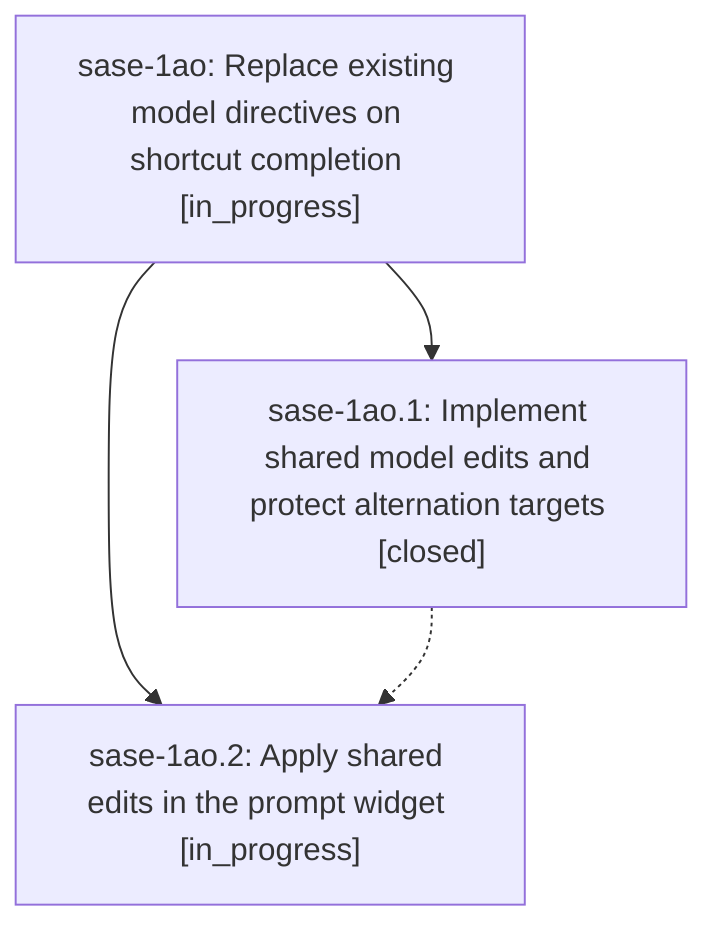

# Bead: sase-1ao — Replace existing model directives on shortcut completion

[Bead Pages](../README.md) / sase-1ao

**Status:** ◐ in_progress · **Type:** ▸ plan · **Tier:** epic
**Owner:** `bryanbugyi34@gmail.com` · **Created by:** [bbugyi200.apollo.1x](https://github.com/sase-org/sase--agents/blob/main/sessions/bbugyi200.apollo.1x.md) · **Assignee:** `sase-1ao.land`
**Created:** 2026-09-26 10:14:32 EDT
**Plan:** [202609/model\_shortcut\_replacement.md](https://github.com/sase-org/sase--plans/blob/main/202609/model_shortcut_replacement.md)

## Description

Accepting =alias or ==model yields one standalone model directive per prompt segment while preserving alternation branches, with matching behavior in the prompt widget and LSP.

## Phases

| Bead | Title | Status | Size | Created | Agents | Commits |
|---|---|---|---|---|---:|---:|
| [sase-1ao.1](sase-1ao.1.md) | Implement shared model edits and protect alternation targets | ✓ closed | medium | 2026-09-26 | 1 | 1 |
| [sase-1ao.2](sase-1ao.2.md) | Apply shared edits in the prompt widget | ◐ in_progress | medium | 2026-09-26 | 1 | 0 |

## Lineage

## Agents

| Agent | Bead | Commits |
|---|---|---:|
| [bbugyi200.apollo.sase-1ao.1](https://github.com/sase-org/sase--agents/blob/main/agents/bbugyi200.apollo.sase-1ao.1/README.md) | [sase-1ao.1](sase-1ao.1.md) | 1 |
| [bbugyi200.apollo.sase-1ao.2](https://github.com/sase-org/sase--agents/blob/main/agents/bbugyi200.apollo.sase-1ao.2/README.md) | [sase-1ao.2](sase-1ao.2.md) | 0 |
| [bbugyi200.apollo.sase-1ao.land](https://github.com/sase-org/sase--agents/blob/main/agents/bbugyi200.apollo.sase-1ao.land/README.md) | [sase-1ao](README.md) | 0 |

## Commits

| Repo | Commit | Subject | Bead | Committed |
|---|---|---|---|---|
| sase-core | [`sase-core@e1179e6`](https://github.com/sase-org/sase-core/commit/e1179e65bacefa91593c7dfbbd5480459ecfa504) | feat(core): alternation-aware model shortcut accept with protected branch targets | [sase-1ao.1](sase-1ao.1.md) | 2026-09-26 11:23:03 EDT |
