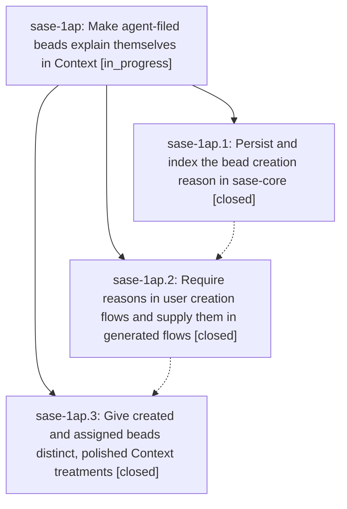

# Bead: sase-1ap — Make agent-filed beads explain themselves in Context

[Bead Pages](../README.md) / sase-1ap

**Status:** ◐ in_progress · **Type:** ▸ plan · **Tier:** epic
**Owner:** `bryanbugyi34@gmail.com` · **Created by:** [bbugyi200.athena.0sv](https://github.com/sase-org/sase--agents/blob/main/sessions/bbugyi200.athena.0sv.md) · **Assignee:** `sase-1ap.land`
**Created:** 2026-09-26 11:35:47 EDT
**Plan:** [202609/bead\_creation\_reasons.md](https://github.com/sase-org/sase--plans/blob/main/202609/bead_creation_reasons.md)

<!-- sase:links:start -->

## Links

| Relation | Artifact | Why |
| --- | --- | --- |
| implemented-by | [plan:202609/bead_creation_reasons.md][1] | derived from the plan's `bead_id:` frontmatter field |

_Plus 1 automatic references — see [Referenced By](#referenced-by)._

[1]: https://github.com/sase-org/sase--plans/blob/main/202609/bead_creation_reasons.md

<!-- sase:links:end -->

## Description

Every new bead records why it was created, and agent-created beads are recognizable and informative in the Context card.

## Phases

| Bead | Title | Status | Size | Created | Agents | Commits |
|---|---|---|---|---|---:|---:|
| [sase-1ap.1](sase-1ap.1.md) | Persist and index the bead creation reason in sase-core | ✓ closed | medium | 2026-09-26 | 1 | 1 |
| [sase-1ap.2](sase-1ap.2.md) | Require reasons in user creation flows and supply them in generated flows | ✓ closed | medium | 2026-09-26 | 1 | 1 |
| [sase-1ap.3](sase-1ap.3.md) | Give created and assigned beads distinct, polished Context treatments | ✓ closed | medium | 2026-09-26 | 1 | 1 |

## Lineage

## Agents

| Agent | Bead | Commits |
|---|---|---:|
| [bbugyi200.athena.sase-1ap.1](https://github.com/sase-org/sase--agents/blob/main/agents/bbugyi200.athena.sase-1ap.1/README.md) | [sase-1ap.1](sase-1ap.1.md) | 1 |
| [bbugyi200.athena.sase-1ap.2](https://github.com/sase-org/sase--agents/blob/main/sessions/bbugyi200.athena.sase-1ap.2.md) | [sase-1ap.2](sase-1ap.2.md) | 1 |
| [bbugyi200.athena.sase-1ap.3](https://github.com/sase-org/sase--agents/blob/main/agents/bbugyi200.athena.sase-1ap.3/README.md) | [sase-1ap.3](sase-1ap.3.md) | 1 |
| [bbugyi200.athena.sase-1ap.land](https://github.com/sase-org/sase--agents/blob/main/agents/bbugyi200.athena.sase-1ap.land/README.md) | [sase-1ap](README.md) | 0 |

## Commits

| Repo | Commit | Subject | Bead | Committed |
|---|---|---|---|---|
| sase-core | [`sase-core@e579d1d`](https://github.com/sase-org/sase-core/commit/e579d1d120b29e54d492e4cbeecd34bddfebe06d) | feat(beads): persist and index the bead creation reason | [sase-1ap.1](sase-1ap.1.md) | 2026-09-26 12:07:17 EDT |
| sase | [`d588a46`](https://github.com/sase-org/sase/commit/d588a461bc9e5201b5abf42c9a5c7f875f2b29c9) | feat(beads): require creation reasons in user flows and supply them in generated flows | [sase-1ap.2](sase-1ap.2.md) | 2026-09-26 13:27:18 EDT |
| sase | [`7606e5d`](https://github.com/sase-org/sase/commit/7606e5d8c7b1493ba7764929ef837739deb5531f) | feat(beads): distinct created/assigned Context treatments with filing reasons (sase-1ap.3) | [sase-1ap.3](sase-1ap.3.md) | 2026-09-26 14:15:00 EDT |

<!-- sase:referenced-by:start -->

## Referenced By

| Relation | Artifact | Why | Uses |
| --- | --- | --- | ---: |
| read-by | [agent:sase-1ap.1][1] | epic scope | 1 |

[1]: https://github.com/sase-org/sase--agents/blob/main/agents/bbugyi200.athena.sase-1ap.1/README.md

<!-- sase:referenced-by:end -->
