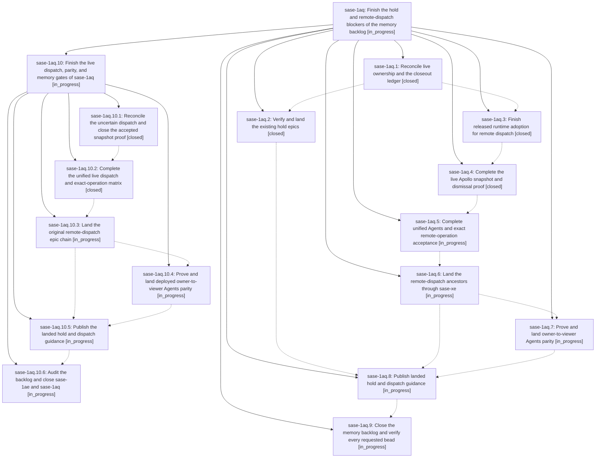

# Bead: sase-1aq — Finish the hold and remote-dispatch blockers of the memory backlog

[Bead Pages](../README.md) / sase-1aq

**Status:** ◐ in_progress · **Type:** ▸ plan · **Tier:** epic
**Owner:** `bryanbugyi34@gmail.com` · **Created by:** `bbugyi200.athena.0sw` · **Assignee:** `sase-1aq.land`
**Created:** 2026-09-26 11:53:24 EDT
**Plan:** [202609/finish\_blocking\_epics\_and\_memory.md](https://github.com/sase-org/sase--plans/blob/main/202609/finish_blocking_epics_and_memory.md)

<!-- sase:links:start -->

## Links

| Relation | Artifact | Why |
| --- | --- | --- |
| implemented-by | [plan:202609/finish_blocking_epics_and_memory.md][1] | derived from the plan's `bead_id:` frontmatter field |

_Plus 1 automatic references — see [Referenced By](#referenced-by)._

[1]: https://github.com/sase-org/sase--plans/blob/main/202609/finish_blocking_epics_and_memory.md

<!-- sase:links:end -->

## Description

Land the existing hold, remote-dispatch, and Agents-parity epics with verified acceptance, publish the two deferred memory updates, and close their descendants and the sase-1ae backlog.

## Phases

| Bead | Title | Status | Size | Created | Agents | Commits |
|---|---|---|---|---|---:|---:|
| [sase-1aq.1](sase-1aq.1.md) | Reconcile live ownership and the closeout ledger | ✓ closed | small | 2026-09-26 | 0 | 0 |
| [sase-1aq.2](sase-1aq.2.md) | Verify and land the existing hold epics | ✓ closed | medium | 2026-09-26 | 0 | 0 |
| [sase-1aq.3](sase-1aq.3.md) | Finish released runtime adoption for remote dispatch | ✓ closed | medium | 2026-09-26 | 0 | 0 |
| [sase-1aq.4](sase-1aq.4.md) | Complete the live Apollo snapshot and dismissal proof | ✓ closed | medium | 2026-09-26 | 0 | 0 |
| [sase-1aq.5](sase-1aq.5.md) | Complete unified Agents and exact remote-operation acceptance | ◐ in_progress | medium | 2026-09-26 | 0 | 0 |
| [sase-1aq.6](sase-1aq.6.md) | Land the remote-dispatch ancestors through sase-xe | ◐ in_progress | medium | 2026-09-26 | 0 | 0 |
| [sase-1aq.7](sase-1aq.7.md) | Prove and land owner-to-viewer Agents parity | ◐ in_progress | medium | 2026-09-26 | 0 | 0 |
| [sase-1aq.8](sase-1aq.8.md) | Publish landed hold and dispatch guidance | ◐ in_progress | medium | 2026-09-26 | 0 | 0 |
| [sase-1aq.9](sase-1aq.9.md) | Close the memory backlog and verify every requested bead | ◐ in_progress | small | 2026-09-26 | 0 | 0 |

## Lineage

## Agents

| Agent | Bead | Commits |
|---|---|---:|
| [bbugyi200.apollo.sase-1aq.10.1](https://github.com/sase-org/sase--agents/blob/main/agents/bbugyi200.apollo.sase-1aq.10.1/README.md) | [sase-1aq.10.1](sase-1aq.10.1.md) | 0 |
| [bbugyi200.apollo.sase-1aq.10.2](https://github.com/sase-org/sase--agents/blob/main/sessions/bbugyi200.apollo.sase-1aq.10.2.md) | [sase-1aq.10.2](sase-1aq.10.2.md) | 1 |
| [bbugyi200.apollo.sase-1aq.10.3](https://github.com/sase-org/sase--agents/blob/main/agents/bbugyi200.apollo.sase-1aq.10.3/README.md) | [sase-1aq.10.3](sase-1aq.10.3.md) | 0 |
| [bbugyi200.apollo.sase-1aq.10.4](https://github.com/sase-org/sase--agents/blob/main/agents/bbugyi200.apollo.sase-1aq.10.4/README.md) | [sase-1aq.10.4](sase-1aq.10.4.md) | 0 |
| [bbugyi200.apollo.sase-1aq.10.5](https://github.com/sase-org/sase--agents/blob/main/agents/bbugyi200.apollo.sase-1aq.10.5/README.md) | [sase-1aq.10.5](sase-1aq.10.5.md) | 0 |
| [bbugyi200.apollo.sase-1aq.10.6](https://github.com/sase-org/sase--agents/blob/main/agents/bbugyi200.apollo.sase-1aq.10.6/README.md) | [sase-1aq.10.6](sase-1aq.10.6.md) | 0 |
| [bbugyi200.apollo.sase-1aq.10.land](https://github.com/sase-org/sase--agents/blob/main/agents/bbugyi200.apollo.sase-1aq.10.land/README.md) | [sase-1aq.10](sase-1aq.10.md) | 0 |

## Commits

| Repo | Commit | Subject | Bead | Committed |
|---|---|---|---|---|
| sase | [`29f8240`](https://github.com/sase-org/sase/commit/29f8240df594e321befb65d0881bbbdd7feff6ee) | fix(mobile-gateway): pass bare sase exe for bridge commands (sase-1aq.10.2) | [sase-1aq.10.2](sase-1aq.10.2.md) | 2026-09-26 18:58:58 EDT |

<!-- sase:referenced-by:start -->

## Referenced By

| Relation | Artifact | Why | Uses |
| --- | --- | --- | ---: |
| read-by | [agent:0sz][1] | Find each epic status, child phase, notes, and blockers for the requested stall report | 1 |

[1]: https://github.com/sase-org/sase--agents/blob/main/agents/bbugyi200.apollo.0sz/README.md

<!-- sase:referenced-by:end -->
