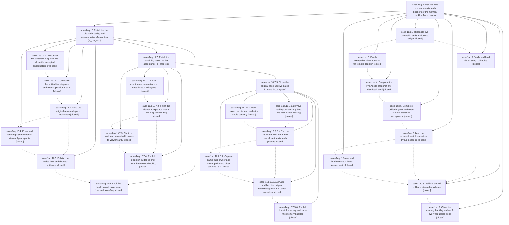

# Bead: sase-1aq — Finish the hold and remote-dispatch blockers of the memory backlog

[Bead Pages](../README.md) / sase-1aq

**Status:** ◐ in_progress · **Type:** ▸ plan · **Tier:** epic
**Owner:** `bryanbugyi34@gmail.com` · **Created by:** `bbugyi200.athena.0sw` · **Assignee:** `sase-1aq.land`
**Created:** 2026-09-26 11:53:24 EDT
**Plan:** [202609/finish\_blocking\_epics\_and\_memory.md](https://github.com/sase-org/sase--plans/blob/main/202609/finish_blocking_epics_and_memory.md)

<!-- sase:links:start -->

## Links

| Relation | Artifact | Why |
| --- | --- | --- |
| implemented-by | [plan:202609/finish_blocking_epics_and_memory.md][1] | derived from the plan's `bead_id:` frontmatter field |

_Plus 1 automatic references — see [Referenced By](#referenced-by)._

[1]: https://github.com/sase-org/sase--plans/blob/main/202609/finish_blocking_epics_and_memory.md

<!-- sase:links:end -->

## Description

Land the existing hold, remote-dispatch, and Agents-parity epics with verified acceptance, publish the two deferred memory updates, and close their descendants and the sase-1ae backlog.

## Phases

| Bead | Title | Status | Size | Created | Agents | Commits |
|---|---|---|---|---|---:|---:|
| [sase-1aq.1](sase-1aq.1.md) | Reconcile live ownership and the closeout ledger | ✓ closed | small | 2026-09-26 | 0 | 0 |
| [sase-1aq.2](sase-1aq.2.md) | Verify and land the existing hold epics | ✓ closed | medium | 2026-09-26 | 0 | 0 |
| [sase-1aq.3](sase-1aq.3.md) | Finish released runtime adoption for remote dispatch | ✓ closed | medium | 2026-09-26 | 0 | 0 |
| [sase-1aq.4](sase-1aq.4.md) | Complete the live Apollo snapshot and dismissal proof | ✓ closed | medium | 2026-09-26 | 0 | 0 |
| [sase-1aq.5](sase-1aq.5.md) | Complete unified Agents and exact remote-operation acceptance | ✓ closed | medium | 2026-09-26 | 0 | 0 |
| [sase-1aq.6](sase-1aq.6.md) | Land the remote-dispatch ancestors through sase-xe | ✓ closed | medium | 2026-09-26 | 0 | 0 |
| [sase-1aq.7](sase-1aq.7.md) | Prove and land owner-to-viewer Agents parity | ✓ closed | medium | 2026-09-26 | 0 | 0 |
| [sase-1aq.8](sase-1aq.8.md) | Publish landed hold and dispatch guidance | ✓ closed | medium | 2026-09-26 | 0 | 0 |
| [sase-1aq.9](sase-1aq.9.md) | Close the memory backlog and verify every requested bead | ✓ closed | small | 2026-09-26 | 0 | 0 |

## Lineage

## Agents

| Agent | Bead | Commits |
|---|---|---:|
| [bbugyi200.apollo.sase-1aq.10.1](https://github.com/sase-org/sase--agents/blob/main/agents/bbugyi200.apollo.sase-1aq.10.1/README.md) | [sase-1aq.10.1](sase-1aq.10.1.md) | 0 |
| [bbugyi200.apollo.sase-1aq.10.2](https://github.com/sase-org/sase--agents/blob/main/sessions/bbugyi200.apollo.sase-1aq.10.2.md) | [sase-1aq.10.2](sase-1aq.10.2.md) | 1 |
| [bbugyi200.apollo.sase-1aq.10.3](https://github.com/sase-org/sase--agents/blob/main/agents/bbugyi200.apollo.sase-1aq.10.3/README.md) | [sase-1aq.10.3](sase-1aq.10.3.md) | 0 |
| [bbugyi200.apollo.sase-1aq.10.4](https://github.com/sase-org/sase--agents/blob/main/agents/bbugyi200.apollo.sase-1aq.10.4/README.md) | [sase-1aq.10.4](sase-1aq.10.4.md) | 0 |
| [bbugyi200.apollo.sase-1aq.10.5](https://github.com/sase-org/sase--agents/blob/main/agents/bbugyi200.apollo.sase-1aq.10.5/README.md) | [sase-1aq.10.5](sase-1aq.10.5.md) | 1 |
| [bbugyi200.apollo.sase-1aq.10.6](https://github.com/sase-org/sase--agents/blob/main/agents/bbugyi200.apollo.sase-1aq.10.6/README.md) | [sase-1aq.10.6](sase-1aq.10.6.md) | 0 |
| [bbugyi200.apollo.sase-1aq.10.7.1](https://github.com/sase-org/sase--agents/blob/main/agents/bbugyi200.apollo.sase-1aq.10.7.1/README.md) | [sase-1aq.10.7.1](sase-1aq.10.7.1.md) | 2 |
| [bbugyi200.apollo.sase-1aq.10.7.2](https://github.com/sase-org/sase--agents/blob/main/agents/bbugyi200.apollo.sase-1aq.10.7.2/README.md) | [sase-1aq.10.7.2](sase-1aq.10.7.2.md) | 1 |
| [bbugyi200.apollo.sase-1aq.10.7.3](https://github.com/sase-org/sase--agents/blob/main/agents/bbugyi200.apollo.sase-1aq.10.7.3/README.md) | [sase-1aq.10.7.3](sase-1aq.10.7.3.md) | 0 |
| [bbugyi200.apollo.sase-1aq.10.7.4](https://github.com/sase-org/sase--agents/blob/main/agents/bbugyi200.apollo.sase-1aq.10.7.4/README.md) | [sase-1aq.10.7.4](sase-1aq.10.7.4.md) | 0 |
| [bbugyi200.apollo.sase-1aq.10.7.5.1](https://github.com/sase-org/sase--agents/blob/main/sessions/bbugyi200.apollo.sase-1aq.10.7.5.1.md) | [sase-1aq.10.7.5.1](sase-1aq.10.7.5.1.md) | 1 |
| [bbugyi200.apollo.sase-1aq.10.7.5.2](https://github.com/sase-org/sase--agents/blob/main/sessions/bbugyi200.apollo.sase-1aq.10.7.5.2.md) | [sase-1aq.10.7.5.2](sase-1aq.10.7.5.2.md) | 2 |
| [bbugyi200.apollo.sase-1aq.10.7.5.3](https://github.com/sase-org/sase--agents/blob/main/agents/bbugyi200.apollo.sase-1aq.10.7.5.3/README.md) | [sase-1aq.10.7.5.3](sase-1aq.10.7.5.3.md) | 0 |
| [bbugyi200.apollo.sase-1aq.10.7.5.4](https://github.com/sase-org/sase--agents/blob/main/agents/bbugyi200.apollo.sase-1aq.10.7.5.4/README.md) | [sase-1aq.10.7.5.4](sase-1aq.10.7.5.4.md) | 0 |
| [bbugyi200.apollo.sase-1aq.10.7.5.5](https://github.com/sase-org/sase--agents/blob/main/agents/bbugyi200.apollo.sase-1aq.10.7.5.5/README.md) | [sase-1aq.10.7.5.5](sase-1aq.10.7.5.5.md) | 1 |
| [bbugyi200.apollo.sase-1aq.10.7.5.6](https://github.com/sase-org/sase--agents/blob/main/agents/bbugyi200.apollo.sase-1aq.10.7.5.6/README.md) | [sase-1aq.10.7.5.6](sase-1aq.10.7.5.6.md) | 1 |
| [bbugyi200.apollo.sase-1aq.10.7.5.land](https://github.com/sase-org/sase--agents/blob/main/agents/bbugyi200.apollo.sase-1aq.10.7.5.land/README.md) | [sase-1aq.10.7.5](sase-1aq.10.7.5.md) | 0 |
| [bbugyi200.apollo.sase-1aq.10.7.land](https://github.com/sase-org/sase--agents/blob/main/sessions/bbugyi200.apollo.sase-1aq.10.7.land.md) | [sase-1aq.10.7](sase-1aq.10.7.md) | 0 |
| [bbugyi200.apollo.sase-1aq.10.land](https://github.com/sase-org/sase--agents/blob/main/sessions/bbugyi200.apollo.sase-1aq.10.land.md) | [sase-1aq.10](sase-1aq.10.md) | 0 |

## Commits

| Repo | Commit | Subject | Bead | Committed |
|---|---|---|---|---|
| sase | [`29f8240`](https://github.com/sase-org/sase/commit/29f8240df594e321befb65d0881bbbdd7feff6ee) | fix(mobile-gateway): pass bare sase exe for bridge commands (sase-1aq.10.2) | [sase-1aq.10.2](sase-1aq.10.2.md) | 2026-09-26 18:58:58 EDT |
| sase | [`e2ce63e`](https://github.com/sase-org/sase/commit/e2ce63eacf6d9813c386c5dfbeda2399c30ded17) | docs(memory): publish hold admission and proc queue guidance plus pull/fail-open decision | [sase-1aq.10.5](sase-1aq.10.5.md) | 2026-09-26 19:40:16 EDT |
| sase | [`fb0b91e`](https://github.com/sase-org/sase/commit/fb0b91edce9b75f1c84002016aa27c83b7a9fafb) | fix(machine): repair exact remote stop/retry lookup for fleet-dispatched agents | [sase-1aq.10.7.1](sase-1aq.10.7.1.md) | 2026-09-26 21:00:24 EDT |
| sase-core | [`sase-core@b2e4ea6`](https://github.com/sase-org/sase-core/commit/b2e4ea6672c47dbf101ad77c0ff8bd9352e4b124) | test(fleet): add catalog and binding terminal-flag coverage | [sase-1aq.10.7.1](sase-1aq.10.7.1.md) | 2026-09-26 21:03:37 EDT |
| sase | [`afca222`](https://github.com/sase-org/sase/commit/afca22227190580a79cb67e88c3b0e5c9e68cb26) | fix(ace-tui): refresh dispatch context line after prompt stack rebuild | [sase-1aq.10.7.2](sase-1aq.10.7.2.md) | 2026-09-26 21:20:52 EDT |
| sase-core | [`sase-core@37a4dd8`](https://github.com/sase-org/sase-core/commit/37a4dd822e4a34ca4d57098ef107cc3b1cd44bad) | test(sase-gateway): prove healthy-beside-hung host and captured-locator fencing | [sase-1aq.10.7.5.1](sase-1aq.10.7.5.1.md) | 2026-09-26 22:38:33 EDT |
| sase | [`700b37b`](https://github.com/sase-org/sase/commit/700b37b3849e84cd775405b7279fdaef2ea8a3ef) | feat(dispatch): settle exact stop and retry receipts certainly | [sase-1aq.10.7.5.2](sase-1aq.10.7.5.2.md) | 2026-09-26 22:54:01 EDT |
| sase-core | [`sase-core@b57cd21`](https://github.com/sase-org/sase-core/commit/b57cd21315a24175dcd1bc866d5a2abe526d9f29) | feat(fleet): settle exact mutate receipts, overlay fresh launches, retain killed rows | [sase-1aq.10.7.5.2](sase-1aq.10.7.5.2.md) | 2026-09-26 22:56:25 EDT |
| sase--plans | [`sase--plans@8ddd920`](https://github.com/sase-org/sase--plans/commit/8ddd920da7f8ff61cb40c214e9dc46ca9b915218) | chore(plans): mark dispatch and parity epic plans done after ancestor landing | [sase-1aq.10.7.5.5](sase-1aq.10.7.5.5.md) | 2026-09-27 00:11:00 EDT |
| sase | [`19abe26`](https://github.com/sase-org/sase/commit/19abe261d428a4a28c9912f0ac5840764342c8af) | docs(memory): publish dispatch reference note and %dispatch directive row | [sase-1aq.10.7.5.6](sase-1aq.10.7.5.6.md) | 2026-09-27 00:49:15 EDT |

<!-- sase:referenced-by:start -->

## Referenced By

| Relation | Artifact | Why | Uses |
| --- | --- | --- | ---: |
| read-by | [agent:0sz][1] | Find each epic status, child phase, notes, and blockers for the requested stall report | 1 |

[1]: https://github.com/sase-org/sase--agents/blob/main/agents/bbugyi200.apollo.0sz/README.md

<!-- sase:referenced-by:end -->
