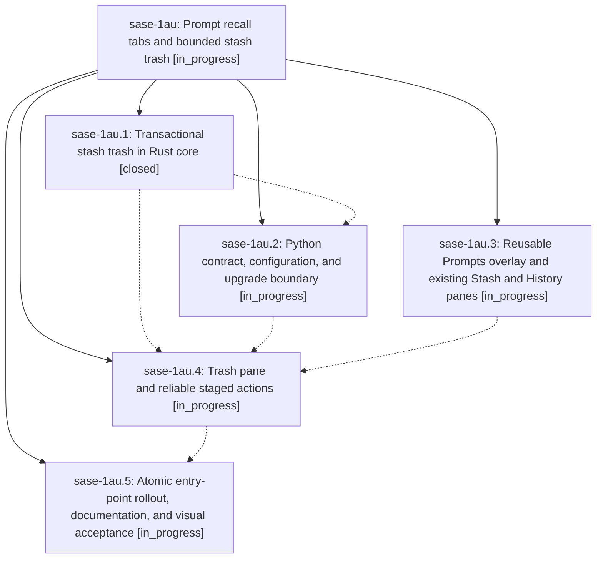

# Bead: sase-1au — Prompt recall tabs and bounded stash trash

[Bead Pages](../README.md) / sase-1au

**Status:** ◐ in_progress · **Type:** ▸ plan · **Tier:** epic
**Owner:** `bryanbugyi34@gmail.com` · **Created by:** [bbugyi200.athena.0sy](https://github.com/sase-org/sase--agents/blob/main/sessions/bbugyi200.athena.0sy.md) · **Assignee:** `sase-1au.land`
**Created:** 2026-09-26 14:44:20 EDT
**Plan:** [202609/prompt\_recall\_tabs\_and\_stash\_trash.md](https://github.com/sase-org/sase--plans/blob/main/202609/prompt_recall_tabs_and_stash_trash.md)

## Description

One reliable Prompts overlay unifies draft recall while bounded, transactional Trash makes deliberate stash discards recoverable.

## Phases

| Bead | Title | Status | Size | Created | Agents | Commits |
|---|---|---|---|---|---:|---:|
| [sase-1au.1](sase-1au.1.md) | Transactional stash trash in Rust core | ✓ closed | medium | 2026-09-26 | 1 | 1 |
| [sase-1au.2](sase-1au.2.md) | Python contract, configuration, and upgrade boundary | ◐ in_progress | medium | 2026-09-26 | 1 | 0 |
| [sase-1au.3](sase-1au.3.md) | Reusable Prompts overlay and existing Stash and History panes | ◐ in_progress | medium | 2026-09-26 | 1 | 0 |
| [sase-1au.4](sase-1au.4.md) | Trash pane and reliable staged actions | ◐ in_progress | medium | 2026-09-26 | 1 | 0 |
| [sase-1au.5](sase-1au.5.md) | Atomic entry-point rollout, documentation, and visual acceptance | ◐ in_progress | medium | 2026-09-26 | 1 | 0 |

## Lineage

## Agents

| Agent | Bead | Commits |
|---|---|---:|
| [bbugyi200.athena.sase-1au.1](https://github.com/sase-org/sase--agents/blob/main/agents/bbugyi200.athena.sase-1au.1/README.md) | [sase-1au.1](sase-1au.1.md) | 1 |
| [bbugyi200.athena.sase-1au.2](https://github.com/sase-org/sase--agents/blob/main/agents/bbugyi200.athena.sase-1au.2/README.md) | [sase-1au.2](sase-1au.2.md) | 0 |
| [bbugyi200.athena.sase-1au.3](https://github.com/sase-org/sase--agents/blob/main/agents/bbugyi200.athena.sase-1au.3/README.md) | [sase-1au.3](sase-1au.3.md) | 0 |
| [bbugyi200.athena.sase-1au.4](https://github.com/sase-org/sase--agents/blob/main/agents/bbugyi200.athena.sase-1au.4/README.md) | [sase-1au.4](sase-1au.4.md) | 0 |
| [bbugyi200.athena.sase-1au.5](https://github.com/sase-org/sase--agents/blob/main/agents/bbugyi200.athena.sase-1au.5/README.md) | [sase-1au.5](sase-1au.5.md) | 0 |
| [bbugyi200.athena.sase-1au.land](https://github.com/sase-org/sase--agents/blob/main/agents/bbugyi200.athena.sase-1au.land/README.md) | [sase-1au](README.md) | 0 |

## Commits

| Repo | Commit | Subject | Bead | Committed |
|---|---|---|---|---|
| sase-core | [`sase-core@e44af7d`](https://github.com/sase-org/sase-core/commit/e44af7d40a6c24b447b258cac831d9ede4262980) | feat(prompt-stash): transactional stash trash lifecycle in Rust core | [sase-1au.1](sase-1au.1.md) | 2026-09-26 15:11:34 EDT |
