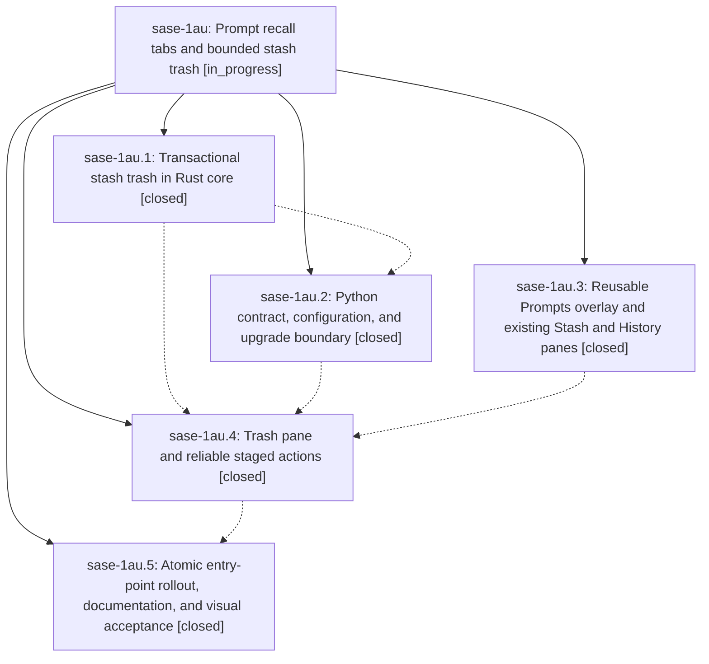

# Bead: sase-1au — Prompt recall tabs and bounded stash trash

[Bead Pages](../README.md) / sase-1au

**Status:** ◐ in_progress · **Type:** ▸ plan · **Tier:** epic
**Owner:** `bryanbugyi34@gmail.com` · **Created by:** [bbugyi200.athena.0sy](https://github.com/sase-org/sase--agents/blob/main/sessions/bbugyi200.athena.0sy.md) · **Assignee:** `sase-1au.land`
**Created:** 2026-09-26 14:44:20 EDT
**Plan:** [202609/prompt\_recall\_tabs\_and\_stash\_trash.md](https://github.com/sase-org/sase--plans/blob/main/202609/prompt_recall_tabs_and_stash_trash.md)

<!-- sase:links:start -->

## Links

| Relation | Artifact | Why |
| --- | --- | --- |
| implemented-by | [plan:202609/prompt_recall_tabs_and_stash_trash.md][1] | derived from the plan's `bead_id:` frontmatter field |

_Plus 1 automatic references — see [Referenced By](#referenced-by)._

[1]: https://github.com/sase-org/sase--plans/blob/main/202609/prompt_recall_tabs_and_stash_trash.md

<!-- sase:links:end -->

## Description

One reliable Prompts overlay unifies draft recall while bounded, transactional Trash makes deliberate stash discards recoverable.

## Phases

| Bead | Title | Status | Size | Created | Agents | Commits |
|---|---|---|---|---|---:|---:|
| [sase-1au.1](sase-1au.1.md) | Transactional stash trash in Rust core | ✓ closed | medium | 2026-09-26 | 1 | 1 |
| [sase-1au.2](sase-1au.2.md) | Python contract, configuration, and upgrade boundary | ✓ closed | medium | 2026-09-26 | 1 | 1 |
| [sase-1au.3](sase-1au.3.md) | Reusable Prompts overlay and existing Stash and History panes | ✓ closed | medium | 2026-09-26 | 1 | 1 |
| [sase-1au.4](sase-1au.4.md) | Trash pane and reliable staged actions | ✓ closed | medium | 2026-09-26 | 1 | 1 |
| [sase-1au.5](sase-1au.5.md) | Atomic entry-point rollout, documentation, and visual acceptance | ✓ closed | medium | 2026-09-26 | 1 | 2 |

## Lineage

```mermaid
flowchart TD
    n0["sase-1au: Prompt recall tabs and bounded stash trash [in_progress]"]
    n1["sase-1au.1: Transactional stash trash in Rust core [closed]"]
    n2["sase-1au.2: Python contract, configuration, and upgrade boundary [closed]"]
    n3["sase-1au.3: Reusable Prompts overlay and existing Stash and History panes [closed]"]
    n4["sase-1au.4: Trash pane and reliable staged actions [closed]"]
    n5["sase-1au.5: Atomic entry-point rollout, documentation, and visual acceptance [closed]"]
    n0 --> n1
    n0 --> n2
    n0 --> n3
    n0 --> n4
    n0 --> n5
    n1 -.-> n2
    n1 -.-> n4
    n2 -.-> n4
    n3 -.-> n4
    n4 -.-> n5
```

## Agents

| Agent | Bead | Commits |
|---|---|---:|
| [bbugyi200.athena.sase-1au.1](https://github.com/sase-org/sase--agents/blob/main/agents/bbugyi200.athena.sase-1au.1/README.md) | [sase-1au.1](sase-1au.1.md) | 1 |
| [bbugyi200.athena.sase-1au.2](https://github.com/sase-org/sase--agents/blob/main/agents/bbugyi200.athena.sase-1au.2/README.md) | [sase-1au.2](sase-1au.2.md) | 1 |
| [bbugyi200.athena.sase-1au.3](https://github.com/sase-org/sase--agents/blob/main/sessions/bbugyi200.athena.sase-1au.3.md) | [sase-1au.3](sase-1au.3.md) | 1 |
| [bbugyi200.athena.sase-1au.4](https://github.com/sase-org/sase--agents/blob/main/sessions/bbugyi200.athena.sase-1au.4.md) | [sase-1au.4](sase-1au.4.md) | 1 |
| [bbugyi200.athena.sase-1au.5](https://github.com/sase-org/sase--agents/blob/main/agents/bbugyi200.athena.sase-1au.5/README.md) | [sase-1au.5](sase-1au.5.md) | 2 |
| [bbugyi200.athena.sase-1au.land](https://github.com/sase-org/sase--agents/blob/main/agents/bbugyi200.athena.sase-1au.land/README.md) | [sase-1au](README.md) | 0 |

## Commits

| Repo | Commit | Subject | Bead | Committed |
|---|---|---|---|---|
| sase-core | [`sase-core@e44af7d`](https://github.com/sase-org/sase-core/commit/e44af7d40a6c24b447b258cac831d9ede4262980) | feat(prompt-stash): transactional stash trash lifecycle in Rust core | [sase-1au.1](sase-1au.1.md) | 2026-09-26 15:11:34 EDT |
| sase | [`e7dc4be`](https://github.com/sase-org/sase/commit/e7dc4be959ecc5f773424673166e3dac5b51d601) | feat(prompt-stash): Python contract, config, and core pin for stash trash (sase-1au.2) | [sase-1au.2](sase-1au.2.md) | 2026-09-26 16:14:01 EDT |
| sase | [`7b209fc`](https://github.com/sase-org/sase/commit/7b209fc9d176eaa375b0193e1f766c21ce789b76) | feat(ace-tui): lazy tabbed PromptsModal with preserved Stash and History behavior | [sase-1au.3](sase-1au.3.md) | 2026-09-26 16:32:51 EDT |
| sase | [`4e7262d`](https://github.com/sase-org/sase/commit/4e7262d6750c337cb4ea532ff964309692829a87) | feat(ace-tui): Trash pane and reliable staged stash actions (sase-1au.4) | [sase-1au.4](sase-1au.4.md) | 2026-09-26 17:03:53 EDT |
| sase | [`ade28c1`](https://github.com/sase-org/sase/commit/ade28c173a85e3bf520bb0947e1fb27e2ad3ba9b) | feat(ace): route all prompt entry points through Prompts overlay | [sase-1au.5](sase-1au.5.md) | 2026-09-26 19:06:21 EDT |
| sase | [`899bdba`](https://github.com/sase-org/sase/commit/899bdba6441eeaf7f27a303209b9d19a5d1ed89f) | feat(ace): route all prompt entry points through Prompts overlay | [sase-1au.5](sase-1au.5.md) | 2026-09-26 19:46:58 EDT |

<!-- sase:referenced-by:start -->

## Referenced By

| Relation | Artifact | Why | Uses |
| --- | --- | --- | ---: |
| read-by | [agent:sase-1au.5][1] | Need parent epic scope for phase 5 | 1 |

[1]: https://github.com/sase-org/sase--agents/blob/main/agents/bbugyi200.athena.sase-1au.5/README.md

<!-- sase:referenced-by:end -->
