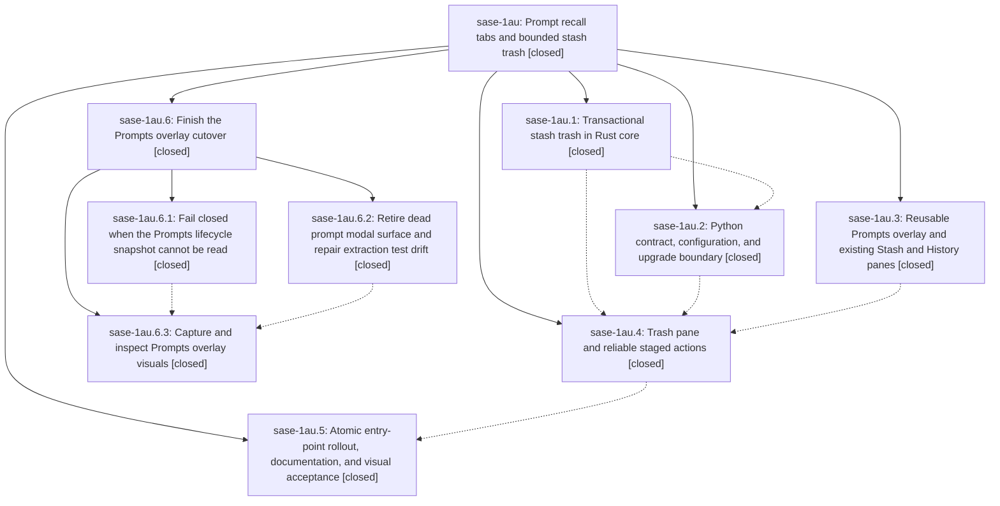

# Bead: sase-1au — Prompt recall tabs and bounded stash trash

[Bead Pages](../README.md) / sase-1au

**Status:** ✓ closed · **Resolution:** done · **Type:** ▸ plan · **Tier:** epic
**Owner:** `bryanbugyi34@gmail.com` · **Created by:** [bbugyi200.athena.0sy](https://github.com/sase-org/sase--agents/blob/main/sessions/bbugyi200.athena.0sy.md) · **Assignee:** `sase-1au.land`
**Created:** 2026-09-26 14:44:20 EDT · **Closed:** 2026-09-26 21:57:48 EDT
**Plan:** [202609/prompt\_recall\_tabs\_and\_stash\_trash.md](https://github.com/sase-org/sase--plans/blob/main/202609/prompt_recall_tabs_and_stash_trash.md)

<!-- sase:links:start -->

## Links

| Relation | Artifact | Why |
| --- | --- | --- |
| implemented-by | [plan:202609/prompt_recall_tabs_and_stash_trash.md][1] | derived from the plan's `bead_id:` frontmatter field |

_Plus 1 automatic references — see [Referenced By](#referenced-by)._

[1]: https://github.com/sase-org/sase--plans/blob/main/202609/prompt_recall_tabs_and_stash_trash.md

<!-- sase:links:end -->

## Description

One reliable Prompts overlay unifies draft recall while bounded, transactional Trash makes deliberate stash discards recoverable.

## Notes

[2026-09-26T23:59:34Z · sase-1au.land] LAND AUDIT pending nested remainder: all five original phases closed; Rust core e44af7d contains tagged transactional trash/restore/purge/reconcile, backup and binding tests, and sase commits e7dc4be95, 7b209fc9d, 4e7262d67, ade28c173, 899bdba64 contain Python wires/config/pin, reusable panes, Trash actions, and entry-point routing. Post-first-stitch commits touching adjacent areas (acbd5999a clan neighbors, e95241543 scrollbar helper, 74c89a638 memory regen) do not require prompt caller integration. Remaining epic-caused gaps: _read_prompt_stash_overlay_snapshot catches every lifecycle-read error and presents active-only Trash as empty, contrary to fail-closed/read and stale-wheel contract; test_residual_freeze_soak patches prompt_history_modal.load_prompt_record_page, removed by phase .3 extraction (present at 7b209^); just symvision reports unused PromptHistoryModal, TrashCommitPreview, sort_trash_records, stash_empty_text, trash_empty_text from the cutover; visual suite still captures only standalone StashedPromptsModal and has no PromptsModal/Trash golden, leaving phase .4 #1 visual request unfinished. These will be handled in a nested plan. Follow-up triage: .2 #1/#2, .3 #3, .4 #2 and .5 #1 legacy private-import / scrollbar findings are fixed by acbd5999a/899bdba64/e95241543; .2 #3 and .5 #1 proc lifecycle test still fails and is recorded on active rename epic sase-1ab note #9; .3 #1 two history tests now pass; .3 #2 is epic-caused soak drift above, not a separate task; .3 #5 and .4 #2 memory --check now pass after 74c89a638; .4 #1 action wiring is complete in ade28c173, visual portion is nested work. No distinct unrelated unowned task remains. No sase-1au epic-symbol entries.

[2026-09-27T01:57:48Z · sase-1au.6.land] Rechecked after sase-1au.6 closed. All five original phases and the nested remainder epic are closed. The prior landing note's four epic-caused gaps are fixed in source: lifecycle overlay reads fail closed with no active-only fallback, the residual freeze soak drives history_pane through PromptsModal, PromptHistoryModal and the four cutover helpers are deleted or private, and the wide/narrow Stash and Trash goldens are present and match the populated and empty states. No --epic-symbol entries for sase-1au. Commits since the remainder epic started do not need a further overlay caller: the dispatch-context refresh already runs on the stash and history rebuild path, and the named-proc export rename left the modal retirement intact. Earlier phase follow-ups stay as the prior landing note triaged them (rename residuals on sase-1ab, fixed private imports, history tests and memory check already green, soak and visuals completed by sase-1au.6). New mypy residuals from the remainder landing were recorded on sase-1ab and sase-19i.7.3.3.3.3, not left on this epic. Linked plan phases match the closed children.

## Phases

| Bead | Title | Status | Size | Created | Agents | Commits |
|---|---|---|---|---|---:|---:|
| [sase-1au.1](sase-1au.1.md) | Transactional stash trash in Rust core | ✓ closed | medium | 2026-09-26 | 1 | 1 |
| [sase-1au.2](sase-1au.2.md) | Python contract, configuration, and upgrade boundary | ✓ closed | medium | 2026-09-26 | 1 | 1 |
| [sase-1au.3](sase-1au.3.md) | Reusable Prompts overlay and existing Stash and History panes | ✓ closed | medium | 2026-09-26 | 1 | 1 |
| [sase-1au.4](sase-1au.4.md) | Trash pane and reliable staged actions | ✓ closed | medium | 2026-09-26 | 1 | 1 |
| [sase-1au.5](sase-1au.5.md) | Atomic entry-point rollout, documentation, and visual acceptance | ✓ closed | medium | 2026-09-26 | 1 | 2 |

## Lineage

```mermaid
flowchart TD
    n0["sase-1au: Prompt recall tabs and bounded stash trash [closed]"]
    n1["sase-1au.1: Transactional stash trash in Rust core [closed]"]
    n2["sase-1au.2: Python contract, configuration, and upgrade boundary [closed]"]
    n3["sase-1au.3: Reusable Prompts overlay and existing Stash and History panes [closed]"]
    n4["sase-1au.4: Trash pane and reliable staged actions [closed]"]
    n5["sase-1au.5: Atomic entry-point rollout, documentation, and visual acceptance [closed]"]
    n6["sase-1au.6: Finish the Prompts overlay cutover [closed]"]
    n7["sase-1au.6.1: Fail closed when the Prompts lifecycle snapshot cannot be read [closed]"]
    n8["sase-1au.6.2: Retire dead prompt modal surface and repair extraction test drift [closed]"]
    n9["sase-1au.6.3: Capture and inspect Prompts overlay visuals [closed]"]
    n0 --> n1
    n0 --> n2
    n0 --> n3
    n0 --> n4
    n0 --> n5
    n0 --> n6
    n6 --> n7
    n6 --> n8
    n6 --> n9
    n1 -.-> n2
    n1 -.-> n4
    n2 -.-> n4
    n3 -.-> n4
    n4 -.-> n5
    n7 -.-> n9
    n8 -.-> n9
```

## Agents

| Agent | Bead | Commits |
|---|---|---:|
| [bbugyi200.athena.sase-1au.1](https://github.com/sase-org/sase--agents/blob/main/agents/bbugyi200.athena.sase-1au.1/README.md) | [sase-1au.1](sase-1au.1.md) | 1 |
| [bbugyi200.athena.sase-1au.2](https://github.com/sase-org/sase--agents/blob/main/agents/bbugyi200.athena.sase-1au.2/README.md) | [sase-1au.2](sase-1au.2.md) | 1 |
| [bbugyi200.athena.sase-1au.3](https://github.com/sase-org/sase--agents/blob/main/sessions/bbugyi200.athena.sase-1au.3.md) | [sase-1au.3](sase-1au.3.md) | 1 |
| [bbugyi200.athena.sase-1au.4](https://github.com/sase-org/sase--agents/blob/main/sessions/bbugyi200.athena.sase-1au.4.md) | [sase-1au.4](sase-1au.4.md) | 1 |
| [bbugyi200.athena.sase-1au.5](https://github.com/sase-org/sase--agents/blob/main/agents/bbugyi200.athena.sase-1au.5/README.md) | [sase-1au.5](sase-1au.5.md) | 2 |
| [bbugyi200.athena.sase-1au.6.1](https://github.com/sase-org/sase--agents/blob/main/sessions/bbugyi200.athena.sase-1au.6.1.md) | [sase-1au.6.1](sase-1au.6.1.md) | 1 |
| [bbugyi200.athena.sase-1au.6.2](https://github.com/sase-org/sase--agents/blob/main/sessions/bbugyi200.athena.sase-1au.6.2.md) | [sase-1au.6.2](sase-1au.6.2.md) | 1 |
| [bbugyi200.athena.sase-1au.6.3](https://github.com/sase-org/sase--agents/blob/main/sessions/bbugyi200.athena.sase-1au.6.3.md) | [sase-1au.6.3](sase-1au.6.3.md) | 1 |
| [bbugyi200.athena.sase-1au.6.land](https://github.com/sase-org/sase--agents/blob/main/agents/bbugyi200.athena.sase-1au.6.land/README.md) | [sase-1au.6](sase-1au.6.md) | 1 |
| [bbugyi200.athena.sase-1au.land](https://github.com/sase-org/sase--agents/blob/main/sessions/bbugyi200.athena.sase-1au.land.md) | [sase-1au](README.md) | 0 |

## Commits

| Repo | Commit | Subject | Bead | Committed |
|---|---|---|---|---|
| sase-core | [`sase-core@e44af7d`](https://github.com/sase-org/sase-core/commit/e44af7d40a6c24b447b258cac831d9ede4262980) | feat(prompt-stash): transactional stash trash lifecycle in Rust core | [sase-1au.1](sase-1au.1.md) | 2026-09-26 15:11:34 EDT |
| sase | [`e7dc4be`](https://github.com/sase-org/sase/commit/e7dc4be959ecc5f773424673166e3dac5b51d601) | feat(prompt-stash): Python contract, config, and core pin for stash trash (sase-1au.2) | [sase-1au.2](sase-1au.2.md) | 2026-09-26 16:14:01 EDT |
| sase | [`7b209fc`](https://github.com/sase-org/sase/commit/7b209fc9d176eaa375b0193e1f766c21ce789b76) | feat(ace-tui): lazy tabbed PromptsModal with preserved Stash and History behavior | [sase-1au.3](sase-1au.3.md) | 2026-09-26 16:32:51 EDT |
| sase | [`4e7262d`](https://github.com/sase-org/sase/commit/4e7262d6750c337cb4ea532ff964309692829a87) | feat(ace-tui): Trash pane and reliable staged stash actions (sase-1au.4) | [sase-1au.4](sase-1au.4.md) | 2026-09-26 17:03:53 EDT |
| sase | [`ade28c1`](https://github.com/sase-org/sase/commit/ade28c173a85e3bf520bb0947e1fb27e2ad3ba9b) | feat(ace): route all prompt entry points through Prompts overlay | [sase-1au.5](sase-1au.5.md) | 2026-09-26 19:06:21 EDT |
| sase | [`899bdba`](https://github.com/sase-org/sase/commit/899bdba6441eeaf7f27a303209b9d19a5d1ed89f) | feat(ace): route all prompt entry points through Prompts overlay | [sase-1au.5](sase-1au.5.md) | 2026-09-26 19:46:58 EDT |
| sase | [`7e54203`](https://github.com/sase-org/sase/commit/7e54203ba044ae262ffea9ca4670a6a2bb898a3c) | fix(ace-tui): make prompt-bar stash restore fail-closed on snapshot read | [sase-1au.6.1](sase-1au.6.1.md) | 2026-09-26 20:23:36 EDT |
| sase | [`cdcc882`](https://github.com/sase-org/sase/commit/cdcc88251ff4ebb24d409055d590eb03b0fdf626) | feat(ace): retire dead prompt modal surface and repair soak extraction (sase-1au.6.2) | [sase-1au.6.2](sase-1au.6.2.md) | 2026-09-26 20:50:21 EDT |
| sase | [`b9f5306`](https://github.com/sase-org/sase/commit/b9f53067b11a8223fbba1829b2add87ebee5b2c6) | feat(ace): add Prompts overlay PNG snapshots for Stash and Trash | [sase-1au.6.3](sase-1au.6.3.md) | 2026-09-26 21:38:21 EDT |
| sase--plans | [`sase--plans@37cfff4`](https://github.com/sase-org/sase--plans/commit/37cfff4b55df6e8b3de0fd7bf461b848fd9e3ab4) | docs(plans): mark the prompt-recall plans done | [sase-1au.6](sase-1au.6.md) | 2026-09-26 22:00:30 EDT |

<!-- sase:referenced-by:start -->

## Referenced By

| Relation | Artifact | Why | Uses |
| --- | --- | --- | ---: |
| read-by | [agent:sase-1au.5][1] | Need parent epic scope for phase 5 | 1 |

[1]: https://github.com/sase-org/sase--agents/blob/main/agents/bbugyi200.athena.sase-1au.5/README.md

<!-- sase:referenced-by:end -->
