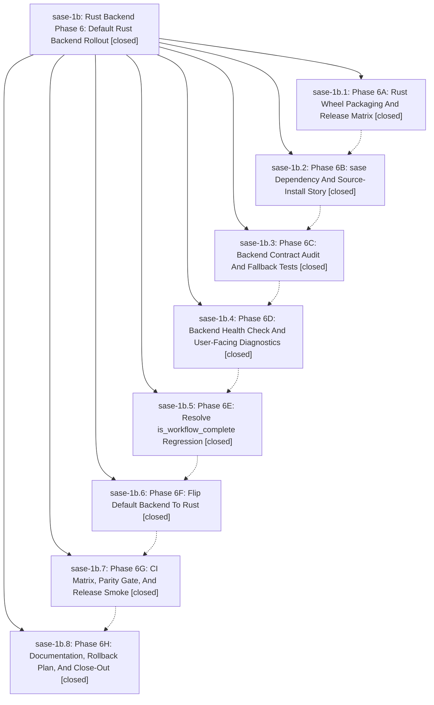

# Bead: sase-1b — Rust Backend Phase 6: Default Rust Backend Rollout

[Bead Pages](../README.md) / sase-1b

**Status:** ✓ closed · **Resolution:** (unrecorded) · **Type:** plan · **Tier:** epic
**Owner:** `bryanbugyi34@gmail.com`
**Created:** 2026-04-29 20:03:43 UTC · **Closed:** 2026-04-29 21:46:07 UTC
**Plan:** [202604/rust\_backend\_phase6\_default\_rust.md](https://github.com/sase-org/sase--plans/blob/main/202604/rust_backend_phase6_default_rust.md)

## Phases

| Bead | Title | Status | Size | Agents | Commits |
|---|---|---|---|---:|---:|
| [sase-1b.1](sase-1b.1.md) | Phase 6A: Rust Wheel Packaging And Release Matrix | ✓ closed | small | 0 | 1 |
| [sase-1b.2](sase-1b.2.md) | Phase 6B: sase Dependency And Source-Install Story | ✓ closed | small | 0 | 1 |
| [sase-1b.3](sase-1b.3.md) | Phase 6C: Backend Contract Audit And Fallback Tests | ✓ closed | small | 0 | 1 |
| [sase-1b.4](sase-1b.4.md) | Phase 6D: Backend Health Check And User-Facing Diagnostics | ✓ closed | small | 0 | 1 |
| [sase-1b.5](sase-1b.5.md) | Phase 6E: Resolve is\_workflow\_complete Regression | ✓ closed | small | 0 | 1 |
| [sase-1b.6](sase-1b.6.md) | Phase 6F: Flip Default Backend To Rust | ✓ closed | small | 0 | 1 |
| [sase-1b.7](sase-1b.7.md) | Phase 6G: CI Matrix, Parity Gate, And Release Smoke | ✓ closed | small | 0 | 1 |
| [sase-1b.8](sase-1b.8.md) | Phase 6H: Documentation, Rollback Plan, And Close-Out | ✓ closed | small | 0 | 1 |

## Lineage

## Commits

| Commit | Subject | Bead | Committed (UTC) |
|---|---|---|---|
| [`4f48f7b`](https://github.com/sase-org/sase/commit/4f48f7bbd73148d16d658947786eb4750d0a20d6) | chore: Phase 6A — sase\_core\_rs wheel packaging and release matrix (sase-1b.1) | [sase-1b.1](sase-1b.1.md) | 2026-04-29 20:17:04 |
| [`2d7cf60`](https://github.com/sase-org/sase/commit/2d7cf60d78c82ca32eae4eb6ccff0d159795af11) | chore: Phase 6B — sase dependency and source-install story (sase-1b.2) | [sase-1b.2](sase-1b.2.md) | 2026-04-29 20:29:44 |
| [`5a98bf7`](https://github.com/sase-org/sase/commit/5a98bf7707032e96fc8ffb01a951f2ffba7c4133) | chore: Phase 6C — backend contract audit and fallback tests (sase-1b.3) | [sase-1b.3](sase-1b.3.md) | 2026-04-29 20:38:18 |
| [`c3ac7d8`](https://github.com/sase-org/sase/commit/c3ac7d83b64a24c65858a4e9fb9384c95b7604d9) | chore: Phase 6D — backend health check and user-facing diagnostics (sase-1b.4) | [sase-1b.4](sase-1b.4.md) | 2026-04-29 20:47:22 |
| [`7cdbfc9`](https://github.com/sase-org/sase/commit/7cdbfc92104017097534c4f5c86ec2d3023d7198) | chore: Phase 6E — resolve is\_workflow\_complete regression (sase-1b.5) | [sase-1b.5](sase-1b.5.md) | 2026-04-29 21:00:08 |
| [`c27c074`](https://github.com/sase-org/sase/commit/c27c07424c32e2a44c39a1a7656e66ec1f78536b) | chore: Phase 6F — flip default core backend to Rust (sase-1b.6) | [sase-1b.6](sase-1b.6.md) | 2026-04-29 21:20:09 |
| [`241d945`](https://github.com/sase-org/sase/commit/241d945a2f6c3bdc189d51626d10d264c9df6509) | chore: Phase 6G — CI matrix, parity gate, and release smoke (sase-1b.7) | [sase-1b.7](sase-1b.7.md) | 2026-04-29 21:31:16 |
| [`6dcc201`](https://github.com/sase-org/sase/commit/6dcc201bb0fb8d2dfc74308303e1885319ed0317) | chore: Phase 6H — documentation, rollback plan, and close-out (sase-1b.8) | [sase-1b.8](sase-1b.8.md) | 2026-04-29 21:43:26 |
