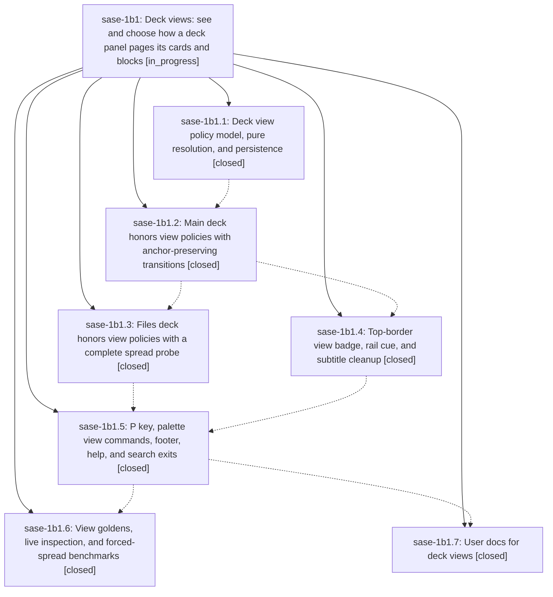

# Bead: sase-1b1 — Deck views: see and choose how a deck panel pages its cards and blocks

[Bead Pages](../README.md) / sase-1b1

**Status:** ◐ in_progress · **Type:** ▸ plan · **Tier:** epic
**Owner:** `bryanbugyi34@gmail.com` · **Created by:** [bbugyi200.athena.0sx](https://github.com/sase-org/sase--agents/blob/main/sessions/bbugyi200.athena.0sx.md) · **Assignee:** `sase-1b1.land`
**Created:** 2026-09-27 05:45:14 EDT
**Plan:** [202609/deck\_views.md](https://github.com/sase-org/sase--plans/blob/main/202609/deck_views.md)

<!-- sase:links:start -->

## Links

| Relation | Artifact | Why |
| --- | --- | --- |
| implemented-by | [plan:202609/deck_views.md][1] | derived from the plan's `bead_id:` frontmatter field |

_Plus 1 automatic references — see [Referenced By](#referenced-by)._

[1]: https://github.com/sase-org/sase--plans/blob/main/202609/deck_views.md

<!-- sase:links:end -->

## Description

Every Main and Files deck panel names its effective view (spread, page cards, or page blocks) and whether it is automatic or fixed, in a stable, text-first badge in the top border. `P` cycles the focused panel through the valid views without losing the reader's place. Palette commands pick a view directly or return to automatic. Choices persist per panel and per deck across agents, splits, zoom, and restarts.

## Notes

[2026-09-27T10:06:58Z · 0t2] CROSS-EPIC COORDINATION with sase-1b2 (the FINAL deck, plan:202609/agents_tab_final_deck.md). The two epics run concurrently and edit the same deck-panel code, and neither plan mentions the other.
Overlap map:
- 1b1.1 <-> 1b2.10 (+1b2.9): DeckPanelState, with_* helpers, deck-state persistence.
- 1b1.2/1b1.3 <-> 1b2.11: deciders, block host, transitions (CardDocumentView extraction).
- 1b1.4 <-> 1b2.9/1b2.11/1b2.14: titles, subtitle, panel chrome, rail.
- 1b1.5 <-> 1b2.9/1b2.14: palette, footer, help, deck-set tests.
- 1b1.6 <-> 1b2.19: goldens and bench.
- 1b1.7 <-> 1b2.20: docs.
Likely order: 1b1's chain finishes before 1b2.14+, which wait on sase-core work. The live races are therefore 1b1.1 vs 1b2.9/1b2.10 and 1b1.2-1b1.4 vs 1b2.11. Each affected phase bead carries specific instructions.

SHARED RULES (the same list is on both sase-1b1 and sase-1b2; these are defaults the user may override):
R1 Scope: deck views stay Main+Files only. FINAL, like Tools, is permanently AUTO: no title badge; `P` and the "Deck view: ..." palette commands are unavailable; no `final` key in persisted `views`. Its spread/paged and block modes stay automatic. The epic that lands second records `PROPOSED FOLLOW-UP: extend deck views (policy, badge, P) to the FINAL deck`.
R2 Explicit dispatch: view code tests `deck is DeckId.MAIN` / `deck in (MAIN, FILES)`, never "not Tools" or an else fall-through (1b2.9's rule). `DeckViewPolicies.for_deck()` returns AUTO, and `with_deck()` rejects every deck other than Main/Files.
R3 State: `DeckPanelState` carries both `views` (1b1.1) and the per-deck preferred-card mapping (1b2.10). `with_panel_deck`, `with_preferred_card`, `with_panel_view`, `layout.new_panel_for_deck`/`choose_new_panel` and `area_state_from_snapshot` build panels with `dataclasses.replace` or keyword args, never positionally. Deck switches keep both fields; new panels start AUTO.
R4 Persistence: both are additive optional panel fields, and `SCHEMA_VERSION` stays 1. Target entry: `{"deck", "preferred_card", "preferred_cards": {...}, "views": {"main", "files"}}`. Each decoder ignores the other's key. Round-trip and legacy tests cover an entry carrying both. A `final` panel decoded to Main (flag off) keeps its `views`.
R5 Engine: after 1b2.11, 1b1's `forced_deck_mode`/`forced_block_mode` early returns live in the generalized deciders (`_decide_document_mode(deck)` and the generic block decider) and read `view_policy(deck)`, which is AUTO for FINAL. 1b1's view-change path (`_apply_main_view_change`, generation counter, pending anchor, spread-target restore) stays Main-only on top of the generic host accessors.
R6 Chrome: the badge appears for Main/Files only. FINAL keeps tab-only title rungs and, with more than 4 tabs, skips the full rungs like Files. `deck_subtitle()` drops `spread` (1b1.4) and gains FINAL's styled `final <glyph>` segment (1b2.14); the two changes are compatible. The rail cue (`page N/M` / `all N`) derives from the host's actual block mode, so FINAL's run-block rail shows it too.
R7 Goldens: 1b2's rule that pre-cutover goldens stay pixel-identical means identical to the master you rebased on, which may already carry 1b1's badge goldens and `agents_deck_view_*`. 1b1 goldens use `ace_final_deck` at its default (off). 1b2.19 re-baselines and inspects every golden its flag removal changes, 1b1's included.
R8 Keys, palette, help, footer: app-level `P` and the picker's `n`/`N` do not collide. Merge help rows, palette commands, footer kwargs and tests with hard-coded deck sets or command counts additively.
R9 Docs: whichever docs phase lands second states the interaction (views are Main/Files only; FINAL always pages automatically, has no badge, and `P` does not apply there) and keeps the two glossary follow-ups consistent (a "Deck View" strand; agent-data-deck lists FINAL).

LAND AGENT: on master, confirm that DeckPanelState keeps `views` and any per-deck preferred cards; that view code dispatches explicitly on Main/Files; that the forced-policy returns and the view-change path survived 1b2.11 if it landed first; and that every 1b1 pilot passes. If 1b2 had already registered FINAL, confirm it shows no badge and `P` is unavailable there, then triage the R1 follow-up.

## Phases

| Bead | Title | Status | Size | Created | Agents | Commits |
|---|---|---|---|---|---:|---:|
| [sase-1b1.1](sase-1b1.1.md) | Deck view policy model, pure resolution, and persistence | ✓ closed | medium | 2026-09-27 | 1 | 1 |
| [sase-1b1.2](sase-1b1.2.md) | Main deck honors view policies with anchor-preserving transitions | ✓ closed | medium | 2026-09-27 | 1 | 1 |
| [sase-1b1.3](sase-1b1.3.md) | Files deck honors view policies with a complete spread probe | ✓ closed | medium | 2026-09-27 | 1 | 1 |
| [sase-1b1.4](sase-1b1.4.md) | Top-border view badge, rail cue, and subtitle cleanup | ✓ closed | medium | 2026-09-27 | 1 | 1 |
| [sase-1b1.5](sase-1b1.5.md) | P key, palette view commands, footer, help, and search exits | ✓ closed | medium | 2026-09-27 | 1 | 1 |
| [sase-1b1.6](sase-1b1.6.md) | View goldens, live inspection, and forced-spread benchmarks | ✓ closed | medium | 2026-09-27 | 1 | 1 |
| [sase-1b1.7](sase-1b1.7.md) | User docs for deck views | ✓ closed | small | 2026-09-27 | 1 | 1 |

## Lineage

## Agents

| Agent | Bead | Commits |
|---|---|---:|
| [bbugyi200.athena.sase-1b1.1](https://github.com/sase-org/sase--agents/blob/main/sessions/bbugyi200.athena.sase-1b1.1.md) | [sase-1b1.1](sase-1b1.1.md) | 1 |
| [bbugyi200.athena.sase-1b1.2](https://github.com/sase-org/sase--agents/blob/main/sessions/bbugyi200.athena.sase-1b1.2.md) | [sase-1b1.2](sase-1b1.2.md) | 1 |
| [bbugyi200.athena.sase-1b1.3](https://github.com/sase-org/sase--agents/blob/main/sessions/bbugyi200.athena.sase-1b1.3.md) | [sase-1b1.3](sase-1b1.3.md) | 1 |
| [bbugyi200.athena.sase-1b1.4](https://github.com/sase-org/sase--agents/blob/main/agents/bbugyi200.athena.sase-1b1.4/README.md) | [sase-1b1.4](sase-1b1.4.md) | 1 |
| [bbugyi200.athena.sase-1b1.5](https://github.com/sase-org/sase--agents/blob/main/sessions/bbugyi200.athena.sase-1b1.5.md) | [sase-1b1.5](sase-1b1.5.md) | 1 |
| [bbugyi200.athena.sase-1b1.6](https://github.com/sase-org/sase--agents/blob/main/sessions/bbugyi200.athena.sase-1b1.6.md) | [sase-1b1.6](sase-1b1.6.md) | 1 |
| [bbugyi200.athena.sase-1b1.7](https://github.com/sase-org/sase--agents/blob/main/sessions/bbugyi200.athena.sase-1b1.7.md) | [sase-1b1.7](sase-1b1.7.md) | 1 |

## Commits

| Repo | Commit | Subject | Bead | Committed |
|---|---|---|---|---|
| sase | [`9c4d104`](https://github.com/sase-org/sase/commit/9c4d104aff897a02257562a0d3f09fae940c2f5b) | feat(ace-tui): add deck view policy model, pure resolution, and persistence | [sase-1b1.1](sase-1b1.1.md) | 2026-09-27 06:36:19 EDT |
| sase | [`12ae301`](https://github.com/sase-org/sase/commit/12ae3014b97f36e2463e9b11b0101ffcdf52ea5e) | feat(deck-views): main deck honors view policies with anchor-preserving transitions | [sase-1b1.2](sase-1b1.2.md) | 2026-09-27 08:30:32 EDT |
| sase | [`cb1b577`](https://github.com/sase-org/sase/commit/cb1b5775a001c0c8c31aba1cc70d02539e3adba2) | fix(deck-views): declare \_files\_probe\_complete on DeckPanelFilesMixin | [sase-1b1.3](sase-1b1.3.md) | 2026-09-27 08:30:32 EDT |
| sase | [`e75fa98`](https://github.com/sase-org/sase/commit/e75fa98d7b6e9b58e56e7b47f380d10c336bf9dd) | feat(decks): title badge ladder, chrome hold, and block rail cue | [sase-1b1.4](sase-1b1.4.md) | 2026-09-27 10:33:44 EDT |
| sase | [`a5e2a34`](https://github.com/sase-org/sase/commit/a5e2a34dab6b15b1e7c34296fefc637a6410bc69) | feat(deck-views): P cycle, palette view commands, footer/help/search (sase-1b1.5) | [sase-1b1.5](sase-1b1.5.md) | 2026-09-27 11:36:27 EDT |
| sase | [`c6d68d8`](https://github.com/sase-org/sase/commit/c6d68d861ec77d490d160aa859b31fc689614858) | docs(deck-views): document deck views, P cycle, palette, persistence (sase-1b1.7) | [sase-1b1.7](sase-1b1.7.md) | 2026-09-27 12:59:46 EDT |
| sase | [`5cafbcb`](https://github.com/sase-org/sase/commit/5cafbcb53f1b6b9c300cc29c25136eee95abc8d7) | feat(deck-views): verify badges, goldens, and forced-spread benchmarks (sase-1b1.6) | [sase-1b1.6](sase-1b1.6.md) | 2026-09-27 13:10:23 EDT |

<!-- sase:referenced-by:start -->

## Referenced By

| Relation | Artifact | Why | Uses |
| --- | --- | --- | ---: |
| read-by | [agent:1c.r0][1] | Reviewing the sase-1b1 epic to write a value-added research report | 1 |

[1]: https://github.com/sase-org/sase--agents/blob/main/agents/bbugyi200.athena.1c.r0/README.md

<!-- sase:referenced-by:end -->
