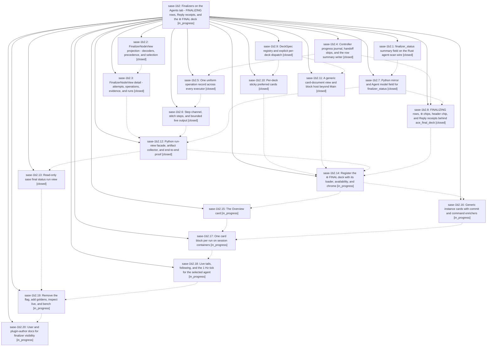

# Bead: sase-1b2 — Finalizers on the Agents tab - FINALIZING rows, Reply receipts, and the ⊛ FINAL deck

[Bead Pages](../README.md) / sase-1b2

**Status:** ◐ in_progress · **Type:** ▸ plan · **Tier:** epic
**Owner:** `bryanbugyi34@gmail.com` · **Created by:** [bbugyi200.athena.0sr](https://github.com/sase-org/sase--agents/blob/main/sessions/bbugyi200.athena.0sr.md) · **Assignee:** `sase-1b2.land`
**Created:** 2026-09-27 05:49:28 EDT
**Plan:** [202609/agents\_tab\_final\_deck.md](https://github.com/sase-org/sase--plans/blob/main/202609/agents_tab_final_deck.md)

<!-- sase:links:start -->

## Links

| Relation | Artifact | Why |
| --- | --- | --- |
| implemented-by | [plan:202609/agents_tab_final_deck.md][1] | derived from the plan's `bead_id:` frontmatter field |

_Plus 4 automatic references — see [Referenced By](#referenced-by)._

[1]: https://github.com/sase-org/sase--plans/blob/main/202609/agents_tab_final_deck.md

<!-- sase:links:end -->

## Description

Sase finalizers become first-class on the Agents tab at four zoom levels over one provider-neutral data layer. At a glance, rows show a FINALIZING phase and a ⊛ chip while finalizers run or after a non-success. In context, each shell's Reply phase ends with a short ⊛ FINAL receipt. To diagnose, a new ⊛ FINAL deck has an Overview card plus one card per finalizer instance and one card block per run, with attempts, operations, steps, typed evidence, diagnostics and gated live tails. For authors, the Overview and a read-only `sase final status` run view explain selection, declarations and drift. A controller progress journal (which also records handoff skips), uniform operation records, a step channel, bounded live logs, an agent_meta summary, and one Rust-core projection feed every surface. Nothing in the model is commit-specific, so future finalizers render well on day one.

## Notes

[2026-09-27T10:07:10Z · 0t2] CROSS-EPIC COORDINATION with sase-1b1 (deck views: badge, `P`, per-panel view policies, plan:202609/deck_views.md). The two epics run concurrently and edit the same deck-panel code, and neither plan mentions the other.
Overlap map:
- 1b2.9/1b2.10 <-> 1b1.1: DeckPanelState, with_* helpers, deck-state persistence.
- 1b2.11 <-> 1b1.2/1b1.3/1b1.4: deciders, block host, transitions, rail.
- 1b2.9/1b2.14 <-> 1b1.4/1b1.5: titles, subtitle, panel chrome, palette, footer, help, deck-set tests.
- 1b2.17 <-> 1b1.4: rail cue on run blocks.
- 1b2.19 <-> 1b1.6: goldens and bench.
- 1b2.20 <-> 1b1.7: docs.
Likely order: 1b1's 7-phase chain finishes before 1b2.14+, so FINAL registration must include 1b1's view sites. The live races are 1b2.9/1b2.10 vs 1b1.1 and 1b2.11 vs 1b1.2-1b1.4. Each affected phase bead carries specific instructions.

SHARED RULES (the same list is on both sase-1b1 and sase-1b2; these are defaults the user may override):
R1 Scope: deck views stay Main+Files only. FINAL, like Tools, is permanently AUTO: no title badge; `P` and the "Deck view: ..." palette commands are unavailable; no `final` key in persisted `views`. Its spread/paged and block modes stay automatic. The epic that lands second records `PROPOSED FOLLOW-UP: extend deck views (policy, badge, P) to the FINAL deck`.
R2 Explicit dispatch: view code tests `deck is DeckId.MAIN` / `deck in (MAIN, FILES)`, never "not Tools" or an else fall-through (1b2.9's rule). `DeckViewPolicies.for_deck()` returns AUTO, and `with_deck()` rejects every deck other than Main/Files.
R3 State: `DeckPanelState` carries both `views` (1b1.1) and the per-deck preferred-card mapping (1b2.10). `with_panel_deck`, `with_preferred_card`, `with_panel_view`, `layout.new_panel_for_deck`/`choose_new_panel` and `area_state_from_snapshot` build panels with `dataclasses.replace` or keyword args, never positionally. Deck switches keep both fields; new panels start AUTO.
R4 Persistence: both are additive optional panel fields, and `SCHEMA_VERSION` stays 1. Target entry: `{"deck", "preferred_card", "preferred_cards": {...}, "views": {"main", "files"}}`. Each decoder ignores the other's key. Round-trip and legacy tests cover an entry carrying both. A `final` panel decoded to Main (flag off) keeps its `views`.
R5 Engine: after 1b2.11, 1b1's `forced_deck_mode`/`forced_block_mode` early returns live in the generalized deciders (`_decide_document_mode(deck)` and the generic block decider) and read `view_policy(deck)`, which is AUTO for FINAL. 1b1's view-change path (`_apply_main_view_change`, generation counter, pending anchor, spread-target restore) stays Main-only on top of the generic host accessors.
R6 Chrome: the badge appears for Main/Files only. FINAL keeps tab-only title rungs and, with more than 4 tabs, skips the full rungs like Files. `deck_subtitle()` drops `spread` (1b1.4) and gains FINAL's styled `final <glyph>` segment (1b2.14); the two changes are compatible. The rail cue (`page N/M` / `all N`) derives from the host's actual block mode, so FINAL's run-block rail shows it too.
R7 Goldens: 1b2's rule that pre-cutover goldens stay pixel-identical means identical to the master you rebased on, which may already carry 1b1's badge goldens and `agents_deck_view_*`. 1b1 goldens use `ace_final_deck` at its default (off). 1b2.19 re-baselines and inspects every golden its flag removal changes, 1b1's included.
R8 Keys, palette, help, footer: app-level `P` and the picker's `n`/`N` do not collide. Merge help rows, palette commands, footer kwargs and tests with hard-coded deck sets or command counts additively.
R9 Docs: whichever docs phase lands second states the interaction (views are Main/Files only; FINAL always pages automatically, has no badge, and `P` does not apply there) and keeps the two glossary follow-ups consistent (a "Deck View" strand; agent-data-deck lists FINAL).

LAND AGENT: on master, confirm that DeckPanelState keeps both `views` and the per-deck preferred-card mapping; that FINAL is excluded from deck views everywhere (no badge; `P`, footer and palette view commands unavailable); that 1b1's pilots and `agents_deck_view_*` goldens still pass after 1b2.11/1b2.19; and triage the R1 follow-up.

[2026-09-27T11:54:45Z · sase-1ah.8.4.land] DISCOVERED ISSUE (sase-1ah.8.4.land, sase HEAD bc7144574): just symvision exits 1. The error is 'Private functions/classes should not be imported: _root_represents_member in src/sase/ace/tui/models/agent_session_members.py'. src/sase/ace/tui/models/_loaders/_meta_enrichment_status.py:17 imports it, and this epic's 988af8f3b (sase-1b2.7) added that import. Make the helper public or keep the consumer in-module per Symvision.

[2026-09-27T12:35:56Z · sase-1ab.land] DISCOVERED ISSUE (sase-1ab land agent, sase master 7b20f4c1c): three failures trace to this epic's commits. (1) mypy: src/sase/ace/tui/models/agent_bundle.py:116 [arg-type], dataclasses.asdict(value) receives DataclassInstance | type[DataclassInstance]. The dataclasses.is_dataclass guard also admits classes (988af8f3b, sase-1b2.7). (2) 988af8f3b bumped the AGENT_ARTIFACT_INDEX_SCHEMA_VERSION mirror to 34 but left two pin tests at 33: tests/core/test_agent_alias_history_wire.py::test_alias_history_schema_versions_are_pinned and tests/core/test_agent_output_variable_history_wire.py::test_history_schema_versions_are_pinned (assert 34 == 33). (3) tests/test_timezone_display_guard.py::test_no_system_clock_display_sites flags src/sase/ace/tui/widgets/prompt_panel/_agent_finalizer_receipt.py:45 'return datetime.fromtimestamp(started)' (5dac33451, sase-1b2.8). All three are deterministic in the full fast suite and a serial rerun. Heads-up: the turn-rename contract flip (child of sase-1ab) will take artifact index schema 35, because this epic's core change already used 34.

## Phases

| Bead | Title | Status | Size | Created | Agents | Commits |
|---|---|---|---|---|---:|---:|
| [sase-1b2.1](sase-1b2.1.md) | finalizer\_status summary field on the Rust agent-scan wire | ✓ closed | small | 2026-09-27 | 1 | 1 |
| [sase-1b2.10](sase-1b2.10.md) | Per-deck sticky preferred cards | ✓ closed | small | 2026-09-27 | 1 | 1 |
| [sase-1b2.11](sase-1b2.11.md) | A generic card-document view and block host beyond Main | ✓ closed | medium | 2026-09-27 | 1 | 1 |
| [sase-1b2.12](sase-1b2.12.md) | Python run-view facade, artifact collector, and end-to-end proof | ✓ closed | medium | 2026-09-27 | 1 | 1 |
| [sase-1b2.13](sase-1b2.13.md) | Read-only sase final status run view | ✓ closed | small | 2026-09-27 | 1 | 1 |
| [sase-1b2.14](sase-1b2.14.md) | Register the ⊛ FINAL deck with its loader, availability, and chrome | ◐ in_progress | medium | 2026-09-27 | 1 | 0 |
| [sase-1b2.15](sase-1b2.15.md) | The Overview card | ◐ in_progress | small | 2026-09-27 | 1 | 0 |
| [sase-1b2.16](sase-1b2.16.md) | Generic instance cards with commit and command enrichers | ◐ in_progress | medium | 2026-09-27 | 1 | 0 |
| [sase-1b2.17](sase-1b2.17.md) | One card block per run on session containers | ◐ in_progress | small | 2026-09-27 | 1 | 0 |
| [sase-1b2.18](sase-1b2.18.md) | Live tails, following, and the 1 Hz tick for the selected agent | ◐ in_progress | medium | 2026-09-27 | 1 | 0 |
| [sase-1b2.19](sase-1b2.19.md) | Remove the flag, add goldens, inspect live, and bench | ◐ in_progress | medium | 2026-09-27 | 1 | 0 |
| [sase-1b2.2](sase-1b2.2.md) | FinalizerNodeView projection - decoders, precedence, and selection | ✓ closed | medium | 2026-09-27 | 1 | 1 |
| [sase-1b2.20](sase-1b2.20.md) | User and plugin-author docs for finalizer visibility | ◐ in_progress | small | 2026-09-27 | 1 | 0 |
| [sase-1b2.3](sase-1b2.3.md) | FinalizerNodeView detail - attempts, operations, evidence, and runs | ✓ closed | medium | 2026-09-27 | 1 | 1 |
| [sase-1b2.4](sase-1b2.4.md) | Controller progress journal, handoff skips, and the row summary writer | ✓ closed | medium | 2026-09-27 | 1 | 1 |
| [sase-1b2.5](sase-1b2.5.md) | One uniform operation record across every executor | ✓ closed | medium | 2026-09-27 | 1 | 1 |
| [sase-1b2.6](sase-1b2.6.md) | Step channel, stitch steps, and bounded live output | ✓ closed | medium | 2026-09-27 | 1 | 1 |
| [sase-1b2.7](sase-1b2.7.md) | Python mirror and Agent model field for finalizer\_status | ✓ closed | small | 2026-09-27 | 1 | 1 |
| [sase-1b2.8](sase-1b2.8.md) | FINALIZING rows, ⊛ chips, header chip, and Reply receipts behind ace\_final\_deck | ✓ closed | medium | 2026-09-27 | 1 | 1 |
| [sase-1b2.9](sase-1b2.9.md) | DeckSpec registry and explicit per-deck dispatch | ✓ closed | medium | 2026-09-27 | 1 | 1 |

## Lineage

## Agents

| Agent | Bead | Commits |
|---|---|---:|
| [bbugyi200.athena.sase-1b2.1](https://github.com/sase-org/sase--agents/blob/main/agents/bbugyi200.athena.sase-1b2.1/README.md) | [sase-1b2.1](sase-1b2.1.md) | 1 |
| [bbugyi200.athena.sase-1b2.10](https://github.com/sase-org/sase--agents/blob/main/agents/bbugyi200.athena.sase-1b2.10/README.md) | [sase-1b2.10](sase-1b2.10.md) | 1 |
| [bbugyi200.athena.sase-1b2.11](https://github.com/sase-org/sase--agents/blob/main/sessions/bbugyi200.athena.sase-1b2.11.md) | [sase-1b2.11](sase-1b2.11.md) | 1 |
| [bbugyi200.athena.sase-1b2.12](https://github.com/sase-org/sase--agents/blob/main/agents/bbugyi200.athena.sase-1b2.12/README.md) | [sase-1b2.12](sase-1b2.12.md) | 1 |
| [bbugyi200.athena.sase-1b2.13](https://github.com/sase-org/sase--agents/blob/main/sessions/bbugyi200.athena.sase-1b2.13.md) | [sase-1b2.13](sase-1b2.13.md) | 1 |
| [bbugyi200.athena.sase-1b2.14](https://github.com/sase-org/sase--agents/blob/main/sessions/bbugyi200.athena.sase-1b2.14.md) | [sase-1b2.14](sase-1b2.14.md) | 0 |
| [bbugyi200.athena.sase-1b2.15](https://github.com/sase-org/sase--agents/blob/main/agents/bbugyi200.athena.sase-1b2.15/README.md) | [sase-1b2.15](sase-1b2.15.md) | 0 |
| [bbugyi200.athena.sase-1b2.16](https://github.com/sase-org/sase--agents/blob/main/agents/bbugyi200.athena.sase-1b2.16/README.md) | [sase-1b2.16](sase-1b2.16.md) | 0 |
| [bbugyi200.athena.sase-1b2.17](https://github.com/sase-org/sase--agents/blob/main/agents/bbugyi200.athena.sase-1b2.17/README.md) | [sase-1b2.17](sase-1b2.17.md) | 0 |
| [bbugyi200.athena.sase-1b2.18](https://github.com/sase-org/sase--agents/blob/main/agents/bbugyi200.athena.sase-1b2.18/README.md) | [sase-1b2.18](sase-1b2.18.md) | 0 |
| [bbugyi200.athena.sase-1b2.19](https://github.com/sase-org/sase--agents/blob/main/agents/bbugyi200.athena.sase-1b2.19/README.md) | [sase-1b2.19](sase-1b2.19.md) | 0 |
| [bbugyi200.athena.sase-1b2.2](https://github.com/sase-org/sase--agents/blob/main/agents/bbugyi200.athena.sase-1b2.2/README.md) | [sase-1b2.2](sase-1b2.2.md) | 1 |
| [bbugyi200.athena.sase-1b2.20](https://github.com/sase-org/sase--agents/blob/main/agents/bbugyi200.athena.sase-1b2.20/README.md) | [sase-1b2.20](sase-1b2.20.md) | 0 |
| [bbugyi200.athena.sase-1b2.3](https://github.com/sase-org/sase--agents/blob/main/agents/bbugyi200.athena.sase-1b2.3/README.md) | [sase-1b2.3](sase-1b2.3.md) | 1 |
| [bbugyi200.athena.sase-1b2.4](https://github.com/sase-org/sase--agents/blob/main/agents/bbugyi200.athena.sase-1b2.4/README.md) | [sase-1b2.4](sase-1b2.4.md) | 1 |
| [bbugyi200.athena.sase-1b2.5](https://github.com/sase-org/sase--agents/blob/main/agents/bbugyi200.athena.sase-1b2.5/README.md) | [sase-1b2.5](sase-1b2.5.md) | 1 |
| [bbugyi200.athena.sase-1b2.6](https://github.com/sase-org/sase--agents/blob/main/agents/bbugyi200.athena.sase-1b2.6/README.md) | [sase-1b2.6](sase-1b2.6.md) | 1 |
| [bbugyi200.athena.sase-1b2.7](https://github.com/sase-org/sase--agents/blob/main/sessions/bbugyi200.athena.sase-1b2.7.md) | [sase-1b2.7](sase-1b2.7.md) | 1 |
| [bbugyi200.athena.sase-1b2.8](https://github.com/sase-org/sase--agents/blob/main/agents/bbugyi200.athena.sase-1b2.8/README.md) | [sase-1b2.8](sase-1b2.8.md) | 1 |
| [bbugyi200.athena.sase-1b2.9](https://github.com/sase-org/sase--agents/blob/main/agents/bbugyi200.athena.sase-1b2.9/README.md) | [sase-1b2.9](sase-1b2.9.md) | 1 |
| [bbugyi200.athena.sase-1b2.land](https://github.com/sase-org/sase--agents/blob/main/agents/bbugyi200.athena.sase-1b2.land/README.md) | [sase-1b2](README.md) | 0 |

## Commits

| Repo | Commit | Subject | Bead | Committed |
|---|---|---|---|---|
| sase-core | [`sase-core@f4f2e96`](https://github.com/sase-org/sase-core/commit/f4f2e96a2e9ee1fdfffa8cbf935d6c77e61bc8ca) | feat(agent-scan): add tolerant finalizer\_status summary to scan wire | [sase-1b2.1](sase-1b2.1.md) | 2026-09-27 06:13:01 EDT |
| sase | [`beb1db0`](https://github.com/sase-org/sase/commit/beb1db054d46ae1ef9ca4b1d0141216e5e6a60be) | feat(finalizers): add controller progress journal and row summary writer | [sase-1b2.4](sase-1b2.4.md) | 2026-09-27 06:15:29 EDT |
| sase-core | [`sase-core@f52fa7c`](https://github.com/sase-org/sase-core/commit/f52fa7c547d12e44a40e195ca393ac30df97a1e7) | feat(finalizer): implement core-run-view-model run\_view module | [sase-1b2.2](sase-1b2.2.md) | 2026-09-27 06:30:01 EDT |
| sase | [`88fee8c`](https://github.com/sase-org/sase/commit/88fee8ce3d9662bd8f120a990a4aced08164822e) | refactor(ace-tui): centralize deck definitions in DeckSpec record | [sase-1b2.9](sase-1b2.9.md) | 2026-09-27 06:41:19 EDT |
| sase | [`d3493f7`](https://github.com/sase-org/sase/commit/d3493f71ae745a83c3dfdf22d4e4c055357a77e1) | feat(finalizers): uniform schema-v1 operation records across executors | [sase-1b2.5](sase-1b2.5.md) | 2026-09-27 06:49:50 EDT |
| sase | [`988af8f`](https://github.com/sase-org/sase/commit/988af8f3bb640bb8d47054998c679aab12e4dc96) | feat(tui): mirror finalizer\_status in Python scan wire and agent model (sase-1b2.7) | [sase-1b2.7](sase-1b2.7.md) | 2026-09-27 06:53:17 EDT |
| sase | [`93e61a0`](https://github.com/sase-org/sase/commit/93e61a07b14a345f980020f3053118e7363a4b1e) | feat(ace-tui): per-deck sticky preferred cards | [sase-1b2.10](sase-1b2.10.md) | 2026-09-27 07:11:15 EDT |
| sase-core | [`sase-core@e53d7a5`](https://github.com/sase-org/sase-core/commit/e53d7a5d34b5677d56380d07ce51fbbfdbe5c1ce) | feat(finalizer): implement core-run-view-detail projection content | [sase-1b2.3](sase-1b2.3.md) | 2026-09-27 07:12:39 EDT |
| sase | [`5dac334`](https://github.com/sase-org/sase/commit/5dac33451a4d36c224491fd1b42a78413f7fc845) | feat(ace-tui): FINALIZING rows, finalizer chips, header chip, and Reply receipts (sase-1b2.8) | [sase-1b2.8](sase-1b2.8.md) | 2026-09-27 07:23:34 EDT |
| sase | [`7b20f4c`](https://github.com/sase-org/sase/commit/7b20f4c1c2d54215af4da1b2aacc7da7747262bb) | feat(finalizers): add step channel and bounded live sink | [sase-1b2.6](sase-1b2.6.md) | 2026-09-27 07:42:14 EDT |
| sase | [`65c016a`](https://github.com/sase-org/sase/commit/65c016a8973dccf28ee71f17f004fdd3f3bde566) | feat(finalizers): add run-view adapter over core detail binding | [sase-1b2.12](sase-1b2.12.md) | 2026-09-27 08:26:55 EDT |
| sase | [`6702105`](https://github.com/sase-org/sase/commit/6702105da8198cc71b4e0a07158d9a52f9e6934e) | fix(ace-tui): clear phase-owned symvision failures from card-document-view extraction | [sase-1b2.11](sase-1b2.11.md) | 2026-09-27 08:42:35 EDT |
| sase | [`a0b25ee`](https://github.com/sase-org/sase/commit/a0b25eea567fe4941be3476d14d647a317d1ea25) | feat(final): add read-only sase final status run view | [sase-1b2.13](sase-1b2.13.md) | 2026-09-27 09:17:37 EDT |

<!-- sase:referenced-by:start -->

## Referenced By

| Relation | Artifact | Why | Uses |
| --- | --- | --- | ---: |
| read-by | [agent:1c][1] | Mapping sase-1b2 phase dependency graph for value report | 1 |
| read-by | [agent:sase-1ah.8.4.land][2] | Check whether the epic is active for routing a symvision failure | 1 |
| read-by | [agent:sase-1b2.10][3] | epic notes for shared rules | 1 |
| read-by | [agent:sase-1b2.9][4] | Need parent epic context for deck-spec-registry phase | 1 |

[1]: https://github.com/sase-org/sase--agents/blob/main/agents/bbugyi200.athena.1c/README.md
[2]: https://github.com/sase-org/sase--agents/blob/main/agents/bbugyi200.athena.sase-1ah.8.4.land/README.md
[3]: https://github.com/sase-org/sase--agents/blob/main/agents/bbugyi200.athena.sase-1b2.10/README.md
[4]: https://github.com/sase-org/sase--agents/blob/main/agents/bbugyi200.athena.sase-1b2.9/README.md

<!-- sase:referenced-by:end -->
