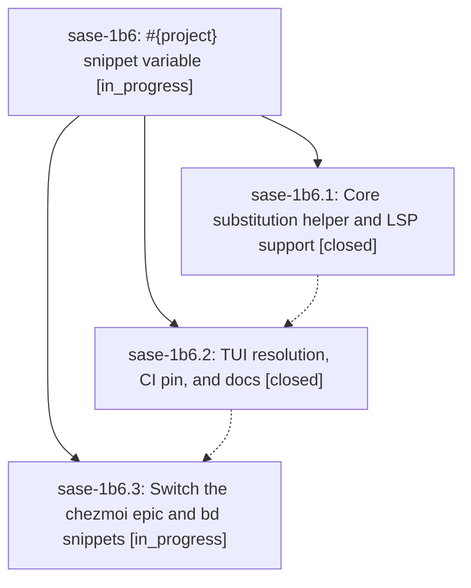

# Bead: sase-1b6 — #{project} snippet variable

[Bead Pages](../README.md) / sase-1b6

**Status:** ◐ in_progress · **Type:** ▸ plan · **Tier:** epic
**Owner:** `bryanbugyi34@gmail.com` · **Created by:** [bbugyi200.apollo.2a](https://github.com/sase-org/sase--agents/blob/main/sessions/bbugyi200.apollo.2a.md) · **Assignee:** `sase-1b6.land`
**Created:** 2026-09-27 08:18:51 EDT
**Plan:** [202609/snippet\_project\_variable.md](https://github.com/sase-org/sase--plans/blob/main/202609/snippet_project_variable.md)

<!-- sase:links:start -->

## Links

| Relation | Artifact | Why |
| --- | --- | --- |
| implemented-by | [plan:202609/snippet_project_variable.md][1] | derived from the plan's `bead_id:` frontmatter field |

[1]: https://github.com/sase-org/sase--plans/blob/main/202609/snippet_project_variable.md

<!-- sase:links:end -->

## Description

Snippet templates can write #{project}, and it expands to the display name of the project the prompt targets, consistently in sase's TUI and in LSP editors. The user's chezmoi `epic` and `bd` snippets then emit the correct bead-ID prefix in every project.

## Phases

| Bead | Title | Status | Size | Created | Agents | Commits |
|---|---|---|---|---|---:|---:|
| [sase-1b6.1](sase-1b6.1.md) | Core substitution helper and LSP support | ✓ closed | medium | 2026-09-27 | 1 | 1 |
| [sase-1b6.2](sase-1b6.2.md) | TUI resolution, CI pin, and docs | ✓ closed | medium | 2026-09-27 | 1 | 1 |
| [sase-1b6.3](sase-1b6.3.md) | Switch the chezmoi epic and bd snippets | ◐ in_progress | xsmall | 2026-09-27 | 1 | 0 |

## Lineage

## Agents

| Agent | Bead | Commits |
|---|---|---:|
| [bbugyi200.apollo.sase-1b6.1](https://github.com/sase-org/sase--agents/blob/main/agents/bbugyi200.apollo.sase-1b6.1/README.md) | [sase-1b6.1](sase-1b6.1.md) | 1 |
| [bbugyi200.apollo.sase-1b6.2](https://github.com/sase-org/sase--agents/blob/main/sessions/bbugyi200.apollo.sase-1b6.2.md) | [sase-1b6.2](sase-1b6.2.md) | 1 |
| [bbugyi200.apollo.sase-1b6.3](https://github.com/sase-org/sase--agents/blob/main/agents/bbugyi200.apollo.sase-1b6.3/README.md) | [sase-1b6.3](sase-1b6.3.md) | 0 |
| [bbugyi200.apollo.sase-1b6.land](https://github.com/sase-org/sase--agents/blob/main/agents/bbugyi200.apollo.sase-1b6.land/README.md) | [sase-1b6](README.md) | 0 |

## Commits

| Repo | Commit | Subject | Bead | Committed |
|---|---|---|---|---|
| sase-core | [`sase-core@73f1044`](https://github.com/sase-org/sase-core/commit/73f104486e9827fe7d83295ce5c80bf13d8b6dc3) | feat(snippets): add #{project} substitution helper, Plan variables, and LSP resolution | [sase-1b6.1](sase-1b6.1.md) | 2026-09-27 08:44:39 EDT |
| sase | [`9071818`](https://github.com/sase-org/sase/commit/9071818bcdfbb0fcfde9e860ded2719203caafa7) | feat(snippets): resolve #{project} on TUI Tab expansion (sase-1b6.2) | [sase-1b6.2](sase-1b6.2.md) | 2026-09-27 10:16:42 EDT |
