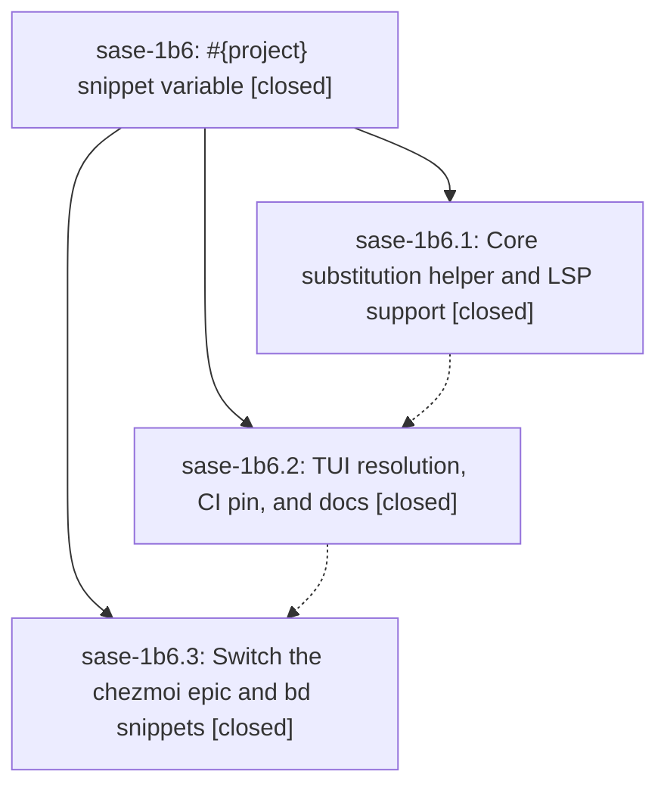

# Bead: sase-1b6 — #{project} snippet variable

[Bead Pages](../README.md) / sase-1b6

**Status:** ✓ closed · **Resolution:** done · **Type:** ▸ plan · **Tier:** epic
**Owner:** `bryanbugyi34@gmail.com` · **Created by:** [bbugyi200.apollo.2a](https://github.com/sase-org/sase--agents/blob/main/sessions/bbugyi200.apollo.2a.md) · **Assignee:** `sase-1b6.land`
**Created:** 2026-09-27 08:18:51 EDT · **Closed:** 2026-09-27 10:33:42 EDT
**Plan:** [202609/snippet\_project\_variable.md](https://github.com/sase-org/sase--plans/blob/main/202609/snippet_project_variable.md)

<!-- sase:links:start -->

## Links

| Relation | Artifact | Why |
| --- | --- | --- |
| implemented-by | [plan:202609/snippet_project_variable.md][1] | derived from the plan's `bead_id:` frontmatter field |

[1]: https://github.com/sase-org/sase--plans/blob/main/202609/snippet_project_variable.md

<!-- sase:links:end -->

## Description

Snippet templates can write #{project}, and it expands to the display name of the project the prompt targets, consistently in sase's TUI and in LSP editors. The user's chezmoi `epic` and `bd` snippets then emit the correct bead-ID prefix in every project.

## Notes

[2026-09-27T14:33:42Z · sase-1b6.land] Verified all 3 phases. P1 (sase-core 73f1044, released in v0.35.1): snippet_variables module (substitute_snippet_variables + PROJECT_SNIPPET_VARIABLE, unit tests), additive serde(default) Plan.variables (no deny_unknown_fields, older cores degrade to verbatim), LSP active_snippet_project (leading tag/VCS ref then current row, no root-basename fallback) applied to snippet insertion+replacement text, tests. P2 (sase 9071818bcd): core pin 73f10448, facade variables kwarg, TUI _snippet_project_name (arg-assist resolver then LaunchContextSource cached project, no I/O, guarded by '#{' check), unresolved warning toast, docs ace.md/editor.md; audited other _expand_snippet_template_at_range callers — all xprompt skeleton/directive templates, correctly unchanged; snippet pane is authoring only. Rebuilt local sase_core_rs to 0.35.1 (workspace venv was stale 0.34.73) and the 51 snippet expansion + facade tests pass; installed uv-tool sase expands 'the #{project}-$1 epic bead' with project=bob-cli to 'the bob-cli- epic bead'. P3 (chezmoi 9b98c5c0, pushed): epic/bd use #{project}-, rep unchanged; chezmoi applied (~/.config/sase/sase.yml matches); sase snippet show epic/repic load cleanly. Integration: sase commits since 12:18Z (finalizer/deck/turn-rename/stash) and sase-core commits since 73f1044 touch no snippet paths; no other plan_snippet_expansion callers; sase-core-rs floor ratchet to 0.35.1 is owned by the mechanical release lane. No epic-symbol entries. Follow-ups: sase-1b6.1 sase-core clippy-1.95 denies -> duplicate of sase-1an, +1 recorded; also DISCOVERED ISSUE note on active epic sase-1b2 for the 2 denies its commits added in finalizer/run_view/decode.rs. sase-1b6.2 stale sase-1b2.14 DeckSpec --epic-symbol -> declined, already resolved (entry no longer in Justfile).

## Phases

| Bead | Title | Status | Size | Created | Agents | Commits |
|---|---|---|---|---|---:|---:|
| [sase-1b6.1](sase-1b6.1.md) | Core substitution helper and LSP support | ✓ closed | medium | 2026-09-27 | 1 | 1 |
| [sase-1b6.2](sase-1b6.2.md) | TUI resolution, CI pin, and docs | ✓ closed | medium | 2026-09-27 | 1 | 1 |
| [sase-1b6.3](sase-1b6.3.md) | Switch the chezmoi epic and bd snippets | ✓ closed | xsmall | 2026-09-27 | 1 | 1 |

## Lineage

## Agents

| Agent | Bead | Commits |
|---|---|---:|
| [bbugyi200.apollo.sase-1b6.1](https://github.com/sase-org/sase--agents/blob/main/agents/bbugyi200.apollo.sase-1b6.1/README.md) | [sase-1b6.1](sase-1b6.1.md) | 1 |
| [bbugyi200.apollo.sase-1b6.2](https://github.com/sase-org/sase--agents/blob/main/sessions/bbugyi200.apollo.sase-1b6.2.md) | [sase-1b6.2](sase-1b6.2.md) | 1 |
| [bbugyi200.apollo.sase-1b6.3](https://github.com/sase-org/sase--agents/blob/main/agents/bbugyi200.apollo.sase-1b6.3/README.md) | [sase-1b6.3](sase-1b6.3.md) | 1 |
| [bbugyi200.apollo.sase-1b6.land](https://github.com/sase-org/sase--agents/blob/main/agents/bbugyi200.apollo.sase-1b6.land/README.md) | [sase-1b6](README.md) | 1 |

## Commits

| Repo | Commit | Subject | Bead | Committed |
|---|---|---|---|---|
| sase-core | [`sase-core@73f1044`](https://github.com/sase-org/sase-core/commit/73f104486e9827fe7d83295ce5c80bf13d8b6dc3) | feat(snippets): add #{project} substitution helper, Plan variables, and LSP resolution | [sase-1b6.1](sase-1b6.1.md) | 2026-09-27 08:44:39 EDT |
| sase | [`9071818`](https://github.com/sase-org/sase/commit/9071818bcdfbb0fcfde9e860ded2719203caafa7) | feat(snippets): resolve #{project} on TUI Tab expansion (sase-1b6.2) | [sase-1b6.2](sase-1b6.2.md) | 2026-09-27 10:16:42 EDT |
| chezmoi | [`chezmoi@9b98c5c`](https://github.com/bbugyi200/dotfiles/commit/9b98c5c099843d350f0816fe4229cdb1d03b23a8) | feat(snippets): use #{project} prefix in epic and bd snippets | [sase-1b6.3](sase-1b6.3.md) | 2026-09-27 10:25:21 EDT |
| sase--plans | [`sase--plans@3269934`](https://github.com/sase-org/sase--plans/commit/3269934c5c9c52292091b6547e2d52cbf78861f9) | chore(plans): mark #{project} snippet variable plan done (sase-1b6) | [sase-1b6](README.md) | 2026-09-27 10:38:38 EDT |
