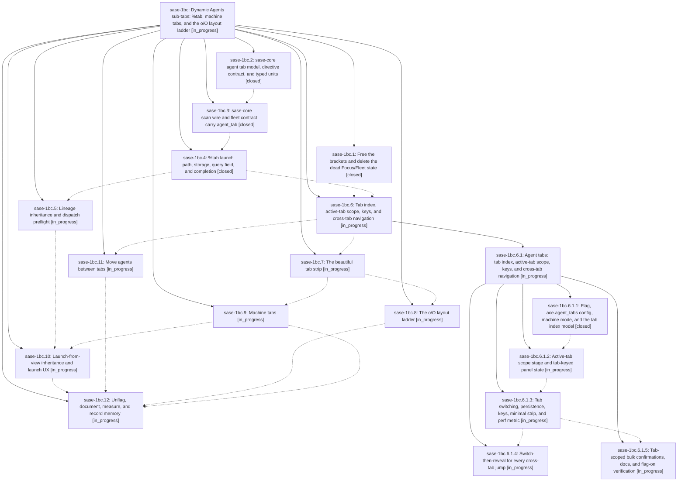

# Bead: sase-1bc — Dynamic Agents sub-tabs: %tab, machine tabs, and the o/O layout ladder

[Bead Pages](../README.md) / sase-1bc

**Status:** ◐ in_progress · **Type:** ▸ plan · **Tier:** epic
**Owner:** `bryanbugyi34@gmail.com` · **Created by:** [bbugyi200.athena.0t4](https://github.com/sase-org/sase--agents/blob/main/sessions/bbugyi200.athena.0t4.md) · **Assignee:** `sase-1bc.land`
**Created:** 2026-09-27 10:56:58 EDT
**Plan:** [202609/agents\_dynamic\_tabs.md](https://github.com/sase-org/sase--plans/blob/main/202609/agents_dynamic_tabs.md)

<!-- sase:links:start -->

## Links

| Relation | Artifact | Why |
| --- | --- | --- |
| implemented-by | [plan:202609/agents_dynamic_tabs.md][1] | derived from the plan's `bead_id:` frontmatter field |

[1]: https://github.com/sase-org/sase--plans/blob/main/202609/agents_dynamic_tabs.md

<!-- sase:links:end -->

## Description

The Agents tab gains dynamic, launch-assigned sub-tabs. `%tab:<name>` places an agent's whole session, clan, or workflow on a named tab on every machine. Agents without a tab land on `main`, or on derived machine tabs (`⌨ local`, `⌨ <alias>`) when remotes are configured. The strip stays invisible until two tabs have agents, never hides something that needs you, and switches instantly. The `o`/`O` modal walks a Split → Merged → All tabs ladder. The whole feature is intuitive, reliable across machines and versions, and beautiful.

## Phases

| Bead | Title | Status | Size | Created | Agents | Commits |
|---|---|---|---|---|---:|---:|
| [sase-1bc.1](sase-1bc.1.md) | Free the brackets and delete the dead Focus/Fleet state | ✓ closed | medium | 2026-09-27 | 1 | 1 |
| [sase-1bc.10](sase-1bc.10.md) | Launch-from-view inheritance and launch UX | ◐ in_progress | medium | 2026-09-27 | 0 | 0 |
| [sase-1bc.11](sase-1bc.11.md) | Move agents between tabs | ◐ in_progress | medium | 2026-09-27 | 0 | 0 |
| [sase-1bc.12](sase-1bc.12.md) | Unflag, document, measure, and record memory | ◐ in_progress | medium | 2026-09-27 | 0 | 0 |
| [sase-1bc.2](sase-1bc.2.md) | sase-core agent tab model, directive contract, and typed units | ✓ closed | medium | 2026-09-27 | 1 | 1 |
| [sase-1bc.3](sase-1bc.3.md) | sase-core scan wire and fleet contract carry agent\_tab | ✓ closed | medium | 2026-09-27 | 1 | 1 |
| [sase-1bc.4](sase-1bc.4.md) | %tab launch path, storage, query field, and completion | ✓ closed | large | 2026-09-27 | 1 | 1 |
| [sase-1bc.5](sase-1bc.5.md) | Lineage inheritance and dispatch preflight | ◐ in_progress | medium | 2026-09-27 | 0 | 0 |
| [sase-1bc.6](sase-1bc.6.md) | Tab index, active-tab scope, keys, and cross-tab navigation | ◐ in_progress | large | 2026-09-27 | 0 | 0 |
| [sase-1bc.7](sase-1bc.7.md) | The beautiful tab strip | ◐ in_progress | large | 2026-09-27 | 0 | 0 |
| [sase-1bc.8](sase-1bc.8.md) | The o/O layout ladder | ◐ in_progress | medium | 2026-09-27 | 0 | 0 |
| [sase-1bc.9](sase-1bc.9.md) | Machine tabs | ◐ in_progress | medium | 2026-09-27 | 0 | 0 |

## Lineage

## Agents

| Agent | Bead | Commits |
|---|---|---:|
| [bbugyi200.athena.sase-1bc.1](https://github.com/sase-org/sase--agents/blob/main/sessions/bbugyi200.athena.sase-1bc.1.md) | [sase-1bc.1](sase-1bc.1.md) | 1 |
| [bbugyi200.athena.sase-1bc.2](https://github.com/sase-org/sase--agents/blob/main/agents/bbugyi200.athena.sase-1bc.2/README.md) | [sase-1bc.2](sase-1bc.2.md) | 1 |
| [bbugyi200.athena.sase-1bc.3](https://github.com/sase-org/sase--agents/blob/main/agents/bbugyi200.athena.sase-1bc.3/README.md) | [sase-1bc.3](sase-1bc.3.md) | 1 |
| [bbugyi200.athena.sase-1bc.4](https://github.com/sase-org/sase--agents/blob/main/sessions/bbugyi200.athena.sase-1bc.4.md) | [sase-1bc.4](sase-1bc.4.md) | 1 |
| [bbugyi200.athena.sase-1bc.6.1.1](https://github.com/sase-org/sase--agents/blob/main/agents/bbugyi200.athena.sase-1bc.6.1.1/README.md) | [sase-1bc.6.1.1](sase-1bc.6.1.1.md) | 1 |

## Commits

| Repo | Commit | Subject | Bead | Committed |
|---|---|---|---|---|
| sase-core | [`sase-core@c448ed6`](https://github.com/sase-org/sase-core/commit/c448ed6d8da9e6874c16c4f9cfe7e1459922ac7a) | feat(agent-tab): core tab model with directive, typed units, and Python bindings | [sase-1bc.2](sase-1bc.2.md) | 2026-09-27 11:53:31 EDT |
| sase-core | [`sase-core@0e8981a`](https://github.com/sase-org/sase-core/commit/0e8981a1f131d2dd040c4887ae949edf19fbeef6) | feat!: carry agent\_tab on scan wire (schema 11) and fleet contract (v7) | [sase-1bc.3](sase-1bc.3.md) | 2026-09-27 12:32:28 EDT |
| sase | [`4bae6f5`](https://github.com/sase-org/sase/commit/4bae6f5fef9d684c05a0d2fb0b685daf7e794743) | feat(agents-deck): move card-block stepping from brackets to parens, delete dead Focus/Fleet state (sase-1bc.1) | [sase-1bc.1](sase-1bc.1.md) | 2026-09-27 12:44:49 EDT |
| sase | [`372ecc9`](https://github.com/sase-org/sase/commit/372ecc97c36ae7b7b25edb10a35b6ccf6da3e958) | feat(xprompt): implement %tab directive for agent tab naming | [sase-1bc.4](sase-1bc.4.md) | 2026-09-27 13:29:47 EDT |
| sase | [`8ad9637`](https://github.com/sase-org/sase/commit/8ad96371875bd3fb3fdad763a32e2751e0bd218a) | feat(agent-tabs): tab-foundation flag, config, machine mode, and tab index model (sase-1bc.6.1.1) | [sase-1bc.6.1.1](sase-1bc.6.1.1.md) | 2026-09-27 14:06:56 EDT |
