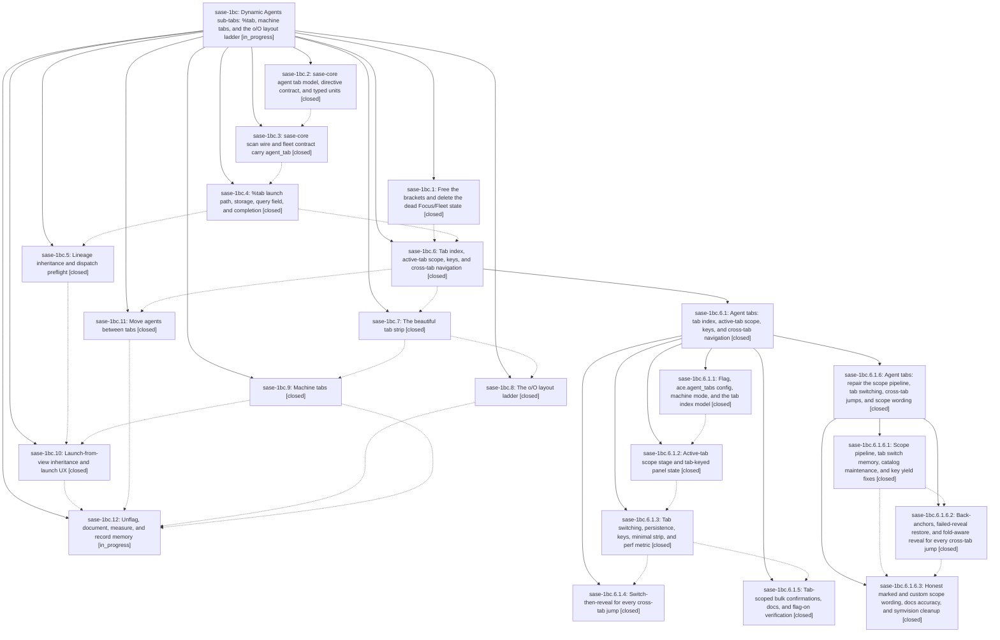

# Bead: sase-1bc — Dynamic Agents sub-tabs: %tab, machine tabs, and the o/O layout ladder

[Bead Pages](../README.md) / sase-1bc

**Status:** ◐ in_progress · **Type:** ▸ plan · **Tier:** epic
**Owner:** `bryanbugyi34@gmail.com` · **Created by:** [bbugyi200.athena.0t4](https://github.com/sase-org/sase--agents/blob/main/sessions/bbugyi200.athena.0t4.md) · **Assignee:** `sase-1bc.land`
**Created:** 2026-09-27 10:56:58 EDT
**Plan:** [202609/agents\_dynamic\_tabs.md](https://github.com/sase-org/sase--plans/blob/main/202609/agents_dynamic_tabs.md)

<!-- sase:links:start -->

## Links

| Relation | Artifact | Why |
| --- | --- | --- |
| implemented-by | [plan:202609/agents_dynamic_tabs.md][1] | derived from the plan's `bead_id:` frontmatter field |

_Plus 4 automatic references — see [Referenced By](#referenced-by)._

[1]: https://github.com/sase-org/sase--plans/blob/main/202609/agents_dynamic_tabs.md

<!-- sase:links:end -->

## Description

The Agents tab gains dynamic, launch-assigned sub-tabs. `%tab:<name>` places an agent's whole session, clan, or workflow on a named tab on every machine. Agents without a tab land on `main`, or on derived machine tabs (`⌨ local`, `⌨ <alias>`) when remotes are configured. The strip stays invisible until two tabs have agents, never hides something that needs you, and switches instantly. The `o`/`O` modal walks a Split → Merged → All tabs ladder. The whole feature is intuitive, reliable across machines and versions, and beautiful.

## Notes

[2026-09-27T18:47:10Z · sase-1b1.land] DISCOVERED ISSUE (sase-1b1.land, sase master 372ecc97c3): two master-red items trace to 372ecc97c3 (sase-1bc.4, %tab directive). (1) `sase validate` / `just check` stage 'SASE validation' fails at 'init memory --check': sase/memory/README.md needs +2 -2 (xprompts.md 'Approx. tokens' 2853 -> 2969 and total 20378 -> 20494). The commit edited xprompts.md and README.md but left the token counts stale; tests/main/test_init_memory_committed_drift.py::test_repo_project_memory_notes_match_generator_output also fails. Regenerate with `sase memory init` under /sase_memory_write rules. (2) tests/ace/tui/test_agent_completion.py goes from 14 passed on 372ecc97c3~1 to 9 failed / 5 passed on 372ecc97c3 in the same venv with sase-core-rs 0.35.1. Examples: candidate name 'main' where 'ship' is expected, and vcs_workflow / plan_preview are None. The failing nodes include test_build_agent_completion_candidates_enriches_visible_named_agents and test_named_proc_completion_candidate_uses_exact_proc_id. Evidence: `sase tool run -k check` run 81ef0cb11e86e4cdaaa8b70cfeb11615 (triage NEW) plus a pre/post worktree comparison.

[2026-09-27T22:27:42Z · sase-1b2.land] DISCOVERED ISSUE (sase-1b2.land, master c78eb3805): 372ecc97c3 (sase-1bc.4, %tab directive) breaks two directive-completion tests. Both fail deterministically in isolation: tests/ace/tui/widgets/test_directive_completion_candidates.py::test_removed_auto_approval_directives_are_absent_from_completion (line 85, tale_candidates == []) and ::test_removed_tribe_spellings_are_absent_from_completion (line 144, candidates == []). The new %tab directive now matches the prefixes those tests assert return no candidates (first extra item: CompletionCandidate display='%tab'). Either scope the assertions to the removed spellings or pick prefixes %tab does not match. Proposed as clean-base failures by sase-1b2.19 note #4 (epic sase-1b2).

[2026-09-28T04:15:51Z · sase-1bn.land] DISCOVERED ISSUE (sase-1bn.land, master 52f7351ae): two more master-red items trace to this epic, not to sase-1bn (both also fail at pre-sase-1bn base b9cfa7386). (1) tests/test_axe_run_agent_exec_repeat_env.py (6 nodes: TestRepeatIterationEnv x2, TestWaitChatsInjection x3, TestInheritedVcsInjection::test_vcs_tag_injected_when_ctx_has_tag) fail because _export_exec_agent_tab in src/sase/axe/run_agent_exec.py reads ctx.agent_meta (added by aff4fc082, sase-1bc.5) but the tests' MagicMock(spec=AgentExecContext) fixture predates that attribute. (2) tests/test_agent_artifact_marker_path_passing_audit.py::test_tracked_marker_path_passing_sites_are_reviewed reports run_agent_directive_metadata.py:session_root_tab (372ecc97c, sase-1bc.4) as an unreviewed marker-path site; filed with the unrelated finalizers/cli.py:_target_for_dir half as task sase-1by. The agent_completion and directive_completion %tab failures are already recorded in this epic's notes #1/#2.

[2026-09-28T11:21:16Z · sase-1c1.5] sase-1c1.5 tab-completion: flag-off main-tab candidates were a product leak. Gated _build_tab_completion_candidates behind agent_tabs_enabled(); updated the two directive removed-spelling tests to assert removed names absent while %tab matches.

[2026-09-28T18:06:13Z · sase-1bu.8.land] DISCOVERED ISSUE (proposed by sase-1bu.8.2 note #1; reproduced by sase-1bu.8.land at master 7fc18e6325): tests/completion/test_kind_coverage.py::test_every_value_slot_is_kinded_choiced_or_hinted fails because agent/tab/set:tab is uncaptioned. The agent tab set parser came from phase sase-1bc.11 commit 647e053e94; add a completion kind, choices, or value hint in this active epic. Unrelated to G1 goal CLI fixes.

[2026-09-28T18:20:44Z · sase-1bu.8.land] DISCOVERED ISSUE (sase-1bu.8.land, check ToolRun e75e56ccb46d2113790301ac0a974915 at master 73eaa9fab0): tests/test_agent_session_terminology.py::test_current_source_avoids_agent_family_identifiers fails because src/sase/agents/cli_tab.py:34 still reads legacy agent_family. Introduced by agent tab set phase sase-1bc.11 (647e053e94); unrelated to G1 goals. The same check had a separately KNOWN config schema failure.

## Phases

| Bead | Title | Status | Size | Created | Agents | Commits |
|---|---|---|---|---|---:|---:|
| [sase-1bc.1](sase-1bc.1.md) | Free the brackets and delete the dead Focus/Fleet state | ✓ closed | medium | 2026-09-27 | 1 | 1 |
| [sase-1bc.10](sase-1bc.10.md) | Launch-from-view inheritance and launch UX | ✓ closed | medium | 2026-09-27 | 1 | 1 |
| [sase-1bc.11](sase-1bc.11.md) | Move agents between tabs | ✓ closed | medium | 2026-09-27 | 1 | 1 |
| [sase-1bc.12](sase-1bc.12.md) | Unflag, document, measure, and record memory | ◐ in_progress | medium | 2026-09-27 | 1 | 0 |
| [sase-1bc.2](sase-1bc.2.md) | sase-core agent tab model, directive contract, and typed units | ✓ closed | medium | 2026-09-27 | 1 | 1 |
| [sase-1bc.3](sase-1bc.3.md) | sase-core scan wire and fleet contract carry agent\_tab | ✓ closed | medium | 2026-09-27 | 1 | 1 |
| [sase-1bc.4](sase-1bc.4.md) | %tab launch path, storage, query field, and completion | ✓ closed | large | 2026-09-27 | 1 | 1 |
| [sase-1bc.5](sase-1bc.5.md) | Lineage inheritance and dispatch preflight | ✓ closed | medium | 2026-09-27 | 1 | 1 |
| [sase-1bc.6](sase-1bc.6.md) | Tab index, active-tab scope, keys, and cross-tab navigation | ✓ closed | large | 2026-09-27 | 1 | 0 |
| [sase-1bc.7](sase-1bc.7.md) | The beautiful tab strip | ✓ closed | large | 2026-09-27 | 1 | 1 |
| [sase-1bc.8](sase-1bc.8.md) | The o/O layout ladder | ✓ closed | medium | 2026-09-27 | 1 | 1 |
| [sase-1bc.9](sase-1bc.9.md) | Machine tabs | ✓ closed | medium | 2026-09-27 | 1 | 1 |

## Lineage

## Agents

| Agent | Bead | Commits |
|---|---|---:|
| [bbugyi200.athena.sase-1bc.1](https://github.com/sase-org/sase--agents/blob/main/sessions/bbugyi200.athena.sase-1bc.1.md) | [sase-1bc.1](sase-1bc.1.md) | 1 |
| [bbugyi200.athena.sase-1bc.10](https://github.com/sase-org/sase--agents/blob/main/sessions/bbugyi200.athena.sase-1bc.10.md) | [sase-1bc.10](sase-1bc.10.md) | 1 |
| [bbugyi200.athena.sase-1bc.11](https://github.com/sase-org/sase--agents/blob/main/agents/bbugyi200.athena.sase-1bc.11/README.md) | [sase-1bc.11](sase-1bc.11.md) | 1 |
| [bbugyi200.athena.sase-1bc.12](https://github.com/sase-org/sase--agents/blob/main/agents/bbugyi200.athena.sase-1bc.12/README.md) | [sase-1bc.12](sase-1bc.12.md) | 0 |
| [bbugyi200.athena.sase-1bc.2](https://github.com/sase-org/sase--agents/blob/main/agents/bbugyi200.athena.sase-1bc.2/README.md) | [sase-1bc.2](sase-1bc.2.md) | 1 |
| [bbugyi200.athena.sase-1bc.3](https://github.com/sase-org/sase--agents/blob/main/agents/bbugyi200.athena.sase-1bc.3/README.md) | [sase-1bc.3](sase-1bc.3.md) | 1 |
| [bbugyi200.athena.sase-1bc.4](https://github.com/sase-org/sase--agents/blob/main/sessions/bbugyi200.athena.sase-1bc.4.md) | [sase-1bc.4](sase-1bc.4.md) | 1 |
| [bbugyi200.athena.sase-1bc.5](https://github.com/sase-org/sase--agents/blob/main/agents/bbugyi200.athena.sase-1bc.5/README.md) | [sase-1bc.5](sase-1bc.5.md) | 1 |
| [bbugyi200.athena.sase-1bc.6](https://github.com/sase-org/sase--agents/blob/main/sessions/bbugyi200.athena.sase-1bc.6.md) | [sase-1bc.6](sase-1bc.6.md) | 0 |
| [bbugyi200.athena.sase-1bc.6.1.1](https://github.com/sase-org/sase--agents/blob/main/agents/bbugyi200.athena.sase-1bc.6.1.1/README.md) | [sase-1bc.6.1.1](sase-1bc.6.1.1.md) | 1 |
| [bbugyi200.athena.sase-1bc.6.1.2](https://github.com/sase-org/sase--agents/blob/main/agents/bbugyi200.athena.sase-1bc.6.1.2/README.md) | [sase-1bc.6.1.2](sase-1bc.6.1.2.md) | 1 |
| [bbugyi200.athena.sase-1bc.6.1.3](https://github.com/sase-org/sase--agents/blob/main/agents/bbugyi200.athena.sase-1bc.6.1.3/README.md) | [sase-1bc.6.1.3](sase-1bc.6.1.3.md) | 1 |
| [bbugyi200.athena.sase-1bc.6.1.4](https://github.com/sase-org/sase--agents/blob/main/sessions/bbugyi200.athena.sase-1bc.6.1.4.md) | [sase-1bc.6.1.4](sase-1bc.6.1.4.md) | 1 |
| [bbugyi200.athena.sase-1bc.6.1.5](https://github.com/sase-org/sase--agents/blob/main/agents/bbugyi200.athena.sase-1bc.6.1.5/README.md) | [sase-1bc.6.1.5](sase-1bc.6.1.5.md) | 1 |
| [bbugyi200.athena.sase-1bc.6.1.6.1](https://github.com/sase-org/sase--agents/blob/main/sessions/bbugyi200.athena.sase-1bc.6.1.6.1.md) | [sase-1bc.6.1.6.1](sase-1bc.6.1.6.1.md) | 1 |
| [bbugyi200.athena.sase-1bc.6.1.6.2](https://github.com/sase-org/sase--agents/blob/main/sessions/bbugyi200.athena.sase-1bc.6.1.6.2.md) | [sase-1bc.6.1.6.2](sase-1bc.6.1.6.2.md) | 1 |
| [bbugyi200.athena.sase-1bc.6.1.6.3](https://github.com/sase-org/sase--agents/blob/main/sessions/bbugyi200.athena.sase-1bc.6.1.6.3.md) | [sase-1bc.6.1.6.3](sase-1bc.6.1.6.3.md) | 1 |
| [bbugyi200.athena.sase-1bc.6.1.6.land](https://github.com/sase-org/sase--agents/blob/main/agents/bbugyi200.athena.sase-1bc.6.1.6.land/README.md) | [sase-1bc.6.1.6](sase-1bc.6.1.6.md) | 0 |
| [bbugyi200.athena.sase-1bc.6.1.land](https://github.com/sase-org/sase--agents/blob/main/sessions/bbugyi200.athena.sase-1bc.6.1.land.md) | [sase-1bc.6.1](sase-1bc.6.1.md) | 0 |
| [bbugyi200.athena.sase-1bc.7](https://github.com/sase-org/sase--agents/blob/main/sessions/bbugyi200.athena.sase-1bc.7.md) | [sase-1bc.7](sase-1bc.7.md) | 1 |
| [bbugyi200.athena.sase-1bc.8](https://github.com/sase-org/sase--agents/blob/main/sessions/bbugyi200.athena.sase-1bc.8.md) | [sase-1bc.8](sase-1bc.8.md) | 1 |
| [bbugyi200.athena.sase-1bc.9](https://github.com/sase-org/sase--agents/blob/main/agents/bbugyi200.athena.sase-1bc.9/README.md) | [sase-1bc.9](sase-1bc.9.md) | 1 |
| [bbugyi200.athena.sase-1bc.land](https://github.com/sase-org/sase--agents/blob/main/agents/bbugyi200.athena.sase-1bc.land/README.md) | [sase-1bc](README.md) | 0 |

## Commits

| Repo | Commit | Subject | Bead | Committed |
|---|---|---|---|---|
| sase-core | [`sase-core@c448ed6`](https://github.com/sase-org/sase-core/commit/c448ed6d8da9e6874c16c4f9cfe7e1459922ac7a) | feat(agent-tab): core tab model with directive, typed units, and Python bindings | [sase-1bc.2](sase-1bc.2.md) | 2026-09-27 11:53:31 EDT |
| sase-core | [`sase-core@0e8981a`](https://github.com/sase-org/sase-core/commit/0e8981a1f131d2dd040c4887ae949edf19fbeef6) | feat!: carry agent\_tab on scan wire (schema 11) and fleet contract (v7) | [sase-1bc.3](sase-1bc.3.md) | 2026-09-27 12:32:28 EDT |
| sase | [`4bae6f5`](https://github.com/sase-org/sase/commit/4bae6f5fef9d684c05a0d2fb0b685daf7e794743) | feat(agents-deck): move card-block stepping from brackets to parens, delete dead Focus/Fleet state (sase-1bc.1) | [sase-1bc.1](sase-1bc.1.md) | 2026-09-27 12:44:49 EDT |
| sase | [`372ecc9`](https://github.com/sase-org/sase/commit/372ecc97c36ae7b7b25edb10a35b6ccf6da3e958) | feat(xprompt): implement %tab directive for agent tab naming | [sase-1bc.4](sase-1bc.4.md) | 2026-09-27 13:29:47 EDT |
| sase | [`8ad9637`](https://github.com/sase-org/sase/commit/8ad96371875bd3fb3fdad763a32e2751e0bd218a) | feat(agent-tabs): tab-foundation flag, config, machine mode, and tab index model (sase-1bc.6.1.1) | [sase-1bc.6.1.1](sase-1bc.6.1.1.md) | 2026-09-27 14:06:56 EDT |
| sase | [`aff4fc0`](https://github.com/sase-org/sase/commit/aff4fc082f4035f3c715015969a0d6086689c612) | feat(tabs): inherit agent tab across launches with dispatch preflight (sase-1bc.5) | [sase-1bc.5](sase-1bc.5.md) | 2026-09-27 14:19:31 EDT |
| sase | [`59f5eff`](https://github.com/sase-org/sase/commit/59f5eff1660acfb36c8eaa040c7e6a4fcd71ee59) | feat(agent-tabs): active-tab scope stage and tab-keyed panel state (sase-1bc.6.1.2) | [sase-1bc.6.1.2](sase-1bc.6.1.2.md) | 2026-09-27 16:53:15 EDT |
| sase | [`c78eb38`](https://github.com/sase-org/sase/commit/c78eb3805faaa4848aa7e8afea69364e2018f064) | feat(agent-tabs): tab switching, persistence, keys, minimal strip, and perf metric (sase-1bc.6.1.3) | [sase-1bc.6.1.3](sase-1bc.6.1.3.md) | 2026-09-27 17:22:49 EDT |
| sase | [`94ed923`](https://github.com/sase-org/sase/commit/94ed923b107a14598fa54803d751abf125c1e5f1) | feat(agent-tabs): tab-scoped bulk confirmations, docs, and flag-on verification (sase-1bc.6.1.5) | [sase-1bc.6.1.5](sase-1bc.6.1.5.md) | 2026-09-27 18:06:24 EDT |
| sase | [`63fd6a5`](https://github.com/sase-org/sase/commit/63fd6a5dfd2826e411a2a63032de5f6ddc1a9274) | feat(agent-tabs): switch-then-reveal for every cross-tab jump (sase-1bc.6.1.4) | [sase-1bc.6.1.4](sase-1bc.6.1.4.md) | 2026-09-27 19:00:21 EDT |
| sase | [`dae0f6e`](https://github.com/sase-org/sase/commit/dae0f6efad9f08622c954cfa536dba769bf23b1d) | fix(ace): repair agent tab scope and switching | [sase-1bc.6.1.6.1](sase-1bc.6.1.6.1.md) | 2026-09-27 22:13:18 EDT |
| sase | [`3ba7f3b`](https://github.com/sase-org/sase/commit/3ba7f3b22f279a6b900fd76405192841a06f73d7) | fix(ace-tui): repair cross-tab jump reveal/restore paths for agent tabs | [sase-1bc.6.1.6.2](sase-1bc.6.1.6.2.md) | 2026-09-28 01:30:43 EDT |
| sase | [`d094fe7`](https://github.com/sase-org/sase/commit/d094fe70ee7f98cb9242575bd5757c85c2a33091) | fix(ace-tui): make agent-tab bulk wording honest and align tab docs | [sase-1bc.6.1.6.3](sase-1bc.6.1.6.3.md) | 2026-09-28 02:48:46 EDT |
| sase | [`647e053`](https://github.com/sase-org/sase/commit/647e053e94e46b0d2e34bcd083e777113ce2ce24) | feat(agents): add tab moves via CLI, persist directive, and TUI modal | [sase-1bc.11](sase-1bc.11.md) | 2026-09-28 09:05:28 EDT |
| sase | [`77438b4`](https://github.com/sase-org/sase/commit/77438b4ef1161a994983a3e2ced3bae395a5aa64) | feat(ace): complete the Agents tab strip (sase-1bc.7) | [sase-1bc.7](sase-1bc.7.md) | 2026-09-28 12:58:30 EDT |
| sase | [`ab2e35a`](https://github.com/sase-org/sase/commit/ab2e35a2d013cc586a935ac5acfb831a6232d166) | feat(ace): machine tabs for the Agents tab strip (sase-1bc.9) | [sase-1bc.9](sase-1bc.9.md) | 2026-09-28 14:25:11 EDT |
| sase | [`6205ae3`](https://github.com/sase-org/sase/commit/6205ae345ea619d2e7b1789e55d890da985e6fc7) | feat(ace): complete the Agents o/O layout ladder (sase-1bc.8) | [sase-1bc.8](sase-1bc.8.md) | 2026-09-28 15:19:59 EDT |
| sase | [`995e057`](https://github.com/sase-org/sase/commit/995e057116b84e6e149a161524ca5cfd870f9743) | feat(agents-tabs): launch-from-view inheritance and launch UX | [sase-1bc.10](sase-1bc.10.md) | 2026-09-28 15:44:55 EDT |

<!-- sase:referenced-by:start -->

## Referenced By

| Relation | Artifact | Why | Uses |
| --- | --- | --- | ---: |
| read-by | [agent:0tf--1][1] | Need DISCOVERED ISSUE notes #1/#2 on agent completion | 1 |
| read-by | [agent:research.2s.cld][2] | Check whether this in-flight epic overlaps Goals seams (finalizers, notifications, FINAL deck, tabs/grouping) | 1 |
| read-by | [agent:research.2s.final][3] | Verify status of epics cited as precedents/coordination points in Goals epic-split reports | 2 |
| read-by | [agent:sase-1c1.5][4] | Need agent-tabs contract for tab completion | 2 |

[1]: https://github.com/sase-org/sase--agents/blob/main/sessions/bbugyi200.athena.0tf.md
[2]: https://github.com/sase-org/sase--agents/blob/main/agents/bbugyi200.athena.research.2s.cld/README.md
[3]: https://github.com/sase-org/sase--agents/blob/main/agents/bbugyi200.athena.research.2s.final/README.md
[4]: https://github.com/sase-org/sase--agents/blob/main/agents/bbugyi200.athena.sase-1c1.5/README.md

<!-- sase:referenced-by:end -->
