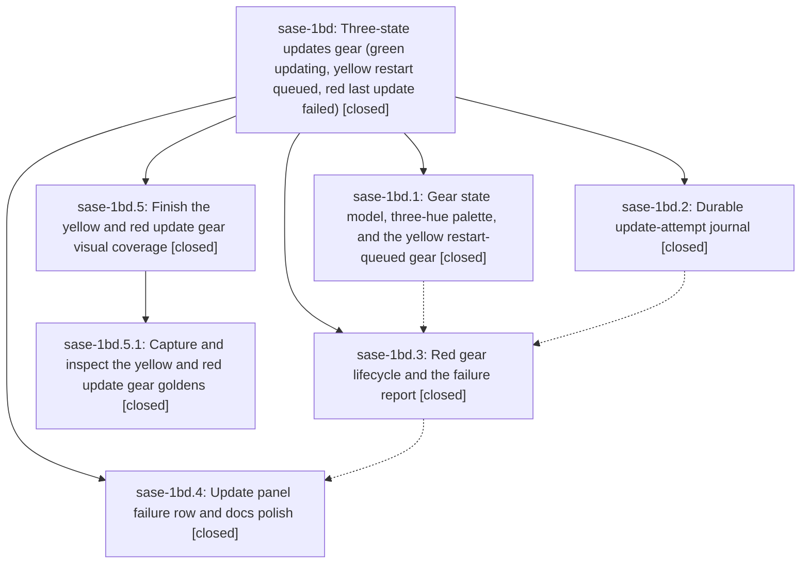

# Bead: sase-1bd — Three-state updates gear (green updating, yellow restart queued, red last update failed)

[Bead Pages](../README.md) / sase-1bd

**Status:** ✓ closed · **Resolution:** done · **Type:** ▸ plan · **Tier:** epic
**Owner:** `bryanbugyi34@gmail.com` · **Created by:** [bbugyi200.apollo.2d](https://github.com/sase-org/sase--agents/blob/main/sessions/bbugyi200.apollo.2d.md) · **Assignee:** `sase-1bd.land`
**Created:** 2026-09-27 13:22:58 EDT · **Closed:** 2026-09-27 17:51:52 EDT
**Plan:** [202609/update\_gear\_states.md](https://github.com/sase-org/sase--plans/blob/main/202609/update_gear_states.md)

<!-- sase:links:start -->

## Links

| Relation | Artifact | Why |
| --- | --- | --- |
| implemented-by | [plan:202609/update_gear_states.md][1] | derived from the plan's `bead_id:` frontmatter field |

_Plus 1 automatic references — see [Referenced By](#referenced-by)._

[1]: https://github.com/sase-org/sase--plans/blob/main/202609/update_gear_states.md

<!-- sase:links:end -->

## Description

The gear inset at the left edge of the top bar's `updates:` badge shows at most one gear and always tells the truth: green while an update proc runs, yellow while an installed update waits for this ACE's own procs before restarting ACE and the SASE service, and red while the user's most recent update (or update-planning) attempt has failed. Each gear has a tooltip that explains it and a click target that acts on it. The red state survives ACE restarts and crashes, and every ACE instance on the machine shows it.

## Notes

[2026-09-27T20:49:58Z · sase-1bd.land] LAND AUDIT before child plan: all four phase scopes match source in commits 1d60ffcf4, 9814d8980, 3786032ef, and 21d4e12c8. Focused current-tree suites pass 191 tests across journal, gear, restart queue, workers, report, and panel. Reviewed intervening commits since phase work began; deck, finder, command-line, and scratch changes have no update-gear integration caller or conflicting behavior. No epic-symbol entries. PROPOSED FOLLOW-UP dispositions: sase-1bd.1 #1 and sase-1bd.3 #2 missing yellow/red PNG goldens are remaining epic work, scoped in the child plan being proposed. sase-1bd.1 #2, sase-1bd.2 #1, and sase-1bd.4 #1 pre-existing unused-public Symvision failures corroborated task sase-1ay with independent phase evidence. sase-1bd.1 #4 busy-cluster flake corroborated task sase-1ak. sase-1bd.1 #3 and sase-1bd.4 cold Rust/check timeout reports declined as transient build or suite contention without a stable failing node; current cold-build Symvision attempt was interrupted before lint after 3 minutes and supplies no new failure evidence. sase-1bd.3 #3 usage_windows external Telegram pragma report declined as unconfirmed workspace checkout availability, with no update-gear change or reproducible failure signature. Reassess these only if a current check reports them. Parent bead absent; once child lands, re-audit and close this epic.

[2026-09-27T21:51:52Z · sase-1bd.5.land] Rechecked after child sase-1bd.5 closed done. All descendants are closed: phases sase-1bd.1 through sase-1bd.4 and child epic sase-1bd.5 (phase sase-1bd.5.1). No --epic-symbol entries. Linked plan plan:202609/update_gear_states.md still matches that closed set. Source still has the contract: resolve_update_gear is green > yellow > red, accents are #FFC000 and #FF5F5F, update_gear_chip renders the same three-cell inset for every state, and docs/ace.md describes the yellow gear and the Update-panel failure row. The omitted yellow and red PNG goldens are in 24e80d42e and were inspected (yellow gear with up-arrow 3; red gear alone, badge visible). Gear source is unchanged since the prior land audit, so the 191-test suite was not re-run. Commits since that audit (59f5eff16, c92e50bd6, 5a60113e1, 40295eaf5, c78eb3805, 24e80d42e) do not add an update-gear caller or a conflicting badge. Follow-ups: sase-1bd.1 #1 and sase-1bd.3 #2 are done via sase-1bd.5. Unused-public reports sase-1bd.1 #2, sase-1bd.2 #1, and sase-1bd.4 #1 stay on task sase-1ay; this turn's symvision returns first on an unrelated private import and did not re-list them. Flake sase-1bd.1 #4 stays on sase-1ak. Timeout notes sase-1bd.1 #3 and sase-1bd.4 were not reproduced. sase-1bd.3 #3 was later filed by another agent as sase-1bj and was not reached by this symvision run. sase-1bd.5.1 #1, the private import of _segment_section_identity from 80fbe7020, is recorded on in-progress sase-1b1.8 and sase-1b1.8.4. No parent bead.

## Phases

| Bead | Title | Status | Size | Created | Agents | Commits |
|---|---|---|---|---|---:|---:|
| [sase-1bd.1](sase-1bd.1.md) | Gear state model, three-hue palette, and the yellow restart-queued gear | ✓ closed | medium | 2026-09-27 | 1 | 1 |
| [sase-1bd.2](sase-1bd.2.md) | Durable update-attempt journal | ✓ closed | medium | 2026-09-27 | 1 | 1 |
| [sase-1bd.3](sase-1bd.3.md) | Red gear lifecycle and the failure report | ✓ closed | medium | 2026-09-27 | 1 | 1 |
| [sase-1bd.4](sase-1bd.4.md) | Update panel failure row and docs polish | ✓ closed | small | 2026-09-27 | 1 | 1 |

## Lineage

## Agents

| Agent | Bead | Commits |
|---|---|---:|
| [bbugyi200.apollo.sase-1bd.1](https://github.com/sase-org/sase--agents/blob/main/sessions/bbugyi200.apollo.sase-1bd.1.md) | [sase-1bd.1](sase-1bd.1.md) | 1 |
| [bbugyi200.apollo.sase-1bd.2](https://github.com/sase-org/sase--agents/blob/main/sessions/bbugyi200.apollo.sase-1bd.2.md) | [sase-1bd.2](sase-1bd.2.md) | 1 |
| [bbugyi200.apollo.sase-1bd.3](https://github.com/sase-org/sase--agents/blob/main/agents/bbugyi200.apollo.sase-1bd.3/README.md) | [sase-1bd.3](sase-1bd.3.md) | 1 |
| [bbugyi200.apollo.sase-1bd.4](https://github.com/sase-org/sase--agents/blob/main/agents/bbugyi200.apollo.sase-1bd.4/README.md) | [sase-1bd.4](sase-1bd.4.md) | 1 |
| [bbugyi200.apollo.sase-1bd.5.1](https://github.com/sase-org/sase--agents/blob/main/sessions/bbugyi200.apollo.sase-1bd.5.1.md) | [sase-1bd.5.1](sase-1bd.5.1.md) | 1 |
| [bbugyi200.apollo.sase-1bd.5.land](https://github.com/sase-org/sase--agents/blob/main/agents/bbugyi200.apollo.sase-1bd.5.land/README.md) | [sase-1bd.5](sase-1bd.5.md) | 1 |
| [bbugyi200.apollo.sase-1bd.land](https://github.com/sase-org/sase--agents/blob/main/sessions/bbugyi200.apollo.sase-1bd.land.md) | [sase-1bd](README.md) | 0 |

## Commits

| Repo | Commit | Subject | Bead | Committed |
|---|---|---|---|---|
| sase | [`1d60ffc`](https://github.com/sase-org/sase/commit/1d60ffcf4687a20e7a88726f618d9edc2430bc44) | feat(ace): add update-attempts journal model and tracking | [sase-1bd.2](sase-1bd.2.md) | 2026-09-27 14:49:36 EDT |
| sase | [`9814d89`](https://github.com/sase-org/sase/commit/9814d8980e3182eda3a872c481196b29383a5780) | feat(gear): add yellow restart-queued gear state model and palette (sase-1bd.1) | [sase-1bd.1](sase-1bd.1.md) | 2026-09-27 14:59:11 EDT |
| sase | [`3786032`](https://github.com/sase-org/sase/commit/3786032efb15beca4347ca240da9f48aa983b77c) | feat(gear): red update-failure gear lifecycle and failure report (sase-1bd.3) | [sase-1bd.3](sase-1bd.3.md) | 2026-09-27 16:03:36 EDT |
| sase | [`21d4e12`](https://github.com/sase-org/sase/commit/21d4e12c8c43c56ebeaa24ff245e7eafbd13c9b5) | feat(update-panel): surface recorded failure as first Update panel row (sase-1bd.4) | [sase-1bd.4](sase-1bd.4.md) | 2026-09-27 16:37:38 EDT |
| sase | [`24e80d4`](https://github.com/sase-org/sase/commit/24e80d42efdb2efc2932e7a22f77ebffa4936b2f) | test(ace-tui): add updates indicator PNG snapshot tests | [sase-1bd.5.1](sase-1bd.5.1.md) | 2026-09-27 17:33:30 EDT |
| sase--plans | [`sase--plans@ba33a70`](https://github.com/sase-org/sase--plans/commit/ba33a70e29b8482d81beda164f144a8bbabba4ad) | chore(plans): mark the update-gear epic plans done | [sase-1bd.5](sase-1bd.5.md) | 2026-09-27 18:28:24 EDT |

<!-- sase:referenced-by:start -->

## Referenced By

| Relation | Artifact | Why | Uses |
| --- | --- | --- | ---: |
| read-by | [agent:sase-1bd.4][1] | parent epic scope for panel phase | 1 |

[1]: https://github.com/sase-org/sase--agents/blob/main/agents/bbugyi200.apollo.sase-1bd.4/README.md

<!-- sase:referenced-by:end -->
