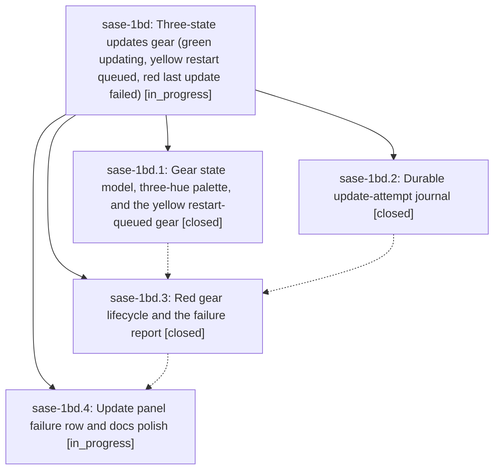

# Bead: sase-1bd — Three-state updates gear (green updating, yellow restart queued, red last update failed)

[Bead Pages](../README.md) / sase-1bd

**Status:** ◐ in_progress · **Type:** ▸ plan · **Tier:** epic
**Owner:** `bryanbugyi34@gmail.com` · **Created by:** [bbugyi200.apollo.2d](https://github.com/sase-org/sase--agents/blob/main/sessions/bbugyi200.apollo.2d.md) · **Assignee:** `sase-1bd.land`
**Created:** 2026-09-27 13:22:58 EDT
**Plan:** [202609/update\_gear\_states.md](https://github.com/sase-org/sase--plans/blob/main/202609/update_gear_states.md)

<!-- sase:links:start -->

## Links

| Relation | Artifact | Why |
| --- | --- | --- |
| implemented-by | [plan:202609/update_gear_states.md][1] | derived from the plan's `bead_id:` frontmatter field |

[1]: https://github.com/sase-org/sase--plans/blob/main/202609/update_gear_states.md

<!-- sase:links:end -->

## Description

The gear inset at the left edge of the top bar's `updates:` badge shows at most one gear and always tells the truth: green while an update proc runs, yellow while an installed update waits for this ACE's own procs before restarting ACE and the SASE service, and red while the user's most recent update (or update-planning) attempt has failed. Each gear has a tooltip that explains it and a click target that acts on it. The red state survives ACE restarts and crashes, and every ACE instance on the machine shows it.

## Phases

| Bead | Title | Status | Size | Created | Agents | Commits |
|---|---|---|---|---|---:|---:|
| [sase-1bd.1](sase-1bd.1.md) | Gear state model, three-hue palette, and the yellow restart-queued gear | ✓ closed | medium | 2026-09-27 | 1 | 1 |
| [sase-1bd.2](sase-1bd.2.md) | Durable update-attempt journal | ✓ closed | medium | 2026-09-27 | 1 | 1 |
| [sase-1bd.3](sase-1bd.3.md) | Red gear lifecycle and the failure report | ✓ closed | medium | 2026-09-27 | 1 | 1 |
| [sase-1bd.4](sase-1bd.4.md) | Update panel failure row and docs polish | ◐ in_progress | small | 2026-09-27 | 1 | 0 |

## Lineage

## Agents

| Agent | Bead | Commits |
|---|---|---:|
| [bbugyi200.apollo.sase-1bd.1](https://github.com/sase-org/sase--agents/blob/main/sessions/bbugyi200.apollo.sase-1bd.1.md) | [sase-1bd.1](sase-1bd.1.md) | 1 |
| [bbugyi200.apollo.sase-1bd.2](https://github.com/sase-org/sase--agents/blob/main/sessions/bbugyi200.apollo.sase-1bd.2.md) | [sase-1bd.2](sase-1bd.2.md) | 1 |
| [bbugyi200.apollo.sase-1bd.3](https://github.com/sase-org/sase--agents/blob/main/agents/bbugyi200.apollo.sase-1bd.3/README.md) | [sase-1bd.3](sase-1bd.3.md) | 1 |
| [bbugyi200.apollo.sase-1bd.4](https://github.com/sase-org/sase--agents/blob/main/agents/bbugyi200.apollo.sase-1bd.4/README.md) | [sase-1bd.4](sase-1bd.4.md) | 0 |
| [bbugyi200.apollo.sase-1bd.land](https://github.com/sase-org/sase--agents/blob/main/agents/bbugyi200.apollo.sase-1bd.land/README.md) | [sase-1bd](README.md) | 0 |

## Commits

| Repo | Commit | Subject | Bead | Committed |
|---|---|---|---|---|
| sase | [`1d60ffc`](https://github.com/sase-org/sase/commit/1d60ffcf4687a20e7a88726f618d9edc2430bc44) | feat(ace): add update-attempts journal model and tracking | [sase-1bd.2](sase-1bd.2.md) | 2026-09-27 14:49:36 EDT |
| sase | [`9814d89`](https://github.com/sase-org/sase/commit/9814d8980e3182eda3a872c481196b29383a5780) | feat(gear): add yellow restart-queued gear state model and palette (sase-1bd.1) | [sase-1bd.1](sase-1bd.1.md) | 2026-09-27 14:59:11 EDT |
| sase | [`3786032`](https://github.com/sase-org/sase/commit/3786032efb15beca4347ca240da9f48aa983b77c) | feat(gear): red update-failure gear lifecycle and failure report (sase-1bd.3) | [sase-1bd.3](sase-1bd.3.md) | 2026-09-27 16:03:36 EDT |
