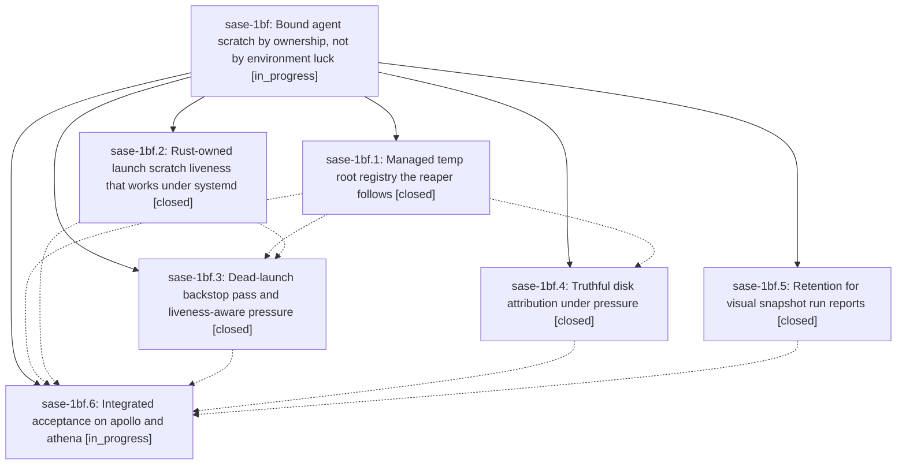

# Bead: sase-1bf — Bound agent scratch by ownership, not by environment luck

[Bead Pages](../README.md) / sase-1bf

**Status:** ◐ in_progress · **Type:** ▸ plan · **Tier:** epic
**Owner:** `bryanbugyi34@gmail.com` · **Created by:** `bbugyi200.kellys_mbp.1d` · **Assignee:** `sase-1bf.land`
**Created:** 2026-09-27 14:23:29 EDT
**Plan:** [202609/bounded\_agent\_scratch.md](https://github.com/sase-org/sase--plans/blob/main/202609/bounded_agent_scratch.md)

<!-- sase:links:start -->

## Links

| Relation | Artifact | Why |
| --- | --- | --- |
| implemented-by | [plan:202609/bounded_agent_scratch.md][1] | derived from the plan's `bead_id:` frontmatter field |

_Plus 1 automatic references — see [Referenced By](#referenced-by)._

[1]: https://github.com/sase-org/sase--plans/blob/main/202609/bounded_agent_scratch.md

<!-- sase:links:end -->

## Description

Per-launch agent scratch (cargo targets, agent TMPDIRs) is removed when its launch is dead, on every managed temp root any writer actually used, regardless of which environment the service host was started with; cleanup refusals are visible; and `sase disk list` / disk-pressure notifications account for where the bytes really are, so a SASE host can no longer silently fill its disk.

## Notes

[2026-09-27T22:27:53Z · sase-1b2.land] DISCOVERED ISSUE (sase-1b2.land, sase-core 924884e, rustc/clippy 1.98.1 stable): ./scripts/check.sh clippy is red on crates/sase_core/src/launch_scratch_liveness.rs, added by 297bc1e (sase-1bf.2). Line 300 fn observe_unreadable trips clippy::too_many_arguments (8/7) in the lib, and line 477 fields.extend(std::iter::repeat("0".to_string()).take(17)) trips clippy::manual_repeat_n in lib test. These are the only sase_core lib/lib-test clippy denies at HEAD (the earlier finalizer/run_view/decode.rs denies from sase-1b2 no longer fire). Distinct from umbrella sase-1an (manual_range_contains/nonminimal_bool in other files).

## Phases

| Bead | Title | Status | Size | Created | Agents | Commits |
|---|---|---|---|---|---:|---:|
| [sase-1bf.1](sase-1bf.1.md) | Managed temp root registry the reaper follows | ✓ closed | medium | 2026-09-27 | 1 | 2 |
| [sase-1bf.2](sase-1bf.2.md) | Rust-owned launch scratch liveness that works under systemd | ✓ closed | medium | 2026-09-27 | 1 | 2 |
| [sase-1bf.3](sase-1bf.3.md) | Dead-launch backstop pass and liveness-aware pressure | ✓ closed | medium | 2026-09-27 | 1 | 1 |
| [sase-1bf.4](sase-1bf.4.md) | Truthful disk attribution under pressure | ✓ closed | medium | 2026-09-27 | 1 | 1 |
| [sase-1bf.5](sase-1bf.5.md) | Retention for visual snapshot run reports | ✓ closed | small | 2026-09-27 | 1 | 1 |
| [sase-1bf.6](sase-1bf.6.md) | Integrated acceptance on apollo and athena | ◐ in_progress | small | 2026-09-27 | 1 | 0 |

## Lineage

## Agents

| Agent | Bead | Commits |
|---|---|---:|
| [bbugyi200.apollo.sase-1bf.1](https://github.com/sase-org/sase--agents/blob/main/sessions/bbugyi200.apollo.sase-1bf.1.md) | [sase-1bf.1](sase-1bf.1.md) | 2 |
| [bbugyi200.apollo.sase-1bf.2](https://github.com/sase-org/sase--agents/blob/main/sessions/bbugyi200.apollo.sase-1bf.2.md) | [sase-1bf.2](sase-1bf.2.md) | 2 |
| [bbugyi200.apollo.sase-1bf.3](https://github.com/sase-org/sase--agents/blob/main/sessions/bbugyi200.apollo.sase-1bf.3.md) | [sase-1bf.3](sase-1bf.3.md) | 1 |
| [bbugyi200.apollo.sase-1bf.4](https://github.com/sase-org/sase--agents/blob/main/sessions/bbugyi200.apollo.sase-1bf.4.md) | [sase-1bf.4](sase-1bf.4.md) | 1 |
| [bbugyi200.apollo.sase-1bf.5](https://github.com/sase-org/sase--agents/blob/main/agents/bbugyi200.apollo.sase-1bf.5/README.md) | [sase-1bf.5](sase-1bf.5.md) | 1 |
| [bbugyi200.apollo.sase-1bf.6](https://github.com/sase-org/sase--agents/blob/main/agents/bbugyi200.apollo.sase-1bf.6/README.md) | [sase-1bf.6](sase-1bf.6.md) | 0 |
| [bbugyi200.apollo.sase-1bf.land](https://github.com/sase-org/sase--agents/blob/main/agents/bbugyi200.apollo.sase-1bf.land/README.md) | [sase-1bf](README.md) | 0 |

## Commits

| Repo | Commit | Subject | Bead | Committed |
|---|---|---|---|---|
| sase | [`d99f478`](https://github.com/sase-org/sase/commit/d99f4789e9c9bf2b49c6b76a77deb212da162389) | feat(visual): prune old screenshot maintenance run reports | [sase-1bf.5](sase-1bf.5.md) | 2026-09-27 14:37:05 EDT |
| sase | [`7e4482a`](https://github.com/sase-org/sase/commit/7e4482a62fe63645c36f73439d6abc79150837d4) | feat(scratch): rust-owned launch scratch liveness with systemd-safe probe | [sase-1bf.2](sase-1bf.2.md) | 2026-09-27 15:32:24 EDT |
| sase-core | [`sase-core@297bc1e`](https://github.com/sase-org/sase-core/commit/297bc1e3364c6017992b2307080390ae61894c8b) | feat(core): launch\_scratch\_liveness module with procfs probe bindings | [sase-1bf.2](sase-1bf.2.md) | 2026-09-27 15:35:48 EDT |
| sase | [`40295ea`](https://github.com/sase-org/sase/commit/40295eaf543f8e64e1e34c0862bce1411a353a42) | feat(managed-tmp): add Rust-owned root registry the reaper follows (sase-1bf.1) | [sase-1bf.1](sase-1bf.1.md) | 2026-09-27 17:19:10 EDT |
| sase-core | [`sase-core@924884e`](https://github.com/sase-org/sase-core/commit/924884e81b7c69aa2b30714a6cb2a9adac99484f) | feat(managed-tmp-roots): add Rust-owned registry with Py bindings (sase-1bf.1) | [sase-1bf.1](sase-1bf.1.md) | 2026-09-27 17:32:22 EDT |
| sase | [`5db68f7`](https://github.com/sase-org/sase/commit/5db68f77f2e46d989934643dd8dad318cbc13fa2) | feat(disk): truthful disk attribution under pressure (sase-1bf.4) | [sase-1bf.4](sase-1bf.4.md) | 2026-09-27 19:16:02 EDT |
| sase | [`c2eb318`](https://github.com/sase-org/sase/commit/c2eb318d8818f47390d80cfe8f07f5cd87cfe51e) | feat(managed-tmp): dead-launch backstop pass and liveness-aware pressure (sase-1bf.3) | [sase-1bf.3](sase-1bf.3.md) | 2026-09-27 19:39:41 EDT |

<!-- sase:referenced-by:start -->

## Referenced By

| Relation | Artifact | Why | Uses |
| --- | --- | --- | ---: |
| read-by | [agent:sase-1bf.1--a][1] | parent scope for phase close check | 1 |

[1]: https://github.com/sase-org/sase--agents/blob/main/sessions/bbugyi200.apollo.sase-1bf.1.md

<!-- sase:referenced-by:end -->
