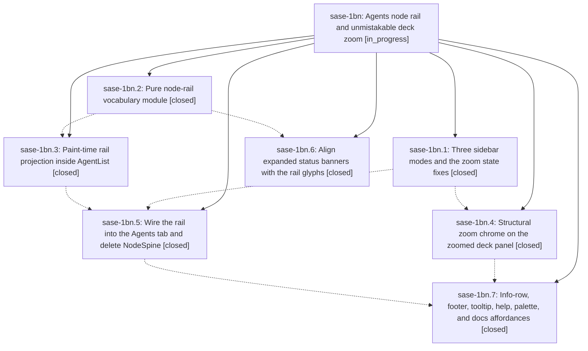

# Bead: sase-1bn — Agents node rail and unmistakable deck zoom

[Bead Pages](../README.md) / sase-1bn

**Status:** ◐ in_progress · **Type:** ▸ plan · **Tier:** epic
**Owner:** `bryanbugyi34@gmail.com` · **Created by:** [bbugyi200.apollo.2h](https://github.com/sase-org/sase--agents/blob/main/sessions/bbugyi200.apollo.2h.md) · **Assignee:** `sase-1bn.land`
**Created:** 2026-09-27 17:33:09 EDT
**Plan:** [202609/agents\_node\_rail\_and\_zoom.md](https://github.com/sase-org/sase--plans/blob/main/202609/agents_node_rail_and_zoom.md)

<!-- sase:links:start -->

## Links

| Relation | Artifact | Why |
| --- | --- | --- |
| implemented-by | [plan:202609/agents_node_rail_and_zoom.md][1] | derived from the plan's `bead_id:` frontmatter field |

_Plus 1 automatic references — see [Referenced By](#referenced-by)._

[1]: https://github.com/sase-org/sase--plans/blob/main/202609/agents_node_rail_and_zoom.md

<!-- sase:links:end -->

## Description

Ctrl+S turns the Agents-tab node sidebar into a fixed-width, row-for-row node rail that still shows every tribe, group, and node as glyphs. Z zoom hides the left column entirely and looks unmistakably different from the rail. Zoom never leaks into the saved Ctrl+S preference, and no key silently drops a split.

## Notes

[2026-09-28T00:21:02Z · sase-1b2.land] DISCOVERED ISSUE (sase-1b2.land, sase master 965248789b): symvision src/sase now fails only on 3 unused publics in src/sase/ace/tui/widgets/_agent_list_render_rail.py: rail_panel_title, rail_tooltip_text and rail_urgency (module from sase-1bn.2/.3, last touched 55e4bf73b2). The Justfile has no --epic-symbol entries for them. If in-progress sase-1bn.5/.7 will consume them, add epic-symbol entries keyed to those phases; otherwise privatize or delete them per the symvision memory.

[2026-09-28T02:52:45Z · sase-1bf.land] DISCOVERED ISSUE (sase-1bf.land, sase master 965248789b + this tale's 3 fixes, sase-core bc71eb2, tool run db269817c4f912574f05104c4e0a6782): landing sase-1bf required bumping sase-core-revision.txt (0e8981a -> bc71eb2, needed for managed-tmp wire 4), which made `just check`'s test-scoped selector distrust the closure and escalate internally to the full suite (per docs/lint_and_test.md; not a reason to run check-full). That full run surfaced a cluster of pre-existing failures that all trace to the in-progress agent-tab/rail work (sase-1bn.2-.7, not to sase-1bf):

- ImportError: `tests/ace/tui/test_agent_tab_cross_nav.py` and `test_agent_tab_scope_honesty.py` cannot import `scoped_agents_for_owner` from `sase.ace.tui.actions.agents._tab_scope` (not yet defined there). This same collection error also fails `tests/test_contract_manifest.py::test_contract_manifest_matches_marker_selection` (`pytest -m contract --collect-only` exits 2).
- `tests/test_axe_run_agent_exec_repeat_env.py` (6 tests): `_export_exec_agent_tab` in `src/sase/axe/run_agent_exec.py:213` reads `ctx.agent_meta`, but the tests' `MagicMock(spec=AgentExecContext)` fixture predates that attribute.
- `tests/ace/tui/test_agent_completion.py` (8 tests) and `tests/ace/tui/widgets/test_directive_completion_candidates.py` (2 tests): completion candidates now include an unexpected `("tab", ...)` entry the assertions don't account for.
- `tests/ace/tui/test_agent_list_watch_highlighted.py`, `tests/ace/tui/widgets/test_agent_header_panel.py`, `tests/ace/tui/test_copy_as_palette_entrypoints.py`, `tests/ace/tui/actions/test_prompts_overlay_entry_points.py`: assorted AgentList/header/palette assertion mismatches, plausibly the same rail/tab refactor (sase-1bn.7 covers palette/tooltip/help affordances).
- `tests/completion/test_kind_coverage.py`, `tests/completion/test_snapshot.py` (2 tests), `tests/completion/test_zsh_smoke.py`: CLI completion spec drift, plausibly downstream of the same directive/tab completion changes.
- `tests/test_agent_artifact_marker_path_passing_audit.py::test_tracked_marker_path_passing_sites_are_reviewed`: static allowlist audit mismatch, plausibly a new agent-tab call site not yet reviewed into the allowlist.

None of these touch managed_tmp/launch-scratch/disk-footprint files, so sase-1bf's landing did not cause them and did not fix them; full evidence is on tool run db269817c4f912574f05104c4e0a6782 (`sase tool show db269817c4f912574f05104c4e0a6782 -F`). sase-1bn.7 is in_progress and may already be addressing part of this; if not, its land agent should triage and either fix or bead each root cause.

## Phases

| Bead | Title | Status | Size | Created | Agents | Commits |
|---|---|---|---|---|---:|---:|
| [sase-1bn.1](sase-1bn.1.md) | Three sidebar modes and the zoom state fixes | ✓ closed | medium | 2026-09-27 | 1 | 1 |
| [sase-1bn.2](sase-1bn.2.md) | Pure node-rail vocabulary module | ✓ closed | medium | 2026-09-27 | 1 | 1 |
| [sase-1bn.3](sase-1bn.3.md) | Paint-time rail projection inside AgentList | ✓ closed | medium | 2026-09-27 | 1 | 1 |
| [sase-1bn.4](sase-1bn.4.md) | Structural zoom chrome on the zoomed deck panel | ✓ closed | medium | 2026-09-27 | 1 | 1 |
| [sase-1bn.5](sase-1bn.5.md) | Wire the rail into the Agents tab and delete NodeSpine | ✓ closed | medium | 2026-09-27 | 1 | 1 |
| [sase-1bn.6](sase-1bn.6.md) | Align expanded status banners with the rail glyphs | ✓ closed | small | 2026-09-27 | 1 | 1 |
| [sase-1bn.7](sase-1bn.7.md) | Info-row, footer, tooltip, help, palette, and docs affordances | ✓ closed | medium | 2026-09-27 | 1 | 1 |

## Lineage

## Agents

| Agent | Bead | Commits |
|---|---|---:|
| [bbugyi200.apollo.sase-1bn.1](https://github.com/sase-org/sase--agents/blob/main/sessions/bbugyi200.apollo.sase-1bn.1.md) | [sase-1bn.1](sase-1bn.1.md) | 1 |
| [bbugyi200.apollo.sase-1bn.2](https://github.com/sase-org/sase--agents/blob/main/sessions/bbugyi200.apollo.sase-1bn.2.md) | [sase-1bn.2](sase-1bn.2.md) | 1 |
| [bbugyi200.apollo.sase-1bn.3](https://github.com/sase-org/sase--agents/blob/main/agents/bbugyi200.apollo.sase-1bn.3/README.md) | [sase-1bn.3](sase-1bn.3.md) | 1 |
| [bbugyi200.apollo.sase-1bn.4](https://github.com/sase-org/sase--agents/blob/main/sessions/bbugyi200.apollo.sase-1bn.4.md) | [sase-1bn.4](sase-1bn.4.md) | 1 |
| [bbugyi200.apollo.sase-1bn.5](https://github.com/sase-org/sase--agents/blob/main/agents/bbugyi200.apollo.sase-1bn.5/README.md) | [sase-1bn.5](sase-1bn.5.md) | 1 |
| [bbugyi200.apollo.sase-1bn.6](https://github.com/sase-org/sase--agents/blob/main/agents/bbugyi200.apollo.sase-1bn.6/README.md) | [sase-1bn.6](sase-1bn.6.md) | 1 |
| [bbugyi200.apollo.sase-1bn.7](https://github.com/sase-org/sase--agents/blob/main/sessions/bbugyi200.apollo.sase-1bn.7.md) | [sase-1bn.7](sase-1bn.7.md) | 1 |
| [bbugyi200.apollo.sase-1bn.land](https://github.com/sase-org/sase--agents/blob/main/agents/bbugyi200.apollo.sase-1bn.land/README.md) | [sase-1bn](README.md) | 0 |

## Commits

| Repo | Commit | Subject | Bead | Committed |
|---|---|---|---|---|
| sase | [`55e4bf7`](https://github.com/sase-org/sase/commit/55e4bf73b27bc7d3b4eecb4e1e7d75ddd85f5337) | fix(ace-tui): correct rail module panel-titles import path (sase-1bn.2) | [sase-1bn.2](sase-1bn.2.md) | 2026-09-27 18:25:29 EDT |
| sase | [`42bb50a`](https://github.com/sase-org/sase/commit/42bb50a80c7a5d25e3d8e49e4a2279ba775b120f) | feat(ace): three sidebar modes with zoom state fixes (sase-1bn.1) | [sase-1bn.1](sase-1bn.1.md) | 2026-09-27 18:42:27 EDT |
| sase | [`74d1ab8`](https://github.com/sase-org/sase/commit/74d1ab8e1a995c0f6933ae41d7d1a0ba0c4ba1d7) | feat(ace-tui): align expanded status banners with rail glyphs (sase-1bn.6) | [sase-1bn.6](sase-1bn.6.md) | 2026-09-27 19:05:23 EDT |
| sase | [`f4cfc51`](https://github.com/sase-org/sase/commit/f4cfc51d701a1a459642b12870471a2d4a8d33a0) | feat(ace-tui): paint-time node rail projection inside AgentList (sase-1bn.3) | [sase-1bn.3](sase-1bn.3.md) | 2026-09-27 19:20:47 EDT |
| sase | [`0a24cf8`](https://github.com/sase-org/sase/commit/0a24cf8024983c0bca74abd2956507ffd9b253c8) | feat(ace): structural zoom chrome on zoomed deck panel (sase-1bn.4) | [sase-1bn.4](sase-1bn.4.md) | 2026-09-27 19:24:24 EDT |
| sase | [`2f03e50`](https://github.com/sase-org/sase/commit/2f03e5059b09cbefab5abce55bc94441a9f2fc98) | feat(ace-tui): project tribe lists at fixed 9-cell rail width | [sase-1bn.5](sase-1bn.5.md) | 2026-09-27 21:29:59 EDT |
| sase | [`52f7351`](https://github.com/sase-org/sase/commit/52f7351ae8afc8d088f52646425cc2bd93013945) | feat(ace-tui): mode affordances for node rail and deck zoom (sase-1bn.7) | [sase-1bn.7](sase-1bn.7.md) | 2026-09-27 23:24:17 EDT |

<!-- sase:referenced-by:start -->

## Referenced By

| Relation | Artifact | Why | Uses |
| --- | --- | --- | ---: |
| read-by | [agent:sase-1b2.land][1] | Route symvision unused publics in _agent_list_render_rail.py found after closing sase-1b2 | 1 |

[1]: https://github.com/sase-org/sase--agents/blob/main/agents/bbugyi200.apollo.sase-1b2.land/README.md

<!-- sase:referenced-by:end -->
