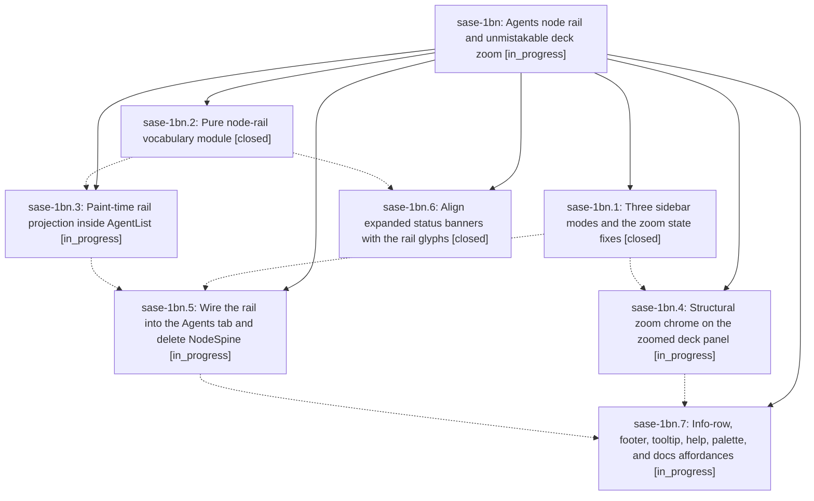

# Bead: sase-1bn — Agents node rail and unmistakable deck zoom

[Bead Pages](../README.md) / sase-1bn

**Status:** ◐ in_progress · **Type:** ▸ plan · **Tier:** epic
**Owner:** `bryanbugyi34@gmail.com` · **Created by:** [bbugyi200.apollo.2h](https://github.com/sase-org/sase--agents/blob/main/sessions/bbugyi200.apollo.2h.md) · **Assignee:** `sase-1bn.land`
**Created:** 2026-09-27 17:33:09 EDT
**Plan:** [202609/agents\_node\_rail\_and\_zoom.md](https://github.com/sase-org/sase--plans/blob/main/202609/agents_node_rail_and_zoom.md)

<!-- sase:links:start -->

## Links

| Relation | Artifact | Why |
| --- | --- | --- |
| implemented-by | [plan:202609/agents_node_rail_and_zoom.md][1] | derived from the plan's `bead_id:` frontmatter field |

[1]: https://github.com/sase-org/sase--plans/blob/main/202609/agents_node_rail_and_zoom.md

<!-- sase:links:end -->

## Description

Ctrl+S turns the Agents-tab node sidebar into a fixed-width, row-for-row node rail that still shows every tribe, group, and node as glyphs. Z zoom hides the left column entirely and looks unmistakably different from the rail. Zoom never leaks into the saved Ctrl+S preference, and no key silently drops a split.

## Phases

| Bead | Title | Status | Size | Created | Agents | Commits |
|---|---|---|---|---|---:|---:|
| [sase-1bn.1](sase-1bn.1.md) | Three sidebar modes and the zoom state fixes | ✓ closed | medium | 2026-09-27 | 1 | 1 |
| [sase-1bn.2](sase-1bn.2.md) | Pure node-rail vocabulary module | ✓ closed | medium | 2026-09-27 | 1 | 1 |
| [sase-1bn.3](sase-1bn.3.md) | Paint-time rail projection inside AgentList | ◐ in_progress | medium | 2026-09-27 | 1 | 0 |
| [sase-1bn.4](sase-1bn.4.md) | Structural zoom chrome on the zoomed deck panel | ◐ in_progress | medium | 2026-09-27 | 1 | 0 |
| [sase-1bn.5](sase-1bn.5.md) | Wire the rail into the Agents tab and delete NodeSpine | ◐ in_progress | medium | 2026-09-27 | 1 | 0 |
| [sase-1bn.6](sase-1bn.6.md) | Align expanded status banners with the rail glyphs | ✓ closed | small | 2026-09-27 | 1 | 1 |
| [sase-1bn.7](sase-1bn.7.md) | Info-row, footer, tooltip, help, palette, and docs affordances | ◐ in_progress | medium | 2026-09-27 | 1 | 0 |

## Lineage

## Agents

| Agent | Bead | Commits |
|---|---|---:|
| [bbugyi200.apollo.sase-1bn.1](https://github.com/sase-org/sase--agents/blob/main/sessions/bbugyi200.apollo.sase-1bn.1.md) | [sase-1bn.1](sase-1bn.1.md) | 1 |
| [bbugyi200.apollo.sase-1bn.2](https://github.com/sase-org/sase--agents/blob/main/sessions/bbugyi200.apollo.sase-1bn.2.md) | [sase-1bn.2](sase-1bn.2.md) | 1 |
| [bbugyi200.apollo.sase-1bn.3](https://github.com/sase-org/sase--agents/blob/main/agents/bbugyi200.apollo.sase-1bn.3/README.md) | [sase-1bn.3](sase-1bn.3.md) | 0 |
| [bbugyi200.apollo.sase-1bn.4](https://github.com/sase-org/sase--agents/blob/main/agents/bbugyi200.apollo.sase-1bn.4/README.md) | [sase-1bn.4](sase-1bn.4.md) | 0 |
| [bbugyi200.apollo.sase-1bn.5](https://github.com/sase-org/sase--agents/blob/main/agents/bbugyi200.apollo.sase-1bn.5/README.md) | [sase-1bn.5](sase-1bn.5.md) | 0 |
| [bbugyi200.apollo.sase-1bn.6](https://github.com/sase-org/sase--agents/blob/main/agents/bbugyi200.apollo.sase-1bn.6/README.md) | [sase-1bn.6](sase-1bn.6.md) | 1 |
| [bbugyi200.apollo.sase-1bn.7](https://github.com/sase-org/sase--agents/blob/main/agents/bbugyi200.apollo.sase-1bn.7/README.md) | [sase-1bn.7](sase-1bn.7.md) | 0 |
| [bbugyi200.apollo.sase-1bn.land](https://github.com/sase-org/sase--agents/blob/main/agents/bbugyi200.apollo.sase-1bn.land/README.md) | [sase-1bn](README.md) | 0 |

## Commits

| Repo | Commit | Subject | Bead | Committed |
|---|---|---|---|---|
| sase | [`55e4bf7`](https://github.com/sase-org/sase/commit/55e4bf73b27bc7d3b4eecb4e1e7d75ddd85f5337) | fix(ace-tui): correct rail module panel-titles import path (sase-1bn.2) | [sase-1bn.2](sase-1bn.2.md) | 2026-09-27 18:25:29 EDT |
| sase | [`42bb50a`](https://github.com/sase-org/sase/commit/42bb50a80c7a5d25e3d8e49e4a2279ba775b120f) | feat(ace): three sidebar modes with zoom state fixes (sase-1bn.1) | [sase-1bn.1](sase-1bn.1.md) | 2026-09-27 18:42:27 EDT |
| sase | [`74d1ab8`](https://github.com/sase-org/sase/commit/74d1ab8e1a995c0f6933ae41d7d1a0ba0c4ba1d7) | feat(ace-tui): align expanded status banners with rail glyphs (sase-1bn.6) | [sase-1bn.6](sase-1bn.6.md) | 2026-09-27 19:05:23 EDT |
