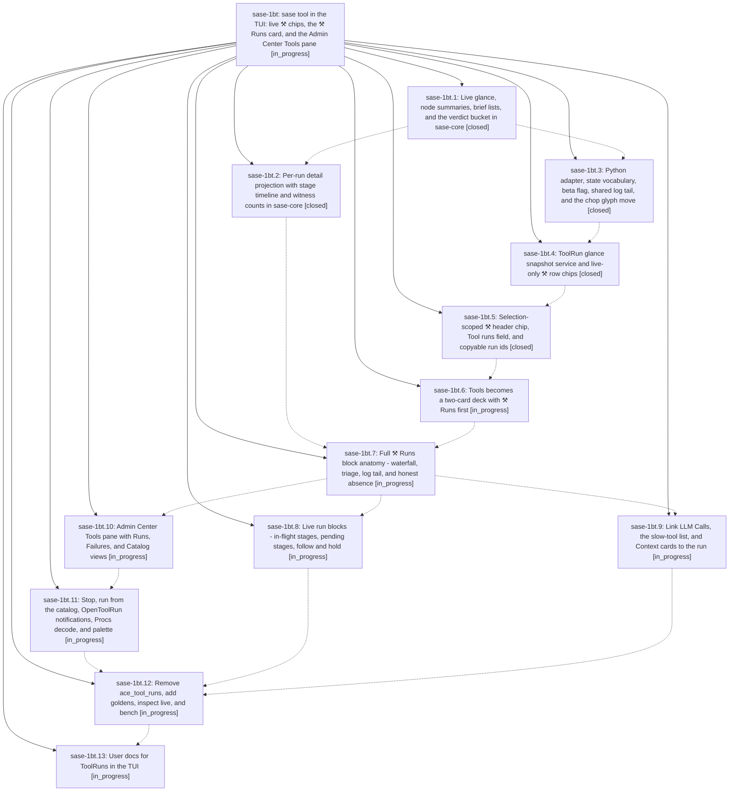

# Bead: sase-1bt — sase tool in the TUI: live ⚒ chips, the ⚒ Runs card, and the Admin Center Tools pane

[Bead Pages](../README.md) / sase-1bt

**Status:** ◐ in_progress · **Type:** ▸ plan · **Tier:** epic
**Owner:** `bryanbugyi34@gmail.com` · **Created by:** [bbugyi200.athena.0tc](https://github.com/sase-org/sase--agents/blob/main/sessions/bbugyi200.athena.0tc.md) · **Assignee:** `sase-1bt.land`
**Created:** 2026-09-27 18:32:32 EDT
**Plan:** [202609/tool\_runs\_tui\_surfaces.md](https://github.com/sase-org/sase--plans/blob/main/202609/tool_runs_tui_surfaces.md)

<!-- sase:links:start -->

## Links

| Relation | Artifact | Why |
| --- | --- | --- |
| implemented-by | [plan:202609/tool_runs_tui_surfaces.md][1] | derived from the plan's `bead_id:` frontmatter field |

_Plus 1 automatic references — see [Referenced By](#referenced-by)._

[1]: https://github.com/sase-org/sase--plans/blob/main/202609/tool_runs_tui_surfaces.md

<!-- sase:links:end -->

## Description

A live ToolRun shows on the row that owns it with its stage progress, and turns red when it goes silent. The selected node's header says whether its latest check added NEW failures. The Tools deck gains a ⚒ Runs card with a stage waterfall, triage items, and a log tail. LLM Calls, the slow-tool list, and monitor/proc Context cards link to the run instead of copying it. An Admin Center Tools pane covers project-wide runs, failure groups, the catalog, stopping a run, starting a named tool, and the -H settlement notification. Everything reads a slim sase-core projection and never reconciles or shells out on a UI path.

## Phases

| Bead | Title | Status | Size | Created | Agents | Commits |
|---|---|---|---|---|---:|---:|
| [sase-1bt.1](sase-1bt.1.md) | Live glance, node summaries, brief lists, and the verdict bucket in sase-core | ✓ closed | medium | 2026-09-27 | 1 | 1 |
| [sase-1bt.10](sase-1bt.10.md) | Admin Center Tools pane with Runs, Failures, and Catalog views | ◐ in_progress | medium | 2026-09-27 | 1 | 0 |
| [sase-1bt.11](sase-1bt.11.md) | Stop, run from the catalog, OpenToolRun notifications, Procs decode, and palette | ◐ in_progress | medium | 2026-09-27 | 1 | 0 |
| [sase-1bt.12](sase-1bt.12.md) | Remove ace\_tool\_runs, add goldens, inspect live, and bench | ◐ in_progress | medium | 2026-09-27 | 1 | 0 |
| [sase-1bt.13](sase-1bt.13.md) | User docs for ToolRuns in the TUI | ◐ in_progress | small | 2026-09-27 | 1 | 0 |
| [sase-1bt.2](sase-1bt.2.md) | Per-run detail projection with stage timeline and witness counts in sase-core | ✓ closed | medium | 2026-09-27 | 1 | 1 |
| [sase-1bt.3](sase-1bt.3.md) | Python adapter, state vocabulary, beta flag, shared log tail, and the chop glyph move | ✓ closed | medium | 2026-09-27 | 1 | 1 |
| [sase-1bt.4](sase-1bt.4.md) | ToolRun glance snapshot service and live-only ⚒ row chips | ✓ closed | medium | 2026-09-27 | 1 | 1 |
| [sase-1bt.5](sase-1bt.5.md) | Selection-scoped ⚒ header chip, Tool runs field, and copyable run ids | ✓ closed | medium | 2026-09-27 | 1 | 1 |
| [sase-1bt.6](sase-1bt.6.md) | Tools becomes a two-card deck with ⚒ Runs first | ◐ in_progress | medium | 2026-09-27 | 1 | 0 |
| [sase-1bt.7](sase-1bt.7.md) | Full ⚒ Runs block anatomy - waterfall, triage, log tail, and honest absence | ◐ in_progress | medium | 2026-09-27 | 1 | 0 |
| [sase-1bt.8](sase-1bt.8.md) | Live run blocks - in-flight stages, pending stages, follow and hold | ◐ in_progress | medium | 2026-09-27 | 1 | 0 |
| [sase-1bt.9](sase-1bt.9.md) | Link LLM Calls, the slow-tool list, and Context cards to the run | ◐ in_progress | medium | 2026-09-27 | 1 | 0 |

## Lineage

## Agents

| Agent | Bead | Commits |
|---|---|---:|
| [bbugyi200.athena.sase-1bt.1](https://github.com/sase-org/sase--agents/blob/main/agents/bbugyi200.athena.sase-1bt.1/README.md) | [sase-1bt.1](sase-1bt.1.md) | 1 |
| [bbugyi200.athena.sase-1bt.10](https://github.com/sase-org/sase--agents/blob/main/agents/bbugyi200.athena.sase-1bt.10/README.md) | [sase-1bt.10](sase-1bt.10.md) | 0 |
| [bbugyi200.athena.sase-1bt.11](https://github.com/sase-org/sase--agents/blob/main/agents/bbugyi200.athena.sase-1bt.11/README.md) | [sase-1bt.11](sase-1bt.11.md) | 0 |
| [bbugyi200.athena.sase-1bt.12](https://github.com/sase-org/sase--agents/blob/main/agents/bbugyi200.athena.sase-1bt.12/README.md) | [sase-1bt.12](sase-1bt.12.md) | 0 |
| [bbugyi200.athena.sase-1bt.13](https://github.com/sase-org/sase--agents/blob/main/agents/bbugyi200.athena.sase-1bt.13/README.md) | [sase-1bt.13](sase-1bt.13.md) | 0 |
| [bbugyi200.athena.sase-1bt.2](https://github.com/sase-org/sase--agents/blob/main/agents/bbugyi200.athena.sase-1bt.2/README.md) | [sase-1bt.2](sase-1bt.2.md) | 1 |
| [bbugyi200.athena.sase-1bt.3](https://github.com/sase-org/sase--agents/blob/main/sessions/bbugyi200.athena.sase-1bt.3.md) | [sase-1bt.3](sase-1bt.3.md) | 1 |
| [bbugyi200.athena.sase-1bt.4](https://github.com/sase-org/sase--agents/blob/main/agents/bbugyi200.athena.sase-1bt.4/README.md) | [sase-1bt.4](sase-1bt.4.md) | 1 |
| [bbugyi200.athena.sase-1bt.5](https://github.com/sase-org/sase--agents/blob/main/agents/bbugyi200.athena.sase-1bt.5/README.md) | [sase-1bt.5](sase-1bt.5.md) | 1 |
| [bbugyi200.athena.sase-1bt.6](https://github.com/sase-org/sase--agents/blob/main/agents/bbugyi200.athena.sase-1bt.6/README.md) | [sase-1bt.6](sase-1bt.6.md) | 0 |
| [bbugyi200.athena.sase-1bt.7](https://github.com/sase-org/sase--agents/blob/main/agents/bbugyi200.athena.sase-1bt.7/README.md) | [sase-1bt.7](sase-1bt.7.md) | 0 |
| [bbugyi200.athena.sase-1bt.8](https://github.com/sase-org/sase--agents/blob/main/agents/bbugyi200.athena.sase-1bt.8/README.md) | [sase-1bt.8](sase-1bt.8.md) | 0 |
| [bbugyi200.athena.sase-1bt.9](https://github.com/sase-org/sase--agents/blob/main/agents/bbugyi200.athena.sase-1bt.9/README.md) | [sase-1bt.9](sase-1bt.9.md) | 0 |
| [bbugyi200.athena.sase-1bt.land](https://github.com/sase-org/sase--agents/blob/main/agents/bbugyi200.athena.sase-1bt.land/README.md) | [sase-1bt](README.md) | 0 |

## Commits

| Repo | Commit | Subject | Bead | Committed |
|---|---|---|---|---|
| sase-core | [`sase-core@9368ddf`](https://github.com/sase-org/sase-core/commit/9368ddfc916e44cf2b05d95ca46dcc428a6b9dd0) | feat(tool-run): add live glance, briefs, and node-summary projections | [sase-1bt.1](sase-1bt.1.md) | 2026-09-27 19:26:49 EDT |
| sase-core | [`sase-core@830e900`](https://github.com/sase-org/sase-core/commit/830e9003ea4139a58fc907aae8f301f652e1657e) | feat(tool-run): add tool\_run\_detail projection with stage timeline and witness counts | [sase-1bt.2](sase-1bt.2.md) | 2026-09-27 20:29:47 EDT |
| sase | [`5c54e6c`](https://github.com/sase-org/sase/commit/5c54e6c14b641766c60349dc095ec4a63a092755) | feat(tool-runs): typed adapters, view vocabulary, beta flag, shared log tail, chop glyph move (sase-1bt.3) | [sase-1bt.3](sase-1bt.3.md) | 2026-09-27 22:42:38 EDT |
| sase | [`4f09a28`](https://github.com/sase-org/sase/commit/4f09a28ea1bc6d6a7cd4828ab79a46a8719aea4e) | feat(ace-tui): implement glance row chips for tool runs | [sase-1bt.4](sase-1bt.4.md) | 2026-09-27 23:51:29 EDT |
| sase | [`e771faa`](https://github.com/sase-org/sase/commit/e771faa8535ee039341157c71c6eea8ae6cbf7d3) | feat(tool-runs): add header chip with node selector and summary loader | [sase-1bt.5](sase-1bt.5.md) | 2026-09-28 01:25:29 EDT |

<!-- sase:referenced-by:start -->

## Referenced By

| Relation | Artifact | Why | Uses |
| --- | --- | --- | ---: |
| read-by | [agent:sase-1bt.4][1] | check epic children status | 1 |

[1]: https://github.com/sase-org/sase--agents/blob/main/agents/bbugyi200.athena.sase-1bt.4/README.md

<!-- sase:referenced-by:end -->
