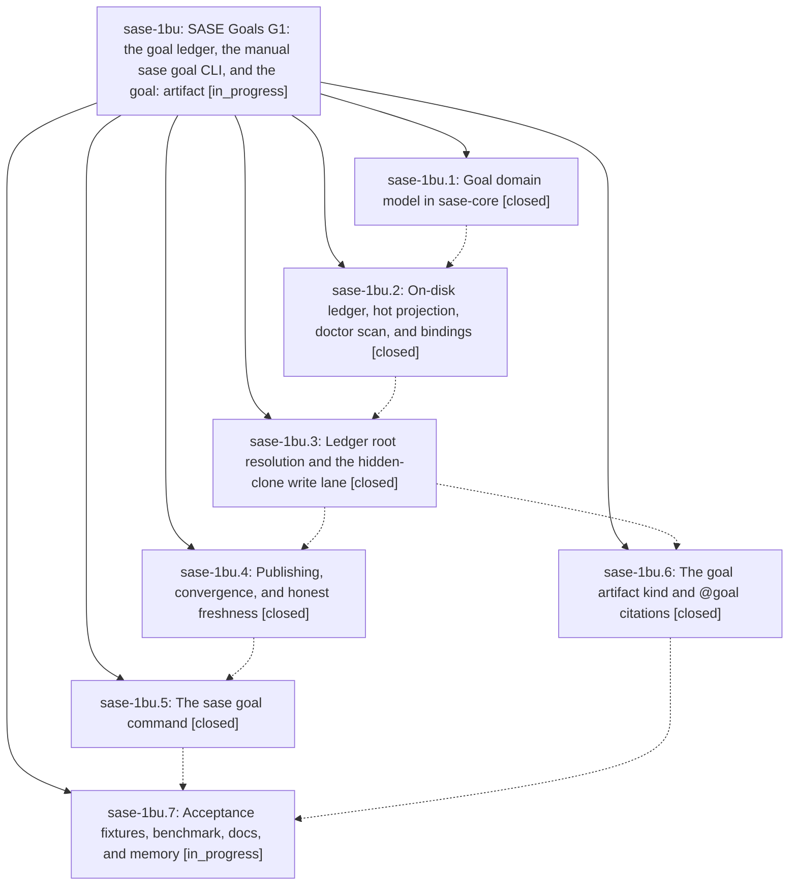

# Bead: sase-1bu — SASE Goals G1: the goal ledger, the manual sase goal CLI, and the goal: artifact

[Bead Pages](../README.md) / sase-1bu

**Status:** ◐ in_progress · **Type:** ▸ plan · **Tier:** epic
**Owner:** `bryanbugyi34@gmail.com` · **Created by:** [bbugyi200.athena.0tb.w0](https://github.com/sase-org/sase--agents/blob/main/sessions/bbugyi200.athena.0tb.w0.md) · **Assignee:** `sase-1bu.land`
**Created:** 2026-09-27 19:03:16 EDT
**Plan:** [202609/goal\_ledger.md](https://github.com/sase-org/sase--plans/blob/main/202609/goal_ledger.md)

<!-- sase:links:start -->

## Links

| Relation | Artifact | Why |
| --- | --- | --- |
| implemented-by | [plan:202609/goal_ledger.md][1] | derived from the plan's `bead_id:` frontmatter field |

_Plus 1 automatic references — see [Referenced By](#referenced-by)._

[1]: https://github.com/sase-org/sase--plans/blob/main/202609/goal_ledger.md

<!-- sase:links:end -->

## Description

Goals are durable, conflict-free, cross-machine records that a person can create, list, show, edit, drop, reopen, merge, and cite as @goal:<id>. Hot reads stay fast however much settled history piles up, and every surface says honestly how fresh it is.

## Phases

| Bead | Title | Status | Size | Created | Agents | Commits |
|---|---|---|---|---|---:|---:|
| [sase-1bu.1](sase-1bu.1.md) | Goal domain model in sase-core | ✓ closed | medium | 2026-09-27 | 1 | 1 |
| [sase-1bu.2](sase-1bu.2.md) | On-disk ledger, hot projection, doctor scan, and bindings | ✓ closed | medium | 2026-09-27 | 1 | 1 |
| [sase-1bu.3](sase-1bu.3.md) | Ledger root resolution and the hidden-clone write lane | ✓ closed | medium | 2026-09-27 | 1 | 1 |
| [sase-1bu.4](sase-1bu.4.md) | Publishing, convergence, and honest freshness | ✓ closed | medium | 2026-09-27 | 1 | 1 |
| [sase-1bu.5](sase-1bu.5.md) | The sase goal command | ✓ closed | medium | 2026-09-27 | 1 | 1 |
| [sase-1bu.6](sase-1bu.6.md) | The goal artifact kind and @goal citations | ✓ closed | medium | 2026-09-27 | 1 | 1 |
| [sase-1bu.7](sase-1bu.7.md) | Acceptance fixtures, benchmark, docs, and memory | ◐ in_progress | medium | 2026-09-27 | 1 | 0 |

## Lineage

## Agents

| Agent | Bead | Commits |
|---|---|---:|
| [bbugyi200.athena.sase-1bu.1](https://github.com/sase-org/sase--agents/blob/main/sessions/bbugyi200.athena.sase-1bu.1.md) | [sase-1bu.1](sase-1bu.1.md) | 1 |
| [bbugyi200.athena.sase-1bu.2](https://github.com/sase-org/sase--agents/blob/main/sessions/bbugyi200.athena.sase-1bu.2.md) | [sase-1bu.2](sase-1bu.2.md) | 1 |
| [bbugyi200.athena.sase-1bu.3](https://github.com/sase-org/sase--agents/blob/main/sessions/bbugyi200.athena.sase-1bu.3.md) | [sase-1bu.3](sase-1bu.3.md) | 1 |
| [bbugyi200.athena.sase-1bu.4](https://github.com/sase-org/sase--agents/blob/main/sessions/bbugyi200.athena.sase-1bu.4.md) | [sase-1bu.4](sase-1bu.4.md) | 1 |
| [bbugyi200.athena.sase-1bu.5](https://github.com/sase-org/sase--agents/blob/main/sessions/bbugyi200.athena.sase-1bu.5.md) | [sase-1bu.5](sase-1bu.5.md) | 1 |
| [bbugyi200.athena.sase-1bu.6](https://github.com/sase-org/sase--agents/blob/main/agents/bbugyi200.athena.sase-1bu.6/README.md) | [sase-1bu.6](sase-1bu.6.md) | 1 |
| [bbugyi200.athena.sase-1bu.7](https://github.com/sase-org/sase--agents/blob/main/agents/bbugyi200.athena.sase-1bu.7/README.md) | [sase-1bu.7](sase-1bu.7.md) | 0 |
| [bbugyi200.athena.sase-1bu.land](https://github.com/sase-org/sase--agents/blob/main/agents/bbugyi200.athena.sase-1bu.land/README.md) | [sase-1bu](README.md) | 0 |

## Commits

| Repo | Commit | Subject | Bead | Committed |
|---|---|---|---|---|
| sase-core | [`sase-core@bc71eb2`](https://github.com/sase-org/sase-core/commit/bc71eb2ca01667aa8eb907c2c94e72392cc5e40e) | feat(goal): add pure goal domain model in sase-core | [sase-1bu.1](sase-1bu.1.md) | 2026-09-27 20:43:49 EDT |
| sase-core | [`sase-core@cbe70f6`](https://github.com/sase-org/sase-core/commit/cbe70f66fb28a6b14a023a1458f26cf0f75de911) | feat(goal): add goal ledger I/O in sase-core with Python bindings (sase-1bu.2) | [sase-1bu.2](sase-1bu.2.md) | 2026-09-28 00:19:58 EDT |
| sase | [`9b69949`](https://github.com/sase-org/sase/commit/9b69949d98429b1b2fd2a2b9eab5957d695debc7) | feat(goals): ledger root resolution and hidden-clone write lane (sase-1bu.3) | [sase-1bu.3](sase-1bu.3.md) | 2026-09-28 02:30:10 EDT |
| sase | [`6afcdb6`](https://github.com/sase-org/sase/commit/6afcdb67ed2f609c43f8a55d9379fb95ff220814) | feat(goals): publishing, convergence, and honest freshness (sase-1bu.4) | [sase-1bu.4](sase-1bu.4.md) | 2026-09-28 04:07:28 EDT |
| sase | [`17d2beb`](https://github.com/sase-org/sase/commit/17d2beb7677cecb357680a93312b105f526620c2) | feat(goals): make goal a first-class builtin artifact kind (sase-1bu.6) | [sase-1bu.6](sase-1bu.6.md) | 2026-09-28 05:36:48 EDT |
| sase | [`f79a391`](https://github.com/sase-org/sase/commit/f79a391b53876a5fb8bfe7cad00939fc18054551) | feat(goals): add sase goal CLI with fast-path list/show and human-only verbs | [sase-1bu.5](sase-1bu.5.md) | 2026-09-28 06:57:51 EDT |

<!-- sase:referenced-by:start -->

## Referenced By

| Relation | Artifact | Why | Uses |
| --- | --- | --- | ---: |
| read-by | [agent:sase-1bu.6][1] | Need epic children status for phase ordering | 1 |

[1]: https://github.com/sase-org/sase--agents/blob/main/agents/bbugyi200.athena.sase-1bu.6/README.md

<!-- sase:referenced-by:end -->
