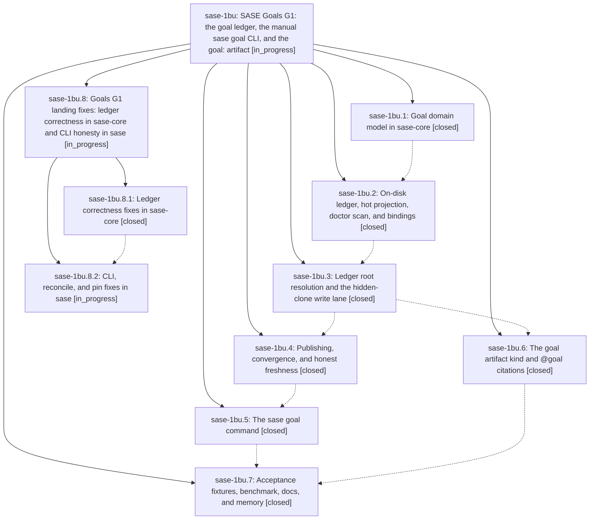

# Bead: sase-1bu — SASE Goals G1: the goal ledger, the manual sase goal CLI, and the goal: artifact

[Bead Pages](../README.md) / sase-1bu

**Status:** ◐ in_progress · **Type:** ▸ plan · **Tier:** epic
**Owner:** `bryanbugyi34@gmail.com` · **Created by:** [bbugyi200.athena.0tb.w0](https://github.com/sase-org/sase--agents/blob/main/sessions/bbugyi200.athena.0tb.w0.md) · **Assignee:** `sase-1bu.land`
**Created:** 2026-09-27 19:03:16 EDT
**Plan:** [202609/goal\_ledger.md](https://github.com/sase-org/sase--plans/blob/main/202609/goal_ledger.md)

<!-- sase:links:start -->

## Links

| Relation | Artifact | Why |
| --- | --- | --- |
| implemented-by | [plan:202609/goal_ledger.md][1] | derived from the plan's `bead_id:` frontmatter field |
| related | [bead:sase-1c3][2] | Epic that built the goal ledger and measured this miss; its landing fixes other hot-read defects in the same read.rs/projection.rs files |

_Plus 2 automatic references — see [Referenced By](#referenced-by)._

[1]: https://github.com/sase-org/sase--plans/blob/main/202609/goal_ledger.md
[2]: https://github.com/sase-org/sase--beads/blob/main/pages/sase-1c3/README.md

<!-- sase:links:end -->

## Description

Goals are durable, conflict-free, cross-machine records that a person can create, list, show, edit, drop, reopen, merge, and cite as @goal:<id>. Hot reads stay fast however much settled history piles up, and every surface says honestly how fresh it is.

## Notes

[2026-09-28T11:32:56Z · sase-1c1.4] DISCOVERED ISSUE: contract-drift (sase-1c1.4) captioned the new sase goal CLI value slots (goal_id, criterion, outcome, remove_criterion, into) with free-form completion hints in src/sase/completion/kinds.py so test_kind_coverage.py stays green. No product behavior change.

[2026-09-28T15:32:24Z · sase-1bu.land] LAND TRIAGE (sase-1bu.land, 2026-09-28 at acfca26dba): FILED sase-1c3 (feature, medium) from sase-1bu.7 #1 — projection-aware hot read; warm list p50 38.7 ms vs 5 ms at 1000 unsettled (file:explicit:1dba5d50c8383526696e7f4f), per the plan's structural-miss rule. CORROBORATED sase-14o (+1) from sase-1bu.6 #1 — test_project_beads_skips_when_store_is_absent still fails on host store. EPIC WORK (not follow-ups): sase-1bu.3 #1 edit-on-missing phantom goal, reproduced (edit of unknown id returns applied and creates live/<id>), goes to the remaining-work plan. DECLINED: sase-1bu.3 #2 PyPI sase-core-rs floor — the plan makes the window move the normal release follow-up, not DoD; v0.36.0 now contains the goal bindings and the release ratchet owns it. sase-1bu.2 #1 (agent_tab import), sase-1bu.3 #3 (agent completion candidates), #4 (deck spread flake), #5 (sase.yml schema) — all pass at HEAD (83 passed incl. those files), fixed by later sase-1c1 CI repair work. sase-1bu.2 #5, sase-1bu.4 #1, sase-1bu.5 #1 — non-specific base-tree failure batches; named nodes now pass and base-tree drift is owned by the sase-1c1 repair epic. sase-1bu.2 #2 (rail symvision KNOWNs) — rechecked by the final just symvision run at close. INTEGRATION: only ef7714508a (completion kinds for goal slots, already integrated) and 647e053e94 (docs/cli.md, goal rows intact) touched goal registries since the epic began; plan decision 8 handed to sase-x7.14 as a coordination note (inventory is a pre-G1 census artifact; enforcement not built yet).

[2026-09-28T15:34:57Z · sase-1bu.land] LAND VERIFICATION (sase-1bu.land, acfca26dba): DoD items met — (1) sase-core goal module present with 12 fixture kinds; (2) pin d2d9ec7 = last goal core commit (later core commits unrelated); (4) tests/goals 91 passed; (5) benchmark artifact file:explicit:1dba5d50c8383526696e7f4f with push-retry counters, warm-read miss filed as sase-1c3; (6) goal kind read/show/expand/stage/complete wired, 37 goldens unchanged per sase-1bu.6; (7) docs/goals.md in mkdocs nav next to Beads; (8) 3 new memory notes + 3 edits present; no sase-1bu epic-symbols. REMAINING EPIC WORK (reproduced, caused by this epic): core — edit/drop on unknown id mints a phantom active goal, raw uppercase ids fork items/<ID>, criterion ids use criteria.len() not event index, removal of unknown criterion ids commits silently, one corrupt event aborts list/show/doctor, 'vanished' race skip unreachable, corrupt goals-hot.json unrebuildable, doctor repair blanks projection header, reopen keeps merged_into, cancel-beaten claim stays active, fixture event ids are 25 chars, I/O probe settled_event_opens is zero by construction; sase — edit -x N silently no-ops (card numbers vs <event_id>.<i> ids), list -s lacks choices, write verbs ignore goal:<project>@id, reconcile commits outside store lock, doctor --repair refusal says 'sase goal repair', offline acceptance test monkeypatch.undo() leaks into real ~/.sase/projects/acme_goals_accept. Planned as child epic (core-fixes then cli-fixes, which also ratchets the pin past the core commit — a second agent turn is required because core commits are host-finalized). DECLINED from the audit: numeric unpublished count (outbox has no count source by design), editor/LSP goal payload icon (payload completion is kind-only in G1 by design), off-TTY compact rows (audit claim false: Python passes TTY state).

## Phases

| Bead | Title | Status | Size | Created | Agents | Commits |
|---|---|---|---|---|---:|---:|
| [sase-1bu.1](sase-1bu.1.md) | Goal domain model in sase-core | ✓ closed | medium | 2026-09-27 | 1 | 1 |
| [sase-1bu.2](sase-1bu.2.md) | On-disk ledger, hot projection, doctor scan, and bindings | ✓ closed | medium | 2026-09-27 | 1 | 1 |
| [sase-1bu.3](sase-1bu.3.md) | Ledger root resolution and the hidden-clone write lane | ✓ closed | medium | 2026-09-27 | 1 | 1 |
| [sase-1bu.4](sase-1bu.4.md) | Publishing, convergence, and honest freshness | ✓ closed | medium | 2026-09-27 | 1 | 1 |
| [sase-1bu.5](sase-1bu.5.md) | The sase goal command | ✓ closed | medium | 2026-09-27 | 1 | 2 |
| [sase-1bu.6](sase-1bu.6.md) | The goal artifact kind and @goal citations | ✓ closed | medium | 2026-09-27 | 1 | 2 |
| [sase-1bu.7](sase-1bu.7.md) | Acceptance fixtures, benchmark, docs, and memory | ✓ closed | medium | 2026-09-27 | 1 | 1 |

## Lineage

## Agents

| Agent | Bead | Commits |
|---|---|---:|
| [bbugyi200.athena.sase-1bu.1](https://github.com/sase-org/sase--agents/blob/main/sessions/bbugyi200.athena.sase-1bu.1.md) | [sase-1bu.1](sase-1bu.1.md) | 1 |
| [bbugyi200.athena.sase-1bu.2](https://github.com/sase-org/sase--agents/blob/main/sessions/bbugyi200.athena.sase-1bu.2.md) | [sase-1bu.2](sase-1bu.2.md) | 1 |
| [bbugyi200.athena.sase-1bu.3](https://github.com/sase-org/sase--agents/blob/main/sessions/bbugyi200.athena.sase-1bu.3.md) | [sase-1bu.3](sase-1bu.3.md) | 1 |
| [bbugyi200.athena.sase-1bu.4](https://github.com/sase-org/sase--agents/blob/main/sessions/bbugyi200.athena.sase-1bu.4.md) | [sase-1bu.4](sase-1bu.4.md) | 1 |
| [bbugyi200.athena.sase-1bu.5](https://github.com/sase-org/sase--agents/blob/main/sessions/bbugyi200.athena.sase-1bu.5.md) | [sase-1bu.5](sase-1bu.5.md) | 2 |
| [bbugyi200.athena.sase-1bu.6](https://github.com/sase-org/sase--agents/blob/main/agents/bbugyi200.athena.sase-1bu.6/README.md) | [sase-1bu.6](sase-1bu.6.md) | 2 |
| [bbugyi200.athena.sase-1bu.7](https://github.com/sase-org/sase--agents/blob/main/agents/bbugyi200.athena.sase-1bu.7/README.md) | [sase-1bu.7](sase-1bu.7.md) | 1 |
| [bbugyi200.athena.sase-1bu.8.1](https://github.com/sase-org/sase--agents/blob/main/agents/bbugyi200.athena.sase-1bu.8.1/README.md) | [sase-1bu.8.1](sase-1bu.8.1.md) | 1 |
| [bbugyi200.athena.sase-1bu.8.2](https://github.com/sase-org/sase--agents/blob/main/agents/bbugyi200.athena.sase-1bu.8.2/README.md) | [sase-1bu.8.2](sase-1bu.8.2.md) | 0 |
| [bbugyi200.athena.sase-1bu.8.land](https://github.com/sase-org/sase--agents/blob/main/agents/bbugyi200.athena.sase-1bu.8.land/README.md) | [sase-1bu.8](sase-1bu.8.md) | 0 |
| [bbugyi200.athena.sase-1bu.land](https://github.com/sase-org/sase--agents/blob/main/sessions/bbugyi200.athena.sase-1bu.land.md) | [sase-1bu](README.md) | 0 |

## Commits

| Repo | Commit | Subject | Bead | Committed |
|---|---|---|---|---|
| sase-core | [`sase-core@bc71eb2`](https://github.com/sase-org/sase-core/commit/bc71eb2ca01667aa8eb907c2c94e72392cc5e40e) | feat(goal): add pure goal domain model in sase-core | [sase-1bu.1](sase-1bu.1.md) | 2026-09-27 20:43:49 EDT |
| sase-core | [`sase-core@cbe70f6`](https://github.com/sase-org/sase-core/commit/cbe70f66fb28a6b14a023a1458f26cf0f75de911) | feat(goal): add goal ledger I/O in sase-core with Python bindings (sase-1bu.2) | [sase-1bu.2](sase-1bu.2.md) | 2026-09-28 00:19:58 EDT |
| sase | [`9b69949`](https://github.com/sase-org/sase/commit/9b69949d98429b1b2fd2a2b9eab5957d695debc7) | feat(goals): ledger root resolution and hidden-clone write lane (sase-1bu.3) | [sase-1bu.3](sase-1bu.3.md) | 2026-09-28 02:30:10 EDT |
| sase | [`6afcdb6`](https://github.com/sase-org/sase/commit/6afcdb67ed2f609c43f8a55d9379fb95ff220814) | feat(goals): publishing, convergence, and honest freshness (sase-1bu.4) | [sase-1bu.4](sase-1bu.4.md) | 2026-09-28 04:07:28 EDT |
| sase | [`17d2beb`](https://github.com/sase-org/sase/commit/17d2beb7677cecb357680a93312b105f526620c2) | feat(goals): make goal a first-class builtin artifact kind (sase-1bu.6) | [sase-1bu.6](sase-1bu.6.md) | 2026-09-28 05:36:48 EDT |
| sase-core | [`sase-core@33b0250`](https://github.com/sase-org/sase-core/commit/33b0250f91b81ebe9913796574e5faf787f741cf) | feat(goals): make goal a first-class builtin artifact kind in sase-core (sase-1bu.6) | [sase-1bu.6](sase-1bu.6.md) | 2026-09-28 05:45:14 EDT |
| sase | [`f79a391`](https://github.com/sase-org/sase/commit/f79a391b53876a5fb8bfe7cad00939fc18054551) | feat(goals): add sase goal CLI with fast-path list/show and human-only verbs | [sase-1bu.5](sase-1bu.5.md) | 2026-09-28 06:57:51 EDT |
| sase-core | [`sase-core@d2d9ec7`](https://github.com/sase-org/sase-core/commit/d2d9ec7fcc5477547bb774ebb9ae38a6c75de01d) | feat(goals): add goal ledger, fast path, and terminal renderer backend | [sase-1bu.5](sase-1bu.5.md) | 2026-09-28 07:12:14 EDT |
| sase | [`acfca26`](https://github.com/sase-org/sase/commit/acfca26dbaf5a80550b8a294d87a46c00aac6dc7) | feat(goals): complete G1 acceptance for goal ledger | [sase-1bu.7](sase-1bu.7.md) | 2026-09-28 11:03:54 EDT |
| sase-core | [`sase-core@32d80d6`](https://github.com/sase-org/sase-core/commit/32d80d6fbcc0fe952c904614a082167b5cafa914) | fix(goals): land G1 ledger correctness fixes for core-fixes phase | [sase-1bu.8.1](sase-1bu.8.1.md) | 2026-09-28 12:32:00 EDT |

<!-- sase:referenced-by:start -->

## Referenced By

| Relation | Artifact | Why | Uses |
| --- | --- | --- | ---: |
| read-by | [agent:sase-1bu.6][1] | Need epic children status for phase ordering | 1 |
| read-by | [agent:sase-1bu.7][2] | Need epic scope for acceptance landing | 1 |

[1]: https://github.com/sase-org/sase--agents/blob/main/agents/bbugyi200.athena.sase-1bu.6/README.md
[2]: https://github.com/sase-org/sase--agents/blob/main/agents/bbugyi200.athena.sase-1bu.7/README.md

<!-- sase:referenced-by:end -->
